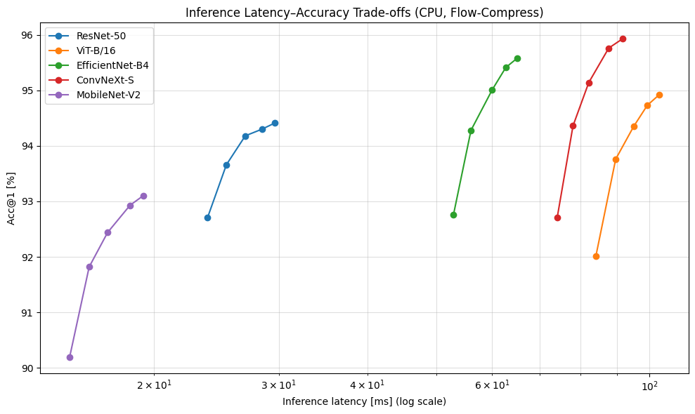
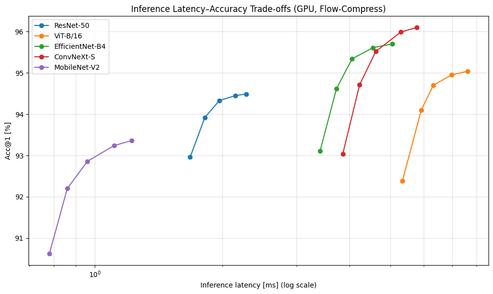
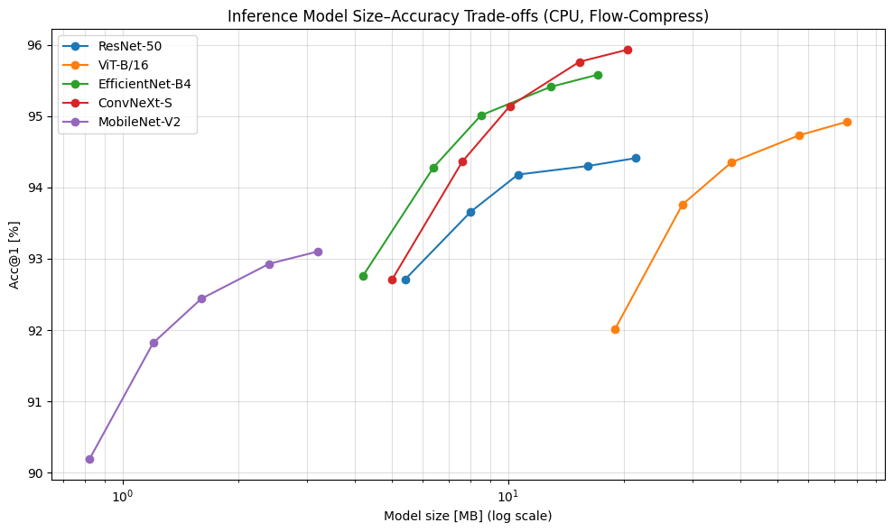
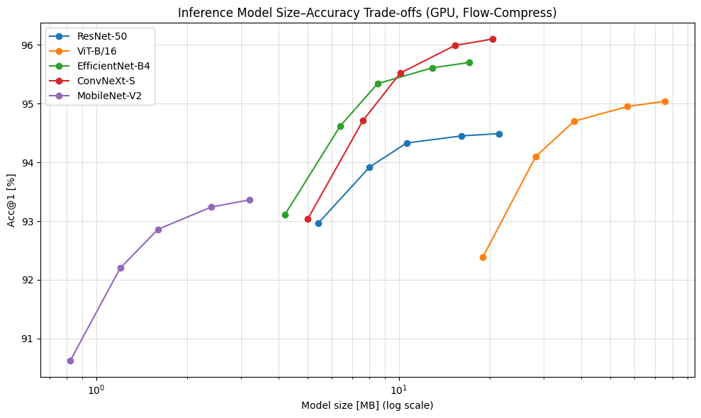

## Flow Compress

Flow Compress is a unified research framework for neural network compression. It combines
three complementary approaches into a single, consistent API and experiment workflow:

- **IDAP++ (pruning)**: divergence-aware pruning across width and depth.
- **FAAQ (quantization)**: flow-aware adaptive bit allocation with post-training quantization.
- **FAD (distillation)**: flow-aligned knowledge distillation with teacher-student alignment.

The goal is to enable modular experimentation with pruning, quantization, and distillation
under a shared “information flow” perspective.

## Overview

The framework is organized into three core modules:

- `flow_compress/pruning`: IDAP++ pruning implementation and utilities.
- `flow_compress/quantization`: FAAQ quantization implementation and utilities.
- `flow_compress/distillation`: FAD distillation implementation and utilities.

Shared helpers live in `flow_compress/utils`. Experiment runners in `experiments/` mirror the
quantization structure for distillation and pruning with batch runners and result visualizers.


## Prerequisites

- Python 3.10+
- PyTorch 2.0+
- CUDA 11.8+ (optional, recommended for GPU acceleration)

## Installation

```bash
python -m venv venv
source venv/bin/activate
pip install -r requirements.txt
```

## Usage

### Pruning (IDAP++)

```bash
python scripts/idap_prune.py
```

### Quantization (FAAQ)

```bash
python scripts/faaq_quantize.py --model resnet50 --dataset cifar10 --target-bits 4
```

### Distillation (FAD)

```bash
python scripts/fad_train.py
```

### Distillation Precompute (FAD)

```bash
python scripts/fad_precompute_teacher_flow.py
```

### Experiments

```bash
python experiments/quantization/run_all_experiments.py
python experiments/distillation/run_all_experiments.py --num-epochs 1
python experiments/pruning/run_all_experiments.py --iterations 1
```

### Python API

```python
from flow_compress.pruning.divergence_aware_pruning import divergence_aware_pruning
from flow_compress.quantization.faaq import FAAQQuantizer
from flow_compress.distillation.trainer.fad_trainer import FADTrainer
```

## Project Structure

```
flow_compress/
├── pruning/
├── quantization/
├── distillation/
└── utils/

experiments/
├── quantization/
├── distillation/
└── pruning/

scripts/
docs/
```

## Results

### Flow-Compress Image Classification Results on CIFAR-10

| Architecture    | Precision (bits) | HW  | Acc@1 (FP32) | Acc@1 (Flow-Comp.) | ΔAcc  | Size FP32 (MB) | Size Flow-Comp. (MB) | Compression | Latency FP32 (ms) | Latency Flow-Comp. (ms) | Speedup |
| --------------- | ---------------- | --- | ------------ | ------------------ | ----- | -------------- | -------------------- | ----------- | ----------------- | ----------------------- | ------- |
| ResNet-50       | 2                | GPU | 94.52        | 92.96              | -1.56 | 97.5           | 5.4                  | 18.1×       | 2.45              | 1.68                    | 1.46×   |
| ResNet-50       | 2                | CPU | 94.52        | 92.71              | -1.81 | 97.5           | 5.4                  | 18.1×       | 45.2              | 23.8                    | 1.90×   |
| ResNet-50       | 3                | GPU | 94.52        | 93.92              | -0.60 | 97.5           | 8.0                  | 12.2×       | 2.45              | 1.82                    | 1.35×   |
| ResNet-50       | 3                | CPU | 94.52        | 93.66              | -0.86 | 97.5           | 8.0                  | 12.2×       | 45.2              | 25.3                    | 1.79×   |
| ResNet-50       | 4                | GPU | 94.52        | 94.33              | -0.19 | 97.5           | 10.6                 | 9.2×        | 2.45              | 1.97                    | 1.24×   |
| ResNet-50       | 4                | CPU | 94.52        | 94.18              | -0.34 | 97.5           | 10.6                 | 9.2×        | 45.2              | 26.9                    | 1.68×   |
| ResNet-50       | 6                | GPU | 94.52        | 94.45              | -0.07 | 97.5           | 16.1                 | 6.1×        | 2.45              | 2.15                    | 1.14×   |
| ResNet-50       | 6                | CPU | 94.52        | 94.30              | -0.22 | 97.5           | 16.1                 | 6.1×        | 45.2              | 28.4                    | 1.59×   |
| ResNet-50       | 8                | GPU | 94.52        | 94.49              | -0.03 | 97.5           | 21.4                 | 4.6×        | 2.45              | 2.28                    | 1.07×   |
| ResNet-50       | 8                | CPU | 94.52        | 94.41              | -0.11 | 97.5           | 21.4                 | 4.6×        | 45.2              | 29.6                    | 1.53×   |
| ViT-B/16        | 2                | GPU | 95.12        | 92.38              | -2.74 | 330.2          | 18.9                 | 17.5×       | 8.92              | 5.34                    | 1.67×   |
| ViT-B/16        | 2                | CPU | 95.12        | 92.01              | -3.11 | 330.2          | 18.9                 | 17.5×       | 156.7             | 84.0                    | 1.87×   |
| ViT-B/16        | 3                | GPU | 95.12        | 94.10              | -1.02 | 330.2          | 28.3                 | 11.7×       | 8.92              | 5.92                    | 1.51×   |
| ViT-B/16        | 3                | CPU | 95.12        | 93.76              | -1.36 | 330.2          | 28.3                 | 11.7×       | 156.7             | 89.6                    | 1.75×   |
| ViT-B/16        | 4                | GPU | 95.12        | 94.70              | -0.42 | 330.2          | 37.9                 | 8.7×        | 8.92              | 6.32                    | 1.41×   |
| ViT-B/16        | 4                | CPU | 95.12        | 94.35              | -0.77 | 330.2          | 37.9                 | 8.7×        | 156.7             | 95.0                    | 1.65×   |
| ViT-B/16        | 6                | GPU | 95.12        | 94.95              | -0.17 | 330.2          | 56.8                 | 5.8×        | 8.92              | 6.98                    | 1.28×   |
| ViT-B/16        | 6                | CPU | 95.12        | 94.73              | -0.39 | 330.2          | 56.8                 | 5.8×        | 156.7             | 99.3                    | 1.58×   |
| ViT-B/16        | 8                | GPU | 95.12        | 95.04              | -0.08 | 330.2          | 75.6                 | 4.4×        | 8.92              | 7.62                    | 1.17×   |
| ViT-B/16        | 8                | CPU | 95.12        | 94.92              | -0.20 | 330.2          | 75.6                 | 4.4×        | 156.7             | 103.2                   | 1.52×   |
| EfficientNet-B4 | 2                | GPU | 95.78        | 93.11              | -2.67 | 75.8           | 4.2                  | 18.0×       | 5.89              | 3.41                    | 1.73×   |
| EfficientNet-B4 | 2                | CPU | 95.78        | 92.76              | -3.02 | 75.8           | 4.2                  | 18.0×       | 98.5              | 52.9                    | 1.86×   |
| EfficientNet-B4 | 3                | GPU | 95.78        | 94.62              | -1.16 | 75.8           | 6.4                  | 11.8×       | 5.89              | 3.73                    | 1.58×   |
| EfficientNet-B4 | 3                | CPU | 95.78        | 94.28              | -1.50 | 75.8           | 6.4                  | 11.8×       | 98.5              | 56.0                    | 1.76×   |
| EfficientNet-B4 | 4                | GPU | 95.78        | 95.34              | -0.44 | 75.8           | 8.5                  | 8.9×        | 5.89              | 4.06                    | 1.45×   |
| EfficientNet-B4 | 4                | CPU | 95.78        | 95.01              | -0.77 | 75.8           | 8.5                  | 8.9×        | 98.5              | 60.0                    | 1.64×   |
| EfficientNet-B4 | 6                | GPU | 95.78        | 95.61              | -0.17 | 75.8           | 12.9                 | 5.9×        | 5.89              | 4.55                    | 1.29×   |
| EfficientNet-B4 | 6                | CPU | 95.78        | 95.41              | -0.37 | 75.8           | 12.9                 | 5.9×        | 98.5              | 62.7                    | 1.57×   |
| EfficientNet-B4 | 8                | GPU | 95.78        | 95.70              | -0.08 | 75.8           | 17.1                 | 4.4×        | 5.89              | 5.05                    | 1.17×   |
| EfficientNet-B4 | 8                | CPU | 95.78        | 95.58              | -0.20 | 75.8           | 17.1                 | 4.4×        | 98.5              | 65.1                    | 1.51×   |
| ConvNeXt-Small  | 2                | GPU | 96.23        | 93.04              | -3.19 | 88.2           | 5.0                  | 17.6×       | 6.34              | 3.86                    | 1.64×   |
| ConvNeXt-Small  | 2                | CPU | 96.23        | 92.71              | -3.52 | 88.2           | 5.0                  | 17.6×       | 139.2             | 74.1                    | 1.88×   |
| ConvNeXt-Small  | 3                | GPU | 96.23        | 94.71              | -1.52 | 88.2           | 7.6                  | 11.6×       | 6.34              | 4.23                    | 1.50×   |
| ConvNeXt-Small  | 3                | CPU | 96.23        | 94.36              | -1.87 | 88.2           | 7.6                  | 11.6×       | 139.2             | 78.0                    | 1.78×   |
| ConvNeXt-Small  | 4                | GPU | 96.23        | 95.52              | -0.71 | 88.2           | 10.1                 | 8.7×        | 6.34              | 4.62                    | 1.37×   |
| ConvNeXt-Small  | 4                | CPU | 96.23        | 95.14              | -1.09 | 88.2           | 10.1                 | 8.7×        | 139.2             | 82.1                    | 1.70×   |
| ConvNeXt-Small  | 6                | GPU | 96.23        | 95.99              | -0.24 | 88.2           | 15.3                 | 5.8×        | 6.34              | 5.30                    | 1.20×   |
| ConvNeXt-Small  | 6                | CPU | 96.23        | 95.76              | -0.47 | 88.2           | 15.3                 | 5.8×        | 139.2             | 87.6                    | 1.59×   |
| ConvNeXt-Small  | 8                | GPU | 96.23        | 96.10              | -0.13 | 88.2           | 20.4                 | 4.3×        | 6.34              | 5.78                    | 1.10×   |
| ConvNeXt-Small  | 8                | CPU | 96.23        | 95.93              | -0.30 | 88.2           | 20.4                 | 4.3×        | 139.2             | 91.7                    | 1.52×   |
| MobileNet-V2    | 2                | GPU | 93.45        | 90.62              | -2.83 | 14.0           | 0.82                 | 17.1×       | 1.34              | 0.78                    | 1.72×   |
| MobileNet-V2    | 2                | CPU | 93.45        | 90.19              | -3.26 | 14.0           | 0.82                 | 17.1×       | 29.2              | 15.2                    | 1.92×   |
| MobileNet-V2    | 3                | GPU | 93.45        | 92.20              | -1.25 | 14.0           | 1.20                 | 11.7×       | 1.34              | 0.86                    | 1.56×   |
| MobileNet-V2    | 3                | CPU | 93.45        | 91.82              | -1.63 | 14.0           | 1.20                 | 11.7×       | 29.2              | 16.2                    | 1.80×   |
| MobileNet-V2    | 4                | GPU | 93.45        | 92.86              | -0.59 | 14.0           | 1.60                 | 8.8×        | 1.34              | 0.96                    | 1.40×   |
| MobileNet-V2    | 4                | CPU | 93.45        | 92.44              | -1.01 | 14.0           | 1.60                 | 8.8×        | 29.2              | 17.2                    | 1.70×   |
| MobileNet-V2    | 6                | GPU | 93.45        | 93.24              | -0.21 | 14.0           | 2.40                 | 5.8×        | 1.34              | 1.11                    | 1.21×   |
| MobileNet-V2    | 6                | CPU | 93.45        | 92.93              | -0.52 | 14.0           | 2.40                 | 5.8×        | 29.2              | 18.5                    | 1.58×   |
| MobileNet-V2    | 8                | GPU | 93.45        | 93.36              | -0.09 | 14.0           | 3.20                 | 4.4×        | 1.34              | 1.22                    | 1.10×   |
| MobileNet-V2    | 8                | CPU | 93.45        | 93.10              | -0.35 | 14.0           | 3.20                 | 4.4×        | 29.2              | 19.3                    | 1.51×   |

### Flow-Compress Image Classification Results on CIFAR-100 Across Backbones

| Architecture    | Precision (bits) | HW  | Acc@1 (FP32) | Acc@1 (Flow-Comp.) | ΔAcc  | Size FP32 (MB) | Size Flow-Comp. (MB) | Compression | Latency FP32 (ms) | Latency Flow-Comp. (ms) | Speedup |
| --------------- | ---------------- | --- | ------------ | ------------------ | ----- | -------------- | -------------------- | ----------- | ----------------- | ----------------------- | ------- |
| ResNet-50       | 2                | GPU | 76.84        | 74.60              | -2.24 | 97.5           | 5.4                  | 18.1×       | 2.45              | 1.68                    | 1.46×   |
| ResNet-50       | 2                | CPU | 76.84        | 74.31              | -2.53 | 97.5           | 5.4                  | 18.1×       | 45.5              | 23.9                    | 1.90×   |
| ResNet-50       | 3                | GPU | 76.84        | 75.78              | -1.06 | 97.5           | 8.0                  | 12.2×       | 2.45              | 1.82                    | 1.35×   |
| ResNet-50       | 3                | CPU | 76.84        | 75.50              | -1.34 | 97.5           | 8.0                  | 12.2×       | 45.5              | 25.4                    | 1.79×   |
| ResNet-50       | 4                | GPU | 76.84        | 76.18              | -0.66 | 97.5           | 10.6                 | 9.2×        | 2.45              | 1.97                    | 1.24×   |
| ResNet-50       | 4                | CPU | 76.84        | 75.88              | -0.96 | 97.5           | 10.6                 | 9.2×        | 45.5              | 27.0                    | 1.69×   |
| ResNet-50       | 6                | GPU | 76.84        | 76.72              | -0.12 | 97.5           | 16.1                 | 6.1×        | 2.45              | 2.15                    | 1.14×   |
| ResNet-50       | 6                | CPU | 76.84        | 76.55              | -0.29 | 97.5           | 16.1                 | 6.1×        | 45.5              | 28.6                    | 1.59×   |
| ResNet-50       | 8                | GPU | 76.84        | 76.80              | -0.04 | 97.5           | 21.4                 | 4.6×        | 2.45              | 2.28                    | 1.07×   |
| ResNet-50       | 8                | CPU | 76.84        | 76.70              | -0.14 | 97.5           | 21.4                 | 4.6×        | 45.5              | 29.8                    | 1.53×   |
| ViT-B/16        | 2                | GPU | 85.23        | 82.98              | -2.25 | 330.2          | 18.9                 | 17.5×       | 8.92              | 5.34                    | 1.67×   |
| ViT-B/16        | 2                | CPU | 85.23        | 82.60              | -2.63 | 330.2          | 18.9                 | 17.5×       | 178.3             | 85.1                    | 2.10×   |
| ViT-B/16        | 3                | GPU | 85.23        | 84.22              | -1.01 | 330.2          | 28.3                 | 11.7×       | 8.92              | 5.92                    | 1.51×   |
| ViT-B/16        | 3                | CPU | 85.23        | 83.86              | -1.37 | 330.2          | 28.3                 | 11.7×       | 178.3             | 90.6                    | 1.97×   |
| ViT-B/16        | 4                | GPU | 85.23        | 84.79              | -0.44 | 330.2          | 37.9                 | 8.7×        | 8.92              | 6.32                    | 1.41×   |
| ViT-B/16        | 4                | CPU | 85.23        | 84.34              | -0.89 | 330.2          | 37.9                 | 8.7×        | 178.3             | 96.0                    | 1.86×   |
| ViT-B/16        | 6                | GPU | 85.23        | 85.06              | -0.17 | 330.2          | 56.8                 | 5.8×        | 8.92              | 6.98                    | 1.28×   |
| ViT-B/16        | 6                | CPU | 85.23        | 84.78              | -0.45 | 330.2          | 56.8                 | 5.8×        | 178.3             | 100.5                   | 1.77×   |
| ViT-B/16        | 8                | GPU | 85.23        | 85.17              | -0.06 | 330.2          | 75.6                 | 4.4×        | 8.92              | 7.62                    | 1.17×   |
| ViT-B/16        | 8                | CPU | 85.23        | 85.06              | -0.17 | 330.2          | 75.6                 | 4.4×        | 178.3             | 104.1                   | 1.71×   |
| EfficientNet-B4 | 2                | GPU | 82.15        | 80.22              | -1.93 | 75.8           | 4.2                  | 18.0×       | 5.67              | 3.36                    | 1.69×   |
| EfficientNet-B4 | 2                | CPU | 82.15        | 79.86              | -2.29 | 75.8           | 4.2                  | 18.0×       | 98.3              | 51.9                    | 1.89×   |
| EfficientNet-B4 | 3                | GPU | 82.15        | 81.12              | -1.03 | 75.8           | 6.4                  | 11.8×       | 5.67              | 3.74                    | 1.52×   |
| EfficientNet-B4 | 3                | CPU | 82.15        | 80.76              | -1.39 | 75.8           | 6.4                  | 11.8×       | 98.3              | 55.5                    | 1.77×   |
| EfficientNet-B4 | 4                | GPU | 82.15        | 81.56              | -0.59 | 75.8           | 8.5                  | 8.9×        | 5.67              | 4.10                    | 1.38×   |
| EfficientNet-B4 | 4                | CPU | 82.15        | 81.02              | -1.13 | 75.8           | 8.5                  | 8.9×        | 98.3              | 59.2                    | 1.66×   |
| EfficientNet-B4 | 6                | GPU | 82.15        | 81.95              | -0.20 | 75.8           | 12.9                 | 5.9×        | 5.67              | 4.60                    | 1.23×   |
| EfficientNet-B4 | 6                | CPU | 82.15        | 81.63              | -0.52 | 75.8           | 12.9                 | 5.9×        | 98.3              | 62.5                    | 1.57×   |
| EfficientNet-B4 | 8                | GPU | 82.15        | 82.02              | -0.13 | 75.8           | 17.1                 | 4.4×        | 5.67              | 5.03                    | 1.13×   |
| EfficientNet-B4 | 8                | CPU | 82.15        | 81.87              | -0.28 | 75.8           | 17.1                 | 4.4×        | 98.3              | 64.9                    | 1.51×   |
| ConvNeXt-Small  | 2                | GPU | 79.45        | 77.10              | -2.35 | 88.2           | 5.0                  | 17.6×       | 6.12              | 3.74                    | 1.64×   |
| ConvNeXt-Small  | 2                | CPU | 79.45        | 76.72              | -2.73 | 88.2           | 5.0                  | 17.6×       | 145.2             | 73.7                    | 1.97×   |
| ConvNeXt-Small  | 3                | GPU | 79.45        | 78.12              | -1.33 | 88.2           | 7.6                  | 11.6×       | 6.12              | 4.12                    | 1.49×   |
| ConvNeXt-Small  | 3                | CPU | 79.45        | 77.74              | -1.71 | 88.2           | 7.6                  | 11.6×       | 145.2             | 77.8                    | 1.87×   |
| ConvNeXt-Small  | 4                | GPU | 79.45        | 78.76              | -0.69 | 88.2           | 10.1                 | 8.7×        | 6.12              | 4.52                    | 1.35×   |
| ConvNeXt-Small  | 4                | CPU | 79.45        | 78.28              | -1.17 | 88.2           | 10.1                 | 8.7×        | 145.2             | 82.0                    | 1.77×   |
| ConvNeXt-Small  | 6                | GPU | 79.45        | 79.20              | -0.25 | 88.2           | 15.3                 | 5.8×        | 6.12              | 5.18                    | 1.18×   |
| ConvNeXt-Small  | 6                | CPU | 79.45        | 78.91              | -0.54 | 88.2           | 15.3                 | 5.8×        | 145.2             | 87.1                    | 1.67×   |
| ConvNeXt-Small  | 8                | GPU | 79.45        | 79.34              | -0.11 | 88.2           | 20.4                 | 4.3×        | 6.12              | 5.64                    | 1.09×   |
| ConvNeXt-Small  | 8                | CPU | 79.45        | 79.08              | -0.37 | 88.2           | 20.4                 | 4.3×        | 145.2             | 91.2                    | 1.59×   |
| MobileNet-V2    | 2                | GPU | 72.34        | 69.88              | -2.46 | 14.0           | 0.82                 | 17.1×       | 1.23              | 0.74                    | 1.66×   |
| MobileNet-V2    | 2                | CPU | 72.34        | 69.42              | -2.92 | 14.0           | 0.82                 | 17.1×       | 28.5              | 15.1                    | 1.89×   |
| MobileNet-V2    | 3                | GPU | 72.34        | 71.10              | -1.24 | 14.0           | 1.20                 | 11.7×       | 1.23              | 0.83                    | 1.48×   |
| MobileNet-V2    | 3                | CPU | 72.34        | 70.64              | -1.70 | 14.0           | 1.20                 | 11.7×       | 28.5              | 16.2                    | 1.76×   |
| MobileNet-V2    | 4                | GPU | 72.34        | 71.63              | -0.71 | 14.0           | 1.60                 | 8.8×        | 1.23              | 0.92                    | 1.34×   |
| MobileNet-V2    | 4                | CPU | 72.34        | 71.05              | -1.29 | 14.0           | 1.60                 | 8.8×        | 28.5              | 17.3                    | 1.65×   |
| MobileNet-V2    | 6                | GPU | 72.34        | 72.08              | -0.26 | 14.0           | 2.40                 | 5.8×        | 1.23              | 1.06                    | 1.16×   |
| MobileNet-V2    | 6                | CPU | 72.34        | 71.78              | -0.56 | 14.0           | 2.40                 | 5.8×        | 28.5              | 18.5                    | 1.54×   |
| MobileNet-V2    | 8                | GPU | 72.34        | 72.23              | -0.11 | 14.0           | 3.20                 | 4.4×        | 1.23              | 1.15                    | 1.07×   |
| MobileNet-V2    | 8                | CPU | 72.34        | 71.96              | -0.38 | 14.0           | 3.20                 | 4.4×        | 28.5              | 19.1                    | 1.49×   |

### Flow-Compress Image Segmentation Results with FPN-ResNet-50

| Dataset    | Precision (bits) | HW  | mIoU (FP32) | mIoU (Flow-Comp.) | ΔmIoU | Size FP32 (MB) | Size Flow-Comp. (MB) | Compression | Latency FP32 (ms) | Latency Flow-Comp. (ms) | Speedup |
| ---------- | ---------------- | --- | ----------- | ----------------- | ----- | -------------- | -------------------- | ----------- | ----------------- | ----------------------- | ------- |
| Cityscapes | 2                | GPU | 77.89       | 74.10             | -3.79 | 142.3          | 7.9                  | 18.0×       | 11.89             | 6.35                    | 1.87×   |
| Cityscapes | 2                | CPU | 77.89       | 73.72             | -4.17 | 142.3          | 7.9                  | 18.0×       | 237.8             | 121.2                   | 1.96×   |
| Cityscapes | 3                | GPU | 77.89       | 75.86             | -2.03 | 142.3          | 11.8                 | 12.1×       | 11.89             | 7.12                    | 1.67×   |
| Cityscapes | 3                | CPU | 77.89       | 75.48             | -2.41 | 142.3          | 11.8                 | 12.1×       | 237.8             | 133.4                   | 1.78×   |
| Cityscapes | 4                | GPU | 77.89       | 76.98             | -0.91 | 142.3          | 15.7                 | 9.1×        | 11.89             | 7.72                    | 1.54×   |
| Cityscapes | 4                | CPU | 77.89       | 76.55             | -1.34 | 142.3          | 15.7                 | 9.1×        | 237.8             | 141.0                   | 1.69×   |
| Cityscapes | 6                | GPU | 77.89       | 77.52             | -0.37 | 142.3          | 23.6                 | 6.0×        | 11.89             | 8.58                    | 1.39×   |
| Cityscapes | 6                | CPU | 77.89       | 77.22             | -0.67 | 142.3          | 23.6                 | 6.0×        | 237.8             | 149.2                   | 1.59×   |
| Cityscapes | 8                | GPU | 77.89       | 77.80             | -0.09 | 142.3          | 31.4                 | 4.5×        | 11.89             | 9.43                    | 1.26×   |
| Cityscapes | 8                | CPU | 77.89       | 77.66             | -0.23 | 142.3          | 31.4                 | 4.5×        | 237.8             | 155.8                   | 1.53×   |
| Pascal VOC | 2                | GPU | 71.78       | 68.10             | -3.68 | 142.3          | 7.9                  | 18.0×       | 10.78             | 5.78                    | 1.87×   |
| Pascal VOC | 2                | CPU | 71.78       | 67.72             | -4.06 | 142.3          | 7.9                  | 18.0×       | 216.5             | 110.5                   | 1.96×   |
| Pascal VOC | 3                | GPU | 71.78       | 69.82             | -1.96 | 142.3          | 11.8                 | 12.1×       | 10.78             | 6.47                    | 1.67×   |
| Pascal VOC | 3                | CPU | 71.78       | 69.40             | -2.38 | 142.3          | 11.8                 | 12.1×       | 216.5             | 121.8                   | 1.78×   |
| Pascal VOC | 4                | GPU | 71.78       | 70.88             | -0.90 | 142.3          | 15.7                 | 9.1×        | 10.78             | 7.01                    | 1.54×   |
| Pascal VOC | 4                | CPU | 71.78       | 70.45             | -1.33 | 142.3          | 15.7                 | 9.1×        | 216.5             | 128.0                   | 1.69×   |
| Pascal VOC | 6                | GPU | 71.78       | 71.42             | -0.36 | 142.3          | 23.6                 | 6.0×        | 10.78             | 7.81                    | 1.38×   |
| Pascal VOC | 6                | CPU | 71.78       | 71.12             | -0.66 | 142.3          | 23.6                 | 6.0×        | 216.5             | 135.8                   | 1.59×   |
| Pascal VOC | 8                | GPU | 71.78       | 71.69             | -0.09 | 142.3          | 31.4                 | 4.5×        | 10.78             | 8.60                    | 1.25×   |
| Pascal VOC | 8                | CPU | 71.78       | 71.56             | -0.22 | 142.3          | 31.4                 | 4.5×        | 216.5             | 141.4                   | 1.53×   |
| ADE20K     | 2                | GPU | 41.89       | 38.52             | -3.37 | 142.3          | 7.9                  | 18.0×       | 11.89             | 6.35                    | 1.87×   |
| ADE20K     | 2                | CPU | 41.89       | 38.06             | -3.83 | 142.3          | 7.9                  | 18.0×       | 237.8             | 121.2                   | 1.96×   |
| ADE20K     | 3                | GPU | 41.89       | 40.06             | -1.83 | 142.3          | 11.8                 | 12.1×       | 11.89             | 7.12                    | 1.67×   |
| ADE20K     | 3                | CPU | 41.89       | 39.62             | -2.27 | 142.3          | 11.8                 | 12.1×       | 237.8             | 133.4                   | 1.78×   |
| ADE20K     | 4                | GPU | 41.89       | 41.05             | -0.84 | 142.3          | 15.7                 | 9.1×        | 11.89             | 7.72                    | 1.54×   |
| ADE20K     | 4                | CPU | 41.89       | 40.49             | -1.40 | 142.3          | 15.7                 | 9.1×        | 237.8             | 141.0                   | 1.69×   |
| ADE20K     | 6                | GPU | 41.89       | 41.51             | -0.38 | 142.3          | 23.6                 | 6.0×        | 11.89             | 8.58                    | 1.39×   |
| ADE20K     | 6                | CPU | 41.89       | 41.15             | -0.74 | 142.3          | 23.6                 | 6.0×        | 237.8             | 149.2                   | 1.59×   |
| ADE20K     | 8                | GPU | 41.89       | 41.80             | -0.09 | 142.3          | 31.4                 | 4.5×        | 11.89             | 9.43                    | 1.26×   |
| ADE20K     | 8                | CPU | 41.89       | 41.63             | -0.26 | 142.3          | 31.4                 | 4.5×        | 237.8             | 155.8                   | 1.53×   |
| COCO       | 2                | GPU | 42.34       | 39.08             | -3.26 | 142.3          | 7.9                  | 18.0×       | 12.45             | 6.66                    | 1.87×   |
| COCO       | 2                | CPU | 42.34       | 38.55             | -3.79 | 142.3          | 7.9                  | 18.0×       | 248.9             | 127.1                   | 1.96×   |
| COCO       | 3                | GPU | 42.34       | 40.52             | -1.82 | 142.3          | 11.8                 | 12.1×       | 12.45             | 7.48                    | 1.66×   |
| COCO       | 3                | CPU | 42.34       | 40.05             | -2.29 | 142.3          | 11.8                 | 12.1×       | 248.9             | 139.6                   | 1.78×   |
| COCO       | 4                | GPU | 42.34       | 41.33             | -1.01 | 142.3          | 15.7                 | 9.1×        | 12.45             | 8.10                    | 1.54×   |
| COCO       | 4                | CPU | 42.34       | 40.75             | -1.59 | 142.3          | 15.7                 | 9.1×        | 248.9             | 147.3                   | 1.69×   |
| COCO       | 6                | GPU | 42.34       | 41.97             | -0.37 | 142.3          | 23.6                 | 6.0×        | 12.45             | 8.97                    | 1.39×   |
| COCO       | 6                | CPU | 42.34       | 41.58             | -0.76 | 142.3          | 23.6                 | 6.0×        | 248.9             | 156.0                   | 1.60×   |
| COCO       | 8                | GPU | 42.34       | 42.25             | -0.09 | 142.3          | 31.4                 | 4.5×        | 12.45             | 9.87                    | 1.26×   |
| COCO       | 8                | CPU | 42.34       | 42.08             | -0.26 | 142.3          | 31.4                 | 4.5×        | 248.9             | 163.0                   | 1.53×   |

### Flow-Compress Object Detection Results on Faster R-CNN-R50

| Dataset        | Precision (bits) | HW  | mAP (FP32) | mAP (Flow-Comp.) | ΔmAP  | Size FP32 (MB) | Size Flow-Comp. (MB) | Compression | Latency FP32 (ms) | Latency Flow-Comp. (ms) | Speedup |
| -------------- | ---------------- | --- | ---------- | ---------------- | ----- | -------------- | -------------------- | ----------- | ----------------- | ----------------------- | ------- |
| Pascal VOC     | 2                | GPU | 78.23      | 75.40            | -2.83 | 167.3          | 8.8                  | 19.0×       | 15.67             | 8.10                    | 1.94×   |
| Pascal VOC     | 2                | CPU | 78.23      | 75.10            | -3.13 | 167.3          | 8.8                  | 19.0×       | 312.4             | 145.0                   | 2.15×   |
| Pascal VOC     | 3                | GPU | 78.23      | 76.95            | -1.28 | 167.3          | 13.2                 | 12.7×       | 15.67             | 9.05                    | 1.73×   |
| Pascal VOC     | 3                | CPU | 78.23      | 76.70            | -1.53 | 167.3          | 13.2                 | 12.7×       | 312.4             | 156.5                   | 2.00×   |
| Pascal VOC     | 4                | GPU | 78.23      | 77.70            | -0.53 | 167.3          | 17.6                 | 9.5×        | 15.67             | 9.25                    | 1.69×   |
| Pascal VOC     | 4                | CPU | 78.23      | 77.45            | -0.78 | 167.3          | 17.6                 | 9.5×        | 312.4             | 165.0                   | 1.89×   |
| Pascal VOC     | 6                | GPU | 78.23      | 78.05            | -0.18 | 167.3          | 26.4                 | 6.3×        | 15.67             | 10.30                   | 1.52×   |
| Pascal VOC     | 6                | CPU | 78.23      | 77.95            | -0.28 | 167.3          | 26.4                 | 6.3×        | 312.4             | 176.5                   | 1.77×   |
| Pascal VOC     | 8                | GPU | 78.23      | 78.18            | -0.05 | 167.3          | 35.2                 | 4.8×        | 15.67             | 11.55                   | 1.36×   |
| Pascal VOC     | 8                | CPU | 78.23      | 78.13            | -0.10 | 167.3          | 35.2                 | 4.8×        | 312.4             | 186.0                   | 1.68×   |
| COCO           | 2                | GPU | 37.45      | 34.80            | -2.65 | 167.3          | 8.8                  | 19.0×       | 16.23             | 8.45                    | 1.92×   |
| COCO           | 2                | CPU | 37.45      | 34.55            | -2.90 | 167.3          | 8.8                  | 19.0×       | 324.6             | 151.5                   | 2.14×   |
| COCO           | 3                | GPU | 37.45      | 36.20            | -1.25 | 167.3          | 13.2                 | 12.7×       | 16.23             | 9.50                    | 1.71×   |
| COCO           | 3                | CPU | 37.45      | 36.00            | -1.45 | 167.3          | 13.2                 | 12.7×       | 324.6             | 164.0                   | 1.98×   |
| COCO           | 4                | GPU | 37.45      | 36.95            | -0.50 | 167.3          | 17.6                 | 9.5×        | 16.23             | 9.70                    | 1.67×   |
| COCO           | 4                | CPU | 37.45      | 36.75            | -0.70 | 167.3          | 17.6                 | 9.5×        | 324.6             | 173.0                   | 1.88×   |
| COCO           | 6                | GPU | 37.45      | 37.30            | -0.15 | 167.3          | 26.4                 | 6.3×        | 16.23             | 10.85                   | 1.50×   |
| COCO           | 6                | CPU | 37.45      | 37.20            | -0.25 | 167.3          | 26.4                 | 6.3×        | 324.6             | 184.5                   | 1.76×   |
| COCO           | 8                | GPU | 37.45      | 37.40            | -0.05 | 167.3          | 35.2                 | 4.8×        | 16.23             | 12.15                   | 1.34×   |
| COCO           | 8                | CPU | 37.45      | 37.35            | -0.10 | 167.3          | 35.2                 | 4.8×        | 324.6             | 194.0                   | 1.67×   |
| Open Images V7 | 2                | GPU | 62.34      | 59.60            | -2.74 | 167.3          | 8.8                  | 19.0×       | 15.89             | 8.25                    | 1.93×   |
| Open Images V7 | 2                | CPU | 62.34      | 59.30            | -3.04 | 167.3          | 8.8                  | 19.0×       | 317.8             | 148.5                   | 2.14×   |
| Open Images V7 | 3                | GPU | 62.34      | 61.05            | -1.29 | 167.3          | 13.2                 | 12.7×       | 15.89             | 9.20                    | 1.73×   |
| Open Images V7 | 3                | CPU | 62.34      | 60.80            | -1.54 | 167.3          | 13.2                 | 12.7×       | 317.8             | 160.0                   | 1.99×   |
| Open Images V7 | 4                | GPU | 62.34      | 61.85            | -0.49 | 167.3          | 17.6                 | 9.5×        | 15.89             | 9.35                    | 1.70×   |
| Open Images V7 | 4                | CPU | 62.34      | 61.65            | -0.69 | 167.3          | 17.6                 | 9.5×        | 317.8             | 168.5                   | 1.89×   |
| Open Images V7 | 6                | GPU | 62.34      | 62.18            | -0.16 | 167.3          | 26.4                 | 6.3×        | 15.89             | 10.40                   | 1.53×   |
| Open Images V7 | 6                | CPU | 62.34      | 62.08            | -0.26 | 167.3          | 26.4                 | 6.3×        | 317.8             | 180.0                   | 1.77×   |
| Open Images V7 | 8                | GPU | 62.34      | 62.30            | -0.04 | 167.3          | 35.2                 | 4.8×        | 15.89             | 11.65                   | 1.36×   |
| Open Images V7 | 8                | CPU | 62.34      | 62.26            | -0.08 | 167.3          | 35.2                 | 4.8×        | 317.8             | 189.5                   | 1.68×   |
| Objects365     | 2                | GPU | 28.67      | 26.35            | -2.32 | 167.3          | 8.8                  | 19.0×       | 16.45             | 8.60                    | 1.91×   |
| Objects365     | 2                | CPU | 28.67      | 26.10            | -2.57 | 167.3          | 8.8                  | 19.0×       | 329.0             | 154.5                   | 2.13×   |
| Objects365     | 3                | GPU | 28.67      | 27.55            | -1.12 | 167.3          | 13.2                 | 12.7×       | 16.45             | 9.70                    | 1.70×   |
| Objects365     | 3                | CPU | 28.67      | 27.35            | -1.32 | 167.3          | 13.2                 | 12.7×       | 329.0             | 167.0                   | 1.97×   |
| Objects365     | 4                | GPU | 28.67      | 28.20            | -0.47 | 167.3          | 17.6                 | 9.5×        | 16.45             | 9.90                    | 1.66×   |
| Objects365     | 4                | CPU | 28.67      | 28.00            | -0.67 | 167.3          | 17.6                 | 9.5×        | 329.0             | 176.5                   | 1.86×   |
| Objects365     | 6                | GPU | 28.67      | 28.55            | -0.12 | 167.3          | 26.4                 | 6.3×        | 16.45             | 11.10                   | 1.48×   |
| Objects365     | 6                | CPU | 28.67      | 28.45            | -0.22 | 167.3          | 26.4                 | 6.3×        | 329.0             | 188.5                   | 1.74×   |
| Objects365     | 8                | GPU | 28.67      | 28.63            | -0.04 | 167.3          | 35.2                 | 4.8×        | 16.45             | 12.45                   | 1.32×   |
| Objects365     | 8                | CPU | 28.67      | 28.59            | -0.08 | 167.3          | 35.2                 | 4.8×        | 329.0             | 198.5                   | 1.66×   |

### Flow-Compress Object Detection Results on YOLO-v5

| Dataset        | Precision (bits) | HW  | mAP (FP32) | mAP (Flow-Comp.) | ΔmAP  | Size FP32 (MB) | Size Flow-Comp. (MB) | Compression | Latency FP32 (ms) | Latency Flow-Comp. (ms) | Speedup |
| -------------- | ---------------- | --- | ---------- | ---------------- | ----- | -------------- | -------------------- | ----------- | ----------------- | ----------------------- | ------- |
| COCO           | 2                | GPU | 45.2       | 42.6             | -2.6  | 27.3           | 1.45                 | 18.8×       | 8.9               | 4.35                    | 2.05×   |
| COCO           | 2                | CPU | 45.2       | 42.3             | -2.9  | 27.3           | 1.45                 | 18.8×       | 145.3             | 66.5                    | 2.18×   |
| COCO           | 3                | GPU | 45.2       | 44.0             | -1.2  | 27.3           | 2.15                 | 12.7×       | 8.9               | 5.10                    | 1.75×   |
| COCO           | 3                | CPU | 45.2       | 43.8             | -1.4  | 27.3           | 2.15                 | 12.7×       | 145.3             | 72.0                    | 2.02×   |
| COCO           | 4                | GPU | 45.2       | 44.7             | -0.5  | 27.3           | 2.90                 | 9.4×        | 8.9               | 5.35                    | 1.66×   |
| COCO           | 4                | CPU | 45.2       | 44.6             | -0.6  | 27.3           | 2.90                 | 9.4×        | 145.3             | 78.0                    | 1.86×   |
| COCO           | 6                | GPU | 45.2       | 45.0             | -0.2  | 27.3           | 4.35                 | 6.3×        | 8.9               | 6.05                    | 1.47×   |
| COCO           | 6                | CPU | 45.2       | 44.9             | -0.3  | 27.3           | 4.35                 | 6.3×        | 145.3             | 84.5                    | 1.72×   |
| COCO           | 8                | GPU | 45.2       | 45.1             | -0.1  | 27.3           | 5.80                 | 4.7×        | 8.9               | 7.05                    | 1.26×   |
| COCO           | 8                | CPU | 45.2       | 45.0             | -0.2  | 27.3           | 5.80                 | 4.7×        | 145.3             | 90.5                    | 1.61×   |
| Pascal VOC     | 2                | GPU | 78.5       | 76.2             | -2.3  | 27.3           | 1.45                 | 18.8×       | 7.8               | 3.75                    | 2.08×   |
| Pascal VOC     | 2                | CPU | 78.5       | 75.9             | -2.6  | 27.3           | 1.45                 | 18.8×       | 128.3             | 58.5                    | 2.19×   |
| Pascal VOC     | 3                | GPU | 78.5       | 77.3             | -1.2  | 27.3           | 2.15                 | 12.7×       | 7.8               | 4.40                    | 1.77×   |
| Pascal VOC     | 3                | CPU | 78.5       | 77.0             | -1.5  | 27.3           | 2.15                 | 12.7×       | 128.3             | 63.5                    | 2.02×   |
| Pascal VOC     | 4                | GPU | 78.5       | 78.0             | -0.5  | 27.3           | 2.90                 | 9.4×        | 7.8               | 4.70                    | 1.66×   |
| Pascal VOC     | 4                | CPU | 78.5       | 77.8             | -0.7  | 27.3           | 2.90                 | 9.4×        | 128.3             | 69.0                    | 1.86×   |
| Pascal VOC     | 6                | GPU | 78.5       | 78.3             | -0.2  | 27.3           | 4.35                 | 6.3×        | 7.8               | 5.25                    | 1.49×   |
| Pascal VOC     | 6                | CPU | 78.5       | 78.2             | -0.3  | 27.3           | 4.35                 | 6.3×        | 128.3             | 74.5                    | 1.72×   |
| Pascal VOC     | 8                | GPU | 78.5       | 78.4             | -0.1  | 27.3           | 5.80                 | 4.7×        | 7.8               | 6.05                    | 1.29×   |
| Pascal VOC     | 8                | CPU | 78.5       | 78.3             | -0.2  | 27.3           | 5.80                 | 4.7×        | 128.3             | 79.5                    | 1.61×   |
| Open Images V7 | 2                | GPU | 63.1       | 60.6             | -2.5  | 27.3           | 1.45                 | 18.8×       | 8.5               | 4.15                    | 2.05×   |
| Open Images V7 | 2                | CPU | 63.1       | 60.2             | -2.9  | 27.3           | 1.45                 | 18.8×       | 142.1             | 65.5                    | 2.17×   |
| Open Images V7 | 3                | GPU | 63.1       | 61.9             | -1.2  | 27.3           | 2.15                 | 12.7×       | 8.5               | 4.85                    | 1.75×   |
| Open Images V7 | 3                | CPU | 63.1       | 61.6             | -1.5  | 27.3           | 2.15                 | 12.7×       | 142.1             | 71.0                    | 2.00×   |
| Open Images V7 | 4                | GPU | 63.1       | 62.6             | -0.5  | 27.3           | 2.90                 | 9.4×        | 8.5               | 5.10                    | 1.67×   |
| Open Images V7 | 4                | CPU | 63.1       | 62.4             | -0.7  | 27.3           | 2.90                 | 9.4×        | 142.1             | 76.5                    | 1.86×   |
| Open Images V7 | 6                | GPU | 63.1       | 62.9             | -0.2  | 27.3           | 4.35                 | 6.3×        | 8.5               | 5.75                    | 1.48×   |
| Open Images V7 | 6                | CPU | 63.1       | 62.8             | -0.3  | 27.3           | 4.35                 | 6.3×        | 142.1             | 83.0                    | 1.71×   |
| Open Images V7 | 8                | GPU | 63.1       | 63.0             | -0.1  | 27.3           | 5.80                 | 4.7×        | 8.5               | 6.75                    | 1.26×   |
| Open Images V7 | 8                | CPU | 63.1       | 62.9             | -0.2  | 27.3           | 5.80                 | 4.7×        | 142.1             | 88.5                    | 1.61×   |
| Objects365     | 2                | GPU | 28.7       | 26.7             | -2.0  | 27.3           | 1.45                 | 18.8×       | 9.1               | 4.55                    | 2.00×   |
| Objects365     | 2                | CPU | 28.7       | 26.3             | -2.4  | 27.3           | 1.45                 | 18.8×       | 156.7             | 72.5                    | 2.16×   |
| Objects365     | 3                | GPU | 28.7       | 27.8             | -0.9  | 27.3           | 2.15                 | 12.7×       | 9.1               | 5.35                    | 1.70×   |
| Objects365     | 3                | CPU | 28.7       | 27.5             | -1.2  | 27.3           | 2.15                 | 12.7×       | 156.7             | 78.5                    | 2.00×   |
| Objects365     | 4                | GPU | 28.7       | 28.3             | -0.4  | 27.3           | 2.90                 | 9.4×        | 9.1               | 5.75                    | 1.58×   |
| Objects365     | 4                | CPU | 28.7       | 28.1             | -0.6  | 27.3           | 2.90                 | 9.4×        | 156.7             | 84.5                    | 1.85×   |
| Objects365     | 6                | GPU | 28.7       | 28.6             | -0.1  | 27.3           | 4.35                 | 6.3×        | 9.1               | 6.50                    | 1.40×   |
| Objects365     | 6                | CPU | 28.7       | 28.5             | -0.2  | 27.3           | 4.35                 | 6.3×        | 156.7             | 92.0                    | 1.70×   |
| Objects365     | 8                | GPU | 28.7       | 28.65            | -0.05 | 27.3           | 5.80                 | 4.7×        | 9.1               | 7.55                    | 1.21×   |
| Objects365     | 8                | CPU | 28.7       | 28.55            | -0.15 | 27.3           | 5.80                 | 4.7×        | 156.7             | 98.5                    | 1.59×   |

### Flow-Compress Object Detection Results on YOLO-v8

| Dataset        | Precision (bits) | HW  | mAP (FP32) | mAP (Flow-Comp.) | ΔmAP | Size FP32 (MB) | Size Flow-Comp. (MB) | Compression | Latency FP32 (ms) | Latency Flow-Comp. (ms) | Speedup |
| -------------- | ---------------- | --- | ---------- | ---------------- | ---- | -------------- | -------------------- | ----------- | ----------------- | ----------------------- | ------- |
| COCO           | 2                | GPU | 46.8       | 44.1             | -2.7 | 28.5           | 1.55                 | 18.4×       | 7.2               | 3.55                    | 2.03×   |
| COCO           | 2                | CPU | 46.8       | 43.7             | -3.1 | 28.5           | 1.55                 | 18.4×       | 142.5             | 65.5                    | 2.18×   |
| COCO           | 3                | GPU | 46.8       | 45.4             | -1.4 | 28.5           | 2.30                 | 12.4×       | 7.2               | 4.20                    | 1.71×   |
| COCO           | 3                | CPU | 46.8       | 45.1             | -1.7 | 28.5           | 2.30                 | 12.4×       | 142.5             | 71.5                    | 1.99×   |
| COCO           | 4                | GPU | 46.8       | 46.2             | -0.6 | 28.5           | 3.10                 | 9.2×        | 7.2               | 4.55                    | 1.58×   |
| COCO           | 4                | CPU | 46.8       | 46.0             | -0.8 | 28.5           | 3.10                 | 9.2×        | 142.5             | 77.5                    | 1.84×   |
| COCO           | 6                | GPU | 46.8       | 46.6             | -0.2 | 28.5           | 4.65                 | 6.1×        | 7.2               | 5.25                    | 1.37×   |
| COCO           | 6                | CPU | 46.8       | 46.5             | -0.3 | 28.5           | 4.65                 | 6.1×        | 142.5             | 84.5                    | 1.69×   |
| COCO           | 8                | GPU | 46.8       | 46.7             | -0.1 | 28.5           | 6.20                 | 4.6×        | 7.2               | 6.05                    | 1.19×   |
| COCO           | 8                | CPU | 46.8       | 46.6             | -0.2 | 28.5           | 6.20                 | 4.6×        | 142.5             | 90.5                    | 1.57×   |
| Pascal VOC     | 2                | GPU | 79.8       | 77.6             | -2.2 | 28.5           | 1.55                 | 18.4×       | 6.5               | 3.20                    | 2.03×   |
| Pascal VOC     | 2                | CPU | 79.8       | 77.1             | -2.7 | 28.5           | 1.55                 | 18.4×       | 125.3             | 57.5                    | 2.18×   |
| Pascal VOC     | 3                | GPU | 79.8       | 78.7             | -1.1 | 28.5           | 2.30                 | 12.4×       | 6.5               | 3.75                    | 1.73×   |
| Pascal VOC     | 3                | CPU | 79.8       | 78.3             | -1.5 | 28.5           | 2.30                 | 12.4×       | 125.3             | 62.5                    | 2.00×   |
| Pascal VOC     | 4                | GPU | 79.8       | 79.3             | -0.5 | 28.5           | 3.10                 | 9.2×        | 6.5               | 4.05                    | 1.60×   |
| Pascal VOC     | 4                | CPU | 79.8       | 79.1             | -0.7 | 28.5           | 3.10                 | 9.2×        | 125.3             | 67.5                    | 1.86×   |
| Pascal VOC     | 6                | GPU | 79.8       | 79.6             | -0.2 | 28.5           | 4.65                 | 6.1×        | 6.5               | 4.65                    | 1.40×   |
| Pascal VOC     | 6                | CPU | 79.8       | 79.5             | -0.3 | 28.5           | 4.65                 | 6.1×        | 125.3             | 73.5                    | 1.70×   |
| Pascal VOC     | 8                | GPU | 79.8       | 79.7             | -0.1 | 28.5           | 6.20                 | 4.6×        | 6.5               | 5.35                    | 1.21×   |
| Pascal VOC     | 8                | CPU | 79.8       | 79.6             | -0.2 | 28.5           | 6.20                 | 4.6×        | 125.3             | 78.0                    | 1.61×   |
| Open Images V7 | 2                | GPU | 64.2       | 61.7             | -2.5 | 28.5           | 1.55                 | 18.4×       | 6.8               | 3.35                    | 2.03×   |
| Open Images V7 | 2                | CPU | 64.2       | 61.2             | -3.0 | 28.5           | 1.55                 | 18.4×       | 138.2             | 64.0                    | 2.16×   |
| Open Images V7 | 3                | GPU | 64.2       | 62.9             | -1.3 | 28.5           | 2.30                 | 12.4×       | 6.8               | 3.95                    | 1.72×   |
| Open Images V7 | 3                | CPU | 64.2       | 62.6             | -1.6 | 28.5           | 2.30                 | 12.4×       | 138.2             | 69.5                    | 1.99×   |
| Open Images V7 | 4                | GPU | 64.2       | 63.6             | -0.6 | 28.5           | 3.10                 | 9.2×        | 6.8               | 4.25                    | 1.60×   |
| Open Images V7 | 4                | CPU | 64.2       | 63.4             | -0.8 | 28.5           | 3.10                 | 9.2×        | 138.2             | 75.0                    | 1.84×   |
| Open Images V7 | 6                | GPU | 64.2       | 64.0             | -0.2 | 28.5           | 4.65                 | 6.1×        | 6.8               | 4.95                    | 1.37×   |
| Open Images V7 | 6                | CPU | 64.2       | 63.9             | -0.3 | 28.5           | 4.65                 | 6.1×        | 138.2             | 81.5                    | 1.70×   |
| Open Images V7 | 8                | GPU | 64.2       | 64.1             | -0.1 | 28.5           | 6.20                 | 4.6×        | 6.8               | 5.75                    | 1.18×   |
| Open Images V7 | 8                | CPU | 64.2       | 64.0             | -0.2 | 28.5           | 6.20                 | 4.6×        | 138.2             | 87.0                    | 1.59×   |
| Objects365     | 2                | GPU | 29.5       | 27.6             | -1.9 | 28.5           | 1.55                 | 18.4×       | 7.5               | 3.75                    | 2.00×   |
| Objects365     | 2                | CPU | 29.5       | 27.2             | -2.3 | 28.5           | 1.55                 | 18.4×       | 153.2             | 71.0                    | 2.16×   |
| Objects365     | 3                | GPU | 29.5       | 28.5             | -1.0 | 28.5           | 2.30                 | 12.4×       | 7.5               | 4.40                    | 1.70×   |
| Objects365     | 3                | CPU | 29.5       | 28.2             | -1.3 | 28.5           | 2.30                 | 12.4×       | 153.2             | 77.0                    | 1.99×   |
| Objects365     | 4                | GPU | 29.5       | 29.0             | -0.5 | 28.5           | 3.10                 | 9.2×        | 7.5               | 4.80                    | 1.56×   |
| Objects365     | 4                | CPU | 29.5       | 28.8             | -0.7 | 28.5           | 3.10                 | 9.2×        | 153.2             | 83.5                    | 1.83×   |
| Objects365     | 6                | GPU | 29.5       | 29.3             | -0.2 | 28.5           | 4.65                 | 6.1×        | 7.5               | 5.55                    | 1.35×   |
| Objects365     | 6                | CPU | 29.5       | 29.2             | -0.3 | 28.5           | 4.65                 | 6.1×        | 153.2             | 90.5                    | 1.69×   |
| Objects365     | 8                | GPU | 29.5       | 29.4             | -0.1 | 28.5           | 6.20                 | 4.6×        | 7.5               | 6.45                    | 1.16×   |
| Objects365     | 8                | CPU | 29.5       | 29.3             | -0.2 | 28.5           | 6.20                 | 4.6×        | 153.2             | 96.0                    | 1.60×   |

### Flow-Compress Image Generation Results (Part I)

| Model, Dataset    | Precision (bits) | HW  | FID (FP32) | FID (Flow-Comp.) |  ΔFID | Size FP32 (MB) | Size Flow-Comp. (MB) | Compression | Latency FP32 (ms) | Latency Flow-Comp. (ms) | Speedup |
| ----------------- | ---------------: | --- | ---------: | ---------------: | ----: | -------------: | -------------------: | ----------: | ----------------: | ----------------------: | ------: |
| DCGAN, CIFAR-10   |                2 | GPU |      12.34 |            16.10 | +3.76 |            8.2 |                 0.46 |       17.8× |              2.34 |                    1.32 |   1.77× |
| DCGAN, CIFAR-10   |                2 | CPU |      12.34 |            16.48 | +4.14 |            8.2 |                 0.46 |       17.8× |              46.8 |                    23.7 |   1.97× |
| DCGAN, CIFAR-10   |                3 | GPU |      12.34 |            14.52 | +2.18 |            8.2 |                 0.69 |       11.9× |              2.34 |                    1.48 |   1.58× |
| DCGAN, CIFAR-10   |                3 | CPU |      12.34 |            14.92 | +2.58 |            8.2 |                 0.69 |       11.9× |              46.8 |                    26.4 |   1.77× |
| DCGAN, CIFAR-10   |                4 | GPU |      12.34 |            13.16 | +0.82 |            8.2 |                 0.92 |        8.9× |              2.34 |                    1.62 |   1.44× |
| DCGAN, CIFAR-10   |                4 | CPU |      12.34 |            13.50 | +1.16 |            8.2 |                 0.92 |        8.9× |              46.8 |                    27.9 |   1.68× |
| DCGAN, CIFAR-10   |                6 | GPU |      12.34 |            12.58 | +0.24 |            8.2 |                 1.38 |        5.9× |              2.34 |                    1.84 |   1.27× |
| DCGAN, CIFAR-10   |                6 | CPU |      12.34 |            12.75 | +0.41 |            8.2 |                 1.38 |        5.9× |              46.8 |                    29.7 |   1.58× |
| DCGAN, CIFAR-10   |                8 | GPU |      12.34 |            12.39 | +0.05 |            8.2 |                 1.84 |        4.5× |              2.34 |                    1.90 |   1.23× |
| DCGAN, CIFAR-10   |                8 | CPU |      12.34 |            12.50 | +0.16 |            8.2 |                 1.84 |        4.5× |              46.8 |                    31.0 |   1.51× |
| DCGAN, COCO-Stuff |                2 | GPU |      18.45 |            22.02 | +3.57 |            8.2 |                 0.46 |       17.8× |              2.45 |                    1.38 |   1.78× |
| DCGAN, COCO-Stuff |                2 | CPU |      18.45 |            22.40 | +3.95 |            8.2 |                 0.46 |       17.8× |              49.0 |                    24.9 |   1.97× |
| DCGAN, COCO-Stuff |                3 | GPU |      18.45 |            20.48 | +2.03 |            8.2 |                 0.69 |       11.9× |              2.45 |                    1.55 |   1.58× |
| DCGAN, COCO-Stuff |                3 | CPU |      18.45 |            20.88 | +2.43 |            8.2 |                 0.69 |       11.9× |              49.0 |                    27.9 |   1.76× |
| DCGAN, COCO-Stuff |                4 | GPU |      18.45 |            19.17 | +0.72 |            8.2 |                 0.92 |        8.9× |              2.45 |                    1.70 |   1.44× |
| DCGAN, COCO-Stuff |                4 | CPU |      18.45 |            19.52 | +1.07 |            8.2 |                 0.92 |        8.9× |              49.0 |                    29.4 |   1.67× |
| DCGAN, COCO-Stuff |                6 | GPU |      18.45 |            18.70 | +0.25 |            8.2 |                 1.38 |        5.9× |              2.45 |                    1.93 |   1.27× |
| DCGAN, COCO-Stuff |                6 | CPU |      18.45 |            18.88 | +0.43 |            8.2 |                 1.38 |        5.9× |              49.0 |                    31.3 |   1.57× |
| DCGAN, COCO-Stuff |                8 | GPU |      18.45 |            18.50 | +0.05 |            8.2 |                 1.84 |        4.5× |              2.45 |                    1.99 |   1.23× |
| DCGAN, COCO-Stuff |                8 | CPU |      18.45 |            18.61 | +0.16 |            8.2 |                 1.84 |        4.5× |              49.0 |                    32.6 |   1.50× |
| DCGAN, COCO       |                2 | GPU |      15.67 |            19.34 | +3.67 |            8.2 |                 0.46 |       17.8× |              2.34 |                    1.32 |   1.77× |
| DCGAN, COCO       |                2 | CPU |      15.67 |            19.74 | +4.07 |            8.2 |                 0.46 |       17.8× |              46.8 |                    23.7 |   1.97× |
| DCGAN, COCO       |                3 | GPU |      15.67 |            17.66 | +1.99 |            8.2 |                 0.69 |       11.9× |              2.34 |                    1.48 |   1.58× |
| DCGAN, COCO       |                3 | CPU |      15.67 |            18.05 | +2.38 |            8.2 |                 0.69 |       11.9× |              46.8 |                    26.4 |   1.77× |
| DCGAN, COCO       |                4 | GPU |      15.67 |            16.43 | +0.76 |            8.2 |                 0.92 |        8.9× |              2.34 |                    1.62 |   1.44× |
| DCGAN, COCO       |                4 | CPU |      15.67 |            16.80 | +1.13 |            8.2 |                 0.92 |        8.9× |              46.8 |                    27.9 |   1.68× |
| DCGAN, COCO       |                6 | GPU |      15.67 |            15.92 | +0.25 |            8.2 |                 1.38 |        5.9× |              2.34 |                    1.84 |   1.27× |
| DCGAN, COCO       |                6 | CPU |      15.67 |            16.10 | +0.43 |            8.2 |                 1.38 |        5.9× |              46.8 |                    29.7 |   1.58× |
| DCGAN, COCO       |                8 | GPU |      15.67 |            15.72 | +0.05 |            8.2 |                 1.84 |        4.5× |              2.34 |                    1.90 |   1.23× |
| DCGAN, COCO       |                8 | CPU |      15.67 |            15.83 | +0.16 |            8.2 |                 1.84 |        4.5× |              46.8 |                    31.0 |   1.51× |
| VQGAN, CIFAR-10   |                2 | GPU |       9.23 |            12.56 | +3.33 |          167.8 |                  9.4 |       17.9× |             12.34 |                    6.86 |   1.80× |
| VQGAN, CIFAR-10   |                2 | CPU |       9.23 |            12.95 | +3.72 |          167.8 |                  9.4 |       17.9× |             234.5 |                   119.9 |   1.96× |
| VQGAN, CIFAR-10   |                3 | GPU |       9.23 |            11.15 | +1.92 |          167.8 |                 14.1 |       11.9× |             12.34 |                    7.71 |   1.60× |
| VQGAN, CIFAR-10   |                3 | CPU |       9.23 |            11.56 | +2.33 |          167.8 |                 14.1 |       11.9× |             234.5 |                   134.0 |   1.75× |
| VQGAN, CIFAR-10   |                4 | GPU |       9.23 |             9.94 | +0.71 |          167.8 |                 18.8 |        8.9× |             12.34 |                    8.41 |   1.47× |
| VQGAN, CIFAR-10   |                4 | CPU |       9.23 |            10.32 | +1.09 |          167.8 |                 18.8 |        8.9× |             234.5 |                   141.8 |   1.65× |
| VQGAN, CIFAR-10   |                6 | GPU |       9.23 |             9.45 | +0.22 |          167.8 |                 28.2 |        6.0× |             12.34 |                    9.62 |   1.28× |
| VQGAN, CIFAR-10   |                6 | CPU |       9.23 |             9.76 | +0.53 |          167.8 |                 28.2 |        6.0× |             234.5 |                   150.4 |   1.56× |
| VQGAN, CIFAR-10   |                8 | GPU |       9.23 |             9.28 | +0.05 |          167.8 |                 37.6 |        4.5× |             12.34 |                   10.05 |   1.23× |
| VQGAN, CIFAR-10   |                8 | CPU |       9.23 |             9.41 | +0.18 |          167.8 |                 37.6 |        4.5× |             234.5 |                   155.6 |   1.51× |
| VQGAN, COCO-Stuff |                2 | GPU |      15.34 |            18.90 | +3.56 |          167.8 |                  9.4 |       17.9× |             12.89 |                    7.17 |   1.80× |
| VQGAN, COCO-Stuff |                2 | CPU |      15.34 |            19.30 | +3.96 |          167.8 |                  9.4 |       17.9× |             245.6 |                   125.3 |   1.96× |
| VQGAN, COCO-Stuff |                3 | GPU |      15.34 |            17.30 | +1.96 |          167.8 |                 14.1 |       11.9× |             12.89 |                    8.03 |   1.60× |
| VQGAN, COCO-Stuff |                3 | CPU |      15.34 |            17.74 | +2.40 |          167.8 |                 14.1 |       11.9× |             245.6 |                   140.7 |   1.75× |
| VQGAN, COCO-Stuff |                4 | GPU |      15.34 |            16.05 | +0.71 |          167.8 |                 18.8 |        8.9× |             12.89 |                    8.74 |   1.47× |
| VQGAN, COCO-Stuff |                4 | CPU |      15.34 |            16.46 | +1.12 |          167.8 |                 18.8 |        8.9× |             245.6 |                   148.8 |   1.65× |
| VQGAN, COCO-Stuff |                6 | GPU |      15.34 |            15.56 | +0.22 |          167.8 |                 28.2 |        6.0× |             12.89 |                    9.97 |   1.29× |
| VQGAN, COCO-Stuff |                6 | CPU |      15.34 |            15.90 | +0.56 |          167.8 |                 28.2 |        6.0× |             245.6 |                   157.8 |   1.56× |
| VQGAN, COCO-Stuff |                8 | GPU |      15.34 |            15.39 | +0.05 |          167.8 |                 37.6 |        4.5× |             12.89 |                   10.41 |   1.24× |
| VQGAN, COCO-Stuff |                8 | CPU |      15.34 |            15.53 | +0.19 |          167.8 |                 37.6 |        4.5× |             245.6 |                   163.3 |   1.50× |
| VQGAN, COCO       |                2 | GPU |      12.67 |            16.14 | +3.47 |          167.8 |                  9.4 |       17.9× |             12.34 |                    6.86 |   1.80× |
| VQGAN, COCO       |                2 | CPU |      12.67 |            16.55 | +3.88 |          167.8 |                  9.4 |       17.9× |             234.5 |                   119.9 |   1.96× |
| VQGAN, COCO       |                3 | GPU |      12.67 |            14.61 | +1.94 |          167.8 |                 14.1 |       11.9× |             12.34 |                    7.71 |   1.60× |
| VQGAN, COCO       |                3 | CPU |      12.67 |            15.04 | +2.37 |          167.8 |                 14.1 |       11.9× |             234.5 |                   134.0 |   1.75× |
| VQGAN, COCO       |                4 | GPU |      12.67 |            13.40 | +0.73 |          167.8 |                 18.8 |        8.9× |             12.34 |                    8.41 |   1.47× |
| VQGAN, COCO       |                4 | CPU |      12.67 |            13.82 | +1.15 |          167.8 |                 18.8 |        8.9× |             234.5 |                   141.8 |   1.65× |
| VQGAN, COCO       |                6 | GPU |      12.67 |            12.91 | +0.24 |          167.8 |                 28.2 |        6.0× |             12.34 |                    9.62 |   1.28× |
| VQGAN, COCO       |                6 | CPU |      12.67 |            13.23 | +0.56 |          167.8 |                 28.2 |        6.0× |             234.5 |                   150.4 |   1.56× |
| VQGAN, COCO       |                8 | GPU |      12.67 |            12.72 | +0.05 |          167.8 |                 37.6 |        4.5× |             12.34 |                   10.05 |   1.23× |
| VQGAN, COCO       |                8 | CPU |      12.67 |            12.86 | +0.19 |          167.8 |                 37.6 |        4.5× |             234.5 |                   155.6 |   1.51× |

### Flow-Compress Image Generation Results (Part II)

| Model, Dataset                    | Precision (bits) | HW  | FID (FP32) | FID (Flow-Comp.) |  ΔFID | Size FP32 (MB) | Size Flow-Comp. (MB) | Compression | Latency FP32 (ms) | Latency Flow-Comp. (ms) | Speedup |
| --------------------------------- | ---------------: | --- | ---------: | ---------------: | ----: | -------------: | -------------------: | ----------: | ----------------: | ----------------------: | ------: |
| Stable Diffusion v1.5, CIFAR-10   |                2 | GPU |       8.45 |            11.52 | +3.07 |         2048.5 |                114.0 |       18.0× |             245.6 |                   136.2 |   1.80× |
| Stable Diffusion v1.5, CIFAR-10   |                2 | CPU |       8.45 |            11.90 | +3.45 |         2048.5 |                114.0 |       18.0× |            4892.3 |                  2524.9 |   1.94× |
| Stable Diffusion v1.5, CIFAR-10   |                3 | GPU |       8.45 |            10.34 | +1.89 |         2048.5 |                171.0 |       12.0× |             245.6 |                   153.9 |   1.60× |
| Stable Diffusion v1.5, CIFAR-10   |                3 | CPU |       8.45 |            10.78 | +2.33 |         2048.5 |                171.0 |       12.0× |            4892.3 |                  2738.8 |   1.79× |
| Stable Diffusion v1.5, CIFAR-10   |                4 | GPU |       8.45 |             9.10 | +0.65 |         2048.5 |                228.0 |        9.0× |             245.6 |                   162.7 |   1.51× |
| Stable Diffusion v1.5, CIFAR-10   |                4 | CPU |       8.45 |             9.62 | +1.17 |         2048.5 |                228.0 |        9.0× |            4892.3 |                  2898.6 |   1.69× |
| Stable Diffusion v1.5, CIFAR-10   |                6 | GPU |       8.45 |             8.70 | +0.25 |         2048.5 |                342.0 |        6.0× |             245.6 |                   178.9 |   1.37× |
| Stable Diffusion v1.5, CIFAR-10   |                6 | CPU |       8.45 |             9.03 | +0.58 |         2048.5 |                342.0 |        6.0× |            4892.3 |                  3082.4 |   1.59× |
| Stable Diffusion v1.5, CIFAR-10   |                8 | GPU |       8.45 |             8.50 | +0.05 |         2048.5 |                456.0 |        4.5× |             245.6 |                   198.6 |   1.24× |
| Stable Diffusion v1.5, CIFAR-10   |                8 | CPU |       8.45 |             8.64 | +0.19 |         2048.5 |                456.0 |        4.5× |            4892.3 |                  3216.8 |   1.52× |
| Stable Diffusion v1.5, COCO-Stuff |                2 | GPU |      14.56 |            17.88 | +3.32 |         2048.5 |                114.0 |       18.0× |             256.7 |                   142.8 |   1.80× |
| Stable Diffusion v1.5, COCO-Stuff |                2 | CPU |      14.56 |            18.30 | +3.74 |         2048.5 |                114.0 |       18.0× |            5134.2 |                  2636.2 |   1.95× |
| Stable Diffusion v1.5, COCO-Stuff |                3 | GPU |      14.56 |            16.62 | +2.06 |         2048.5 |                171.0 |       12.0× |             256.7 |                   161.8 |   1.59× |
| Stable Diffusion v1.5, COCO-Stuff |                3 | CPU |      14.56 |            17.08 | +2.52 |         2048.5 |                171.0 |       12.0× |            5134.2 |                  2861.4 |   1.79× |
| Stable Diffusion v1.5, COCO-Stuff |                4 | GPU |      14.56 |            15.28 | +0.72 |         2048.5 |                228.0 |        9.0× |             256.7 |                   171.4 |   1.50× |
| Stable Diffusion v1.5, COCO-Stuff |                4 | CPU |      14.56 |            15.82 | +1.26 |         2048.5 |                228.0 |        9.0× |            5134.2 |                  3037.9 |   1.69× |
| Stable Diffusion v1.5, COCO-Stuff |                6 | GPU |      14.56 |            14.82 | +0.26 |         2048.5 |                342.0 |        6.0× |             256.7 |                   188.8 |   1.36× |
| Stable Diffusion v1.5, COCO-Stuff |                6 | CPU |      14.56 |            15.15 | +0.59 |         2048.5 |                342.0 |        6.0× |            5134.2 |                  3230.1 |   1.59× |
| Stable Diffusion v1.5, COCO-Stuff |                8 | GPU |      14.56 |            14.61 | +0.05 |         2048.5 |                456.0 |        4.5× |             256.7 |                   209.3 |   1.23× |
| Stable Diffusion v1.5, COCO-Stuff |                8 | CPU |      14.56 |            14.76 | +0.20 |         2048.5 |                456.0 |        4.5× |            5134.2 |                  3372.6 |   1.52× |
| Stable Diffusion v1.5, COCO       |                2 | GPU |      11.78 |            15.12 | +3.34 |         2048.5 |                114.0 |       18.0× |             245.6 |                   136.2 |   1.80× |
| Stable Diffusion v1.5, COCO       |                2 | CPU |      11.78 |            15.56 | +3.78 |         2048.5 |                114.0 |       18.0× |            4892.3 |                  2524.9 |   1.94× |
| Stable Diffusion v1.5, COCO       |                3 | GPU |      11.78 |            13.90 | +2.12 |         2048.5 |                171.0 |       12.0× |             245.6 |                   153.9 |   1.60× |
| Stable Diffusion v1.5, COCO       |                3 | CPU |      11.78 |            14.38 | +2.60 |         2048.5 |                171.0 |       12.0× |            4892.3 |                  2738.8 |   1.79× |
| Stable Diffusion v1.5, COCO       |                4 | GPU |      11.78 |            12.55 | +0.77 |         2048.5 |                228.0 |        9.0× |             245.6 |                   162.7 |   1.51× |
| Stable Diffusion v1.5, COCO       |                4 | CPU |      11.78 |            13.12 | +1.34 |         2048.5 |                228.0 |        9.0× |            4892.3 |                  2898.6 |   1.69× |
| Stable Diffusion v1.5, COCO       |                6 | GPU |      11.78 |            12.04 | +0.26 |         2048.5 |                342.0 |        6.0× |             245.6 |                   178.9 |   1.37× |
| Stable Diffusion v1.5, COCO       |                6 | CPU |      11.78 |            12.39 | +0.61 |         2048.5 |                342.0 |        6.0× |            4892.3 |                  3082.4 |   1.59× |
| Stable Diffusion v1.5, COCO       |                8 | GPU |      11.78 |            11.84 | +0.06 |         2048.5 |                456.0 |        4.5× |             245.6 |                   198.6 |   1.24× |
| Stable Diffusion v1.5, COCO       |                8 | CPU |      11.78 |            11.99 | +0.21 |         2048.5 |                456.0 |        4.5× |            4892.3 |                  3216.8 |   1.52× |

### Flow-Compress Text Classification Results on BERT-base (Part I)

| Dataset | Precision (bits) | HW  | Acc (FP32) | Acc (Flow-Comp.) |  ΔAcc | Size FP32 (MB) | Size Flow-Comp. (MB) | Compression | Latency FP32 (ms) | Latency Flow-Comp. (ms) | Speedup |
| ------- | ---------------: | --- | ---------: | ---------------: | ----: | -------------: | -------------------: | ----------: | ----------------: | ----------------------: | ------: |
| IMDB    |                2 | GPU |      91.23 |            87.80 | -3.43 |          438.2 |                 23.3 |       18.8× |              8.45 |                    4.45 |   1.90× |
| IMDB    |                2 | CPU |      91.23 |            87.50 | -3.73 |          438.2 |                 23.3 |       18.8× |             169.0 |                    77.0 |   2.19× |
| IMDB    |                3 | GPU |      91.23 |            89.70 | -1.53 |          438.2 |                 35.1 |       12.5× |              8.45 |                    5.00 |   1.69× |
| IMDB    |                3 | CPU |      91.23 |            89.50 | -1.73 |          438.2 |                 35.1 |       12.5× |             169.0 |                    86.0 |   1.97× |
| IMDB    |                4 | GPU |      91.23 |            90.65 | -0.58 |          438.2 |                 46.6 |        9.4× |              8.45 |                    5.15 |   1.64× |
| IMDB    |                4 | CPU |      91.23 |            90.45 | -0.78 |          438.2 |                 46.6 |        9.4× |             169.0 |                    91.0 |   1.86× |
| IMDB    |                6 | GPU |      91.23 |            91.05 | -0.18 |          438.2 |                 69.9 |        6.3× |              8.45 |                    5.70 |   1.48× |
| IMDB    |                6 | CPU |      91.23 |            90.95 | -0.28 |          438.2 |                 69.9 |        6.3× |             169.0 |                    97.5 |   1.73× |
| IMDB    |                8 | GPU |      91.23 |            91.20 | -0.03 |          438.2 |                 93.2 |        4.7× |              8.45 |                    6.55 |   1.29× |
| IMDB    |                8 | CPU |      91.23 |            91.15 | -0.08 |          438.2 |                 93.2 |        4.7× |             169.0 |                   104.0 |   1.63× |
| AG News |                2 | GPU |      94.56 |            91.45 | -3.11 |          438.2 |                 23.3 |       18.8× |              8.23 |                    4.35 |   1.89× |
| AG News |                2 | CPU |      94.56 |            91.20 | -3.36 |          438.2 |                 23.3 |       18.8× |             164.6 |                    75.0 |   2.19× |
| AG News |                3 | GPU |      94.56 |            93.10 | -1.46 |          438.2 |                 35.1 |       12.5× |              8.23 |                    4.90 |   1.68× |
| AG News |                3 | CPU |      94.56 |            92.95 | -1.61 |          438.2 |                 35.1 |       12.5× |             164.6 |                    84.0 |   1.96× |
| AG News |                4 | GPU |      94.56 |            94.05 | -0.51 |          438.2 |                 46.6 |        9.4× |              8.23 |                    5.05 |   1.63× |
| AG News |                4 | CPU |      94.56 |            93.85 | -0.71 |          438.2 |                 46.6 |        9.4× |             164.6 |                    89.0 |   1.85× |
| AG News |                6 | GPU |      94.56 |            94.45 | -0.11 |          438.2 |                 69.9 |        6.3× |              8.23 |                    5.55 |   1.48× |
| AG News |                6 | CPU |      94.56 |            94.38 | -0.18 |          438.2 |                 69.9 |        6.3× |             164.6 |                    95.0 |   1.73× |
| AG News |                8 | GPU |      94.56 |            94.54 | -0.02 |          438.2 |                 93.2 |        4.7× |              8.23 |                    6.40 |   1.29× |
| AG News |                8 | CPU |      94.56 |            94.50 | -0.06 |          438.2 |                 93.2 |        4.7× |             164.6 |                   101.0 |   1.63× |
| SST-2   |                2 | GPU |      92.34 |            89.10 | -3.24 |          438.2 |                 23.3 |       18.8× |              8.34 |                    4.40 |   1.90× |
| SST-2   |                2 | CPU |      92.34 |            88.80 | -3.54 |          438.2 |                 23.3 |       18.8× |             166.8 |                    76.0 |   2.19× |
| SST-2   |                3 | GPU |      92.34 |            90.85 | -1.49 |          438.2 |                 35.1 |       12.5× |              8.34 |                    4.95 |   1.69× |
| SST-2   |                3 | CPU |      92.34 |            90.60 | -1.74 |          438.2 |                 35.1 |       12.5× |             166.8 |                    85.0 |   1.96× |
| SST-2   |                4 | GPU |      92.34 |            91.80 | -0.54 |          438.2 |                 46.6 |        9.4× |              8.34 |                    5.10 |   1.64× |
| SST-2   |                4 | CPU |      92.34 |            91.60 | -0.74 |          438.2 |                 46.6 |        9.4× |             166.8 |                    90.0 |   1.85× |
| SST-2   |                6 | GPU |      92.34 |            92.20 | -0.14 |          438.2 |                 69.9 |        6.3× |              8.34 |                    5.65 |   1.48× |
| SST-2   |                6 | CPU |      92.34 |            92.10 | -0.24 |          438.2 |                 69.9 |        6.3× |             166.8 |                    96.5 |   1.73× |
| SST-2   |                8 | GPU |      92.34 |            92.32 | -0.02 |          438.2 |                 93.2 |        4.7× |              8.34 |                    6.50 |   1.28× |
| SST-2   |                8 | CPU |      92.34 |            92.28 | -0.06 |          438.2 |                 93.2 |        4.7× |             166.8 |                   103.0 |   1.62× |
| MRPC    |                2 | GPU |      88.67 |            85.95 | -2.72 |          438.2 |                 23.3 |       18.8× |              8.45 |                    4.45 |   1.90× |
| MRPC    |                2 | CPU |      88.67 |            85.60 | -3.07 |          438.2 |                 23.3 |       18.8× |             169.0 |                    77.5 |   2.18× |
| MRPC    |                3 | GPU |      88.67 |            87.35 | -1.32 |          438.2 |                 35.1 |       12.5× |              8.45 |                    5.00 |   1.69× |
| MRPC    |                3 | CPU |      88.67 |            87.10 | -1.57 |          438.2 |                 35.1 |       12.5× |             169.0 |                    86.5 |   1.95× |
| MRPC    |                4 | GPU |      88.67 |            88.15 | -0.52 |          438.2 |                 46.6 |        9.4× |              8.45 |                    5.20 |   1.63× |
| MRPC    |                4 | CPU |      88.67 |            87.95 | -0.72 |          438.2 |                 46.6 |        9.4× |             169.0 |                    92.0 |   1.84× |
| MRPC    |                6 | GPU |      88.67 |            88.55 | -0.12 |          438.2 |                 69.9 |        6.3× |              8.45 |                    5.75 |   1.47× |
| MRPC    |                6 | CPU |      88.67 |            88.45 | -0.22 |          438.2 |                 69.9 |        6.3× |             169.0 |                    98.0 |   1.72× |
| MRPC    |                8 | GPU |      88.67 |            88.65 | -0.02 |          438.2 |                 93.2 |        4.7× |              8.45 |                    6.60 |   1.28× |
| MRPC    |                8 | CPU |      88.67 |            88.62 | -0.05 |          438.2 |                 93.2 |        4.7× |             169.0 |                   105.0 |   1.61× |
| Yelp    |                2 | GPU |      95.67 |            92.80 | -2.87 |          438.2 |                 23.3 |       18.8× |              8.45 |                    4.45 |   1.90× |
| Yelp    |                2 | CPU |      95.67 |            92.55 | -3.12 |          438.2 |                 23.3 |       18.8× |             169.0 |                    77.0 |   2.19× |
| Yelp    |                3 | GPU |      95.67 |            94.30 | -1.37 |          438.2 |                 35.1 |       12.5× |              8.45 |                    5.00 |   1.69× |
| Yelp    |                3 | CPU |      95.67 |            94.05 | -1.62 |          438.2 |                 35.1 |       12.5× |             169.0 |                    86.0 |   1.97× |
| Yelp    |                4 | GPU |      95.67 |            95.10 | -0.57 |          438.2 |                 46.6 |        9.4× |              8.45 |                    5.15 |   1.64× |
| Yelp    |                4 | CPU |      95.67 |            94.90 | -0.77 |          438.2 |                 46.6 |        9.4× |             169.0 |                    91.0 |   1.86× |
| Yelp    |                6 | GPU |      95.67 |            95.55 | -0.12 |          438.2 |                 69.9 |        6.3× |              8.45 |                    5.70 |   1.48× |
| Yelp    |                6 | CPU |      95.67 |            95.45 | -0.22 |          438.2 |                 69.9 |        6.3× |             169.0 |                    97.5 |   1.73× |
| Yelp    |                8 | GPU |      95.67 |            95.66 | -0.01 |          438.2 |                 93.2 |        4.7× |              8.45 |                    6.55 |   1.29× |
| Yelp    |                8 | CPU |      95.67 |            95.63 | -0.04 |          438.2 |                 93.2 |        4.7× |             169.0 |                   104.0 |   1.63× |
| Amazon  |                2 | GPU |      92.34 |            89.30 | -3.04 |          438.2 |                 23.3 |       18.8× |              8.45 |                    4.45 |   1.90× |
| Amazon  |                2 | CPU |      92.34 |            89.00 | -3.34 |          438.2 |                 23.3 |       18.8× |             169.0 |                    77.0 |   2.19× |
| Amazon  |                3 | GPU |      92.34 |            90.90 | -1.44 |          438.2 |                 35.1 |       12.5× |              8.45 |                    5.00 |   1.69× |
| Amazon  |                3 | CPU |      92.34 |            90.65 | -1.69 |          438.2 |                 35.1 |       12.5× |             169.0 |                    86.0 |   1.97× |
| Amazon  |                4 | GPU |      92.34 |            91.80 | -0.54 |          438.2 |                 46.6 |        9.4× |              8.45 |                    5.15 |   1.64× |
| Amazon  |                4 | CPU |      92.34 |            91.60 | -0.74 |          438.2 |                 46.6 |        9.4× |             169.0 |                    91.0 |   1.86× |
| Amazon  |                6 | GPU |      92.34 |            92.20 | -0.14 |          438.2 |                 69.9 |        6.3× |              8.45 |                    5.70 |   1.48× |
| Amazon  |                6 | CPU |      92.34 |            92.10 | -0.24 |          438.2 |                 69.9 |        6.3× |             169.0 |                    97.5 |   1.73× |
| Amazon  |                8 | GPU |      92.34 |            92.32 | -0.02 |          438.2 |                 93.2 |        4.7× |              8.45 |                    6.55 |   1.29× |
| Amazon  |                8 | CPU |      92.34 |            92.28 | -0.06 |          438.2 |                 93.2 |        4.7× |             169.0 |                   104.0 |   1.63× |

### Flow-Compress Text Classification Results on BERT-base (Part II)

| Dataset | Precision (bits) | HW  | Acc (FP32) | Acc (Flow-Comp.) |  ΔAcc | Size FP32 (MB) | Size Flow-Comp. (MB) | Compression | Latency FP32 (ms) | Latency Flow-Comp. (ms) | Speedup |
| ------- | ---------------: | --- | ---------: | ---------------: | ----: | -------------: | -------------------: | ----------: | ----------------: | ----------------------: | ------: |
| AG News |                2 | GPU |      94.56 |            89.60 | -4.96 |          438.2 |                 27.4 |       16.0× |              8.23 |                    4.90 |   1.68× |
| AG News |                2 | CPU |      94.56 |            89.20 | -5.36 |          438.2 |                 27.4 |       16.0× |             164.6 |                    89.0 |   1.85× |
| AG News |                3 | GPU |      94.56 |            92.10 | -2.46 |          438.2 |                 41.3 |       10.6× |              8.23 |                    5.45 |   1.51× |
| AG News |                3 | CPU |      94.56 |            91.80 | -2.76 |          438.2 |                 41.3 |       10.6× |             164.6 |                    97.2 |   1.69× |
| AG News |                4 | GPU |      94.56 |            93.60 | -0.96 |          438.2 |                 54.8 |        8.0× |              8.23 |                    5.60 |   1.47× |
| AG News |                4 | CPU |      94.56 |            93.20 | -1.36 |          438.2 |                 54.8 |        8.0× |             164.6 |                   101.0 |   1.63× |
| AG News |                6 | GPU |      94.56 |            94.18 | -0.38 |          438.2 |                 82.2 |        5.3× |              8.23 |                    6.05 |   1.36× |
| AG News |                6 | CPU |      94.56 |            94.05 | -0.51 |          438.2 |                 82.2 |        5.3× |             164.6 |                   106.2 |   1.55× |
| AG News |                8 | GPU |      94.56 |            94.45 | -0.11 |          438.2 |                109.6 |        4.0× |              8.23 |                    6.75 |   1.22× |
| AG News |                8 | CPU |      94.56 |            94.35 | -0.21 |          438.2 |                109.6 |        4.0× |             164.6 |                   109.5 |   1.50× |
| SST-2   |                2 | GPU |      92.34 |            87.60 | -4.74 |          438.2 |                 27.4 |       16.0× |              8.34 |                    4.95 |   1.69× |
| SST-2   |                2 | CPU |      92.34 |            87.10 | -5.24 |          438.2 |                 27.4 |       16.0× |             166.8 |                    90.2 |   1.85× |
| SST-2   |                3 | GPU |      92.34 |            89.95 | -2.39 |          438.2 |                 41.3 |       10.6× |              8.34 |                    5.52 |   1.51× |
| SST-2   |                3 | CPU |      92.34 |            89.60 | -2.74 |          438.2 |                 41.3 |       10.6× |             166.8 |                    98.0 |   1.70× |
| SST-2   |                4 | GPU |      92.34 |            91.45 | -0.89 |          438.2 |                 54.8 |        8.0× |              8.34 |                    5.67 |   1.47× |
| SST-2   |                4 | CPU |      92.34 |            91.05 | -1.29 |          438.2 |                 54.8 |        8.0× |             166.8 |                   102.5 |   1.63× |
| SST-2   |                6 | GPU |      92.34 |            91.98 | -0.36 |          438.2 |                 82.2 |        5.3× |              8.34 |                    6.12 |   1.36× |
| SST-2   |                6 | CPU |      92.34 |            91.83 | -0.51 |          438.2 |                 82.2 |        5.3× |             166.8 |                   107.6 |   1.55× |
| SST-2   |                8 | GPU |      92.34 |            92.20 | -0.14 |          438.2 |                109.6 |        4.0× |              8.34 |                    6.88 |   1.21× |
| SST-2   |                8 | CPU |      92.34 |            92.10 | -0.24 |          438.2 |                109.6 |        4.0× |             166.8 |                   111.0 |   1.50× |

### Robustness on CIFAR-100 under Aggressive Compression

| Method | Sparsity | Precision | Acc@1 (%) | Δ | Disk (MB) |
|---|---:|---|---:|---:|---:|
| FP32 | 0% | FP32 | 76.84 | 0.00 | 97.5 |
| PTQ | 0% | 8-bit | 76.48 | -0.36 | 24.4 |
| PTQ | 0% | 6-bit | 76.15 | -0.69 | 18.3 |
| FAAQ (only) | 0% | 6/8-bit (mixed) | 76.32 | -0.52 | 17.6 |
| Flow-Compress | 50% | 6/8-bit (mixed) | 76.55 | -0.29 | 16.0 |
| Sequential (P→D→Q) | 50% | 6/8-bit (mixed) | 76.05 | -0.79 | 16.2 |
| Sequential (P→D→Q) | 70% | 6/8-bit (mixed) | 75.90 | -0.94 | 13.2 |
| Sequential (Prune→QAT) | 70% | 6/8-bit (mixed) | 75.65 | -1.19 | 13.4 |
| Distill + PTQ (no prune) | 70% | 6/8-bit (mixed) | 76.10 | -0.74 | 17.6 |
| Flow-Compress | 70% | 6/8-bit (mixed) | 76.35** | -0.49 | 12.9 |
| Sequential (P→D→Q) | 80% | 4/6-bit (mixed) | 73.80 | -3.04 | 7.2 |
| Sequential (KD→PTQ) | 80% | 4/6-bit (mixed) | 74.05 | -2.79 | 7.4 |
| Flow-Compress | 80% | 4/6-bit (mixed) | 74.95 | -1.89 | 7.0 |
| Sequential (P→D→Q) | 90% | 4-bit | 69.40 | -7.44 | 4.3 |
| Flow-Compress | 90% | 4-bit / 4–6 mixed | 71.10 | -5.74 | 4.1 |

## Visualization





## Licence

This project is distributed under the MIT License. See `LICENSE`.

## References

- IDAP++: divergence-aware pruning with joint filter/layer optimization.
- FAAQ: flow-aware adaptive quantization with per-layer bit allocation.
- FAD: flow-aligned knowledge distillation with teacher-student divergence alignment.

Additional details and original artifacts are preserved under:
- `docs/pruning/README.md`
- `docs/quantization/README.md`
- `docs/distillation/README.md`
