# FAD: Flow-Aligned Knowledge Distillation

Implementation of **FAD (Flow-Aligned Knowledge Distillation)**, a principled framework that jointly optimizes student architecture selection and knowledge transfer through information flow analysis.

## Overview

FAD addresses a fundamental challenge in knowledge distillation: selecting the optimal student architecture. Unlike traditional approaches that rely on heuristics, FAD provides a principled method that:

- **Models layer-wise information sensitivity** to identify critical knowledge transfer points
- **Quantifies teacher-student capacity alignment** using flow divergence analysis
- **Adapts distillation targets** based on representational fidelity and task-driven optimization
- **Requires no post-distillation tuning** and deploys directly on standard hardware

The framework achieves up to **8× compression** with **< 0.5% accuracy drop** across vision and language tasks, outperforming prior distillation approaches and rivaling expert-designed models.

## Key Features

### Architecture-Aware Distillation
- **Automatic student selection** from candidate architectures
- **Gradient-aware calibration** for optimal knowledge transfer
- **Task-driven representational fidelity** metrics

### Flow Divergence Analysis
- **Layer-wise flow divergence computation** (D_T, D_S)
- **Depth-aligned divergence** (D_align) for teacher-student matching
- **Selective flow alignment** for adaptive distillation

### Flexible Framework
- **Vision tasks**: Classification, object detection
- **NLP tasks**: Language modeling, fine-tuning
- **PyTorch Lightning integration** for scalable training
- **W&B and TensorBoard logging** support

## Prerequisites
- Python 3.10+
- PyTorch 2.0+
- CUDA-compatible GPU (recommended)


## Quick Start

```bash
python scripts/fad_train.py
```

### Precomputing Teacher Flows

For efficiency, you can precompute teacher flow divergences:

```bash
python scripts/fad_precompute_teacher_flow.py
```

## Architecture Selection

FAD can automatically select the best student architecture from a set of candidates.

## Project Structure

```
fad/
├── flows/                    # Flow divergence and alignment computation
│   ├── alignment.py         # Flow alignment metrics (D_align)
│   ├── divergence.py        # Layer-wise flow divergence (D_T, D_S)
│   ├── graph_matching.py    # Graph-based layer matching
│   ├── graph_representation.py  # Graph structure representation
│   ├── hooks.py             # Activation hooks for flow extraction
│   └── selective.py         # Selective flow alignment
│
├── losses/                   # Distillation loss functions
│   ├── fad_loss.py          # Core FAD loss
│   ├── kd_logits.py         # Logits-based knowledge distillation
│   ├── attention_transfer.py    # Attention transfer loss
│   ├── contrastive_distillation.py  # Contrastive loss
│   ├── generative_distillation.py   # Generative loss
│   └── variational_divergence.py    # Variational divergence
│
├── models/                   # Model wrappers and architectures
│   ├── teacher_wrapper.py   # Teacher model wrapper
│   ├── student_wrapper.py   # Student model wrapper
│   ├── architectures.py     # Architecture definitions
│   ├── models.py            # Model factory
│   └── hf_adapters.py       # HuggingFace model adapters
│
├── tasks/                    # Task-specific implementations
│   ├── classification.py    # Image classification
│   ├── detection.py         # Object detection
│   └── nlp.py               # Natural language processing
│
├── trainer/                  # Training strategies
│   ├── fad_trainer.py       # Core FAD trainer
│   ├── curriculum_fad_trainer.py    # Curriculum learning
│   ├── joint_distillation.py        # Joint optimization
│   ├── attention_transfer_trainer.py
│   ├── contrastive_distillation_trainer.py
│   ├── generative_distillation_trainer.py
│   ├── graph_distillation.py
│   ├── fad_distillation.py  # FAD initialization
│   └── lightning_callbacks.py  # PyTorch Lightning integration

scripts/
├── fad_train.py             # Main training script
└── fad_precompute_teacher_flow.py  # Teacher flow precomputation
```

## Configuration

FAD supports configuration via Hydra. Default configurations can be generated:

```python
from flow_compress.utils.hydra_config import create_default_configs

create_default_configs(config_dir="./configs")
```

Configuration files support:
- Model architectures (teacher/student)
- Training hyperparameters
- Distillation strategy selection
- Loss function weights
- Optimization criteria


## FAD Diagram

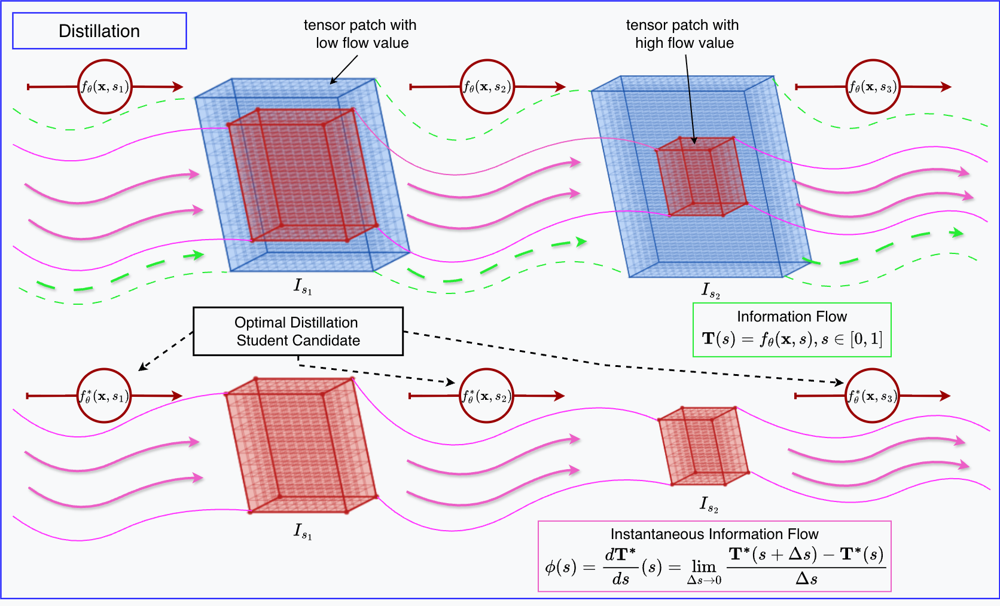

## Results

FAD achieves state-of-the-art results across multiple benchmarks:

- **Vision**: Up to 8× compression on ImageNet with < 0.5% accuracy drop
- **NLP**: Effective compression for transformer-based models
- **Efficiency**: No post-distillation tuning required
- **Flexibility**: Works with diverse architectures (CNNs, Transformers, etc.)

---
### 1. Knowledge Distillation Results Using FAD: Base vs. Distilled Models Across Different Architectures (Acc@1, GFlops, Δ%)

The table below presents the results of our distillation experiments, offering a comparative analysis across multiple model architectures and datasets. It reports top-1 accuracy for both original and distilled computer vision classification models, along with their computational efficiency measured in GFlops. The Δ% columns indicate the relative improvements or changes in accuracy and computational complexity achieved through knowledge distillation.


<table border="2" cellpadding="6" cellspacing="0" style="width: 100%;">
  <thead>
    <tr>
      <th>Dataset</th>
      <th>Architecture</th>
      <th>Acc@1 (Base)</th>
      <th>Acc@1 (Pruned)</th>
      <th>Δ%</th>
      <th>GFlops (Base)</th>
      <th>GFlops (Pruned)</th>
      <th>Δ%</th>
    </tr>
  </thead>
  <tbody>
    <tr>
      <td rowspan="10" style="vertical-align: middle;">ImageNet</td>
      <td>Inception-v3</td>
      <td>77,16</td>
      <td>75,81</td>
      <td>-1,75</td>
      <td>5,7</td>
      <td>2,1</td>
      <td>-64</td>
    </tr>
    <tr>
      <td>DenseNet-121</td>
      <td>74,65</td>
      <td>73,95</td>
      <td>-0,94</td>
      <td>2,8</td>
      <td>1,0</td>
      <td>-65</td>
    </tr>
    <tr>
      <td>VGG19 (BN)</td>
      <td>73,12</td>
      <td>71,56</td>
      <td>-2,14</td>
      <td>19,6</td>
      <td>7,1</td>
      <td>-64</td>
    </tr>
    <tr>
      <td>ResNet-50</td>
      <td>76,14</td>
      <td>75,15</td>
      <td>-1,30</td>
      <td>4,1</td>
      <td>1,6</td>
      <td>-61</td>
    </tr>
    <tr>
      <td>ViT-Base/16</td>
      <td>80,17</td>
      <td>79,81</td>
      <td>-0,45</td>
      <td>17,5</td>
      <td>6,9</td>
      <td>-61</td>
    </tr>
    <tr>
      <td>ShuffleNetV2 x2.0</td>
      <td>76,22</td>
      <td>74,86</td>
      <td>-1,78</td>
      <td>0,5</td>
      <td>0,2</td>
      <td>-60</td>
    </tr>
    <tr>
      <td>EfficientNet-B4</td>
      <td>83,37</td>
      <td>81,70</td>
      <td>-2,00</td>
      <td>4,2</td>
      <td>1,7</td>
      <td>-60</td>
    </tr>
    <tr>
      <td>EfficientNet V2-S</td>
      <td>84,21</td>
      <td>82,89</td>
      <td>-1,57</td>
      <td>8,8</td>
      <td>3,2</td>
      <td>-64</td>
    </tr>
    <tr>
      <td>MobileNetV3-L</td>
      <td>74,03</td>
      <td>72,80</td>
      <td>-1,66</td>
      <td>0,2</td>
      <td>0,1</td>
      <td>-50</td>
    </tr>
    <tr>
      <td>ConvNeXt-Small</td>
      <td>82,06</td>
      <td>80,93</td>
      <td>-1,38</td>
      <td>8,6</td>
      <td>2,7</td>
      <td>-69</td>
    </tr>
    <tr>
      <td rowspan="10" style="vertical-align: middle;">CIFAR-10</td>
      <td>Inception-v3</td>
      <td>95,33</td>
      <td>94,91</td>
      <td>-0,44</td>
      <td>5,7</td>
      <td>1,8</td>
      <td>-69</td>
    </tr>
    <tr>
      <td>DenseNet-121</td>
      <td>94,20</td>
      <td>93,97</td>
      <td>-0,24</td>
      <td>2,8</td>
      <td>0,9</td>
      <td>-68</td>
    </tr>
    <tr>
      <td>VGG19 (BN)</td>
      <td>93,46</td>
      <td>92,95</td>
      <td>-0,54</td>
      <td>19,6</td>
      <td>5,8</td>
      <td>-71</td>
    </tr>
    <tr>
      <td>ResNet-50</td>
      <td>98,19</td>
      <td>97,54</td>
      <td>-0,66</td>
      <td>4,1</td>
      <td>1,2</td>
      <td>-71</td>
    </tr>
    <tr>
      <td>ViT-Base/16</td>
      <td>98,61</td>
      <td>98,20</td>
      <td>-0,42</td>
      <td>17,5</td>
      <td>5,1</td>
      <td>-71</td>
    </tr>
    <tr>
      <td>ShuffleNetV2 x2.0</td>
      <td>90,45</td>
      <td>89,91</td>
      <td>-0,59</td>
      <td>0,5</td>
      <td>0,1</td>
      <td>-80</td>
    </tr>
    <tr>
      <td>EfficientNet-B4</td>
      <td>96,90</td>
      <td>96,60</td>
      <td>-0,31</td>
      <td>4,2</td>
      <td>1,6</td>
      <td>-62</td>
    </tr>
    <tr>
      <td>EfficientNet V2-S</td>
      <td>97,12</td>
      <td>96,78</td>
      <td>-0,35</td>
      <td>8,8</td>
      <td>2,8</td>
      <td>-69</td>
    </tr>
    <tr>
      <td>MobileNetV3-L</td>
      <td>89,80</td>
      <td>89,39</td>
      <td>-0,46</td>
      <td>0,2</td>
      <td>0,1</td>
      <td>-50</td>
    </tr>
    <tr>
      <td>ConvNeXt-Small</td>
      <td>94,21</td>
      <td>93,85</td>
      <td>-0,38</td>
      <td>8,6</td>
      <td>2,1</td>
      <td>-76</td>
    </tr>
    <tr>
      <td rowspan="10" style="vertical-align: middle;">CIFAR-100</td>
      <td>Inception-v3</td>
      <td>82,15</td>
      <td>80,55</td>
      <td>-1,95</td>
      <td>5,7</td>
      <td>2,0</td>
      <td>-65</td>
    </tr>
    <tr>
      <td>DenseNet-121</td>
      <td>72,07</td>
      <td>71,25</td>
      <td>-1,14</td>
      <td>2,8</td>
      <td>1,0</td>
      <td>-65</td>
    </tr>
    <tr>
      <td>VGG19 (BN)</td>
      <td>73,89</td>
      <td>72,60</td>
      <td>-1,75</td>
      <td>19,6</td>
      <td>7,3</td>
      <td>-63</td>
    </tr>
    <tr>
      <td>ResNet-50</td>
      <td>86,61</td>
      <td>85,10</td>
      <td>-1,74</td>
      <td>4,1</td>
      <td>1,2</td>
      <td>-71</td>
    </tr>
    <tr>
      <td>ViT-Base/16</td>
      <td>94,24</td>
      <td>93,25</td>
      <td>-1,05</td>
      <td>17,5</td>
      <td>7,1</td>
      <td>-60</td>
    </tr>
    <tr>
      <td>ShuffleNetV2 x2.0</td>
      <td>75,33</td>
      <td>74,09</td>
      <td>-1,64</td>
      <td>0,5</td>
      <td>0,2</td>
      <td>-60</td>
    </tr>
    <tr>
      <td>EfficientNet-B4</td>
      <td>90,12</td>
      <td>88,84</td>
      <td>-1,43</td>
      <td>4,2</td>
      <td>1,8</td>
      <td>-58</td>
    </tr>
    <tr>
      <td>EfficientNet V2-S</td>
      <td>88,44</td>
      <td>87,17</td>
      <td>-1,43</td>
      <td>8,8</td>
      <td>3,1</td>
      <td>-65</td>
    </tr>
    <tr>
      <td>MobileNetV3-L</td>
      <td>77,70</td>
      <td>76,97</td>
      <td>-0,94</td>
      <td>0,2</td>
      <td>0,1</td>
      <td>-50</td>
    </tr>
    <tr>
      <td>ConvNeXt-Small</td>
      <td>85,59</td>
      <td>84,10</td>
      <td>-1,75</td>
      <td>8,6</td>
      <td>2,6</td>
      <td>-70</td>
    </tr>
    <tr>
      <td rowspan="10" style="vertical-align: middle;">Stanford Cars</td>
      <td>Inception-v3</td>
      <td>83,86</td>
      <td>82,32</td>
      <td>-1,84</td>
      <td>5,7</td>
      <td>2,2</td>
      <td>-62</td>
    </tr>
    <tr>
      <td>DenseNet-121</td>
      <td>83,13</td>
      <td>81,93</td>
      <td>-1,45</td>
      <td>2,8</td>
      <td>1,1</td>
      <td>-61</td>
    </tr>
    <tr>
      <td>VGG19 (BN)</td>
      <td>86,99</td>
      <td>85,67</td>
      <td>-1,52</td>
      <td>19,6</td>
      <td>7,6</td>
      <td>-62</td>
    </tr>
    <tr>
      <td>ResNet-50</td>
      <td>92,52</td>
      <td>91,07</td>
      <td>-1,57</td>
      <td>4,1</td>
      <td>1,5</td>
      <td>-64</td>
    </tr>
    <tr>
      <td>ViT-Base/16</td>
      <td>93,73</td>
      <td>92,17</td>
      <td>-1,67</td>
      <td>17,5</td>
      <td>7,5</td>
      <td>-58</td>
    </tr>
    <tr>
      <td>ShuffleNetV2 x2.0</td>
      <td>82,56</td>
      <td>81,37</td>
      <td>-1,44</td>
      <td>0,5</td>
      <td>0,2</td>
      <td>-60</td>
    </tr>
    <tr>
      <td>EfficientNet-B4</td>
      <td>91,34</td>
      <td>90,04</td>
      <td>-1,42</td>
      <td>4,2</td>
      <td>1,6</td>
      <td>-62</td>
    </tr>
    <tr>
      <td>EfficientNet V2-S</td>
      <td>90,24</td>
      <td>89,55</td>
      <td>-0,76</td>
      <td>8,8</td>
      <td>3,2</td>
      <td>-64</td>
    </tr>
    <tr>
      <td>MobileNetV3-L</td>
      <td>68,32</td>
      <td>67,43</td>
      <td>-1,30</td>
      <td>0,2</td>
      <td>0,1</td>
      <td>-50</td>
    </tr>
    <tr>
      <td>ConvNeXt-Small</td>
      <td>86,22</td>
      <td>81,17</td>
      <td>-5,86</td>
      <td>8,6</td>
      <td>3,1</td>
      <td>-64</td>
    </tr>
    <tr>
      <td rowspan="10" style="vertical-align: middle;">Fashion MNIST</td>
      <td>Inception-v3</td>
      <td>92,78</td>
      <td>92,29</td>
      <td>-0,53</td>
      <td>5,7</td>
      <td>1,7</td>
      <td>-71</td>
    </tr>
    <tr>
      <td>DenseNet-121</td>
      <td>93,00</td>
      <td>92,30</td>
      <td>-0,76</td>
      <td>2,8</td>
      <td>0,9</td>
      <td>-68</td>
    </tr>
    <tr>
      <td>VGG19 (BN)</td>
      <td>91,77</td>
      <td>91,12</td>
      <td>-0,71</td>
      <td>19,6</td>
      <td>5,4</td>
      <td>-73</td>
    </tr>
    <tr>
      <td>ResNet-50</td>
      <td>93,18</td>
      <td>92,77</td>
      <td>-0,44</td>
      <td>4,1</td>
      <td>1,2</td>
      <td>-71</td>
    </tr>
    <tr>
      <td>ViT-Base/16</td>
      <td>94,80</td>
      <td>94,21</td>
      <td>-0,62</td>
      <td>17,5</td>
      <td>5,8</td>
      <td>-67</td>
    </tr>
    <tr>
      <td>ShuffleNetV2 x2.0</td>
      <td>90,89</td>
      <td>90,27</td>
      <td>-0,68</td>
      <td>0,5</td>
      <td>0,1</td>
      <td>-80</td>
    </tr>
    <tr>
      <td>EfficientNet-B4</td>
      <td>94,97</td>
      <td>94,51</td>
      <td>-0,49</td>
      <td>4,2</td>
      <td>1,5</td>
      <td>-65</td>
    </tr>
    <tr>
      <td>EfficientNet V2-S</td>
      <td>95,35</td>
      <td>94,89</td>
      <td>-0,48</td>
      <td>8,8</td>
      <td>2,7</td>
      <td>-70</td>
    </tr>
    <tr>
      <td>MobileNetV3-L</td>
      <td>89,80</td>
      <td>89,39</td>
      <td>-0,46</td>
      <td>0,2</td>
      <td>0,1</td>
      <td>-50</td>
    </tr>
    <tr>
      <td>ConvNeXt-Small</td>
      <td>89,66</td>
      <td>89,29</td>
      <td>-0,41</td>
      <td>8,6</td>
      <td>3,5</td>
      <td>-60</td>
    </tr>
    <tr>
      <td rowspan="10" style="vertical-align: middle;">Food101</td>
      <td>Inception-v3</td>
      <td>88,12</td>
      <td>86,82</td>
      <td>-1,48</td>
      <td>5,7</td>
      <td>2,1</td>
      <td>-64</td>
    </tr>
    <tr>
      <td>DenseNet-121</td>
      <td>87,35</td>
      <td>85,70</td>
      <td>-1,89</td>
      <td>2,8</td>
      <td>0,9</td>
      <td>-68</td>
    </tr>
    <tr>
      <td>VGG19 (BN)</td>
      <td>86,32</td>
      <td>84,32</td>
      <td>-2,32</td>
      <td>19,6</td>
      <td>5,8</td>
      <td>-71</td>
    </tr>
    <tr>
      <td>ResNet-50</td>
      <td>90,46</td>
      <td>89,21</td>
      <td>-1,38</td>
      <td>4,1</td>
      <td>1,4</td>
      <td>-66</td>
    </tr>
    <tr>
      <td>ViT-Base/16</td>
      <td>87,44</td>
      <td>86,13</td>
      <td>-1,50</td>
      <td>17,5</td>
      <td>7,2</td>
      <td>-59</td>
    </tr>
    <tr>
      <td>ShuffleNetV2 x2.0</td>
      <td>84,23</td>
      <td>82,89</td>
      <td>-1,59</td>
      <td>0,5</td>
      <td>0,2</td>
      <td>-60</td>
    </tr>
    <tr>
      <td>EfficientNet-B4</td>
      <td>90,36</td>
      <td>89,08</td>
      <td>-1,41</td>
      <td>4,2</td>
      <td>1,7</td>
      <td>-60</td>
    </tr>
    <tr>
      <td>EfficientNet V2-S</td>
      <td>90,56</td>
      <td>89,21</td>
      <td>-1,49</td>
      <td>8,8</td>
      <td>3,0</td>
      <td>-66</td>
    </tr>
    <tr>
      <td>MobileNetV3-L</td>
      <td>86,05</td>
      <td>83,76</td>
      <td>-2,67</td>
      <td>0,2</td>
      <td>0,1</td>
      <td>-50</td>
    </tr>
    <tr>
      <td>ConvNeXt-Small</td>
      <td>86,25</td>
      <td>83,69</td>
      <td>-2,97</td>
      <td>8,6</td>
      <td>3,7</td>
      <td>-57</td>
    </tr>
    <tr>
      <td rowspan="10" style="vertical-align: middle;">iNaturalist</td>
      <td>Inception-v3</td>
      <td>72,35</td>
      <td>71,10</td>
      <td>-1,73</td>
      <td>5,7</td>
      <td>2,3</td>
      <td>-60</td>
    </tr>
    <tr>
      <td>DenseNet-121</td>
      <td>69,75</td>
      <td>68,79</td>
      <td>-1,38</td>
      <td>2,8</td>
      <td>1,0</td>
      <td>-65</td>
    </tr>
    <tr>
      <td>VGG19 (BN)</td>
      <td>67,20</td>
      <td>65,40</td>
      <td>-2,68</td>
      <td>19,6</td>
      <td>6,8</td>
      <td>-66</td>
    </tr>
    <tr>
      <td>ResNet-50</td>
      <td>76,15</td>
      <td>74,66</td>
      <td>-1,96</td>
      <td>4,1</td>
      <td>1,5</td>
      <td>-64</td>
    </tr>
    <tr>
      <td>ViT-Base/16</td>
      <td>68,66</td>
      <td>67,77</td>
      <td>-1,30</td>
      <td>17,5</td>
      <td>7,2</td>
      <td>-59</td>
    </tr>
    <tr>
      <td>ShuffleNetV2 x2.0</td>
      <td>66,77</td>
      <td>65,64</td>
      <td>-1,70</td>
      <td>0,5</td>
      <td>0,2</td>
      <td>-60</td>
    </tr>
    <tr>
      <td>EfficientNet-B4</td>
      <td>70,58</td>
      <td>68,59</td>
      <td>-2,82</td>
      <td>4,2</td>
      <td>1,5</td>
      <td>-65</td>
    </tr>
    <tr>
      <td>EfficientNet V2-S</td>
      <td>74,30</td>
      <td>73,13</td>
      <td>-1,57</td>
      <td>8,8</td>
      <td>3,3</td>
      <td>-63</td>
    </tr>
    <tr>
      <td>MobileNetV3-L</td>
      <td>68,31</td>
      <td>67,37</td>
      <td>-1,38</td>
      <td>0,2</td>
      <td>0,1</td>
      <td>-50</td>
    </tr>
    <tr>
      <td>ConvNeXt-Small</td>
      <td>68,90</td>
      <td>67,45</td>
      <td>-2,10</td>
      <td>8,6</td>
      <td>3,2</td>
      <td>-63</td>
    </tr>
    <tr>
      <td rowspan="10" style="vertical-align: middle;">Oxford-IIIT Pet</td>
      <td>Inception-v3</td>
      <td>89,34</td>
      <td>88,24</td>
      <td>-1,24</td>
      <td>5,7</td>
      <td>1,9</td>
      <td>-67</td>
    </tr>
    <tr>
      <td>DenseNet-121</td>
      <td>85,24</td>
      <td>84,22</td>
      <td>-1,19</td>
      <td>2,8</td>
      <td>0,8</td>
      <td>-72</td>
    </tr>
    <tr>
      <td>VGG19 (BN)</td>
      <td>85,20</td>
      <td>85,25</td>
      <td>0,06</td>
      <td>19,6</td>
      <td>6,1</td>
      <td>-69</td>
    </tr>
    <tr>
      <td>ResNet-50</td>
      <td>93,11</td>
      <td>92,79</td>
      <td>-0,35</td>
      <td>4,1</td>
      <td>1,7</td>
      <td>-59</td>
    </tr>
    <tr>
      <td>ViT-Base/16</td>
      <td>89,58</td>
      <td>88,15</td>
      <td>-1,60</td>
      <td>17,5</td>
      <td>5,4</td>
      <td>-70</td>
    </tr>
    <tr>
      <td>ShuffleNetV2 x2.0</td>
      <td>83,67</td>
      <td>82,49</td>
      <td>-1,42</td>
      <td>0,5</td>
      <td>0,2</td>
      <td>-60</td>
    </tr>
    <tr>
      <td>EfficientNet-B4</td>
      <td>87,85</td>
      <td>87,05</td>
      <td>-0,91</td>
      <td>4,2</td>
      <td>1,6</td>
      <td>-62</td>
    </tr>
    <tr>
      <td>EfficientNet V2-S</td>
      <td>88,36</td>
      <td>88,15</td>
      <td>-0,24</td>
      <td>8,8</td>
      <td>3,7</td>
      <td>-58</td>
    </tr>
    <tr>
      <td>MobileNetV3-L</td>
      <td>85,53</td>
      <td>84,59</td>
      <td>-1,10</td>
      <td>0,2</td>
      <td>0,1</td>
      <td>-50</td>
    </tr>
    <tr>
      <td>ConvNeXt-Small</td>
      <td>84,08</td>
      <td>83,05</td>
      <td>-1,23</td>
      <td>8,6</td>
      <td>2,9</td>
      <td>-67</td>
    </tr>
    <tr>
      <td rowspan="10" style="vertical-align: middle;">FER2013</td>
      <td>Inception-v3</td>
      <td>70,46</td>
      <td>69,10</td>
      <td>-1,93</td>
      <td>5,7</td>
      <td>2,2</td>
      <td>-62</td>
    </tr>
    <tr>
      <td>DenseNet-121</td>
      <td>65,13</td>
      <td>64,16</td>
      <td>-1,49</td>
      <td>2,8</td>
      <td>0,9</td>
      <td>-68</td>
    </tr>
    <tr>
      <td>VGG19 (BN)</td>
      <td>68,34</td>
      <td>67,15</td>
      <td>-1,75</td>
      <td>19,6</td>
      <td>6,7</td>
      <td>-66</td>
    </tr>
    <tr>
      <td>ResNet-50</td>
      <td>71,81</td>
      <td>70,71</td>
      <td>-1,54</td>
      <td>4,1</td>
      <td>1,4</td>
      <td>-66</td>
    </tr>
    <tr>
      <td>ViT-Base/16</td>
      <td>70,21</td>
      <td>69,02</td>
      <td>-1,69</td>
      <td>17,5</td>
      <td>6,2</td>
      <td>-65</td>
    </tr>
    <tr>
      <td>ShuffleNetV2 x2.0</td>
      <td>67,45</td>
      <td>66,23</td>
      <td>-1,81</td>
      <td>0,5</td>
      <td>0,2</td>
      <td>-60</td>
    </tr>
    <tr>
      <td>EfficientNet-B4</td>
      <td>74,16</td>
      <td>73,29</td>
      <td>-1,17</td>
      <td>4,2</td>
      <td>1,7</td>
      <td>-60</td>
    </tr>
    <tr>
      <td>EfficientNet V2-S</td>
      <td>76,89</td>
      <td>75,42</td>
      <td>-1,91</td>
      <td>8,8</td>
      <td>3,1</td>
      <td>-65</td>
    </tr>
    <tr>
      <td>MobileNetV3-L</td>
      <td>69,88</td>
      <td>67,40</td>
      <td>-3,55</td>
      <td>0,2</td>
      <td>0,1</td>
      <td>-50</td>
    </tr>
    <tr>
      <td>ConvNeXt-Small</td>
      <td>76,10</td>
      <td>74,85</td>
      <td>-1,64</td>
      <td>8,6</td>
      <td>2,7</td>
      <td>-69</td>
    </tr>
  </tbody>
</table>

---
### 2. Distillation results (Vision Tasks)

<table border="2" cellpadding="6" cellspacing="0" style="width: 100%;">
  <thead>
    <tr>
      <th>Dataset</th>
      <th>Architecture</th>
      <th>GFlops (Base)</th>
      <th>GFlops (Pruned)</th>
      <th>Δ%</th>
      <th>Metric (Base)</th>
      <th>Metric (Pruned)</th>
      <th>Δ%</th>
    </tr>
  </thead>
  <tbody>
  <tr>
  <td colspan="8" style="text-align: left;">
    Image Classification Task (Metric: Top-1 Accuracy, %)
  </td>
  <tbody>
    <tr>
      <td rowspan="4">ImageNet</td>
      <td>ResNet-50</td>
      <td>4,1</td>
      <td>1,6</td>
      <td>-61</td>
      <td>76,1</td>
      <td>75,2</td>
      <td>-1,3</td>
    </tr>
    <tr>
      <td>ShuffleNetV2 x2.0</td>
      <td>0,5</td>
      <td>0,2</td>
      <td>-60</td>
      <td>76,2</td>
      <td>74,9</td>
      <td>-1,8</td>
    </tr>
    <tr>
      <td>EfficientNet-B4</td>
      <td>4,2</td>
      <td>1,7</td>
      <td>-60</td>
      <td>83,4</td>
      <td>81,7</td>
      <td>-2,0</td>
    </tr>
    <tr>
      <td>ViT-Base/16</td>
      <td>17,5</td>
      <td>6,9</td>
      <td>-61</td>
      <td>80,2</td>
      <td>79,8</td>
      <td>-1,5</td>
    </tr>
    <tr>
      <td rowspan="4">Stanford Cars</td>
      <td>ResNet-50</td>
      <td>4,1</td>
      <td>1,5</td>
      <td>-64</td>
      <td>92,5</td>
      <td>91,1</td>
      <td>-1,6</td>
    </tr>
    <tr>
      <td>ShuffleNetV2 x2.0</td>
      <td>0,5</td>
      <td>0,2</td>
      <td>-60</td>
      <td>82,6</td>
      <td>81,4</td>
      <td>-1,4</td>
    </tr>
    <tr>
      <td>EfficientNet-B4</td>
      <td>4,2</td>
      <td>1,6</td>
      <td>-62</td>
      <td>91,3</td>
      <td>90,0</td>
      <td>-1,4</td>
    </tr>
    <tr>
      <td>ViT-Base/16</td>
      <td>17,5</td>
      <td>7,5</td>
      <td>-58</td>
      <td>93,7</td>
      <td>92,2</td>
      <td>-1,7</td>
    </tr>
    <tr>
      <td rowspan="4">CIFAR-100</td>
      <td>ResNet-50</td>
      <td>4,1</td>
      <td>1,2</td>
      <td>-71,0</td>
      <td>86,6</td>
      <td>85,1</td>
      <td>-1,7</td>
    </tr>
    <tr>
      <td>ShuffleNetV2 x2.0</td>
      <td>0,5</td>
      <td>0,2</td>
      <td>-60,0</td>
      <td>75,3</td>
      <td>74,1</td>
      <td>-1,6</td>
    </tr>
    <tr>
      <td>EfficientNet-B4</td>
      <td>4,2</td>
      <td>1,8</td>
      <td>-58,0</td>
      <td>90,1</td>
      <td>88,8</td>
      <td>-1,4</td>
    </tr>
    <tr>
      <td>ViT-Base/16</td>
      <td>17,5</td>
      <td>7,1</td>
      <td>-60,0</td>
      <td>94,2</td>
      <td>93,3</td>
      <td>-1,0</td>
    </tr>
    <tr>
      <td rowspan="4">Food101</td>
      <td>ResNet-50</td>
      <td>4,1</td>
      <td>1,4</td>
      <td>-66,0</td>
      <td>90,5</td>
      <td>89,2</td>
      <td>-1,4</td>
    </tr>
    <tr>
      <td>ShuffleNetV2 x2.0</td>
      <td>0,5</td>
      <td>0,2</td>
      <td>-60,0</td>
      <td>84,2</td>
      <td>82,9</td>
      <td>-1,6</td>
    </tr>
    <tr>
      <td>EfficientNet-B4</td>
      <td>4,2</td>
      <td>1,7</td>
      <td>-60,0</td>
      <td>90,4</td>
      <td>89,1</td>
      <td>-1,4</td>
    </tr>
    <tr>
      <td>ViT-Base/16</td>
      <td>17,5</td>
      <td>7,2</td>
      <td>-59,0</td>
      <td>87,4</td>
      <td>86,1</td>
      <td>-1,5</td>
    </tr>
    <tr>
      <td colspan="8">Object Detection Task (Metric: mAP)</td>
    </tr>
    <tr>
      <td rowspan="3">Pascal VOC</td>
      <td>Faster R-CNN (ResNet-50)</td>
      <td>150,2</td>
      <td>62,0</td>
      <td>-59</td>
      <td>78,4</td>
      <td>76,7</td>
      <td>-2,1</td>
    </tr>
    <tr>
      <td>YOLOv4 (ShuffleNetV2)</td>
      <td>52,3</td>
      <td>22,1</td>
      <td>-58</td>
      <td>77,5</td>
      <td>75,7</td>
      <td>-2,3</td>
    </tr>
    <tr>
      <td>DETR (ViT-Base/16)</td>
      <td>80,5</td>
      <td>34,2</td>
      <td>-58</td>
      <td>79,1</td>
      <td>77,2</td>
      <td>-2,5</td>
    </tr>
    <tr>
      <td rowspan="3">Objects365</td>
      <td>Faster R-CNN (ResNet-50)</td>
      <td>232,1</td>
      <td>90,8</td>
      <td>-61</td>
      <td>45,8</td>
      <td>43,9</td>
      <td>-4,2</td>
    </tr>
    <tr>
      <td>YOLOv4 (ShuffleNetV2)</td>
      <td>82,5</td>
      <td>35,5</td>
      <td>-57</td>
      <td>44,1</td>
      <td>42,4</td>
      <td>-3,9</td>
    </tr>
    <tr>
      <td>DETR (ViT-Base/16)</td>
      <td>112,3</td>
      <td>45,4</td>
      <td>-60</td>
      <td>47,2</td>
      <td>45,4</td>
      <td>-3,9</td>
    </tr>
    <tr>
      <td rowspan="3">Open Images</td>
      <td>Faster R-CNN (ResNet-50)</td>
      <td>210,8</td>
      <td>86,1</td>
      <td>-59</td>
      <td>63,5</td>
      <td>61,6</td>
      <td>-2,9</td>
    </tr>
    <tr>
      <td>YOLOv4 (ShuffleNetV2)</td>
      <td>75,2</td>
      <td>31,5</td>
      <td>-58</td>
      <td>61,0</td>
      <td>59,3</td>
      <td>-2,8</td>
    </tr>
    <tr>
      <td>DETR (ViT-Base/16)</td>
      <td>100,7</td>
      <td>41,6</td>
      <td>-59</td>
      <td>64,2</td>
      <td>62,1</td>
      <td>-3,3</td>
    </tr>
    <tr>
      <td rowspan="3">COCO 2017</td>
      <td>Faster R-CNN (ResNet-50)</td>
      <td>180,5</td>
      <td>73,4</td>
      <td>-59</td>
      <td>41,2</td>
      <td>39,9</td>
      <td>-3,3</td>
    </tr>
    <tr>
      <td>YOLOv4 (ShuffleNetV2)</td>
      <td>60,8</td>
      <td>27,2</td>
      <td>-55</td>
      <td>39,5</td>
      <td>38,0</td>
      <td>-3,8</td>
    </tr>
    <tr>
      <td>DETR (ViT-Base/16)</td>
      <td>86,4</td>
      <td>37,5</td>
      <td>-57</td>
      <td>42,0</td>
      <td>40,4</td>
      <td>-3,7</td>
    </tr>
    <tr>
      <td colspan="8">Image Segmentation Task (Metric: mIoU)</td>
    </tr>
    <tr>
      <td rowspan="3">ADE20K</td>
      <td>FCN (VGG19-BN)</td>
      <td>225,1</td>
      <td>84,4</td>
      <td>-63</td>
      <td>36,7</td>
      <td>34,9</td>
      <td>-4,8</td>
    </tr>
    <tr>
      <td>U-Net (ResNet-50)</td>
      <td>188,7</td>
      <td>68,9</td>
      <td>-63</td>
      <td>44,8</td>
      <td>42,8</td>
      <td>-4,5</td>
    </tr>
    <tr>
      <td>SegFormer (ViT-Base/16)</td>
      <td>158,4</td>
      <td>54,6</td>
      <td>-66</td>
      <td>47,0</td>
      <td>45,0</td>
      <td>-4,2</td>
    </tr>
    <tr>
      <td rowspan="3">Pascal VOC</td>
      <td>FCN (VGG19-BN)</td>
      <td>201,8</td>
      <td>75,7</td>
      <td>-63</td>
      <td>69,5</td>
      <td>68,2</td>
      <td>-1,9</td>
    </tr>
    <tr>
      <td>U-Net (ResNet-50)</td>
      <td>170,2</td>
      <td>60,6</td>
      <td>-64</td>
      <td>75,8</td>
      <td>74,3</td>
      <td>-2,0</td>
    </tr>
    <tr>
      <td>SegFormer (ViT-Base/16)</td>
      <td>142,1</td>
      <td>54,0</td>
      <td>-62</td>
      <td>78,0</td>
      <td>76,4</td>
      <td>-2,0</td>
    </tr>
    <tr>
      <td rowspan="3">COCO 2017</td>
      <td>FCN (VGG19-BN)</td>
      <td>233,0</td>
      <td>84,7</td>
      <td>-64</td>
      <td>36,7</td>
      <td>35,1</td>
      <td>-4,4</td>
    </tr>
    <tr>
      <td>U-Net (ResNet-50)</td>
      <td>192,5</td>
      <td>72,1</td>
      <td>-63</td>
      <td>44,8</td>
      <td>43,5</td>
      <td>-2,8</td>
    </tr>
    <tr>
      <td>SegFormer (ViT-Base/16)</td>
      <td>162,8</td>
      <td>61,8</td>
      <td>-62</td>
      <td>47,0</td>
      <td>45,1</td>
      <td>-4,1</td>
    </tr>
    <tr>
      <td rowspan="3">Cityscapes</td>
      <td>FCN (VGG19-BN)</td>
      <td>212,5</td>
      <td>84,3</td>
      <td>-60</td>
      <td>70,2</td>
      <td>68,9</td>
      <td>-1,9</td>
    </tr>
    <tr>
      <td>U-Net (ResNet-50)</td>
      <td>181,3</td>
      <td>71,7</td>
      <td>-60</td>
      <td>77,5</td>
      <td>76,1</td>
      <td>-1,9</td>
    </tr>
    <tr>
      <td>SegFormer (ViT-Base/16)</td>
      <td>150,9</td>
      <td>58,0</td>
      <td>-62</td>
      <td>80,0</td>
      <td>78,5</td>
      <td>-1,9</td>
    </tr>
    <tr>
      <td colspan="8">Image Generation Task (Metric: FID, Less is better)</td>
    </tr>
    <tr>
      <td>CIFAR-10</td>
      <td>DCGAN</td>
      <td>12,2</td>
      <td>4,7</td>
      <td>-61</td>
      <td>24,1</td>
      <td>25,9</td>
      <td>+6,8</td>
    </tr>
    <tr>
      <td>COCO-Stuff</td>
      <td>VQGAN</td>
      <td>18,3</td>
      <td>7,5</td>
      <td>-59</td>
      <td>18,5</td>
      <td>20,0</td>
      <td>+8,1</td>
    </tr>
    <tr>
      <td>COCO 2017</td>
      <td>Stable Diffusion v1,5</td>
      <td>85,7</td>
      <td>34,4</td>
      <td>-60</td>
      <td>12,3</td>
      <td>13,5</td>
      <td>+9,0</td>
    </tr>
  </tbody>
</table>

---
### 3. Distillation results (CV & NLP Tasks)

<table border="2" cellpadding="6" cellspacing="0" style="width: 100%;">
  <thead>
    <tr>
      <th>Model</th>
      <th>Method</th>
      <th>ImageNet</th>
      <th>CIFAR-10</th>
      <th>CIFAR-100</th>
    </tr>
  </thead>
  <tbody>
    <tr>
      <td rowspan="6">ResNet-50</td>
      <td>Baseline</td>
      <td>76,1</td>
      <td>98,2</td>
      <td>86,6</td>
    </tr>
    <tr>
      <td>Attention Transfer</td>
      <td>73,2</td>
      <td>92,3</td>
      <td>75,5</td>
    </tr>
    <tr>
      <td>Contrastive Distillation</td>
      <td>74,7</td>
      <td>93,9</td>
      <td>77,1</td>
    </tr>
    <tr>
      <td>Generative Distillation</td>
      <td>74,4</td>
      <td>94,4</td>
      <td>78,2</td>
    </tr>
    <tr>
      <td>TopKD</td>
      <td>74,9</td>
      <td>95,2</td>
      <td>81,4</td>
    </tr>
    <tr>
      <td>FAD (Ours)</td>
      <td>75,2</td>
      <td>97,5</td>
      <td>85,1</td>
    </tr>
    <tr>
      <td rowspan="6">ViT-Base/16</td>
      <td>Baseline</td>
      <td>81,1</td>
      <td>98,6</td>
      <td>93,7</td>
    </tr>
    <tr>
      <td>Attention Transfer</td>
      <td>78,4</td>
      <td>95,3</td>
      <td>87,6</td>
    </tr>
    <tr>
      <td>Contrastive Distillation</td>
      <td>78,6</td>
      <td>96,3</td>
      <td>89,1</td>
    </tr>
    <tr>
      <td>Generative Distillation</td>
      <td>78,3</td>
      <td>96,0</td>
      <td>89,7</td>
    </tr>
    <tr>
      <td>TopKD</td>
      <td>79,4</td>
      <td>96,7</td>
      <td>90,9</td>
    </tr>
    <tr>
      <td>FAD (Ours)</td>
      <td>79,8</td>
      <td>98,2</td>
      <td>93,3</td>
    </tr>
    <tr>
      <td rowspan="6">DenseNet-121</td>
      <td>Baseline</td>
      <td>74,7</td>
      <td>94,2</td>
      <td>72,0</td>
    </tr>
    <tr>
      <td>Attention Transfer</td>
      <td>71,6</td>
      <td>89,8</td>
      <td>64,7</td>
    </tr>
    <tr>
      <td>Contrastive Distillation</td>
      <td>73,0</td>
      <td>92,0</td>
      <td>67,6</td>
    </tr>
    <tr>
      <td>Generative Distillation</td>
      <td>72,9</td>
      <td>91,8</td>
      <td>66,4</td>
    </tr>
    <tr>
      <td>TopKD</td>
      <td>73,5</td>
      <td>92,7</td>
      <td>69,4</td>
    </tr>
    <tr>
      <td>FAD (Ours)</td>
      <td>73,9</td>
      <td>94,0</td>
      <td>71,2</td>
    </tr>
  </tbody>
</table>

<table border="2" cellpadding="6" cellspacing="0" style="width: 100%;">
  <thead>
    <tr>
      <th>Model</th>
      <th>Method</th>
      <th>SST-2</th>
      <th>QQP</th>
      <th>MNLI-m</th>
    </tr>
  </thead>
  <tbody>
    <tr>
      <td rowspan="6">BERT Base</td>
      <td>Baseline</td>
      <td>93,5</td>
      <td>91,2</td>
      <td>84,5</td>
    </tr>
    <tr>
      <td>Attention Transfer</td>
      <td>90,8</td>
      <td>87,9</td>
      <td>81,4</td>
    </tr>
    <tr>
      <td>Contrastive Distillation</td>
      <td>91,5</td>
      <td>88,3</td>
      <td>81,3</td>
    </tr>
    <tr>
      <td>Generative Distillation</td>
      <td>91,1</td>
      <td>87,9</td>
      <td>80,3</td>
    </tr>
    <tr>
      <td>TopKD</td>
      <td>91,1</td>
      <td>88,9</td>
      <td>82,1</td>
    </tr>
    <tr>
      <td>FAD (Ours)</td>
      <td>91,4</td>
      <td>89,1</td>
      <td>82,5</td>
    </tr>
    <tr>
      <td rowspan="6">T5 Base</td>
      <td>Baseline</td>
      <td>95,2</td>
      <td>92,4</td>
      <td>87,1</td>
    </tr>
    <tr>
      <td>Attention Transfer</td>
      <td>92,7</td>
      <td>87,7</td>
      <td>83,2</td>
    </tr>
    <tr>
      <td>Contrastive Distillation</td>
      <td>93,3</td>
      <td>88,6</td>
      <td>82,7</td>
    </tr>
    <tr>
      <td>Generative Distillation</td>
      <td>92,7</td>
      <td>89,1</td>
      <td>82,7</td>
    </tr>
    <tr>
      <td>TopKD</td>
      <td>93,7</td>
      <td>89,0</td>
      <td>83,7</td>
    </tr>
    <tr>
      <td>FAD (Ours)</td>
      <td>93,7</td>
      <td>89,2</td>
      <td>83,7</td>
    </tr>
    <tr>
      <td rowspan="6">GPT-2 Base</td>
      <td>Baseline</td>
      <td>92,1</td>
      <td>87,1</td>
      <td>82,3</td>
    </tr>
    <tr>
      <td>Attention Transfer</td>
      <td>89,6</td>
      <td>84,8</td>
      <td>78,5</td>
    </tr>
    <tr>
      <td>Contrastive Distillation</td>
      <td>90,0</td>
      <td>85,2</td>
      <td>78,4</td>
    </tr>
    <tr>
      <td>Generative Distillation</td>
      <td>89,8</td>
      <td>85,9</td>
      <td>79,0</td>
    </tr>
    <tr>
      <td>TopKD</td>
      <td>90,6</td>
      <td>86,1</td>
      <td>79,0</td>
    </tr>
    <tr>
      <td>FAD (Ours)</td>
      <td>90,6</td>
      <td>86,2</td>
      <td>79,0</td>
    </tr>
  </tbody>
</table>

---
### 4. Comparison of inference times for baseline and pruned models across various architectures, along with the achieved speedup

<table border="2" cellpadding="6" cellspacing="0" style="width: 100%;">
  <thead>
    <tr>
      <th>Architecture</th>
      <th>Inference Time Base (ms)</th>
      <th>Inference Time Pruned (ms)</th>
      <th>Speedup ×</th>
    </tr>
  </thead>
  <tbody>
    <tr>
      <td>ResNet-50</td>
      <td>8,5</td>
      <td>4,3</td>
      <td>2,00</td>
    </tr>
    <tr>
      <td>EfficientNet-B4</td>
      <td>8,8</td>
      <td>4,6</td>
      <td>1,93</td>
    </tr>
    <tr>
      <td>ViT-Base/16</td>
      <td>33,2</td>
      <td>19,9</td>
      <td>1,67</td>
    </tr>
    <tr>
      <td>MobileNetV3-Large</td>
      <td>4,1</td>
      <td>1,9</td>
      <td>2,14</td>
    </tr>
    <tr>
      <td>DenseNet-121</td>
      <td>6,2</td>
      <td>3,3</td>
      <td>1,86</td>
    </tr>
    <tr>
      <td>ConvNeXt-Small</td>
      <td>17,5</td>
      <td>10,6</td>
      <td>1,65</td>
    </tr>
    <tr>
      <td>VGG19-BN</td>
      <td>38,2</td>
      <td>18,2</td>
      <td>2,10</td>
    </tr>
    <tr>
      <td>ShuffleNet V2 x2.0</td>
      <td>3,5</td>
      <td>1,8</td>
      <td>1,93</td>
    </tr>
    <tr>
      <td>Inception-v3</td>
      <td>11,6</td>
      <td>5,4</td>
      <td>2,13</td>
    </tr>
    <tr>
      <td>EfficientNetV2-S</td>
      <td>17,4</td>
      <td>11,3</td>
      <td>1,54</td>
    </tr>
    <tr>
      <td>Faster R-CNN (ResNet-50)</td>
      <td>48,0</td>
      <td>28,3</td>
      <td>1,70</td>
    </tr>
    <tr>
      <td>YOLOv4 (ShuffleNetV2)</td>
      <td>12,5</td>
      <td>6,7</td>
      <td>1,88</td>
    </tr>
    <tr>
      <td>DETR (ViT-Base/16)</td>
      <td>75,0</td>
      <td>47,5</td>
      <td>1,58</td>
    </tr>
    <tr>
      <td>FCN (VGG19-BN)</td>
      <td>52,0</td>
      <td>26,5</td>
      <td>1,96</td>
    </tr>
    <tr>
      <td>U-Net (ResNet-50)</td>
      <td>28,0</td>
      <td>15,3</td>
      <td>1,82</td>
    </tr>
    <tr>
      <td>SegFormer (ViT-Base/16)</td>
      <td>65,0</td>
      <td>40,6</td>
      <td>1,60</td>
    </tr>
    <tr>
      <td>BERT Base</td>
      <td>45,0</td>
      <td>28,6</td>
      <td>1,58</td>
    </tr>
    <tr>
      <td>GPT-2 Base</td>
      <td>120,0</td>
      <td>80,8</td>
      <td>1,49</td>
    </tr>
    <tr>
      <td>T5 Base</td>
      <td>95,0</td>
      <td>60,8</td>
      <td>1,56</td>
    </tr>
  </tbody>
</table>

---
### 5. Comparison of model compression methods with different compression levels (~50%, ~70%, ~90% of weights removed)

<table border="2" cellpadding="6" cellspacing="0" style="width: 100%;">
  <caption>ResNet-50, ImageNet</caption>
  <thead>
    <tr>
      <th>Compression (~%)</th>
      <th>Method</th>
      <th>Acc@1</th>
      <th>Params (M)</th>
      <th>GFLOPs</th>
      <th>Disk Size (Mb)</th>
      <th>Throughput (img/s)</th>
      <th>Latency (ms)</th>
    </tr>
  </thead>
  <tbody>
    <tr>
      <td>0</td>
      <td>Baseline</td>
      <td>76,1</td>
      <td>25,6</td>
      <td>4,1</td>
      <td>97,8</td>
      <td>4718</td>
      <td>4,1</td>
    </tr>
    <tr>
      <td>~50</td>
      <td>Attention Transfer</td>
      <td>75,1</td>
      <td>11,6</td>
      <td>2,1</td>
      <td>45,0</td>
      <td>5046</td>
      <td>3,8</td>
    </tr>
    <tr>
      <td></td>
      <td>Contrastive Distillation</td>
      <td>75,3</td>
      <td>11,7</td>
      <td>2,0</td>
      <td>45,5</td>
      <td>5216</td>
      <td>3,9</td>
    </tr>
    <tr>
      <td></td>
      <td>Generative Distillation</td>
      <td>75,1</td>
      <td>12,3</td>
      <td>2,0</td>
      <td>47,0</td>
      <td>5840</td>
      <td>3,3</td>
    </tr>
    <tr>
      <td></td>
      <td>TopKD</td>
      <td>74,9</td>
      <td>12,8</td>
      <td>2,0</td>
      <td>48,2</td>
      <td>5272</td>
      <td>3,0</td>
    </tr>
    <tr>
      <td></td>
      <td>FAD</td>
      <td>75,8</td>
      <td>11,5</td>
      <td>1,8</td>
      <td>43,9</td>
      <td>6248</td>
      <td>2,7</td>
    </tr>
    <tr>
      <td>~70</td>
      <td>Attention Transfer</td>
      <td>73,3</td>
      <td>6,7</td>
      <td>1,0</td>
      <td>25,6</td>
      <td>5184</td>
      <td>3,7</td>
    </tr>
    <tr>
      <td></td>
      <td>Contrastive Distillation</td>
      <td>74,8</td>
      <td>7,0</td>
      <td>1,1</td>
      <td>26,3</td>
      <td>5328</td>
      <td>3,5</td>
    </tr>
    <tr>
      <td></td>
      <td>Generative Distillation</td>
      <td>74,7</td>
      <td>6,9</td>
      <td>1,1</td>
      <td>26,1</td>
      <td>6260</td>
      <td>2,7</td>
    </tr>
    <tr>
      <td></td>
      <td>TopKD</td>
      <td>75,1</td>
      <td>7,2</td>
      <td>1,2</td>
      <td>27,8</td>
      <td>6868</td>
      <td>2,6</td>
    </tr>
    <tr>
      <td></td>
      <td>FAD</td>
      <td>75,2</td>
      <td>6,1</td>
      <td>1,0</td>
      <td>23,4</td>
      <td>7267</td>
      <td>2,6</td>
    </tr>
    <tr>
      <td>~90</td>
      <td>Attention Transfer</td>
      <td>64,8</td>
      <td>2,9</td>
      <td>0,5</td>
      <td>11,5</td>
      <td>5486</td>
      <td>3,3</td>
    </tr>
    <tr>
      <td></td>
      <td>Contrastive Distillation</td>
      <td>66,2</td>
      <td>3,0</td>
      <td>0,5</td>
      <td>11,4</td>
      <td>5764</td>
      <td>2,9</td>
    </tr>
    <tr>
      <td></td>
      <td>Generative Distillation</td>
      <td>67,6</td>
      <td>2,8</td>
      <td>0,4</td>
      <td>10,8</td>
      <td>8580</td>
      <td>2,4</td>
    </tr>
    <tr>
      <td></td>
      <td>TopKD</td>
      <td>68,2</td>
      <td>3,2</td>
      <td>0,5</td>
      <td>11,7</td>
      <td>9101</td>
      <td>2,5</td>
    </tr>
    <tr>
      <td></td>
      <td>FAD</td>
      <td>69,3</td>
      <td>2,6</td>
      <td>0,4</td>
      <td>9,7</td>
      <td>9223</td>
      <td>2,4</td>
    </tr>
  </tbody>
</table>

<table border="2" cellpadding="6" cellspacing="0" style="width: 100%;">
  <caption>ViT-Base/16, ImageNet</caption>
  <thead>
    <tr>
      <th>Compression (~%)</th>
      <th>Method</th>
      <th>Acc@1</th>
      <th>Params (M)</th>
      <th>GFLOPs</th>
      <th>Disk Size (Mb)</th>
      <th>Throughput (img/s)</th>
      <th>Latency (ms)</th>
    </tr>
  </thead>
  <tbody>
    <tr>
      <td>0</td>
      <td>Baseline</td>
      <td>81,1</td>
      <td>86,6</td>
      <td>16,9</td>
      <td>330,2</td>
      <td>1477</td>
      <td>53,9</td>
    </tr>
    <tr>
      <td>~50</td>
      <td>Attention Transfer</td>
      <td>80,2</td>
      <td>39,8</td>
      <td>7,8</td>
      <td>151,8</td>
      <td>1563</td>
      <td>50,5</td>
    </tr>
    <tr>
      <td></td>
      <td>Contrastive Distillation</td>
      <td>80,6</td>
      <td>41,5</td>
      <td>8,2</td>
      <td>158,6</td>
      <td>1604</td>
      <td>49,0</td>
    </tr>
    <tr>
      <td></td>
      <td>Generative Distillation</td>
      <td>80,7</td>
      <td>41,7</td>
      <td>8,1</td>
      <td>158,6</td>
      <td>2317</td>
      <td>37,7</td>
    </tr>
    <tr>
      <td></td>
      <td>TopKD</td>
      <td>81,0</td>
      <td>42,3</td>
      <td>8,2</td>
      <td>161,7</td>
      <td>2523</td>
      <td>35,1</td>
    </tr>
    <tr>
      <td></td>
      <td>FAD</td>
      <td>81,0</td>
      <td>39,0</td>
      <td>7,6</td>
      <td>148,6</td>
      <td>2948</td>
      <td>33,1</td>
    </tr>
    <tr>
      <td>~70</td>
      <td>Attention Transfer</td>
      <td>78,7</td>
      <td>22,8</td>
      <td>4,4</td>
      <td>86,9</td>
      <td>1555</td>
      <td>48,8</td>
    </tr>
    <tr>
      <td></td>
      <td>Contrastive Distillation</td>
      <td>78,8</td>
      <td>23,5</td>
      <td>4,5</td>
      <td>89,1</td>
      <td>1602</td>
      <td>47,5</td>
    </tr>
    <tr>
      <td></td>
      <td>Generative Distillation</td>
      <td>78,2</td>
      <td>22,6</td>
      <td>4,4</td>
      <td>85,8</td>
      <td>3224</td>
      <td>29,7</td>
    </tr>
    <tr>
      <td></td>
      <td>TopKD</td>
      <td>79,7</td>
      <td>24,7</td>
      <td>4,8</td>
      <td>94,1</td>
      <td>3506</td>
      <td>27,8</td>
    </tr>
    <tr>
      <td></td>
      <td>FAD</td>
      <td>79,8</td>
      <td>20,8</td>
      <td>4,1</td>
      <td>79,3</td>
      <td>4212</td>
      <td>25,9</td>
    </tr>
    <tr>
      <td>~90</td>
      <td>Attention Transfer</td>
      <td>74,2</td>
      <td>11,2</td>
      <td>2,2</td>
      <td>42,9</td>
      <td>1754</td>
      <td>45,5</td>
    </tr>
    <tr>
      <td></td>
      <td>Contrastive Distillation</td>
      <td>75,5</td>
      <td>10,2</td>
      <td>2,0</td>
      <td>38,6</td>
      <td>1880</td>
      <td>44,5</td>
    </tr>
    <tr>
      <td></td>
      <td>Generative Distillation</td>
      <td>76,0</td>
      <td>9,6</td>
      <td>1,9</td>
      <td>36,5</td>
      <td>3842</td>
      <td>23,8</td>
    </tr>
    <tr>
      <td></td>
      <td>TopKD</td>
      <td>76,4</td>
      <td>10,4</td>
      <td>2,1</td>
      <td>39,6</td>
      <td>4114</td>
      <td>22,7</td>
    </tr>
    <tr>
      <td></td>
      <td>FAD</td>
      <td>76,3</td>
      <td>8,7</td>
      <td>1,7</td>
      <td>33,0</td>
      <td>4856</td>
      <td>20,6</td>
    </tr>
  </tbody>
</table>

<table border="2" cellpadding="6" cellspacing="0" style="width: 100%;">
  <caption>DenseNet-121, ImageNet</caption>
  <thead>
    <tr>
      <th>Compression (~%)</th>
      <th>Method</th>
      <th>Acc@1</th>
      <th>Params (M)</th>
      <th>GFLOPs</th>
      <th>Disk Size (Mb)</th>
      <th>Throughput (img/s)</th>
      <th>Latency (ms)</th>
    </tr>
  </thead>
  <tbody>
    <tr>
      <td>0</td>
      <td>Baseline</td>
      <td>74,7</td>
      <td>8,0</td>
      <td>2,9</td>
      <td>30,4</td>
      <td>1454</td>
      <td>74,2</td>
    </tr>
    <tr>
      <td>~50</td>
      <td>Attention Transfer</td>
      <td>73,8</td>
      <td>3,8</td>
      <td>1,3</td>
      <td>14,0</td>
      <td>1586</td>
      <td>43,4</td>
    </tr>
    <tr>
      <td></td>
      <td>Contrastive Distillation</td>
      <td>74,0</td>
      <td>3,7</td>
      <td>1,2</td>
      <td>14,3</td>
      <td>1615</td>
      <td>42,1</td>
    </tr>
    <tr>
      <td></td>
      <td>Generative Distillation</td>
      <td>74,1</td>
      <td>3,8</td>
      <td>1,4</td>
      <td>14,5</td>
      <td>1631</td>
      <td>39,4</td>
    </tr>
    <tr>
      <td></td>
      <td>TopKD</td>
      <td>74,1</td>
      <td>4,1</td>
      <td>1,3</td>
      <td>15,1</td>
      <td>1761</td>
      <td>36,9</td>
    </tr>
    <tr>
      <td></td>
      <td>FAD</td>
      <td>74,5</td>
      <td>3,6</td>
      <td>1,3</td>
      <td>13,7</td>
      <td>1888</td>
      <td>34,9</td>
    </tr>
    <tr>
      <td>~70</td>
      <td>Attention Transfer</td>
      <td>71,8</td>
      <td>2,1</td>
      <td>0,9</td>
      <td>7,9</td>
      <td>1899</td>
      <td>35,7</td>
    </tr>
    <tr>
      <td></td>
      <td>Contrastive Distillation</td>
      <td>72,9</td>
      <td>2,2</td>
      <td>0,8</td>
      <td>8,2</td>
      <td>1971</td>
      <td>32,7</td>
    </tr>
    <tr>
      <td></td>
      <td>Generative Distillation</td>
      <td>73,1</td>
      <td>2,2</td>
      <td>0,8</td>
      <td>8,3</td>
      <td>2402</td>
      <td>27,7</td>
    </tr>
    <tr>
      <td></td>
      <td>TopKD</td>
      <td>73,7</td>
      <td>2,3</td>
      <td>0,7</td>
      <td>8,8</td>
      <td>2660</td>
      <td>25,8</td>
    </tr>
    <tr>
      <td></td>
      <td>FAD</td>
      <td>73,9</td>
      <td>1,9</td>
      <td>0,7</td>
      <td>7,3</td>
      <td>2771</td>
      <td>24,0</td>
    </tr>
    <tr>
      <td>~90</td>
      <td>Attention Transfer</td>
      <td>58,1</td>
      <td>0,8</td>
      <td>0,4</td>
      <td>3,5</td>
      <td>2208</td>
      <td>31,0</td>
    </tr>
    <tr>
      <td></td>
      <td>Contrastive Distillation</td>
      <td>60,1</td>
      <td>0,8</td>
      <td>0,3</td>
      <td>3,6</td>
      <td>2497</td>
      <td>27,2</td>
    </tr>
    <tr>
      <td></td>
      <td>Generative Distillation</td>
      <td>61,5</td>
      <td>0,8</td>
      <td>0,3</td>
      <td>3,3</td>
      <td>2665</td>
      <td>24,6</td>
    </tr>
    <tr>
      <td></td>
      <td>TopKD</td>
      <td>62,2</td>
      <td>0,9</td>
      <td>0,4</td>
      <td>3,7</td>
      <td>2781</td>
      <td>23,1</td>
    </tr>
    <tr>
      <td></td>
      <td>FAD</td>
      <td>64,7</td>
      <td>0,8</td>
      <td>0,3</td>
      <td>3,0</td>
      <td>3100</td>
      <td>21,6</td>
    </tr>
  </tbody>
</table>

<table border="2" cellpadding="6" cellspacing="0" style="width: 100%;">
  <caption>ResNet-50, CIFAR-10</caption>
  <thead>
    <tr>
      <th>Compression (~%)</th>
      <th>Method</th>
      <th>Acc@1</th>
      <th>Params (M)</th>
      <th>GFLOPs</th>
      <th>Disk Size (Mb)</th>
      <th>Throughput (img/s)</th>
      <th>Latency (ms)</th>
    </tr>
  </thead>
  <tbody>
    <tr>
      <td>0</td>
      <td>Baseline</td>
      <td>98,2</td>
      <td>23,5</td>
      <td>4,1</td>
      <td>89,8</td>
      <td>5124</td>
      <td>8,3</td>
    </tr>
    <tr>
      <td>~50</td>
      <td>Attention Transfer</td>
      <td>97,6</td>
      <td>10,8</td>
      <td>1,9</td>
      <td>41,3</td>
      <td>5341</td>
      <td>7,8</td>
    </tr>
    <tr>
      <td></td>
      <td>Contrastive Distillation</td>
      <td>97,9</td>
      <td>11,1</td>
      <td>1,9</td>
      <td>41,7</td>
      <td>5589</td>
      <td>7,3</td>
    </tr>
    <tr>
      <td></td>
      <td>Generative Distillation</td>
      <td>98,0</td>
      <td>11,3</td>
      <td>2,0</td>
      <td>43,1</td>
      <td>5823</td>
      <td>7,0</td>
    </tr>
    <tr>
      <td></td>
      <td>TopKD</td>
      <td>97,9</td>
      <td>11,7</td>
      <td>2,0</td>
      <td>44,7</td>
      <td>6189</td>
      <td>6,4</td>
    </tr>
    <tr>
      <td></td>
      <td>FAD</td>
      <td>98,1</td>
      <td>10,6</td>
      <td>1,8</td>
      <td>40,4</td>
      <td>6654</td>
      <td>5,8</td>
    </tr>
    <tr>
      <td>~70</td>
      <td>Attention Transfer</td>
      <td>92,6</td>
      <td>6,1</td>
      <td>1,1</td>
      <td>23,6</td>
      <td>6823</td>
      <td>6,2</td>
    </tr>
    <tr>
      <td></td>
      <td>Contrastive Distillation</td>
      <td>94,1</td>
      <td>6,4</td>
      <td>1,2</td>
      <td>24,1</td>
      <td>7189</td>
      <td>5,6</td>
    </tr>
    <tr>
      <td></td>
      <td>Generative Distillation</td>
      <td>94,8</td>
      <td>6,4</td>
      <td>1,1</td>
      <td>24,2</td>
      <td>7523</td>
      <td>5,3</td>
    </tr>
    <tr>
      <td></td>
      <td>TopKD</td>
      <td>95,4</td>
      <td>6,7</td>
      <td>1,2</td>
      <td>25,7</td>
      <td>7987</td>
      <td>4,8</td>
    </tr>
    <tr>
      <td></td>
      <td>FAD</td>
      <td>97,5</td>
      <td>6,6</td>
      <td>1,1</td>
      <td>25,2</td>
      <td>8543</td>
      <td>4,4</td>
    </tr>
    <tr>
      <td>~90</td>
      <td>Attention Transfer</td>
      <td>88,7</td>
      <td>2,8</td>
      <td>0,4</td>
      <td>10,5</td>
      <td>8234</td>
      <td>4,1</td>
    </tr>
    <tr>
      <td></td>
      <td>Contrastive Distillation</td>
      <td>90,9</td>
      <td>2,7</td>
      <td>0,5</td>
      <td>10,5</td>
      <td>8678</td>
      <td>3,9</td>
    </tr>
    <tr>
      <td></td>
      <td>Generative Distillation</td>
      <td>91,5</td>
      <td>2,5</td>
      <td>0,4</td>
      <td>9,9</td>
      <td>9012</td>
      <td>3,6</td>
    </tr>
    <tr>
      <td></td>
      <td>TopKD</td>
      <td>92,9</td>
      <td>2,7</td>
      <td>0,6</td>
      <td>10,8</td>
      <td>9456</td>
      <td>3,2</td>
    </tr>
    <tr>
      <td></td>
      <td>FAD</td>
      <td>93,7</td>
      <td>2,4</td>
      <td>0,4</td>
      <td>9,0</td>
      <td>10123</td>
      <td>2,8</td>
    </tr>
  </tbody>
</table>

<table border="2" cellpadding="6" cellspacing="0" style="width: 100%;">
  <caption>ViT-Base/16, CIFAR-10</caption>
  <thead>
    <tr>
      <th>Compression (~%)</th>
      <th>Method</th>
      <th>Acc@1</th>
      <th>Params (M)</th>
      <th>GFLOPs</th>
      <th>Disk Size (Mb)</th>
      <th>Throughput (img/s)</th>
      <th>Latency (ms)</th>
    </tr>
  </thead>
  <tbody>
    <tr>
      <td>0</td>
      <td>Baseline</td>
      <td>98,6</td>
      <td>85,8</td>
      <td>17,5</td>
      <td>327,3</td>
      <td>8234</td>
      <td>7,8</td>
    </tr>
    <tr>
      <td>~50</td>
      <td>Attention Transfer</td>
      <td>97,8</td>
      <td>39,5</td>
      <td>8,1</td>
      <td>150,4</td>
      <td>8678</td>
      <td>7,5</td>
    </tr>
    <tr>
      <td></td>
      <td>Contrastive Distillation</td>
      <td>98,0</td>
      <td>40,0</td>
      <td>8,2</td>
      <td>152,3</td>
      <td>9123</td>
      <td>7,1</td>
    </tr>
    <tr>
      <td></td>
      <td>Generative Distillation</td>
      <td>98,1</td>
      <td>41,1</td>
      <td>8,3</td>
      <td>157,0</td>
      <td>9567</td>
      <td>6,9</td>
    </tr>
    <tr>
      <td></td>
      <td>TopKD</td>
      <td>98,0</td>
      <td>42,7</td>
      <td>8,8</td>
      <td>162,6</td>
      <td>10012</td>
      <td>6,5</td>
    </tr>
    <tr>
      <td></td>
      <td>FAD</td>
      <td>98,4</td>
      <td>38,6</td>
      <td>7,9</td>
      <td>147,3</td>
      <td>10589</td>
      <td>6,3</td>
    </tr>
    <tr>
      <td>~70</td>
      <td>Attention Transfer</td>
      <td>95,3</td>
      <td>22,6</td>
      <td>4,4</td>
      <td>86,0</td>
      <td>9891</td>
      <td>6,9</td>
    </tr>
    <tr>
      <td></td>
      <td>Contrastive Distillation</td>
      <td>96,7</td>
      <td>23,2</td>
      <td>4,7</td>
      <td>88,4</td>
      <td>10345</td>
      <td>6,6</td>
    </tr>
    <tr>
      <td></td>
      <td>Generative Distillation</td>
      <td>96,3</td>
      <td>22,9</td>
      <td>4,5</td>
      <td>87,8</td>
      <td>10789</td>
      <td>6,3</td>
    </tr>
    <tr>
      <td></td>
      <td>TopKD</td>
      <td>97,1</td>
      <td>24,5</td>
      <td>4,8</td>
      <td>93,3</td>
      <td>11234</td>
      <td>5,9</td>
    </tr>
    <tr>
      <td></td>
      <td>FAD</td>
      <td>98,2</td>
      <td>20,6</td>
      <td>4,1</td>
      <td>78,6</td>
      <td>11867</td>
      <td>5,6</td>
    </tr>
    <tr>
      <td>~90</td>
      <td>Attention Transfer</td>
      <td>89,3</td>
      <td>10,0</td>
      <td>2,0</td>
      <td>38,7</td>
      <td>11234</td>
      <td>5,3</td>
    </tr>
    <tr>
      <td></td>
      <td>Contrastive Distillation</td>
      <td>91,2</td>
      <td>9,9</td>
      <td>2,1</td>
      <td>38,2</td>
      <td>11789</td>
      <td>5,1</td>
    </tr>
    <tr>
      <td></td>
      <td>Generative Distillation</td>
      <td>92,2</td>
      <td>9,5</td>
      <td>2,1</td>
      <td>36,1</td>
      <td>12345</td>
      <td>4,8</td>
    </tr>
    <tr>
      <td></td>
      <td>TopKD</td>
      <td>93,3</td>
      <td>10,3</td>
      <td>2,0</td>
      <td>39,3</td>
      <td>12890</td>
      <td>4,6</td>
    </tr>
    <tr>
      <td></td>
      <td>FAD</td>
      <td>93,5</td>
      <td>8,6</td>
      <td>1,7</td>
      <td>32,7</td>
      <td>13678</td>
      <td>4,4</td>
    </tr>
  </tbody>
</table>

<table border="2" cellpadding="6" cellspacing="0" style="width: 100%;">
  <caption>DenseNet-121, CIFAR-10</caption>
  <thead>
    <tr>
      <th>Compression (~%)</th>
      <th>Method</th>
      <th>Acc@1</th>
      <th>Params (M)</th>
      <th>GFLOPs</th>
      <th>Disk Size (Mb)</th>
      <th>Throughput (img/s)</th>
      <th>Latency (ms)</th>
    </tr>
  </thead>
  <tbody>
    <tr>
      <td>0</td>
      <td>Baseline</td>
      <td>94,2</td>
      <td>7,0</td>
      <td>2,8</td>
      <td>26,6</td>
      <td>6789</td>
      <td>9,1</td>
    </tr>
    <tr>
      <td>~50</td>
      <td>Attention Transfer</td>
      <td>93,8</td>
      <td>3,1</td>
      <td>1,5</td>
      <td>12,1</td>
      <td>7234</td>
      <td>8,6</td>
    </tr>
    <tr>
      <td></td>
      <td>Contrastive Distillation</td>
      <td>94,1</td>
      <td>3,1</td>
      <td>1,4</td>
      <td>12,4</td>
      <td>7567</td>
      <td>8,3</td>
    </tr>
    <tr>
      <td></td>
      <td>Generative Distillation</td>
      <td>94,1</td>
      <td>3,2</td>
      <td>1,4</td>
      <td>12,8</td>
      <td>7981</td>
      <td>8,0</td>
    </tr>
    <tr>
      <td></td>
      <td>TopKD</td>
      <td>94,0</td>
      <td>3,4</td>
      <td>1,4</td>
      <td>13,3</td>
      <td>8345</td>
      <td>7,9</td>
    </tr>
    <tr>
      <td></td>
      <td>FAD</td>
      <td>94,1</td>
      <td>3,1</td>
      <td>1,3</td>
      <td>12,0</td>
      <td>8891</td>
      <td>7,5</td>
    </tr>
    <tr>
      <td>~70</td>
      <td>Attention Transfer</td>
      <td>89,9</td>
      <td>1,7</td>
      <td>0,7</td>
      <td>7,0</td>
      <td>9234</td>
      <td>6,8</td>
    </tr>
    <tr>
      <td></td>
      <td>Contrastive Distillation</td>
      <td>92,5</td>
      <td>1,8</td>
      <td>0,8</td>
      <td>7,1</td>
      <td>9678</td>
      <td>6,7</td>
    </tr>
    <tr>
      <td></td>
      <td>Generative Distillation</td>
      <td>91,8</td>
      <td>1,8</td>
      <td>0,8</td>
      <td>7,1</td>
      <td>10123</td>
      <td>6,4</td>
    </tr>
    <tr>
      <td></td>
      <td>TopKD</td>
      <td>93,1</td>
      <td>1,9</td>
      <td>0,8</td>
      <td>7,7</td>
      <td>10567</td>
      <td>6,0</td>
    </tr>
    <tr>
      <td></td>
      <td>FAD</td>
      <td>94,0</td>
      <td>1,7</td>
      <td>0,7</td>
      <td>6,4</td>
      <td>11234</td>
      <td>5,7</td>
    </tr>
    <tr>
      <td>~90</td>
      <td>Attention Transfer</td>
      <td>83,3</td>
      <td>0,7</td>
      <td>0,4</td>
      <td>3,1</td>
      <td>10987</td>
      <td>5,5</td>
    </tr>
    <tr>
      <td></td>
      <td>Contrastive Distillation</td>
      <td>85,6</td>
      <td>0,8</td>
      <td>0,2</td>
      <td>3,2</td>
      <td>11523</td>
      <td>5,3</td>
    </tr>
    <tr>
      <td></td>
      <td>Generative Distillation</td>
      <td>86,8</td>
      <td>0,9</td>
      <td>0,3</td>
      <td>2,9</td>
      <td>12098</td>
      <td>4,9</td>
    </tr>
    <tr>
      <td></td>
      <td>TopKD</td>
      <td>88,3</td>
      <td>0,7</td>
      <td>0,4</td>
      <td>3,2</td>
      <td>12678</td>
      <td>4,6</td>
    </tr>
    <tr>
      <td></td>
      <td>FAD</td>
      <td>91,5</td>
      <td>0,7</td>
      <td>0,3</td>
      <td>2,7</td>
      <td>13456</td>
      <td>4,3</td>
    </tr>
  </tbody>
</table>

<table border="2" cellpadding="6" cellspacing="0" style="width: 100%;">
  <caption>ResNet-50, CIFAR-100</caption>
  <thead>
    <tr>
      <th>Compression (~%)</th>
      <th>Method</th>
      <th>Acc@1</th>
      <th>Params (M)</th>
      <th>GFLOPs</th>
      <th>Disk Size (Mb)</th>
      <th>Throughput (img/s)</th>
      <th>Latency (ms)</th>
    </tr>
  </thead>
  <tbody>
    <tr>
      <td>0</td>
      <td>Baseline</td>
      <td>86,6</td>
      <td>23,7</td>
      <td>4,1</td>
      <td>90,5</td>
      <td>5187</td>
      <td>10,1</td>
    </tr>
    <tr>
      <td>~50</td>
      <td>Attention Transfer</td>
      <td>85,0</td>
      <td>11,0</td>
      <td>2,0</td>
      <td>41,7</td>
      <td>5423</td>
      <td>9,6</td>
    </tr>
    <tr>
      <td></td>
      <td>Contrastive Distillation</td>
      <td>85,4</td>
      <td>10,9</td>
      <td>2,0</td>
      <td>42,0</td>
      <td>5689</td>
      <td>9,3</td>
    </tr>
    <tr>
      <td></td>
      <td>Generative Distillation</td>
      <td>85,7</td>
      <td>11,5</td>
      <td>2,0</td>
      <td>43,3</td>
      <td>5987</td>
      <td>8,7</td>
    </tr>
    <tr>
      <td></td>
      <td>TopKD</td>
      <td>85,6</td>
      <td>11,7</td>
      <td>2,0</td>
      <td>44,9</td>
      <td>6321</td>
      <td>8,3</td>
    </tr>
    <tr>
      <td></td>
      <td>FAD</td>
      <td>86,3</td>
      <td>10,7</td>
      <td>1,9</td>
      <td>40,7</td>
      <td>6789</td>
      <td>7,7</td>
    </tr>
    <tr>
      <td>~70</td>
      <td>Attention Transfer</td>
      <td>75,6</td>
      <td>6,2</td>
      <td>1,1</td>
      <td>23,8</td>
      <td>6987</td>
      <td>8,0</td>
    </tr>
    <tr>
      <td></td>
      <td>Contrastive Distillation</td>
      <td>77,1</td>
      <td>6,4</td>
      <td>1,2</td>
      <td>24,5</td>
      <td>7345</td>
      <td>7,4</td>
    </tr>
    <tr>
      <td></td>
      <td>Generative Distillation</td>
      <td>78,5</td>
      <td>6,5</td>
      <td>1,1</td>
      <td>24,4</td>
      <td>7712</td>
      <td>7,0</td>
    </tr>
    <tr>
      <td></td>
      <td>TopKD</td>
      <td>81,4</td>
      <td>6,8</td>
      <td>1,2</td>
      <td>25,9</td>
      <td>8123</td>
      <td>6,7</td>
    </tr>
    <tr>
      <td></td>
      <td>FAD</td>
      <td>85,1</td>
      <td>5,7</td>
      <td>1,0</td>
      <td>21,7</td>
      <td>8746</td>
      <td>6,3</td>
    </tr>
    <tr>
      <td>~90</td>
      <td>Attention Transfer</td>
      <td>62,9</td>
      <td>2,7</td>
      <td>0,4</td>
      <td>10,7</td>
      <td>8456</td>
      <td>6,1</td>
    </tr>
    <tr>
      <td></td>
      <td>Contrastive Distillation</td>
      <td>65,4</td>
      <td>2,8</td>
      <td>0,3</td>
      <td>10,5</td>
      <td>8891</td>
      <td>5,7</td>
    </tr>
    <tr>
      <td></td>
      <td>Generative Distillation</td>
      <td>67,0</td>
      <td>2,6</td>
      <td>0,5</td>
      <td>10,1</td>
      <td>9234</td>
      <td>5,5</td>
    </tr>
    <tr>
      <td></td>
      <td>TopKD</td>
      <td>69,7</td>
      <td>2,8</td>
      <td>0,5</td>
      <td>10,9</td>
      <td>9678</td>
      <td>5,1</td>
    </tr>
    <tr>
      <td></td>
      <td>FAD</td>
      <td>72,3</td>
      <td>2,4</td>
      <td>0,4</td>
      <td>9,0</td>
      <td>10345</td>
      <td>4,7</td>
    </tr>
  </tbody>
</table>

<table border="2" cellpadding="6" cellspacing="0" style="width: 100%;">
  <caption>ViT-Base/16, CIFAR-100</caption>
  <thead>
    <tr>
      <th>Compression (~%)</th>
      <th>Method</th>
      <th>Acc@1</th>
      <th>Params (M)</th>
      <th>GFLOPs</th>
      <th>Disk Size (Mb)</th>
      <th>Throughput (img/s)</th>
      <th>Latency (ms)</th>
    </tr>
  </thead>
  <tbody>
    <tr>
      <td>0</td>
      <td>Baseline</td>
      <td>93,7</td>
      <td>85,9</td>
      <td>17,5</td>
      <td>327,6</td>
      <td>8312</td>
      <td>7,7</td>
    </tr>
    <tr>
      <td rowspan="5">~50</td>
      <td>Attention Transfer</td>
      <td>92,0</td>
      <td>39,6</td>
      <td>8,4</td>
      <td>150,6</td>
      <td>8765</td>
      <td>7,5</td>
    </tr>
    <tr>
      <td>Contrastive Distillation</td>
      <td>92,5</td>
      <td>40,1</td>
      <td>8,2</td>
      <td>152,4</td>
      <td>9210</td>
      <td>7,0</td>
    </tr>
    <tr>
      <td>Generative Distillation</td>
      <td>92,7</td>
      <td>41,2</td>
      <td>8,5</td>
      <td>157,3</td>
      <td>9654</td>
      <td>6,7</td>
    </tr>
    <tr>
      <td>TopKD</td>
      <td>92,4</td>
      <td>42,5</td>
      <td>8,8</td>
      <td>162,7</td>
      <td>10123</td>
      <td>6,5</td>
    </tr>
    <tr>
      <td>FAD</td>
      <td>93,4</td>
      <td>38,6</td>
      <td>7,9</td>
      <td>147,4</td>
      <td>10789</td>
      <td>6,2</td>
    </tr>
    <tr>
      <td rowspan="5">~70</td>
      <td>Attention Transfer</td>
      <td>87,9</td>
      <td>22,6</td>
      <td>4,7</td>
      <td>86,0</td>
      <td>9987</td>
      <td>6,8</td>
    </tr>
    <tr>
      <td>Contrastive Distillation</td>
      <td>89,6</td>
      <td>23,2</td>
      <td>4,7</td>
      <td>88,4</td>
      <td>10456</td>
      <td>6,5</td>
    </tr>
    <tr>
      <td>Generative Distillation</td>
      <td>89,9</td>
      <td>23,0</td>
      <td>4,6</td>
      <td>87,9</td>
      <td>10912</td>
      <td>6,2</td>
    </tr>
    <tr>
      <td>TopKD</td>
      <td>91,0</td>
      <td>24,4</td>
      <td>4,9</td>
      <td>93,6</td>
      <td>11456</td>
      <td>5,9</td>
    </tr>
    <tr>
      <td>FAD</td>
      <td>93,3</td>
      <td>20,6</td>
      <td>4,2</td>
      <td>78,6</td>
      <td>12134</td>
      <td>5,5</td>
    </tr>
    <tr>
      <td rowspan="5">~90</td>
      <td>Attention Transfer</td>
      <td>78,5</td>
      <td>10,3</td>
      <td>2,0</td>
      <td>38,8</td>
      <td>11523</td>
      <td>5,2</td>
    </tr>
    <tr>
      <td>Contrastive Distillation</td>
      <td>80,7</td>
      <td>10,0</td>
      <td>2,0</td>
      <td>38,3</td>
      <td>12098</td>
      <td>5,0</td>
    </tr>
    <tr>
      <td>Generative Distillation</td>
      <td>81,8</td>
      <td>9,5</td>
      <td>2,1</td>
      <td>36,2</td>
      <td>12678</td>
      <td>4,8</td>
    </tr>
    <tr>
      <td>TopKD</td>
      <td>83,6</td>
      <td>10,3</td>
      <td>2,0</td>
      <td>39,3</td>
      <td>13245</td>
      <td>4,7</td>
    </tr>
    <tr>
      <td>FAD</td>
      <td>84,3</td>
      <td>8,6</td>
      <td>1,7</td>
      <td>32,8</td>
      <td>13987</td>
      <td>4,3</td>
    </tr>
  </tbody>
</table>

<table border="2" cellpadding="6" cellspacing="0" style="width: 100%;">
  <caption>DenseNet-121, CIFAR-100</caption>
  <thead>
    <tr>
      <th>Compression (~%)</th>
      <th>Method</th>
      <th>Acc@1</th>
      <th>Params (M)</th>
      <th>GFLOPs</th>
      <th>Disk Size (Mb)</th>
      <th>Throughput (img/s)</th>
      <th>Latency (ms)</th>
    </tr>
  </thead>
  <tbody>
    <tr>
      <td>0</td>
      <td>Baseline</td>
      <td>72,1</td>
      <td>7,1</td>
      <td>2,8</td>
      <td>26,9</td>
      <td>6845</td>
      <td>9,0</td>
    </tr>
    <tr>
      <td>~50</td>
      <td>Attention Transfer</td>
      <td>70,8</td>
      <td>3,2</td>
      <td>1,4</td>
      <td>12,3</td>
      <td>7312</td>
      <td>8,6</td>
    </tr>
    <tr>
      <td></td>
      <td>Contrastive Distillation</td>
      <td>71,1</td>
      <td>3,4</td>
      <td>1,4</td>
      <td>12,5</td>
      <td>7654</td>
      <td>8,4</td>
    </tr>
    <tr>
      <td></td>
      <td>Generative Distillation</td>
      <td>71,3</td>
      <td>3,3</td>
      <td>1,4</td>
      <td>12,9</td>
      <td>8019</td>
      <td>8,0</td>
    </tr>
    <tr>
      <td></td>
      <td>TopKD</td>
      <td>71,1</td>
      <td>3,5</td>
      <td>1,4</td>
      <td>13,4</td>
      <td>8432</td>
      <td>7,6</td>
    </tr>
    <tr>
      <td></td>
      <td>FAD</td>
      <td>71,9</td>
      <td>3,2</td>
      <td>1,3</td>
      <td>12,1</td>
      <td>9012</td>
      <td>7,4</td>
    </tr>
    <tr>
      <td>~70</td>
      <td>Attention Transfer</td>
      <td>65,1</td>
      <td>1,9</td>
      <td>0,8</td>
      <td>7,1</td>
      <td>9345</td>
      <td>6,9</td>
    </tr>
    <tr>
      <td></td>
      <td>Contrastive Distillation</td>
      <td>67,8</td>
      <td>2,0</td>
      <td>0,7</td>
      <td>7,3</td>
      <td>9789</td>
      <td>6,4</td>
    </tr>
    <tr>
      <td></td>
      <td>Generative Distillation</td>
      <td>66,5</td>
      <td>1,8</td>
      <td>0,8</td>
      <td>7,1</td>
      <td>10234</td>
      <td>6,1</td>
    </tr>
    <tr>
      <td></td>
      <td>TopKD</td>
      <td>69,7</td>
      <td>2,1</td>
      <td>0,7</td>
      <td>7,7</td>
      <td>10789</td>
      <td>6,0</td>
    </tr>
    <tr>
      <td></td>
      <td>FAD</td>
      <td>71,2</td>
      <td>1,7</td>
      <td>0,7</td>
      <td>6,5</td>
      <td>11567</td>
      <td>5,6</td>
    </tr>
    <tr>
      <td>~90</td>
      <td>Attention Transfer</td>
      <td>54,7</td>
      <td>0,7</td>
      <td>0,3</td>
      <td>3,3</td>
      <td>11234</td>
      <td>5,5</td>
    </tr>
    <tr>
      <td></td>
      <td>Contrastive Distillation</td>
      <td>57,3</td>
      <td>0,8</td>
      <td>0,4</td>
      <td>3,0</td>
      <td>11867</td>
      <td>5,0</td>
    </tr>
    <tr>
      <td></td>
      <td>Generative Distillation</td>
      <td>58,9</td>
      <td>0,8</td>
      <td>0,4</td>
      <td>3,1</td>
      <td>12456</td>
      <td>4,8</td>
    </tr>
    <tr>
      <td></td>
      <td>TopKD</td>
      <td>60,4</td>
      <td>0,8</td>
      <td>0,3</td>
      <td>3,2</td>
      <td>13012</td>
      <td>4,7</td>
    </tr>
    <tr>
      <td></td>
      <td>FAD</td>
      <td>62,1</td>
      <td>0,7</td>
      <td>0,3</td>
      <td>2,7</td>
      <td>13789</td>
      <td>4,4</td>
    </tr>
  </tbody>
</table>

<table border="2" cellpadding="6" cellspacing="0" style="width: 100%;">
  <caption>BERT Base, SST-2</caption>
  <thead>
    <tr>
      <th>Compression (~%)</th>
      <th>Method</th>
      <th>Acc@1</th>
      <th>Params (M)</th>
      <th>GFLOPs</th>
      <th>Disk Size (Mb)</th>
      <th>Throughput (img/s)</th>
      <th>Latency (ms)</th>
    </tr>
  </thead>
  <tbody>
    <tr>
      <td>0</td>
      <td>Baseline</td>
      <td>93,5</td>
      <td>109,5</td>
      <td>22,4</td>
      <td>417,7</td>
      <td>1824</td>
      <td>6,8</td>
    </tr>
    <tr>
      <td rowspan="5">~50</td>
      <td>Attention Transfer</td>
      <td>93,1</td>
      <td>52,3</td>
      <td>10,9</td>
      <td>199,5</td>
      <td>2215</td>
      <td>5,5</td>
    </tr>
    <tr>
      <td>Contrastive Distillation</td>
      <td>91,8</td>
      <td>54,8</td>
      <td>11,6</td>
      <td>209,1</td>
      <td>2087</td>
      <td>5,8</td>
    </tr>
    <tr>
      <td>Generative Distillation</td>
      <td>93,1</td>
      <td>51,6</td>
      <td>10,6</td>
      <td>197,2</td>
      <td>2356</td>
      <td>5,2</td>
    </tr>
    <tr>
      <td>TopKD</td>
      <td>93,0</td>
      <td>53,3</td>
      <td>11,1</td>
      <td>202,9</td>
      <td>2289</td>
      <td>5,3</td>
    </tr>
    <tr>
      <td>FAD</td>
      <td>93,2</td>
      <td>49,8</td>
      <td>10,2</td>
      <td>190,0</td>
      <td>2589</td>
      <td>4,9</td>
    </tr>
    <tr>
      <td rowspan="5">~70</td>
      <td>Attention Transfer</td>
      <td>91,0</td>
      <td>30,1</td>
      <td>6,4</td>
      <td>114,7</td>
      <td>2987</td>
      <td>4,2</td>
    </tr>
    <tr>
      <td>Contrastive Distillation</td>
      <td>91,5</td>
      <td>32,7</td>
      <td>6,9</td>
      <td>125,1</td>
      <td>2765</td>
      <td>4,5</td>
    </tr>
    <tr>
      <td>Generative Distillation</td>
      <td>91,2</td>
      <td>29,5</td>
      <td>6,1</td>
      <td>112,4</td>
      <td>3124</td>
      <td>4,1</td>
    </tr>
    <tr>
      <td>TopKD</td>
      <td>91,3</td>
      <td>31,4</td>
      <td>6,7</td>
      <td>119,9</td>
      <td>3056</td>
      <td>4,4</td>
    </tr>
    <tr>
      <td>FAD</td>
      <td>91,4</td>
      <td>27,4</td>
      <td>5,8</td>
      <td>104,5</td>
      <td>3567</td>
      <td>3,7</td>
    </tr>
    <tr>
      <td rowspan="5">~90</td>
      <td>Attention Transfer</td>
      <td>88,6</td>
      <td>9,8</td>
      <td>2,3</td>
      <td>37,4</td>
      <td>3789</td>
      <td>3,4</td>
    </tr>
    <tr>
      <td>Contrastive Distillation</td>
      <td>82,4</td>
      <td>10,9</td>
      <td>2,6</td>
      <td>41,6</td>
      <td>3456</td>
      <td>3,7</td>
    </tr>
    <tr>
      <td>Generative Distillation</td>
      <td>89,5</td>
      <td>9,4</td>
      <td>2,2</td>
      <td>36,0</td>
      <td>4012</td>
      <td>3,3</td>
    </tr>
    <tr>
      <td>TopKD</td>
      <td>89,1</td>
      <td>10,3</td>
      <td>2,4</td>
      <td>38,9</td>
      <td>3891</td>
      <td>3,4</td>
    </tr>
    <tr>
      <td>FAD</td>
      <td>89,9</td>
      <td>6,2</td>
      <td>1,4</td>
      <td>25,7</td>
      <td>4892</td>
      <td>2,8</td>
    </tr>
  </tbody>
</table>

<table border="2" cellpadding="6" cellspacing="0" style="width: 100%;">
  <caption>T5 Base, SST-2</caption>
  <thead>
    <tr>
      <th>Compression (~%)</th>
      <th>Method</th>
      <th>Acc@1</th>
      <th>Params (M)</th>
      <th>GFLOPs</th>
      <th>Disk Size (Mb)</th>
      <th>Throughput (img/s)</th>
      <th>Latency (ms)</th>
    </tr>
  </thead>
  <tbody>
    <tr>
      <td>0</td>
      <td>Baseline</td>
      <td>95,2</td>
      <td>222,9</td>
      <td>45,2</td>
      <td>850,3</td>
      <td>912</td>
      <td>13,4</td>
    </tr>
    <tr>
      <td>~50</td>
      <td>Attention Transfer</td>
      <td>94,7</td>
      <td>106,8</td>
      <td>21,7</td>
      <td>407,0</td>
      <td>1123</td>
      <td>11,2</td>
    </tr>
    <tr>
      <td></td>
      <td>Contrastive Distillation</td>
      <td>93,0</td>
      <td>111,5</td>
      <td>23,0</td>
      <td>425,1</td>
      <td>1045</td>
      <td>12,1</td>
    </tr>
    <tr>
      <td></td>
      <td>Generative Distillation</td>
      <td>94,8</td>
      <td>105,1</td>
      <td>21,4</td>
      <td>401,3</td>
      <td>1189</td>
      <td>10,8</td>
    </tr>
    <tr>
      <td></td>
      <td>TopKD</td>
      <td>94,7</td>
      <td>108,9</td>
      <td>22,2</td>
      <td>415,4</td>
      <td>1156</td>
      <td>11,0</td>
    </tr>
    <tr>
      <td></td>
      <td>FAD</td>
      <td>95,0</td>
      <td>98,6</td>
      <td>20,1</td>
      <td>376,1</td>
      <td>1324</td>
      <td>10,2</td>
    </tr>
    <tr>
      <td>~70</td>
      <td>Attention Transfer</td>
      <td>93,2</td>
      <td>62,3</td>
      <td>12,9</td>
      <td>238,1</td>
      <td>1456</td>
      <td>8,7</td>
    </tr>
    <tr>
      <td></td>
      <td>Contrastive Distillation</td>
      <td>93,5</td>
      <td>66,9</td>
      <td>13,7</td>
      <td>255,2</td>
      <td>1342</td>
      <td>9,3</td>
    </tr>
    <tr>
      <td></td>
      <td>Generative Distillation</td>
      <td>93,2</td>
      <td>60,8</td>
      <td>12,5</td>
      <td>231,8</td>
      <td>1523</td>
      <td>8,4</td>
    </tr>
    <tr>
      <td></td>
      <td>TopKD</td>
      <td>94,0</td>
      <td>64,2</td>
      <td>13,2</td>
      <td>244,8</td>
      <td>1489</td>
      <td>8,8</td>
    </tr>
    <tr>
      <td></td>
      <td>FAD</td>
      <td>93,7</td>
      <td>55,7</td>
      <td>11,4</td>
      <td>212,5</td>
      <td>1789</td>
      <td>7,9</td>
    </tr>
    <tr>
      <td>~90</td>
      <td>Attention Transfer</td>
      <td>89,7</td>
      <td>19,1</td>
      <td>4,1</td>
      <td>73,1</td>
      <td>1892</td>
      <td>6,7</td>
    </tr>
    <tr>
      <td></td>
      <td>Contrastive Distillation</td>
      <td>85,6</td>
      <td>22,3</td>
      <td>4,7</td>
      <td>85,1</td>
      <td>1678</td>
      <td>7,7</td>
    </tr>
    <tr>
      <td></td>
      <td>Generative Distillation</td>
      <td>91,3</td>
      <td>18,7</td>
      <td>3,9</td>
      <td>70,9</td>
      <td>2015</td>
      <td>6,5</td>
    </tr>
    <tr>
      <td></td>
      <td>TopKD</td>
      <td>90,4</td>
      <td>20,0</td>
      <td>4,3</td>
      <td>76,8</td>
      <td>1956</td>
      <td>6,7</td>
    </tr>
    <tr>
      <td></td>
      <td>FAD</td>
      <td>92,1</td>
      <td>12,8</td>
      <td>2,7</td>
      <td>51,3</td>
      <td>2268</td>
      <td>5,4</td>
    </tr>
  </tbody>
</table>

<table border="2" cellpadding="6" cellspacing="0" style="width: 100%;">
  <caption>GPT-2 Base, SST-2</caption>
  <thead>
    <tr>
      <th>Compression (~%)</th>
      <th>Method</th>
      <th>Acc@1</th>
      <th>Params (M)</th>
      <th>GFLOPs</th>
      <th>Disk Size (Mb)</th>
      <th>Throughput (img/s)</th>
      <th>Latency (ms)</th>
    </tr>
  </thead>
  <tbody>
    <tr>
      <td>0</td>
      <td>Baseline</td>
      <td>92,1</td>
      <td>124,4</td>
      <td>25,8</td>
      <td>474,5</td>
      <td>1567</td>
      <td>8,1</td>
    </tr>
    <tr>
      <td>~50</td>
      <td>Attention Transfer</td>
      <td>91,4</td>
      <td>59,8</td>
      <td>12,3</td>
      <td>228,2</td>
      <td>1892</td>
      <td>6,6</td>
    </tr>
    <tr>
      <td></td>
      <td>Contrastive Distillation</td>
      <td>90,2</td>
      <td>62,2</td>
      <td>12,8</td>
      <td>237,4</td>
      <td>1789</td>
      <td>7,1</td>
    </tr>
    <tr>
      <td></td>
      <td>Generative Distillation</td>
      <td>91,7</td>
      <td>59,0</td>
      <td>12,2</td>
      <td>224,7</td>
      <td>1987</td>
      <td>6,5</td>
    </tr>
    <tr>
      <td></td>
      <td>TopKD</td>
      <td>91,6</td>
      <td>61,4</td>
      <td>12,7</td>
      <td>233,7</td>
      <td>1923</td>
      <td>6,8</td>
    </tr>
    <tr>
      <td></td>
      <td>FAD</td>
      <td>91,9</td>
      <td>55,2</td>
      <td>11,4</td>
      <td>210,6</td>
      <td>2234</td>
      <td>6,1</td>
    </tr>
    <tr>
      <td>~70</td>
      <td>Attention Transfer</td>
      <td>89,8</td>
      <td>34,5</td>
      <td>7,2</td>
      <td>132,0</td>
      <td>2456</td>
      <td>5,2</td>
    </tr>
    <tr>
      <td></td>
      <td>Contrastive Distillation</td>
      <td>90,2</td>
      <td>37,2</td>
      <td>7,8</td>
      <td>142,2</td>
      <td>2289</td>
      <td>5,7</td>
    </tr>
    <tr>
      <td></td>
      <td>Generative Distillation</td>
      <td>89,8</td>
      <td>33,9</td>
      <td>6,9</td>
      <td>129,3</td>
      <td>2567</td>
      <td>5,1</td>
    </tr>
    <tr>
      <td></td>
      <td>TopKD</td>
      <td>90,8</td>
      <td>36,2</td>
      <td>7,4</td>
      <td>137,7</td>
      <td>2498</td>
      <td>5,3</td>
    </tr>
    <tr>
      <td></td>
      <td>FAD</td>
      <td>90,6</td>
      <td>30,8</td>
      <td>6,4</td>
      <td>117,5</td>
      <td>2891</td>
      <td>4,7</td>
    </tr>
    <tr>
      <td>~90</td>
      <td>Attention Transfer</td>
      <td>86,4</td>
      <td>11,2</td>
      <td>2,4</td>
      <td>42,6</td>
      <td>3124</td>
      <td>4,4</td>
    </tr>
    <tr>
      <td></td>
      <td>Contrastive Distillation</td>
      <td>81,9</td>
      <td>12,4</td>
      <td>2,7</td>
      <td>47,4</td>
      <td>2891</td>
      <td>4,7</td>
    </tr>
    <tr>
      <td></td>
      <td>Generative Distillation</td>
      <td>87,9</td>
      <td>10,9</td>
      <td>2,2</td>
      <td>41,7</td>
      <td>3345</td>
      <td>4,2</td>
    </tr>
    <tr>
      <td></td>
      <td>TopKD</td>
      <td>87,1</td>
      <td>11,7</td>
      <td>2,5</td>
      <td>44,5</td>
      <td>3234</td>
      <td>4,3</td>
    </tr>
    <tr>
      <td></td>
      <td>FAD</td>
      <td>87,8</td>
      <td>7,9</td>
      <td>1,7</td>
      <td>30,1</td>
      <td>4123</td>
      <td>3,5</td>
    </tr>
  </tbody>
</table>

<table border="2" cellpadding="6" cellspacing="0" style="width: 100%;">
  <caption>BERT Base, QQP</caption>
  <thead>
    <tr>
      <th>Compression (~%)</th>
      <th>Method</th>
      <th>Acc@1</th>
      <th>Params (M)</th>
      <th>GFLOPs</th>
      <th>Disk Size (Mb)</th>
      <th>Throughput (img/s)</th>
      <th>Latency (ms)</th>
    </tr>
  </thead>
  <tbody>
    <tr>
      <td>0</td>
      <td>Baseline</td>
      <td>91,2</td>
      <td>109,5</td>
      <td>28,7</td>
      <td>417,7</td>
      <td>1423</td>
      <td>8,9</td>
    </tr>
    <tr>
      <td>~50</td>
      <td>Attention Transfer</td>
      <td>90,7</td>
      <td>52,6</td>
      <td>13,9</td>
      <td>200,7</td>
      <td>1723</td>
      <td>7,4</td>
    </tr>
    <tr>
      <td></td>
      <td>Contrastive Distillation</td>
      <td>89,5</td>
      <td>55,1</td>
      <td>14,5</td>
      <td>210,3</td>
      <td>1612</td>
      <td>8,0</td>
    </tr>
    <tr>
      <td></td>
      <td>Generative Distillation</td>
      <td>90,8</td>
      <td>52,0</td>
      <td>13,8</td>
      <td>198,5</td>
      <td>1821</td>
      <td>7,1</td>
    </tr>
    <tr>
      <td></td>
      <td>TopKD</td>
      <td>90,6</td>
      <td>53,4</td>
      <td>14,2</td>
      <td>203,8</td>
      <td>1765</td>
      <td>7,4</td>
    </tr>
    <tr>
      <td></td>
      <td>FAD</td>
      <td>91,0</td>
      <td>49,7</td>
      <td>13,1</td>
      <td>189,6</td>
      <td>1987</td>
      <td>6,6</td>
    </tr>
    <tr>
      <td>~70</td>
      <td>Attention Transfer</td>
      <td>88,1</td>
      <td>30,4</td>
      <td>8,2</td>
      <td>116,0</td>
      <td>2345</td>
      <td>5,6</td>
    </tr>
    <tr>
      <td></td>
      <td>Contrastive Distillation</td>
      <td>88,4</td>
      <td>33,1</td>
      <td>8,8</td>
      <td>126,4</td>
      <td>2156</td>
      <td>5,8</td>
    </tr>
    <tr>
      <td></td>
      <td>Generative Distillation</td>
      <td>88,0</td>
      <td>29,7</td>
      <td>8,0</td>
      <td>113,3</td>
      <td>2456</td>
      <td>5,4</td>
    </tr>
    <tr>
      <td></td>
      <td>TopKD</td>
      <td>89,1</td>
      <td>31,7</td>
      <td>8,4</td>
      <td>121,0</td>
      <td>2389</td>
      <td>5,6</td>
    </tr>
    <tr>
      <td></td>
      <td>FAD</td>
      <td>89,1</td>
      <td>27,1</td>
      <td>7,3</td>
      <td>103,4</td>
      <td>2789</td>
      <td>4,9</td>
    </tr>
    <tr>
      <td>~90</td>
      <td>Attention Transfer</td>
      <td>85,6</td>
      <td>10,0</td>
      <td>2,7</td>
      <td>37,7</td>
      <td>2987</td>
      <td>4,4</td>
    </tr>
    <tr>
      <td></td>
      <td>Contrastive Distillation</td>
      <td>79,7</td>
      <td>10,9</td>
      <td>3,2</td>
      <td>42,0</td>
      <td>2678</td>
      <td>4,7</td>
    </tr>
    <tr>
      <td></td>
      <td>Generative Distillation</td>
      <td>86,9</td>
      <td>9,5</td>
      <td>2,7</td>
      <td>36,2</td>
      <td>3215</td>
      <td>4,2</td>
    </tr>
    <tr>
      <td></td>
      <td>TopKD</td>
      <td>86,2</td>
      <td>10,4</td>
      <td>3,0</td>
      <td>39,4</td>
      <td>3124</td>
      <td>4,5</td>
    </tr>
    <tr>
      <td></td>
      <td>FAD</td>
      <td>88,4</td>
      <td>6,1</td>
      <td>1,7</td>
      <td>25,3</td>
      <td>4123</td>
      <td>3,6</td>
    </tr>
  </tbody>
</table>

<table border="2" cellpadding="6" cellspacing="0" style="width: 100%;">
  <caption>T5 Base, QQP</caption>
  <thead>
    <tr>
      <th>Compression (~%)</th>
      <th>Method</th>
      <th>Acc@1</th>
      <th>Params (M)</th>
      <th>GFLOPs</th>
      <th>Disk Size (Mb)</th>
      <th>Throughput (img/s)</th>
      <th>Latency (ms)</th>
    </tr>
  </thead>
  <tbody>
    <tr>
      <td>0</td>
      <td>Baseline</td>
      <td>92,4</td>
      <td>222,9</td>
      <td>58,3</td>
      <td>850,3</td>
      <td>712</td>
      <td>17,2</td>
    </tr>
    <tr>
      <td>~50</td>
      <td>Attention Transfer</td>
      <td>91,8</td>
      <td>107,1</td>
      <td>28,2</td>
      <td>408,9</td>
      <td>867</td>
      <td>14,6</td>
    </tr>
    <tr>
      <td></td>
      <td>Contrastive Distillation</td>
      <td>90,2</td>
      <td>112,1</td>
      <td>29,5</td>
      <td>427,7</td>
      <td>801</td>
      <td>15,8</td>
    </tr>
    <tr>
      <td></td>
      <td>Generative Distillation</td>
      <td>92,0</td>
      <td>105,7</td>
      <td>27,8</td>
      <td>403,6</td>
      <td>923</td>
      <td>14,1</td>
    </tr>
    <tr>
      <td></td>
      <td>TopKD</td>
      <td>91,8</td>
      <td>109,5</td>
      <td>28,7</td>
      <td>417,3</td>
      <td>890</td>
      <td>14,4</td>
    </tr>
    <tr>
      <td></td>
      <td>FAD</td>
      <td>92,2</td>
      <td>98,2</td>
      <td>25,7</td>
      <td>374,6</td>
      <td>1012</td>
      <td>13,4</td>
    </tr>
    <tr>
      <td>~70</td>
      <td>Attention Transfer</td>
      <td>87,9</td>
      <td>62,9</td>
      <td>16,6</td>
      <td>239,9</td>
      <td>1123</td>
      <td>11,2</td>
    </tr>
    <tr>
      <td></td>
      <td>Contrastive Distillation</td>
      <td>88,9</td>
      <td>67,5</td>
      <td>17,8</td>
      <td>257,1</td>
      <td>1034</td>
      <td>12,4</td>
    </tr>
    <tr>
      <td></td>
      <td>Generative Distillation</td>
      <td>89,2</td>
      <td>61,1</td>
      <td>16,1</td>
      <td>233,4</td>
      <td>1178</td>
      <td>10,9</td>
    </tr>
    <tr>
      <td></td>
      <td>TopKD</td>
      <td>89,4</td>
      <td>64,7</td>
      <td>17,0</td>
      <td>246,8</td>
      <td>1145</td>
      <td>11,4</td>
    </tr>
    <tr>
      <td></td>
      <td>FAD</td>
      <td>89,2</td>
      <td>55,3</td>
      <td>14,5</td>
      <td>211,0</td>
      <td>1345</td>
      <td>10,2</td>
    </tr>
    <tr>
      <td>~90</td>
      <td>Attention Transfer</td>
      <td>84,3</td>
      <td>19,7</td>
      <td>5,2</td>
      <td>74,8</td>
      <td>1456</td>
      <td>8,8</td>
    </tr>
    <tr>
      <td></td>
      <td>Contrastive Distillation</td>
      <td>81,2</td>
      <td>22,7</td>
      <td>6,1</td>
      <td>86,6</td>
      <td>1298</td>
      <td>9,9</td>
    </tr>
    <tr>
      <td></td>
      <td>Generative Distillation</td>
      <td>87,7</td>
      <td>19,0</td>
      <td>5,1</td>
      <td>72,2</td>
      <td>1567</td>
      <td>8,8</td>
    </tr>
    <tr>
      <td></td>
      <td>TopKD</td>
      <td>87,0</td>
      <td>20,5</td>
      <td>5,3</td>
      <td>77,8</td>
      <td>1512</td>
      <td>8,9</td>
    </tr>
    <tr>
      <td></td>
      <td>FAD</td>
      <td>88,2</td>
      <td>12,6</td>
      <td>3,3</td>
      <td>50,1</td>
      <td>2015</td>
      <td>7,5</td>
    </tr>
  </tbody>
</table>

<table border="2" cellpadding="6" cellspacing="0" style="width: 100%;">

<table border="2" cellpadding="6" cellspacing="0" style="width: 100%;">
  <caption>GPT-2 Base, QQP</caption>
  <thead>
    <tr>
      <th>Compression (~%)</th>
      <th>Method</th>
      <th>Acc@1</th>
      <th>Params (M)</th>
      <th>GFLOPs</th>
      <th>Disk Size (Mb)</th>
      <th>Throughput (img/s)</th>
      <th>Latency (ms)</th>
    </tr>
  </thead>
  <tbody>
    <tr>
      <td>0</td>
      <td>Baseline</td>
      <td>87,1</td>
      <td>124,4</td>
      <td>32,9</td>
      <td>474,5</td>
      <td>1234</td>
      <td>10,3</td>
    </tr>
    <tr>
      <td>~50</td>
      <td>Attention Transfer</td>
      <td>86,3</td>
      <td>60,0</td>
      <td>15,9</td>
      <td>229,4</td>
      <td>1489</td>
      <td>8,5</td>
    </tr>
    <tr>
      <td></td>
      <td>Contrastive Distillation</td>
      <td>85,0</td>
      <td>62,7</td>
      <td>16,6</td>
      <td>239,3</td>
      <td>1398</td>
      <td>9,1</td>
    </tr>
    <tr>
      <td></td>
      <td>Generative Distillation</td>
      <td>86,7</td>
      <td>59,4</td>
      <td>15,8</td>
      <td>226,2</td>
      <td>1567</td>
      <td>8,5</td>
    </tr>
    <tr>
      <td></td>
      <td>TopKD</td>
      <td>86,5</td>
      <td>61,6</td>
      <td>16,3</td>
      <td>235,0</td>
      <td>1523</td>
      <td>8,7</td>
    </tr>
    <tr>
      <td></td>
      <td>FAD</td>
      <td>86,9</td>
      <td>55,0</td>
      <td>14,5</td>
      <td>209,8</td>
      <td>1765</td>
      <td>7,9</td>
    </tr>
    <tr>
      <td>~70</td>
      <td>Attention Transfer</td>
      <td>85,3</td>
      <td>35,0</td>
      <td>9,2</td>
      <td>133,1</td>
      <td>1892</td>
      <td>6,8</td>
    </tr>
    <tr>
      <td></td>
      <td>Contrastive Distillation</td>
      <td>85,7</td>
      <td>37,8</td>
      <td>10,1</td>
      <td>143,8</td>
      <td>1723</td>
      <td>7,4</td>
    </tr>
    <tr>
      <td></td>
      <td>Generative Distillation</td>
      <td>85,9</td>
      <td>34,3</td>
      <td>9,2</td>
      <td>130,4</td>
      <td>1987</td>
      <td>6,7</td>
    </tr>
    <tr>
      <td></td>
      <td>TopKD</td>
      <td>86,6</td>
      <td>36,4</td>
      <td>9,7</td>
      <td>138,9</td>
      <td>1923</td>
      <td>6,9</td>
    </tr>
    <tr>
      <td></td>
      <td>FAD</td>
      <td>86,2</td>
      <td>30,6</td>
      <td>8,1</td>
      <td>116,7</td>
      <td>2234</td>
      <td>6,3</td>
    </tr>
    <tr>
      <td>~90</td>
      <td>Attention Transfer</td>
      <td>82,0</td>
      <td>11,4</td>
      <td>3,1</td>
      <td>43,5</td>
      <td>2456</td>
      <td>5,4</td>
    </tr>
    <tr>
      <td></td>
      <td>Contrastive Distillation</td>
      <td>78,6</td>
      <td>12,7</td>
      <td>3,3</td>
      <td>48,3</td>
      <td>2234</td>
      <td>5,8</td>
    </tr>
    <tr>
      <td></td>
      <td>Generative Distillation</td>
      <td>83,8</td>
      <td>11,0</td>
      <td>3,0</td>
      <td>42,1</td>
      <td>2678</td>
      <td>5,4</td>
    </tr>
    <tr>
      <td></td>
      <td>TopKD</td>
      <td>83,3</td>
      <td>12,0</td>
      <td>3,3</td>
      <td>45,3</td>
      <td>2567</td>
      <td>5,6</td>
    </tr>
    <tr>
      <td></td>
      <td>FAD</td>
      <td>83,9</td>
      <td>7,8</td>
      <td>2,1</td>
      <td>29,8</td>
      <td>3456</td>
      <td>4,7</td>
    </tr>
  </tbody>
</table>

<table border="2" cellpadding="6" cellspacing="0" style="width: 100%;">

<table border="2" cellpadding="6" cellspacing="0" style="width: 100%;">
  <caption>BERT Base, MNLI-m</caption>
  <thead>
    <tr>
      <th>Compression (~%)</th>
      <th>Method</th>
      <th>Acc@1</th>
      <th>Params (M)</th>
      <th>GFLOPs</th>
      <th>Disk Size (Mb)</th>
      <th>Throughput (img/s)</th>
      <th>Latency (ms)</th>
    </tr>
  </thead>
  <tbody>
    <tr>
      <td>0</td>
      <td>Baseline</td>
      <td>84,5</td>
      <td>109,3</td>
      <td>34,1</td>
      <td>416,9</td>
      <td>1318</td>
      <td>9,6</td>
    </tr>
    <tr>
      <td>~50</td>
      <td>Attention Transfer</td>
      <td>84,1</td>
      <td>52,2</td>
      <td>16,4</td>
      <td>198,6</td>
      <td>1612</td>
      <td>7,9</td>
    </tr>
    <tr>
      <td></td>
      <td>Contrastive Distillation</td>
      <td>82,7</td>
      <td>54,6</td>
      <td>17,5</td>
      <td>208,7</td>
      <td>1498</td>
      <td>8,4</td>
    </tr>
    <tr>
      <td></td>
      <td>Generative Distillation</td>
      <td>84,2</td>
      <td>51,6</td>
      <td>16,4</td>
      <td>196,9</td>
      <td>1709</td>
      <td>7,7</td>
    </tr>
    <tr>
      <td></td>
      <td>TopKD</td>
      <td>83,9</td>
      <td>53,1</td>
      <td>16,7</td>
      <td>202,6</td>
      <td>1656</td>
      <td>7,8</td>
    </tr>
    <tr>
      <td></td>
      <td>FAD</td>
      <td>84,4</td>
      <td>49,6</td>
      <td>15,7</td>
      <td>189,2</td>
      <td>1856</td>
      <td>7,2</td>
    </tr>
    <tr>
      <td>~70</td>
      <td>Attention Transfer</td>
      <td>81,8</td>
      <td>30,4</td>
      <td>9,8</td>
      <td>115,6</td>
      <td>2123</td>
      <td>6,0</td>
    </tr>
    <tr>
      <td></td>
      <td>Contrastive Distillation</td>
      <td>81,3</td>
      <td>32,9</td>
      <td>10,6</td>
      <td>125,5</td>
      <td>1987</td>
      <td>6,6</td>
    </tr>
    <tr>
      <td></td>
      <td>Generative Distillation</td>
      <td>80,6</td>
      <td>29,6</td>
      <td>9,5</td>
      <td>112,8</td>
      <td>2234</td>
      <td>5,9</td>
    </tr>
    <tr>
      <td></td>
      <td>TopKD</td>
      <td>82,0</td>
      <td>31,6</td>
      <td>10,1</td>
      <td>120,1</td>
      <td>2189</td>
      <td>6,3</td>
    </tr>
    <tr>
      <td></td>
      <td>FAD</td>
      <td>82,5</td>
      <td>32,4</td>
      <td>11,2</td>
      <td>123,6</td>
      <td>2456</td>
      <td>5,5</td>
    </tr>
    <tr>
      <td>~90</td>
      <td>Attention Transfer</td>
      <td>77,9</td>
      <td>9,6</td>
      <td>3,5</td>
      <td>37,1</td>
      <td>2789</td>
      <td>4,8</td>
    </tr>
    <tr>
      <td></td>
      <td>Contrastive Distillation</td>
      <td>73,2</td>
      <td>11,0</td>
      <td>3,7</td>
      <td>41,6</td>
      <td>2456</td>
      <td>5,3</td>
    </tr>
    <tr>
      <td></td>
      <td>Generative Distillation</td>
      <td>79,3</td>
      <td>9,2</td>
      <td>3,3</td>
      <td>35,4</td>
      <td>2987</td>
      <td>4,6</td>
    </tr>
    <tr>
      <td></td>
      <td>TopKD</td>
      <td>78,7</td>
      <td>10,1</td>
      <td>3,6</td>
      <td>38,6</td>
      <td>2891</td>
      <td>4,7</td>
    </tr>
    <tr>
      <td></td>
      <td>FAD</td>
      <td>79,9</td>
      <td>6,1</td>
      <td>2,0</td>
      <td>25,4</td>
      <td>4234</td>
      <td>3,4</td>
    </tr>
  </tbody>
</table>

<table border="2" cellpadding="6" cellspacing="0" style="width: 100%;">

<table border="2" cellpadding="6" cellspacing="0" style="width: 100%;">
  <caption>T5 Base, MNLI-m</caption>
  <thead>
    <tr>
      <th>Compression (~%)</th>
      <th>Method</th>
      <th>Acc@1</th>
      <th>Params (M)</th>
      <th>GFLOPs</th>
      <th>Disk Size (Mb)</th>
      <th>Throughput (img/s)</th>
      <th>Latency (ms)</th>
    </tr>
  </thead>
  <tbody>
    <tr>
      <td>0</td>
      <td>Baseline</td>
      <td>87,1</td>
      <td>220,7</td>
      <td>69,8</td>
      <td>841,9</td>
      <td>678</td>
      <td>18,1</td>
    </tr>
    <tr>
      <td>~50</td>
      <td>Attention Transfer</td>
      <td>86,5</td>
      <td>106,0</td>
      <td>33,6</td>
      <td>404,0</td>
      <td>834</td>
      <td>15,3</td>
    </tr>
    <tr>
      <td></td>
      <td>Contrastive Distillation</td>
      <td>84,8</td>
      <td>110,8</td>
      <td>35,2</td>
      <td>422,7</td>
      <td>767</td>
      <td>16,5</td>
    </tr>
    <tr>
      <td></td>
      <td>Generative Distillation</td>
      <td>86,8</td>
      <td>104,6</td>
      <td>33,1</td>
      <td>399,0</td>
      <td>890</td>
      <td>14,7</td>
    </tr>
    <tr>
      <td></td>
      <td>TopKD</td>
      <td>86,4</td>
      <td>107,7</td>
      <td>34,1</td>
      <td>410,8</td>
      <td>856</td>
      <td>15,1</td>
    </tr>
    <tr>
      <td></td>
      <td>FAD</td>
      <td>86,9</td>
      <td>97,8</td>
      <td>30,9</td>
      <td>373,1</td>
      <td>978</td>
      <td>13,9</td>
    </tr>
    <tr>
      <td>~70</td>
      <td>Attention Transfer</td>
      <td>83,2</td>
      <td>62,0</td>
      <td>20,1</td>
      <td>236,1</td>
      <td>1012</td>
      <td>12,4</td>
    </tr>
    <tr>
      <td></td>
      <td>Contrastive Distillation</td>
      <td>82,8</td>
      <td>66,5</td>
      <td>21,4</td>
      <td>253,8</td>
      <td>923</td>
      <td>13,7</td>
    </tr>
    <tr>
      <td></td>
      <td>Generative Distillation</td>
      <td>83,1</td>
      <td>60,4</td>
      <td>19,6</td>
      <td>230,3</td>
      <td>1067</td>
      <td>12,2</td>
    </tr>
    <tr>
      <td></td>
      <td>TopKD</td>
      <td>83,7</td>
      <td>63,9</td>
      <td>20,7</td>
      <td>243,5</td>
      <td>1034</td>
      <td>12,7</td>
    </tr>
    <tr>
      <td></td>
      <td>FAD</td>
      <td>83,7</td>
      <td>71,2</td>
      <td>22,8</td>
      <td>271,6</td>
      <td>1123</td>
      <td>11,8</td>
    </tr>
    <tr>
      <td>~90</td>
      <td>Attention Transfer</td>
      <td>79,6</td>
      <td>19,2</td>
      <td>6,8</td>
      <td>73,0</td>
      <td>1345</td>
      <td>9,5</td>
    </tr>
    <tr>
      <td></td>
      <td>Contrastive Distillation</td>
      <td>76,2</td>
      <td>22,1</td>
      <td>7,9</td>
      <td>84,4</td>
      <td>1189</td>
      <td>10,8</td>
    </tr>
    <tr>
      <td></td>
      <td>Generative Distillation</td>
      <td>81,3</td>
      <td>18,5</td>
      <td>6,5</td>
      <td>70,6</td>
      <td>1456</td>
      <td>9,5</td>
    </tr>
    <tr>
      <td></td>
      <td>TopKD</td>
      <td>80,8</td>
      <td>20,0</td>
      <td>7,0</td>
      <td>75,9</td>
      <td>1412</td>
      <td>9,6</td>
    </tr>
    <tr>
      <td></td>
      <td>FAD</td>
      <td>82,4</td>
      <td>12,4</td>
      <td>4,1</td>
      <td>50,3</td>
      <td>2123</td>
      <td>7,9</td>
    </tr>
  </tbody>
</table>

<table border="2" cellpadding="6" cellspacing="0" style="width: 100%;">

<table border="2" cellpadding="6" cellspacing="0" style="width: 100%;">
  <caption>GPT-2 Base, MNLI-m</caption>
  <thead>
    <tr>
      <th>Compression (~%)</th>
      <th>Method</th>
      <th>Acc@1</th>
      <th>Params (M)</th>
      <th>GFLOPs</th>
      <th>Disk Size (Mb)</th>
      <th>Throughput (img/s)</th>
      <th>Latency (ms)</th>
    </tr>
  </thead>
  <tbody>
    <tr>
      <td>0</td>
      <td>Baseline</td>
      <td>82,3</td>
      <td>124,4</td>
      <td>41,2</td>
      <td>474,5</td>
      <td>1123</td>
      <td>11,3</td>
    </tr>
    <tr>
      <td>~50</td>
      <td>Attention Transfer</td>
      <td>81,6</td>
      <td>59,7</td>
      <td>19,7</td>
      <td>227,7</td>
      <td>1345</td>
      <td>9,4</td>
    </tr>
    <tr>
      <td></td>
      <td>Contrastive Distillation</td>
      <td>80,0</td>
      <td>62,3</td>
      <td>20,6</td>
      <td>237,8</td>
      <td>1234</td>
      <td>10,2</td>
    </tr>
    <tr>
      <td></td>
      <td>Generative Distillation</td>
      <td>81,9</td>
      <td>59,0</td>
      <td>19,6</td>
      <td>225,1</td>
      <td>1412</td>
      <td>9,3</td>
    </tr>
    <tr>
      <td></td>
      <td>TopKD</td>
      <td>81,6</td>
      <td>61,1</td>
      <td>20,3</td>
      <td>233,1</td>
      <td>1378</td>
      <td>9,5</td>
    </tr>
    <tr>
      <td></td>
      <td>FAD</td>
      <td>82,1</td>
      <td>54,9</td>
      <td>18,2</td>
      <td>209,4</td>
      <td>1567</td>
      <td>8,8</td>
    </tr>
    <tr>
      <td>~70</td>
      <td>Attention Transfer</td>
      <td>78,6</td>
      <td>34,6</td>
      <td>11,6</td>
      <td>132,4</td>
      <td>1789</td>
      <td>7,4</td>
    </tr>
    <tr>
      <td></td>
      <td>Contrastive Distillation</td>
      <td>78,6</td>
      <td>37,6</td>
      <td>12,4</td>
      <td>143,1</td>
      <td>1656</td>
      <td>7,9</td>
    </tr>
    <tr>
      <td></td>
      <td>Generative Distillation</td>
      <td>79,3</td>
      <td>34,0</td>
      <td>11,4</td>
      <td>129,6</td>
      <td>1892</td>
      <td>7,4</td>
    </tr>
    <tr>
      <td></td>
      <td>TopKD</td>
      <td>79,3</td>
      <td>35,8</td>
      <td>11,9</td>
      <td>136,9</td>
      <td>1823</td>
      <td>7,5</td>
    </tr>
    <tr>
      <td></td>
      <td>FAD</td>
      <td>79,0</td>
      <td>30,5</td>
      <td>10,1</td>
      <td>116,3</td>
      <td>2123</td>
      <td>6,8</td>
    </tr>
    <tr>
      <td>~90</td>
      <td>Attention Transfer</td>
      <td>74,9</td>
      <td>11,3</td>
      <td>4,1</td>
      <td>43,2</td>
      <td>2345</td>
      <td>5,7</td>
    </tr>
    <tr>
      <td></td>
      <td>Contrastive Distillation</td>
      <td>71,2</td>
      <td>12,5</td>
      <td>4,6</td>
      <td>47,6</td>
      <td>2123</td>
      <td>6,2</td>
    </tr>
    <tr>
      <td></td>
      <td>Generative Distillation</td>
      <td>76,3</td>
      <td>11,0</td>
      <td>4,1</td>
      <td>41,7</td>
      <td>2567</td>
      <td>5,7</td>
    </tr>
    <tr>
      <td></td>
      <td>TopKD</td>
      <td>75,6</td>
      <td>11,8</td>
      <td>4,1</td>
      <td>45,1</td>
      <td>2456</td>
      <td>5,8</td>
    </tr>
    <tr>
      <td></td>
      <td>FAD</td>
      <td>76,4</td>
      <td>7,7</td>
      <td>2,6</td>
      <td>29,4</td>
      <td>3789</td>
      <td>4,6</td>
    </tr>
  </tbody>
</table>

---
### 6. Comparison of model compression methods by total compression time

<table border="2" cellpadding="6" cellspacing="0" style="width: 100%;">
  <thead>
    <tr>
      <th>Model</th>
      <th>Dataset</th>
      <th>Metric</th>
      <th>Method</th>
      <th>Quality Metric</th>
      <th>Params (M)</th>
      <th>GFLOPs</th>
      <th>Disk Size (Mb)</th>
      <th>Throughput (samples/s)</th>
      <th>Latency (ms)</th>
      <th>Total Compression Time (h, min)</th>
    </tr>
  </thead>
  <tbody>
    <tr>
      <td colspan="11" style="text-align: center;">
        ResNet-50 — ImageNet (Quality Metric: Acc@1)
      </td>
    </tr>
    <tr>
      <td rowspan="6">ResNet-50</td>
      <td rowspan="6">ImageNet</td>
      <td rowspan="6">Acc@1</td>
      <td>Baseline</td>
      <td>76,1</td>
      <td>25,6</td>
      <td>4,1</td>
      <td>97,5</td>
      <td>4718</td>
      <td>4,1</td>
      <td>-</td>
    </tr>
    <tr>
      <td>Attention Transfer</td>
      <td>73,3</td>
      <td>6,7</td>
      <td>1,0</td>
      <td>25,6</td>
      <td>5184</td>
      <td>3,7</td>
      <td>58 h 54 min</td>
    </tr>
    <tr>
      <td>Contrastive Distillation</td>
      <td>74,8</td>
      <td>7,0</td>
      <td>1,1</td>
      <td>26,3</td>
      <td>5328</td>
      <td>3,5</td>
      <td>42 h 24 min</td>
    </tr>
    <tr>
      <td>Generative Distillation</td>
      <td>74,7</td>
      <td>6,9</td>
      <td>1,1</td>
      <td>26,1</td>
      <td>6260</td>
      <td>2,7</td>
      <td>38 h 08 min</td>
    </tr>
    <tr>
      <td>TopKD</td>
      <td>75,1</td>
      <td>7,2</td>
      <td>1,2</td>
      <td>27,8</td>
      <td>6868</td>
      <td>2,6</td>
      <td>33 h 01 min</td>
    </tr>
    <tr>
      <td>FAD</td>
      <td>75,2</td>
      <td>6,1</td>
      <td>1,0</td>
      <td>23,4</td>
      <td>7267</td>
      <td>2,6</td>
      <td>23 h 37 min</td>
    </tr>
    <tr>
      <td colspan="11" style="text-align: center;">
        EfficientNet-B4 — CIFAR-100 (Quality Metric: Acc@1)
      </td>
    </tr>
    <tr>
      <td rowspan="6">EfficientNet-B4</td>
      <td rowspan="6">CIFAR-100</td>
      <td rowspan="6">Acc@1</td>
      <td>Baseline</td>
      <td>90,1</td>
      <td>19,0</td>
      <td>4,2</td>
      <td>72,5</td>
      <td>2280</td>
      <td>3,9</td>
      <td>-</td>
    </tr>
    <tr>
      <td>Attention Transfer</td>
      <td>87,3</td>
      <td>7,7</td>
      <td>1,7</td>
      <td>29,0</td>
      <td>2953</td>
      <td>2,9</td>
      <td>24 h 23 min</td>
    </tr>
    <tr>
      <td>Contrastive Distillation</td>
      <td>88,0</td>
      <td>8,1</td>
      <td>1,8</td>
      <td>30,8</td>
      <td>3103</td>
      <td>2,8</td>
      <td>17 h 44 min</td>
    </tr>
    <tr>
      <td>Generative Distillation</td>
      <td>87,9</td>
      <td>8,4</td>
      <td>1,9</td>
      <td>32,0</td>
      <td>3261</td>
      <td>2,8</td>
      <td>15 h 30 min</td>
    </tr>
    <tr>
      <td>TopKD</td>
      <td>88,5</td>
      <td>8,9</td>
      <td>2,0</td>
      <td>33,6</td>
      <td>3418</td>
      <td>2,8</td>
      <td>13 h 41 min</td>
    </tr>
    <tr>
      <td>FAD</td>
      <td>88,8</td>
      <td>7,2</td>
      <td>1,7</td>
      <td>27,1</td>
      <td>3649</td>
      <td>2,6</td>
      <td>09 h 44 min</td>
    </tr>
    <tr>
      <td colspan="11" style="text-align: center;">
        ViT-Base/16 — CIFAR-10 (Quality Metric: Acc@1)
      </td>
    </tr>
    <tr>
      <td rowspan="6">ViT-Base/16</td>
      <td rowspan="6">CIFAR-10</td>
      <td rowspan="6">Acc@1</td>
      <td>Baseline</td>
      <td>98,6</td>
      <td>85,8</td>
      <td>17,5</td>
      <td>327,3</td>
      <td>8234</td>
      <td>7,8</td>
      <td>-</td>
    </tr>
    <tr>
      <td>Attention Transfer</td>
      <td>95,3</td>
      <td>22,6</td>
      <td>4,4</td>
      <td>86,0</td>
      <td>9890,9</td>
      <td>6,9</td>
      <td>44 h 54 min</td>
    </tr>
    <tr>
      <td>Contrastive Distillation</td>
      <td>96,7</td>
      <td>23,2</td>
      <td>4,7</td>
      <td>88,4</td>
      <td>10345,0</td>
      <td>6,6</td>
      <td>32 h 19 min</td>
    </tr>
    <tr>
      <td>Generative Distillation</td>
      <td>96,3</td>
      <td>22,9</td>
      <td>4,5</td>
      <td>87,8</td>
      <td>10789,1</td>
      <td>6,3</td>
      <td>28 h 58 min</td>
    </tr>
    <tr>
      <td>TopKD</td>
      <td>97,1</td>
      <td>24,5</td>
      <td>4,8</td>
      <td>93,3</td>
      <td>11234,1</td>
      <td>5,9</td>
      <td>25 h 11 min</td>
    </tr>
    <tr>
      <td>FAD</td>
      <td>98,2</td>
      <td>20,6</td>
      <td>4,1</td>
      <td>78,6</td>
      <td>11867,0</td>
      <td>5,6</td>
      <td>18 h 08 min</td>
    </tr>
    <tr>
      <td colspan="11" style="text-align: center;">
        Faster R-CNN (ResNet-50) — Pascal VOC (Quality Metric: mAP)
      </td>
    </tr>
    <tr>
      <td rowspan="6">Faster R-CNN (ResNet-50)</td>
      <td rowspan="6">Pascal VOC</td>
      <td rowspan="6">mAP</td>
      <td>Baseline</td>
      <td>78,4</td>
      <td>41,1</td>
      <td>150,2</td>
      <td>156,8</td>
      <td>820</td>
      <td>12,1</td>
      <td>-</td>
    </tr>
    <tr>
      <td>Attention Transfer</td>
      <td>75,0</td>
      <td>16,3</td>
      <td>63,0</td>
      <td>62,5</td>
      <td>1010</td>
      <td>9,7</td>
      <td>51 h 44 min</td>
    </tr>
    <tr>
      <td>Contrastive Distillation</td>
      <td>76,1</td>
      <td>17,1</td>
      <td>64,4</td>
      <td>64,9</td>
      <td>1090</td>
      <td>9,6</td>
      <td>36 h 57 min</td>
    </tr>
    <tr>
      <td>Generative Distillation</td>
      <td>75,8</td>
      <td>17,1</td>
      <td>66,9</td>
      <td>65,9</td>
      <td>1145</td>
      <td>9,1</td>
      <td>32 h 49 min</td>
    </tr>
    <tr>
      <td>TopKD</td>
      <td>76,3</td>
      <td>17,7</td>
      <td>67,3</td>
      <td>68,4</td>
      <td>1198</td>
      <td>9,1</td>
      <td>28 h 44 min</td>
    </tr>
    <tr>
      <td>FAD</td>
      <td>76,8</td>
      <td>15,2</td>
      <td>61,6</td>
      <td>57,6</td>
      <td>1319</td>
      <td>8,4</td>
      <td>20 h 36 min</td>
    </tr>
    <tr>
      <td colspan="11" style="text-align: center;">
        YOLOv4 (ShuffleNetV2) — Pascal VOC (Quality Metric: mAP)
      </td>
    </tr>
    <tr>
      <td rowspan="6">YOLOv4 (ShuffleNetV2)</td>
      <td rowspan="6">Pascal VOC</td>
      <td rowspan="6">mAP</td>
      <td>Baseline</td>
      <td>77,5</td>
      <td>26,8</td>
      <td>52,3</td>
      <td>102,2</td>
      <td>1480</td>
      <td>9,1</td>
      <td>-</td>
    </tr>
    <tr>
      <td>Attention Transfer</td>
      <td>74,2</td>
      <td>10,0</td>
      <td>18,9</td>
      <td>37,8</td>
      <td>1893</td>
      <td>7,4</td>
      <td>30 h 41 min</td>
    </tr>
    <tr>
      <td>Contrastive Distillation</td>
      <td>75,2</td>
      <td>10,6</td>
      <td>20,0</td>
      <td>39,7</td>
      <td>1959</td>
      <td>7,1</td>
      <td>21 h 52 min</td>
    </tr>
    <tr>
      <td>Generative Distillation</td>
      <td>75,0</td>
      <td>10,6</td>
      <td>20,7</td>
      <td>40,8</td>
      <td>2013</td>
      <td>7,2</td>
      <td>19 h 33 min</td>
    </tr>
    <tr>
      <td>TopKD</td>
      <td>75,6</td>
      <td>11,2</td>
      <td>21,2</td>
      <td>42,2</td>
      <td>2080</td>
      <td>7,0</td>
      <td>17 h 13 min</td>
    </tr>
    <tr>
      <td>FAD</td>
      <td>75,8</td>
      <td>9,1</td>
      <td>22,3</td>
      <td>34,8</td>
      <td>2206</td>
      <td>6,4</td>
      <td>12 h 11 min</td>
    </tr>
    <tr>
      <td colspan="11" style="text-align: center;">
        DETR (ViT-Base/16) — COCO 2017 (Quality Metric: mAP)
      </td>
    </tr>
    <tr>
      <td rowspan="6">DETR (ViT-Base/16)</td>
      <td rowspan="6">COCO 2017</td>
      <td rowspan="6">mAP</td>
      <td>Baseline</td>
      <td>42,0</td>
      <td>86,0</td>
      <td>86,4</td>
      <td>328,1</td>
      <td>512</td>
      <td>19,5</td>
      <td>-</td>
    </tr>
    <tr>
      <td>Attention Transfer</td>
      <td>38,4</td>
      <td>34,6</td>
      <td>35,0</td>
      <td>132,7</td>
      <td>679</td>
      <td>15,6</td>
      <td>76 h 60 min</td>
    </tr>
    <tr>
      <td>Contrastive Distillation</td>
      <td>39,6</td>
      <td>36,0</td>
      <td>35,8</td>
      <td>138,0</td>
      <td>703</td>
      <td>15,1</td>
      <td>56 h 13 min</td>
    </tr>
    <tr>
      <td>Generative Distillation</td>
      <td>38,9</td>
      <td>37,8</td>
      <td>36,7</td>
      <td>143,4</td>
      <td>722</td>
      <td>15,0</td>
      <td>49 h 07 min</td>
    </tr>
    <tr>
      <td>TopKD</td>
      <td>39,8</td>
      <td>39,1</td>
      <td>38,3</td>
      <td>148,2</td>
      <td>744</td>
      <td>14,3</td>
      <td>43 h 38 min</td>
    </tr>
    <tr>
      <td>FAD</td>
      <td>40,5</td>
      <td>33,2</td>
      <td>37,2</td>
      <td>125,1</td>
      <td>811</td>
      <td>13,2</td>
      <td>30 h 52 min</td>
    </tr>
    <tr>
      <td colspan="11" style="text-align: center;">
        FCN (VGG19-BN) — Cityscapes (Quality Metric: mIoU)
      </td>
    </tr>
    <tr>
      <td rowspan="6">FCN (VGG19-BN)</td>
      <td rowspan="6">Cityscapes</td>
      <td rowspan="6">mIoU</td>
      <td>Baseline</td>
      <td>70,2</td>
      <td>142,1</td>
      <td>212,5</td>
      <td>542,1</td>
      <td>390</td>
      <td>25,7</td>
      <td>-</td>
    </tr>
    <tr>
      <td>Attention Transfer</td>
      <td>66,7</td>
      <td>52,1</td>
      <td>78,6</td>
      <td>199,9</td>
      <td>513</td>
      <td>20,6</td>
      <td>43 h 16 min</td>
    </tr>
    <tr>
      <td>Contrastive Distillation</td>
      <td>67,5</td>
      <td>55,0</td>
      <td>81,5</td>
      <td>207,1</td>
      <td>534</td>
      <td>19,3</td>
      <td>31 h 13 min</td>
    </tr>
    <tr>
      <td>Generative Distillation</td>
      <td>67,4</td>
      <td>55,1</td>
      <td>84,9</td>
      <td>210,9</td>
      <td>552</td>
      <td>19,9</td>
      <td>28 h 04 min</td>
    </tr>
    <tr>
      <td>TopKD</td>
      <td>68,1</td>
      <td>56,3</td>
      <td>87,1</td>
      <td>217,6</td>
      <td>570</td>
      <td>19,8</td>
      <td>24 h 08 min</td>
    </tr>
    <tr>
      <td>FAD</td>
      <td>68,8</td>
      <td>46,8</td>
      <td>83,9</td>
      <td>179,5</td>
      <td>609</td>
      <td>18,4</td>
      <td>17 h 23 min</td>
    </tr>
    <tr>
      <td colspan="11" style="text-align: center;">
        U-Net (ResNet-50) — Pascal VOC (Quality Metric: mIoU)
      </td>
    </tr>
    <tr>
      <td rowspan="6">U-Net (ResNet-50)</td>
      <td rowspan="6">Pascal VOC</td>
      <td rowspan="6">mIoU</td>
      <td>Baseline</td>
      <td>75,8</td>
      <td>31,0</td>
      <td>170,2</td>
      <td>118,3</td>
      <td>680</td>
      <td>14,8</td>
      <td>-</td>
    </tr>
    <tr>
      <td>Attention Transfer</td>
      <td>72,0</td>
      <td>12,1</td>
      <td>67,6</td>
      <td>46,2</td>
      <td>845</td>
      <td>12,3</td>
      <td>29 h 15 min</td>
    </tr>
    <tr>
      <td>Contrastive Distillation</td>
      <td>73,2</td>
      <td>12,9</td>
      <td>71,3</td>
      <td>49,3</td>
      <td>873</td>
      <td>11,7</td>
      <td>21 h 04 min</td>
    </tr>
    <tr>
      <td>Generative Distillation</td>
      <td>72,8</td>
      <td>13,2</td>
      <td>72,8</td>
      <td>51,1</td>
      <td>890</td>
      <td>11,6</td>
      <td>18 h 56 min</td>
    </tr>
    <tr>
      <td>TopKD</td>
      <td>73,5</td>
      <td>13,9</td>
      <td>74,8</td>
      <td>53,4</td>
      <td>910</td>
      <td>10,9</td>
      <td>16 h 23 min</td>
    </tr>
    <tr>
      <td>FAD</td>
      <td>74,3</td>
      <td>11,3</td>
      <td>63,0</td>
      <td>42,6</td>
      <td>955</td>
      <td>10,7</td>
      <td>11 h 37 min</td>
    </tr>
    <tr>
      <td colspan="11" style="text-align: center;">
        SegFormer (ViT-Base/16) — COCO 2017 (Quality Metric: mIoU)
      </td>
    </tr>
    <tr>
      <td rowspan="6">SegFormer (ViT-Base/16)</td>
      <td rowspan="6">COCO 2017</td>
      <td rowspan="6">mIoU</td>
      <td>Baseline</td>
      <td>47,0</td>
      <td>86,3</td>
      <td>162,8</td>
      <td>329,2</td>
      <td>441</td>
      <td>23,1</td>
      <td>-</td>
    </tr>
    <tr>
      <td>Attention Transfer</td>
      <td>43,2</td>
      <td>35,2</td>
      <td>64,5</td>
      <td>132,3</td>
      <td>588</td>
      <td>19,1</td>
      <td>67 h 38 min</td>
    </tr>
    <tr>
      <td>Contrastive Distillation</td>
      <td>44,1</td>
      <td>36,1</td>
      <td>69,7</td>
      <td>138,1</td>
      <td>612</td>
      <td>18,5</td>
      <td>48 h 39 min</td>
    </tr>
    <tr>
      <td>Generative Distillation</td>
      <td>44,0</td>
      <td>36,6</td>
      <td>70,4</td>
      <td>141,2</td>
      <td>629</td>
      <td>18,6</td>
      <td>42 h 49 min</td>
    </tr>
    <tr>
      <td>TopKD</td>
      <td>44,7</td>
      <td>38,4</td>
      <td>74,3</td>
      <td>146,7</td>
      <td>652</td>
      <td>17,5</td>
      <td>37 h 48 min</td>
    </tr>
    <tr>
      <td>FAD</td>
      <td>45,1</td>
      <td>32,1</td>
      <td>63,2</td>
      <td>123,9</td>
      <td>690</td>
      <td>17,5</td>
      <td>26 h 54 min</td>
    </tr>
    <tr>
      <td colspan="11" style="text-align: center;">
        DCGAN — CIFAR-10 (Quality Metric: FID)
      </td>
    </tr>
    <tr>
      <td rowspan="6">DCGAN</td>
      <td rowspan="6">CIFAR-10</td>
      <td rowspan="6">FID</td>
      <td>Baseline</td>
      <td>24,1</td>
      <td>11,5</td>
      <td>12,2</td>
      <td>43,9</td>
      <td>2950</td>
      <td>4,1</td>
      <td>-</td>
    </tr>
    <tr>
      <td>Attention Transfer</td>
      <td>26,9</td>
      <td>4,7</td>
      <td>4,9</td>
      <td>17,5</td>
      <td>3402</td>
      <td>3,4</td>
      <td>04 h 49 min</td>
    </tr>
    <tr>
      <td>Contrastive Distillation</td>
      <td>25,5</td>
      <td>4,8</td>
      <td>5,0</td>
      <td>18,3</td>
      <td>3516</td>
      <td>3,5</td>
      <td>03 h 31 min</td>
    </tr>
    <tr>
      <td>Generative Distillation</td>
      <td>25,2</td>
      <td>4,9</td>
      <td>5,1</td>
      <td>18,7</td>
      <td>3601</td>
      <td>3,2</td>
      <td>03 h 07 min</td>
    </tr>
    <tr>
      <td>TopKD</td>
      <td>25,8</td>
      <td>5,2</td>
      <td>5,3</td>
      <td>19,5</td>
      <td>3747</td>
      <td>3,3</td>
      <td>02 h 43 min</td>
    </tr>
    <tr>
      <td>FAD</td>
      <td>25,9</td>
      <td>4,1</td>
      <td>4,8</td>
      <td>15,6</td>
      <td>3912</td>
      <td>3,0</td>
      <td>01 h 55 min</td>
    </tr>
    <tr>
      <td colspan="11" style="text-align: center;">
        VQGAN — COCO-Stuff (Quality Metric: FID)
      </td>
    </tr>
    <tr>
      <td rowspan="6">VQGAN</td>
      <td rowspan="6">COCO-Stuff</td>
      <td rowspan="6">FID</td>
      <td>Baseline</td>
      <td>18,5</td>
      <td>17,2</td>
      <td>18,3</td>
      <td>65,6</td>
      <td>1510</td>
      <td>13,2</td>
      <td>-</td>
    </tr>
    <tr>
      <td>Attention Transfer</td>
      <td>19,8</td>
      <td>6,7</td>
      <td>7,8</td>
      <td>25,6</td>
      <td>1890</td>
      <td>10,5</td>
      <td>11 h 42 min</td>
    </tr>
    <tr>
      <td>Contrastive Distillation</td>
      <td>19,2</td>
      <td>7,0</td>
      <td>8,2</td>
      <td>26,7</td>
      <td>1970</td>
      <td>9,8</td>
      <td>08 h 31 min</td>
    </tr>
    <tr>
      <td>Generative Distillation</td>
      <td>19,0</td>
      <td>7,3</td>
      <td>8,2</td>
      <td>27,5</td>
      <td>2016</td>
      <td>10,0</td>
      <td>07 h 29 min</td>
    </tr>
    <tr>
      <td>TopKD</td>
      <td>19,6</td>
      <td>7,7</td>
      <td>8,6</td>
      <td>29,0</td>
      <td>2084</td>
      <td>9,4</td>
      <td>06 h 36 min</td>
    </tr>
    <tr>
      <td>FAD</td>
      <td>20,1</td>
      <td>6,1</td>
      <td>7,4</td>
      <td>23,3</td>
      <td>3914</td>
      <td>3,1</td>
      <td>04 h 43 min</td>
    </tr>
    <tr>
      <td colspan="11" style="text-align: center;">
        Stable Diffusion v1.5 — MS COCO (Quality Metric: FID)
      </td>
    </tr>
    <tr>
      <td rowspan="6">Stable Diffusion v1.5</td>
      <td rowspan="6">MS COCO</td>
      <td rowspan="6">FID</td>
      <td>Baseline</td>
      <td>12,3</td>
      <td>860,1</td>
      <td>85,7</td>
      <td>3281,0</td>
      <td>92</td>
      <td>109,0</td>
      <td>-</td>
    </tr>
    <tr>
      <td>Attention Transfer</td>
      <td>14,9</td>
      <td>345,9</td>
      <td>35,1</td>
      <td>1315,0</td>
      <td>118</td>
      <td>85,8</td>
      <td>95 h 22 min</td>
    </tr>
    <tr>
      <td>Contrastive Distillation</td>
      <td>13,8</td>
      <td>355,8</td>
      <td>35,8</td>
      <td>1375,6</td>
      <td>123</td>
      <td>86,9</td>
      <td>69 h 09 min</td>
    </tr>
    <tr>
      <td>Generative Distillation</td>
      <td>13,5</td>
      <td>368,7</td>
      <td>36,5</td>
      <td>1411,1</td>
      <td>127</td>
      <td>82,4</td>
      <td>61 h 28 min</td>
    </tr>
    <tr>
      <td>TopKD</td>
      <td>14,1</td>
      <td>384,0</td>
      <td>38,5</td>
      <td>1459,8</td>
      <td>131</td>
      <td>82,6</td>
      <td>53 h 18 min</td>
    </tr>
    <tr>
      <td>FAD</td>
      <td>13,5</td>
      <td>319,1</td>
      <td>33,8</td>
      <td>1229,9</td>
      <td>149</td>
      <td>76,8</td>
      <td>38 h 38 min</td>
    </tr>
    <tr>
      <td colspan="11" style="text-align: center;">
        BERT Base — MNLI-m (Quality Metric: Acc)
      </td>
    </tr>
    <tr>
      <td rowspan="6">BERT Base</td>
      <td rowspan="6">MNLI-m</td>
      <td rowspan="6">Acc</td>
      <td>Baseline</td>
      <td>84,5</td>
      <td>109,3</td>
      <td>34,1</td>
      <td>416,9</td>
      <td>1318</td>
      <td>9,6</td>
      <td>-</td>
    </tr>
    <tr>
      <td>Attention Transfer</td>
      <td>81,7</td>
      <td>30,3</td>
      <td>9,9</td>
      <td>115,5</td>
      <td>2124</td>
      <td>6,0</td>
      <td>16 h 10 min</td>
    </tr>
    <tr>
      <td>Contrastive Distillation</td>
      <td>81,3</td>
      <td>32,6</td>
      <td>10,4</td>
      <td>125,4</td>
      <td>1990</td>
      <td>6,6</td>
      <td>01 h 57 min</td>
    </tr>
    <tr>
      <td>Generative Distillation</td>
      <td>80,6</td>
      <td>29,3</td>
      <td>9,4</td>
      <td>113,0</td>
      <td>2236</td>
      <td>6,1</td>
      <td>04 h 33 min</td>
    </tr>
    <tr>
      <td>TopKD</td>
      <td>81,9</td>
      <td>31,7</td>
      <td>10,2</td>
      <td>120,4</td>
      <td>2187</td>
      <td>6,0</td>
      <td>09 h 05 min</td>
    </tr>
    <tr>
      <td>FAD</td>
      <td>82,0</td>
      <td>32,4</td>
      <td>11,1</td>
      <td>123,8</td>
      <td>2460</td>
      <td>5,4</td>
      <td>06 h 32 min</td>
    </tr>
    <tr>
      <td colspan="11" style="text-align: center;">
        GPT-2 Base — QQP (Quality Metric: F1)
      </td>
    </tr>
    <tr>
      <td rowspan="6">GPT-2 Base</td>
      <td rowspan="6">QQP</td>
      <td rowspan="6">F1</td>
      <td>Baseline</td>
      <td>87,1</td>
      <td>124,4</td>
      <td>32,9</td>
      <td>474,5</td>
      <td>1234</td>
      <td>10,3</td>
      <td>-</td>
    </tr>
    <tr>
      <td>Attention Transfer</td>
      <td>85,5</td>
      <td>59,4</td>
      <td>15,7</td>
      <td>229,0</td>
      <td>1489</td>
      <td>8,5</td>
      <td>18 h 17 min</td>
    </tr>
    <tr>
      <td>Contrastive Distillation</td>
      <td>85,7</td>
      <td>61,8</td>
      <td>16,6</td>
      <td>238,8</td>
      <td>1398</td>
      <td>9,3</td>
      <td>02 h 11 min</td>
    </tr>
    <tr>
      <td>Generative Distillation</td>
      <td>85,8</td>
      <td>59,8</td>
      <td>15,5</td>
      <td>226,5</td>
      <td>1566</td>
      <td>8,6</td>
      <td>05 h 10 min</td>
    </tr>
    <tr>
      <td>TopKD</td>
      <td>86,5</td>
      <td>61,0</td>
      <td>16,4</td>
      <td>234,6</td>
      <td>1524</td>
      <td>8,8</td>
      <td>10 h 15 min</td>
    </tr>
    <tr>
      <td>FAD</td>
      <td>86,0</td>
      <td>55,7</td>
      <td>14,4</td>
      <td>209,4</td>
      <td>1767</td>
      <td>8,0</td>
      <td>07 h 23 min</td>
    </tr>
    <tr>
      <td colspan="11" style="text-align: center;">
        T5 Base — MNLI-m (Quality Metric: Acc)
      </td>
    </tr>
    <tr>
      <td rowspan="6">T5 Base</td>
      <td rowspan="6">MNLI-m</td>
      <td rowspan="6">Acc</td>
      <td>Baseline</td>
      <td>87,1</td>
      <td>220,7</td>
      <td>69,8</td>
      <td>841,9</td>
      <td>678</td>
      <td>18,1</td>
      <td>-</td>
    </tr>
    <tr>
      <td>Attention Transfer</td>
      <td>83,2</td>
      <td>105,5</td>
      <td>34,0</td>
      <td>404,6</td>
      <td>834</td>
      <td>15,2</td>
      <td>22 h 22 min</td>
    </tr>
    <tr>
      <td>Contrastive Distillation</td>
      <td>82,6</td>
      <td>111,3</td>
      <td>35,1</td>
      <td>423,0</td>
      <td>766</td>
      <td>16,4</td>
      <td>02 h 40 min</td>
    </tr>
    <tr>
      <td>Generative Distillation</td>
      <td>83,0</td>
      <td>104,8</td>
      <td>33,0</td>
      <td>399,6</td>
      <td>890</td>
      <td>14,8</td>
      <td>06 h 20 min</td>
    </tr>
    <tr>
      <td>TopKD</td>
      <td>83,9</td>
      <td>107,3</td>
      <td>34,0</td>
      <td>411,3</td>
      <td>855</td>
      <td>15,3</td>
      <td>12 h 35 min</td>
    </tr>
    <tr>
      <td>FAD</td>
      <td>83,9</td>
      <td>98,2</td>
      <td>31,0</td>
      <td>372,9</td>
      <td>978</td>
      <td>13,6</td>
      <td>08 h 55 min</td>
    </tr>
  </tbody>
</table>

## Visualization

Below, we present diagrams for visualizing and comparing our approach (FAD) with competing methods (Attention Transfer, Contrastive Distillation, Generative Distillation, and TopKD). For visualization purposes, all metrics are normalized to the range from 0 to 100 percent. Some metrics are transformed to a complementary scale (100 − m) to ensure a consistent interpretation, such that higher values always indicate better performance.

The metrics are prepared according to the following scheme:
- Acc@1 is used without modification;
- Total Compression Time: complementary proportion relative to the maximum value, expressed in percent;
- Latency: speedup level, defined as the complementary proportion relative to the baseline, expressed in percent;
- Disk Size, GFLOPs, Params: compression level relative to the baseline.

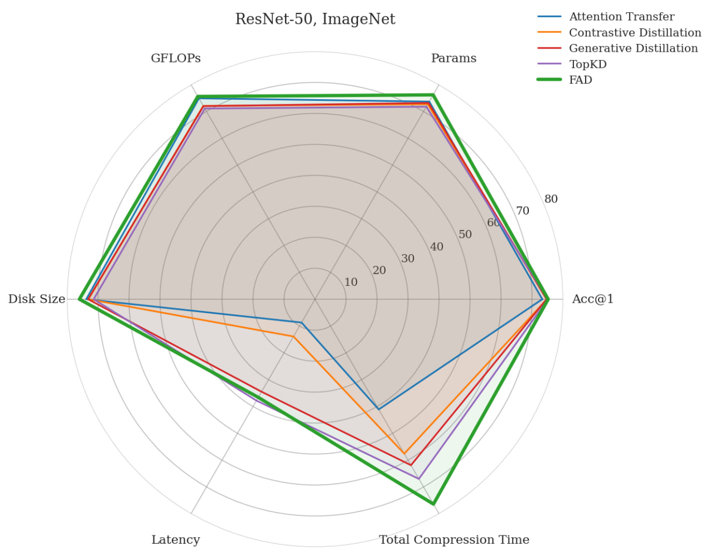

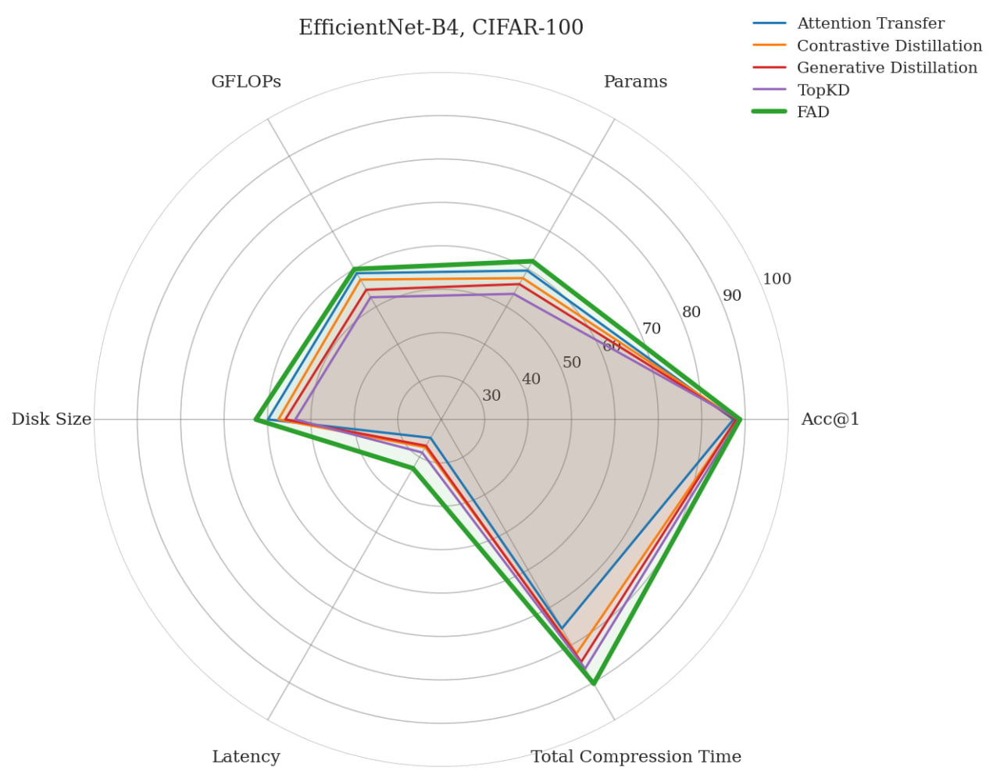

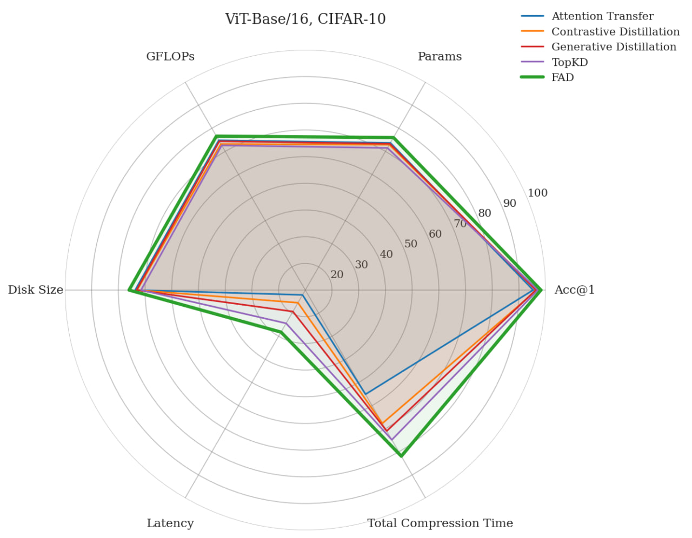

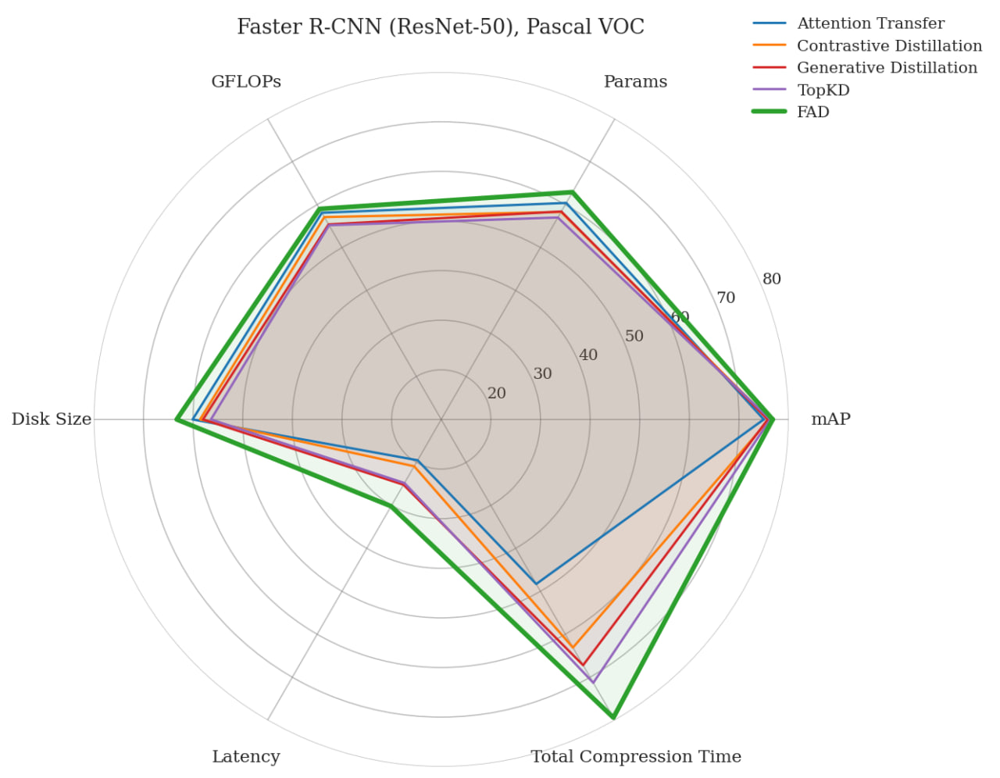

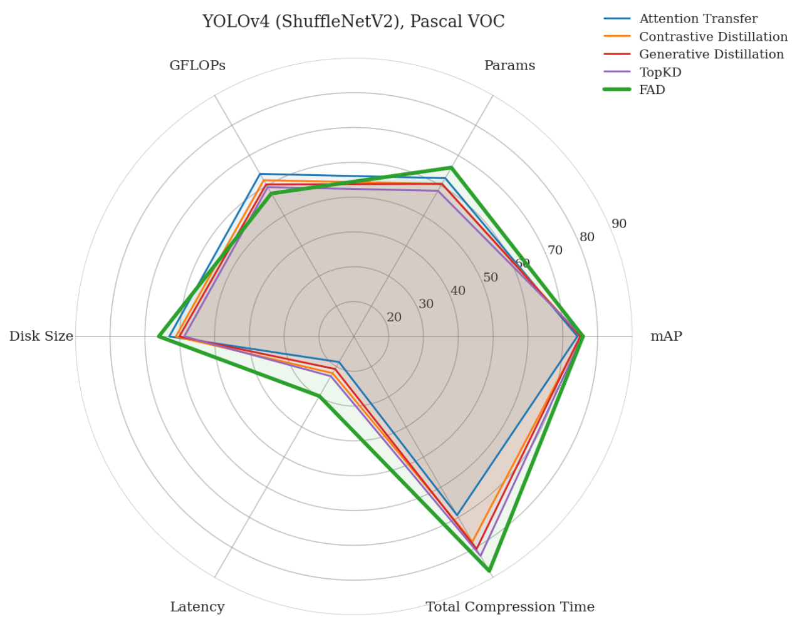


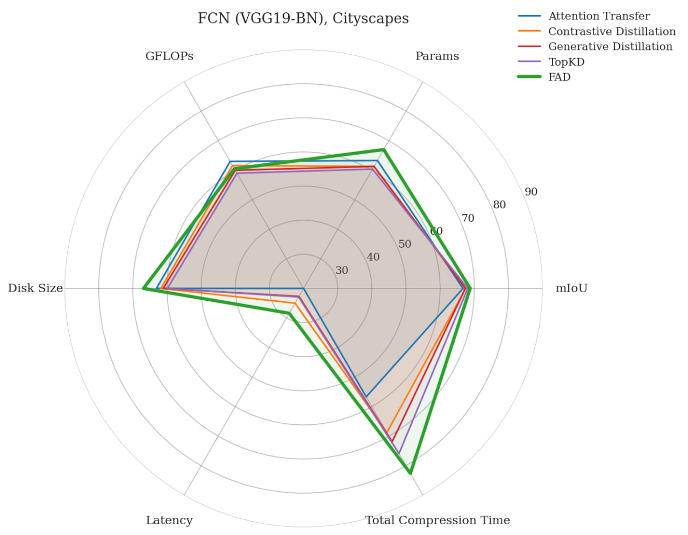

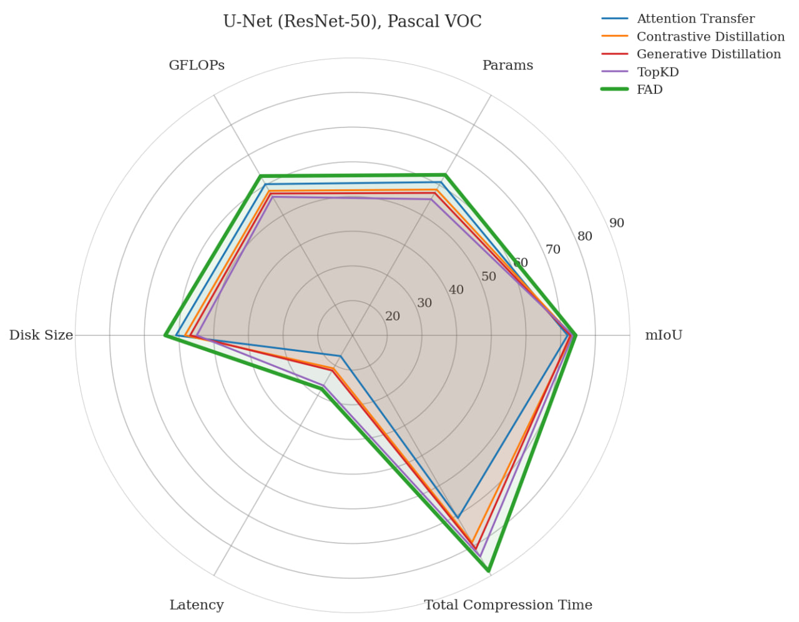


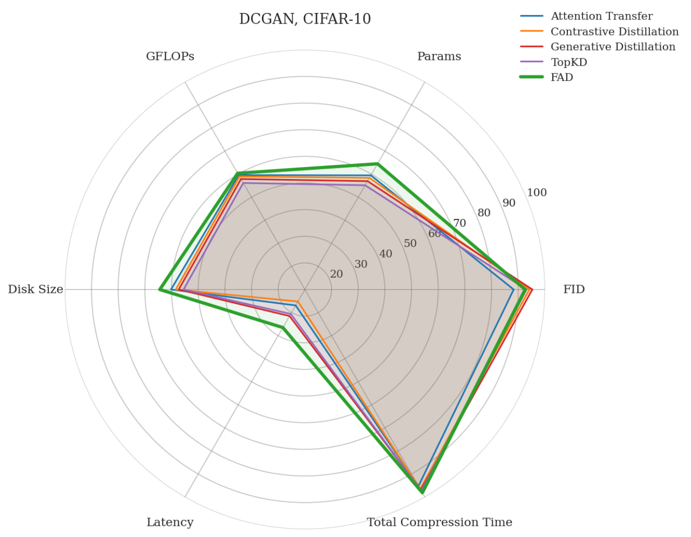

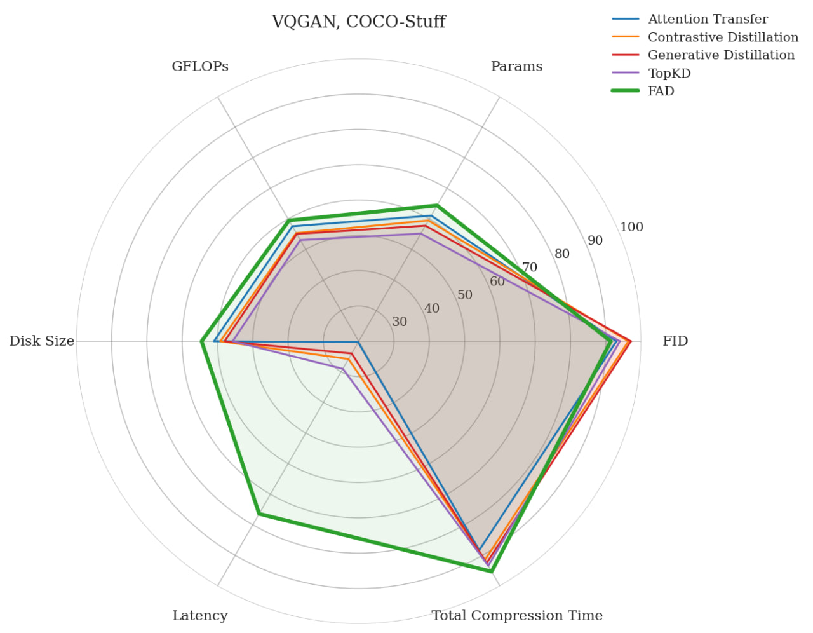

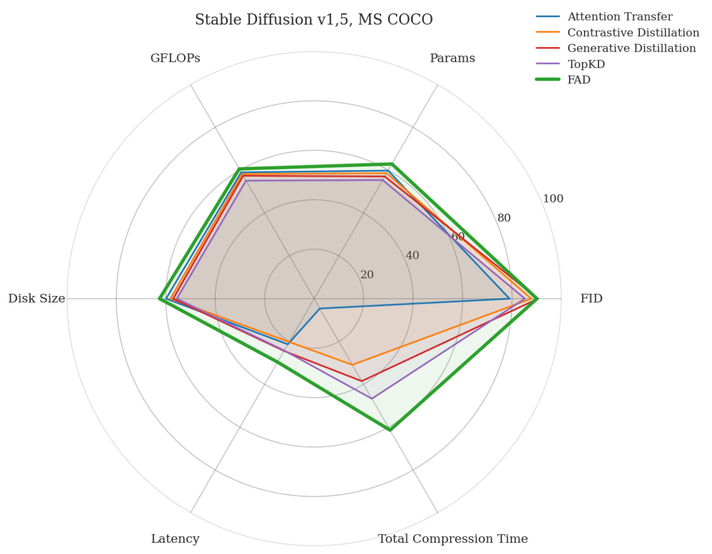

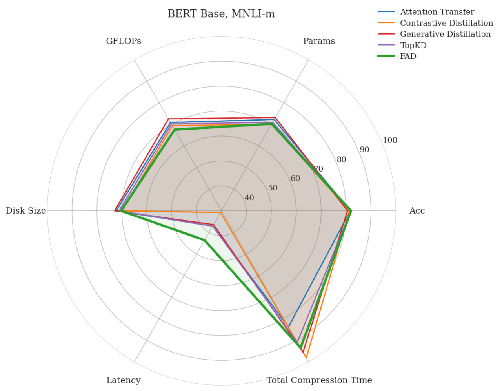


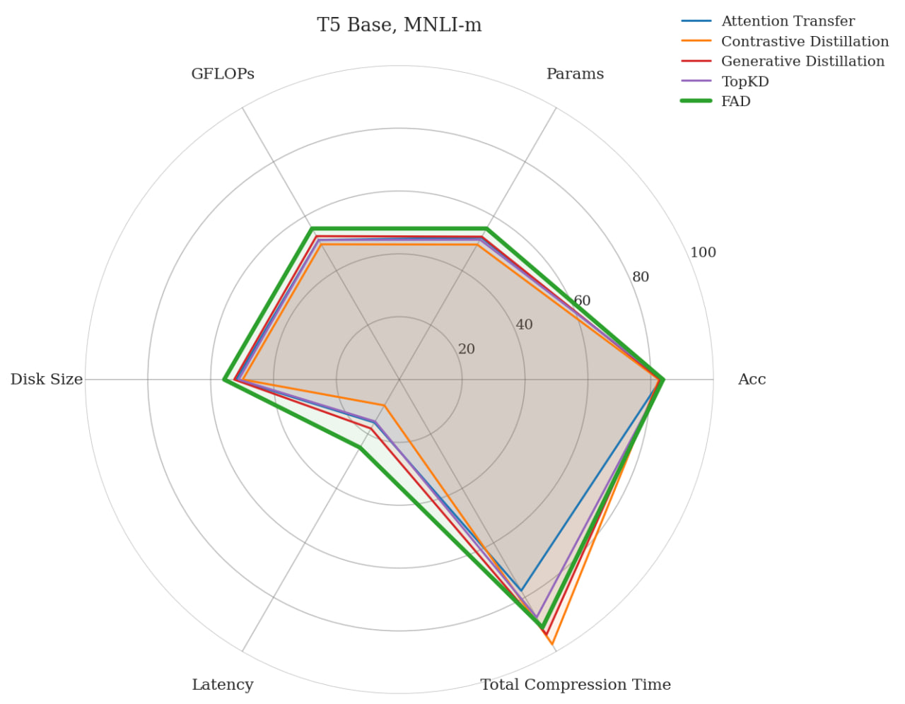

## License

This project is licensed under the MIT License - see the LICENSE file for details.

## References

- PyTorch: https://pytorch.org/
- PyTorch Lightning: https://www.pytorchlightning.ai/
- HuggingFace Transformers: https://huggingface.co/transformers/
