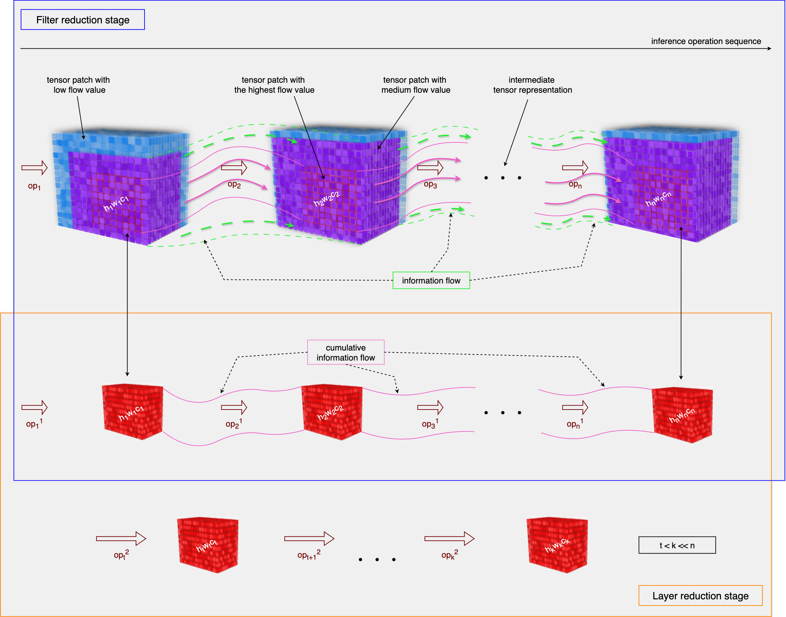
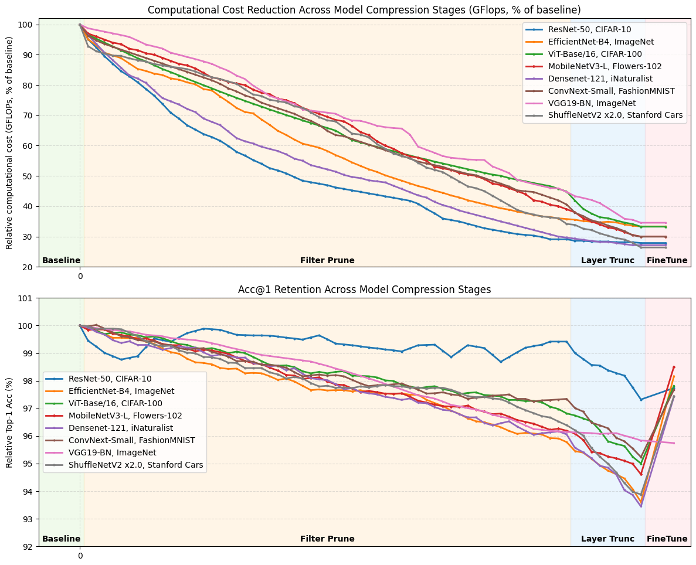
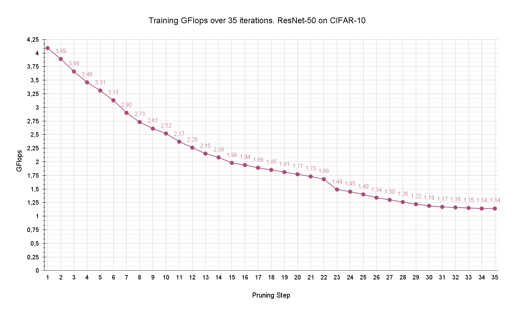
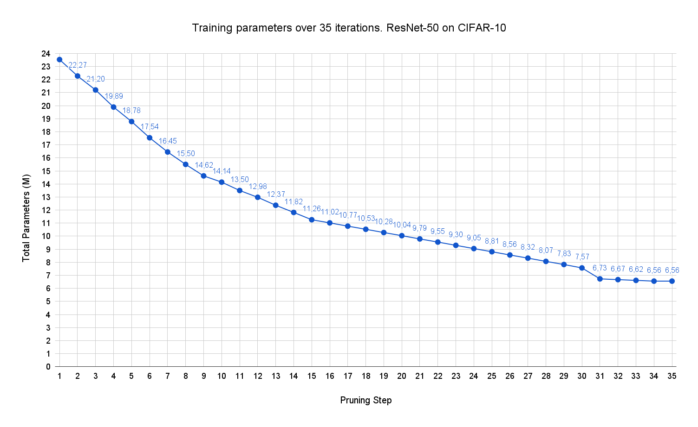
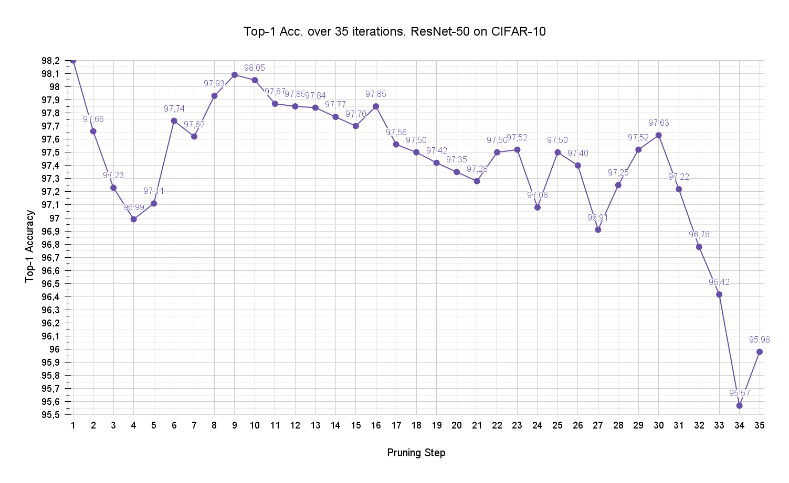
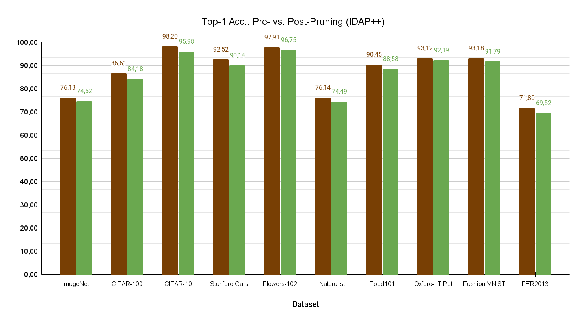

# IDAP++: Advancing Divergence-Aware Pruning with Joint Filter and Layer Optimization

This repository provides the implementation of IDAP++, a neural network compression approach that unifies both filter-level (width) and architecture-level (depth) pruning through information flow divergence analysis. The proposed method establishes a unified approach applicable to diverse neural architectures, including convolutional networks and transformer-based models. 

The framework combines:
- Divergence-Aware Filter Pruning (IDAP)
- Flow-Guided Layer Truncation

### Prerequisites
- Python 3.10+
- PyTorch 2.0+
- CUDA-compatible GPU
- Other dependencies listed in `requirements.txt`  
- Minimal setup to reproduce results: RTX 3060, Batch Size = 1

### Visualization of information flow through network depth

### Results
1. **Pruning Results for Different Architectures Using IDAP++: Base vs. Pruned Models (Acc@1, GFlops, Δ%)**

The table below presents the outcomes of our experiments, offering a comparative analysis of pruning across various model architectures and datasets. It reports top-1 accuracy (Acc@1) for both the original and pruned models, along with their computational cost measured in GFlops. The Δ% columns indicate the relative changes in accuracy and computational complexity resulting from pruning.

<table>
    <tr>
        <td colspan="11" class="title-row">Pruning Results for Different Architectures Using IDAP++: Base vs. Pruned Models (Acc@1, GFlops, Inference Time)</td>
    </tr>
    <tr>
        <td>Architecture</td>
        <td>Dataset</td>
        <td>Acc@1 Base</td>
        <td>Acc@1 Pruned</td>
        <td>Δ%</td>
        <td>GFlops Base</td>
        <td>GFlops Pruned</td>
        <td>Δ%</td>
        <td>Inference Time Base</td>
        <td>Inference Time Pruned</td>
        <td>Speedup x</td>
    </tr>
    <tr>
        <td>ResNet-50</td>
        <td>ImageNet</td>
        <td>76.13</td>
        <td>74.62</td>
        <td>-1.99</td>
        <td>4.1</td>
        <td>1.5</td>
        <td>-63</td>
        <td>8.9</td>
        <td>4.5</td>
        <td>2.0</td>
    </tr>
    <tr>
        <td>ResNet-50</td>
        <td>CIFAR-100</td>
        <td>86.61</td>
        <td>84.18</td>
        <td>-2.80</td>
        <td>4.1</td>
        <td>1.2</td>
        <td>-71</td>
        <td>8.6</td>
        <td>4.0</td>
        <td>2.2</td>
    </tr>
    <tr>
        <td>ResNet-50</td>
        <td>CIFAR-10</td>
        <td>98.20</td>
        <td>95.98</td>
        <td>-2.26</td>
        <td>4.1</td>
        <td>1.1</td>
        <td>-72</td>
        <td>8.8</td>
        <td>4.5</td>
        <td>2.0</td>
    </tr>
    <tr>
        <td>ResNet-50</td>
        <td>Stanford Cars</td>
        <td>92.52</td>
        <td>90.14</td>
        <td>-2.57</td>
        <td>4.1</td>
        <td>1.2</td>
        <td>-70</td>
        <td>8.8</td>
        <td>4.4</td>
        <td>2.0</td>
    </tr>
    <tr>
        <td>ResNet-50</td>
        <td>Flowers-102</td>
        <td>97.91</td>
        <td>96.75</td>
        <td>-1.19</td>
        <td>4.1</td>
        <td>1.5</td>
        <td>-64</td>
        <td>8.7</td>
        <td>4.3</td>
        <td>2.0</td>
    </tr>
    <tr>
        <td>ResNet-50</td>
        <td>iNaturalist</td>
        <td>76.14</td>
        <td>74.49</td>
        <td>-2.17</td>
        <td>4.1</td>
        <td>1.4</td>
        <td>-65</td>
        <td>8.8</td>
        <td>4.5</td>
        <td>2.0</td>
    </tr>
    <tr>
        <td>ResNet-50</td>
        <td>Food101</td>
        <td>90.45</td>
        <td>88.58</td>
        <td>-2.07</td>
        <td>4.1</td>
        <td>1.3</td>
        <td>-67</td>
        <td>8.6</td>
        <td>3.9</td>
        <td>2.2</td>
    </tr>
    <tr>
        <td>ResNet-50</td>
        <td>Oxford-IIIT Pet</td>
        <td>93.12</td>
        <td>92.19</td>
        <td>-1.00</td>
        <td>4.1</td>
        <td>1.4</td>
        <td>-65</td>
        <td>8.7</td>
        <td>4.2</td>
        <td>2.1</td>
    </tr>
    <tr>
        <td>ResNet-50</td>
        <td>Fashion MNIST</td>
        <td>93.18</td>
        <td>91.79</td>
        <td>-1.49</td>
        <td>4.1</td>
        <td>0.8</td>
        <td>-80</td>
        <td>8.8</td>
        <td>4.0</td>
        <td>2.2</td>
    </tr>
    <tr>
        <td>ResNet-50</td>
        <td>FER2013</td>
        <td>71.80</td>
        <td>69.52</td>
        <td>-3.18</td>
        <td>4.1</td>
        <td>1.3</td>
        <td>-67</td>
        <td>8.7</td>
        <td>4.2</td>
        <td>2.1</td>
    </tr>
    <tr>
        <td>EfficientNet-B4</td>
        <td>ImageNet</td>
        <td>83.38</td>
        <td>81.85</td>
        <td>-1.84</td>
        <td>4.5</td>
        <td>1.5</td>
        <td>-65</td>
        <td>23.3</td>
        <td>10.2</td>
        <td>2.3</td>
    </tr>
    <tr>
        <td>EfficientNet-B4</td>
        <td>CIFAR-100</td>
        <td>90.12</td>
        <td>88.07</td>
        <td>-2.27</td>
        <td>4.5</td>
        <td>1.5</td>
        <td>-65</td>
        <td>23.2</td>
        <td>9.5</td>
        <td>2.4</td>
    </tr>
    <tr>
        <td>EfficientNet-B4</td>
        <td>CIFAR-10</td>
        <td>96.91</td>
        <td>95.52</td>
        <td>-1.44</td>
        <td>4.5</td>
        <td>1.3</td>
        <td>-70</td>
        <td>23.2</td>
        <td>9.5</td>
        <td>2.4</td>
    </tr>
    <tr>
        <td>EfficientNet-B4</td>
        <td>Stanford Cars</td>
        <td>91.34</td>
        <td>89.06</td>
        <td>-2.50</td>
        <td>4.5</td>
        <td>1.4</td>
        <td>-68</td>
        <td>24.0</td>
        <td>12.6</td>
        <td>1.9</td>
    </tr>
    <tr>
        <td>EfficientNet-B4</td>
        <td>Flowers-102</td>
        <td>96.91</td>
        <td>95.50</td>
        <td>-1.46</td>
        <td>4.5</td>
        <td>1.5</td>
        <td>-63</td>
        <td>23.3</td>
        <td>10.3</td>
        <td>2.3</td>
    </tr>
    <tr>
        <td>EfficientNet-B4</td>
        <td>iNaturalist</td>
        <td>70.58</td>
        <td>68.72</td>
        <td>-2.64</td>
        <td>4.5</td>
        <td>1.3</td>
        <td>-68</td>
        <td>23.2</td>
        <td>9.4</td>
        <td>2.5</td>
    </tr>
    <tr>
        <td>EfficientNet-B4</td>
        <td>Food101</td>
        <td>91.23</td>
        <td>88.91</td>
        <td>-2.54</td>
        <td>4.5</td>
        <td>1.5</td>
        <td>-65</td>
        <td>23.0</td>
        <td>8.7</td>
        <td>2.6</td>
    </tr>
    <tr>
        <td>EfficientNet-B4</td>
        <td>Oxford-IIIT Pet</td>
        <td>87.85</td>
        <td>85.71</td>
        <td>-2.43</td>
        <td>4.5</td>
        <td>1.6</td>
        <td>-61</td>
        <td>23.2</td>
        <td>9.4</td>
        <td>2.5</td>
    </tr>
    <tr>
        <td>EfficientNet-B4</td>
        <td>Fashion MNIST</td>
        <td>94.98</td>
        <td>93.27</td>
        <td>-1.80</td>
        <td>4.5</td>
        <td>1.4</td>
        <td>-66</td>
        <td>23.2</td>
        <td>9.5</td>
        <td>2.4</td>
    </tr>
    <tr>
        <td>EfficientNet-B4</td>
        <td>FER2013</td>
        <td>74.17</td>
        <td>72.23</td>
        <td>-2.61</td>
        <td>4.5</td>
        <td>1.4</td>
        <td>-68</td>
        <td>23.2</td>
        <td>9.2</td>
        <td>2.5</td>
    </tr>
    <tr>
        <td>ViT-Base/16</td>
        <td>ImageNet</td>
        <td>81.07</td>
        <td>79.49</td>
        <td>-1.95</td>
        <td>17.5</td>
        <td>6.3</td>
        <td>-64</td>
        <td>33.4</td>
        <td>18.9</td>
        <td>1.8</td>
    </tr>
    <tr>
        <td>ViT-Base/16</td>
        <td>CIFAR-100</td>
        <td>94.25</td>
        <td>92.19</td>
        <td>-2.19</td>
        <td>17.5</td>
        <td>5.8</td>
        <td>-67</td>
        <td>33.1</td>
        <td>18.5</td>
        <td>1.8</td>
    </tr>
    <tr>
        <td>ViT-Base/16</td>
        <td>CIFAR-10</td>
        <td>98.61</td>
        <td>96.99</td>
        <td>-1.64</td>
        <td>17.5</td>
        <td>4.3</td>
        <td>-75</td>
        <td>33.1</td>
        <td>18.8</td>
        <td>1.8</td>
    </tr>
    <tr>
        <td>ViT-Base/16</td>
        <td>Stanford Cars</td>
        <td>93.74</td>
        <td>91.05</td>
        <td>-2.87</td>
        <td>17.5</td>
        <td>5.1</td>
        <td>-71</td>
        <td>33.3</td>
        <td>18.7</td>
        <td>1.8</td>
    </tr>
    <tr>
        <td>ViT-Base/16</td>
        <td>Flowers-102</td>
        <td>95.53</td>
        <td>94.56</td>
        <td>-1.01</td>
        <td>17.5</td>
        <td>5.5</td>
        <td>-68</td>
        <td>33.4</td>
        <td>19.0</td>
        <td>1.8</td>
    </tr>
    <tr>
        <td>ViT-Base/16</td>
        <td>iNaturalist</td>
        <td>68.65</td>
        <td>67.16</td>
        <td>-2.17</td>
        <td>17.5</td>
        <td>6.8</td>
        <td>-61</td>
        <td>33.4</td>
        <td>19.0</td>
        <td>1.8</td>
    </tr>
    <tr>
        <td>ViT-Base/16</td>
        <td>Food101</td>
        <td>87.41</td>
        <td>85.00</td>
        <td>-2.76</td>
        <td>17.5</td>
        <td>6.5</td>
        <td>-63</td>
        <td>33.4</td>
        <td>18.7</td>
        <td>1.8</td>
    </tr>
    <tr>
        <td>ViT-Base/16</td>
        <td>Oxford-IIIT Pet</td>
        <td>89.57</td>
        <td>87.32</td>
        <td>-2.51</td>
        <td>17.5</td>
        <td>4.9</td>
        <td>-72</td>
        <td>33.4</td>
        <td>18.1</td>
        <td>1.8</td>
    </tr>
    <tr>
        <td>ViT-Base/16</td>
        <td>Fashion MNIST</td>
        <td>92.83</td>
        <td>90.81</td>
        <td>-2.18</td>
        <td>17.5</td>
        <td>6.5</td>
        <td>-63</td>
        <td>33.2</td>
        <td>17.0</td>
        <td>2.0</td>
    </tr>
    <tr>
        <td>ViT-Base/16</td>
        <td>FER2013</td>
        <td>70.21</td>
        <td>67.95</td>
        <td>-3.23</td>
        <td>17.5</td>
        <td>6.0</td>
        <td>-66</td>
        <td>33.2</td>
        <td>18.7</td>
        <td>1.8</td>
    </tr>
    <tr>
        <td>MobileNetV3-L</td>
        <td>ImageNet</td>
        <td>74.04</td>
        <td>72.05</td>
        <td>-2.68</td>
        <td>0.2</td>
        <td>0.1</td>
        <td>-67</td>
        <td>9.1</td>
        <td>3.9</td>
        <td>2.3</td>
    </tr>
    <tr>
        <td>MobileNetV3-L</td>
        <td>CIFAR-100</td>
        <td>77.70</td>
        <td>76.04</td>
        <td>-2.13</td>
        <td>0.2</td>
        <td>0.1</td>
        <td>-63</td>
        <td>8.8</td>
        <td>3.8</td>
        <td>2.3</td>
    </tr>
    <tr>
        <td>MobileNetV3-L</td>
        <td>CIFAR-10</td>
        <td>89.81</td>
        <td>88.56</td>
        <td>-1.40</td>
        <td>0.2</td>
        <td>0.1</td>
        <td>-68</td>
        <td>8.9</td>
        <td>3.9</td>
        <td>2.3</td>
    </tr>
    <tr>
        <td>MobileNetV3-L</td>
        <td>Stanford Cars</td>
        <td>83.87</td>
        <td>82.37</td>
        <td>-1.79</td>
        <td>0.2</td>
        <td>0.1</td>
        <td>-66</td>
        <td>9.3</td>
        <td>4.1</td>
        <td>2.3</td>
    </tr>
    <tr>
        <td>MobileNetV3-L</td>
        <td>Flowers-102</td>
        <td>90.02</td>
        <td>88.68</td>
        <td>-1.48</td>
        <td>0.2</td>
        <td>0.0</td>
        <td>-64</td>
        <td>9.2</td>
        <td>4.3</td>
        <td>2.1</td>
    </tr>
    <tr>
        <td>MobileNetV3-L</td>
        <td>iNaturalist</td>
        <td>68.32</td>
        <td>67.16</td>
        <td>-1.70</td>
        <td>0.2</td>
        <td>0.1</td>
        <td>-66</td>
        <td>9.1</td>
        <td>4.0</td>
        <td>2.3</td>
    </tr>
    <tr>
        <td>MobileNetV3-L</td>
        <td>Food101</td>
        <td>87.42</td>
        <td>85.59</td>
        <td>-2.09</td>
        <td>0.2</td>
        <td>0.1</td>
        <td>-72</td>
        <td>9.2</td>
        <td>4.4</td>
        <td>2.1</td>
    </tr>
    <tr>
        <td>MobileNetV3-L</td>
        <td>Oxford-IIIT Pet</td>
        <td>85.54</td>
        <td>83.33</td>
        <td>-2.59</td>
        <td>0.2</td>
        <td>0.1</td>
        <td>-68</td>
        <td>9.1</td>
        <td>4.8</td>
        <td>1.9</td>
    </tr>
    <tr>
        <td>MobileNetV3-L</td>
        <td>Fashion MNIST</td>
        <td>92.74</td>
        <td>90.60</td>
        <td>-2.31</td>
        <td>0.2</td>
        <td>0.1</td>
        <td>-73</td>
        <td>9.0</td>
        <td>3.9</td>
        <td>2.3</td>
    </tr>
    <tr>
        <td>MobileNetV3-L</td>
        <td>FER2013</td>
        <td>69.87</td>
        <td>67.79</td>
        <td>-2.98</td>
        <td>0.2</td>
        <td>0.1</td>
        <td>-63</td>
        <td>9.3</td>
        <td>4.2</td>
        <td>2.2</td>
    </tr>
    <tr>
        <td>DenseNet-121</td>
        <td>ImageNet</td>
        <td>74.65</td>
        <td>73.84</td>
        <td>-1.08</td>
        <td>2.8</td>
        <td>0.9</td>
        <td>-68</td>
        <td>22.1</td>
        <td>9.8</td>
        <td>2.3</td>
    </tr>
    <tr>
        <td>DenseNet-121</td>
        <td>CIFAR-100</td>
        <td>72.07</td>
        <td>70.11</td>
        <td>-2.72</td>
        <td>2.8</td>
        <td>0.9</td>
        <td>-69</td>
        <td>22.0</td>
        <td>9.9</td>
        <td>2.2</td>
    </tr>
    <tr>
        <td>DenseNet-121</td>
        <td>CIFAR-10</td>
        <td>94.21</td>
        <td>92.84</td>
        <td>-1.46</td>
        <td>2.8</td>
        <td>0.7</td>
        <td>-74</td>
        <td>22.2</td>
        <td>9.4</td>
        <td>2.4</td>
    </tr>
    <tr>
        <td>DenseNet-121</td>
        <td>Stanford Cars</td>
        <td>83.14</td>
        <td>81.06</td>
        <td>-2.50</td>
        <td>2.8</td>
        <td>0.9</td>
        <td>-70</td>
        <td>22.2</td>
        <td>8.8</td>
        <td>2.5</td>
    </tr>
    <tr>
        <td>DenseNet-121</td>
        <td>Flowers-102</td>
        <td>91.03</td>
        <td>88.75</td>
        <td>-2.51</td>
        <td>2.8</td>
        <td>0.8</td>
        <td>-70</td>
        <td>22.2</td>
        <td>9.5</td>
        <td>2.3</td>
    </tr>
    <tr>
        <td>DenseNet-121</td>
        <td>iNaturalist</td>
        <td>69.74</td>
        <td>67.94</td>
        <td>-2.57</td>
        <td>2.8</td>
        <td>0.8</td>
        <td>-71</td>
        <td>22.0</td>
        <td>9.7</td>
        <td>2.3</td>
    </tr>
    <tr>
        <td>DenseNet-121</td>
        <td>Food101</td>
        <td>87.34</td>
        <td>84.87</td>
        <td>-2.82</td>
        <td>2.8</td>
        <td>0.8</td>
        <td>-72</td>
        <td>22.0</td>
        <td>9.6</td>
        <td>2.3</td>
    </tr>
    <tr>
        <td>DenseNet-121</td>
        <td>Oxford-IIIT Pet</td>
        <td>85.23</td>
        <td>83.59</td>
        <td>-1.92</td>
        <td>2.8</td>
        <td>0.7</td>
        <td>-76</td>
        <td>21.7</td>
        <td>11.4</td>
        <td>1.9</td>
    </tr>
    <tr>
        <td>DenseNet-121</td>
        <td>Fashion MNIST</td>
        <td>93.01</td>
        <td>90.88</td>
        <td>-2.29</td>
        <td>2.8</td>
        <td>0.9</td>
        <td>-66</td>
        <td>21.4</td>
        <td>10.2</td>
        <td>2.1</td>
    </tr>
    <tr>
        <td>DenseNet-121</td>
        <td>FER2013</td>
        <td>65.13</td>
        <td>63.13</td>
        <td>-3.07</td>
        <td>2.8</td>
        <td>0.8</td>
        <td>-71</td>
        <td>21.7</td>
        <td>9.6</td>
        <td>2.3</td>
    </tr>
    <tr>
        <td>ConvNeXt-Small</td>
        <td>ImageNet</td>
        <td>83.61</td>
        <td>81.21</td>
        <td>-2.87</td>
        <td>8.6</td>
        <td>2.6</td>
        <td>-70</td>
        <td>17.5</td>
        <td>8.3</td>
        <td>2.1</td>
    </tr>
    <tr>
        <td>ConvNeXt-Small</td>
        <td>CIFAR-100</td>
        <td>85.58</td>
        <td>83.36</td>
        <td>-2.59</td>
        <td>8.6</td>
        <td>2.2</td>
        <td>-74</td>
        <td>17.0</td>
        <td>8.9</td>
        <td>1.9</td>
    </tr>
    <tr>
        <td>ConvNeXt-Small</td>
        <td>CIFAR-10</td>
        <td>94.21</td>
        <td>92.00</td>
        <td>-2.35</td>
        <td>8.6</td>
        <td>2.3</td>
        <td>-74</td>
        <td>16.8</td>
        <td>7.9</td>
        <td>2.1</td>
    </tr>
    <tr>
        <td>ConvNeXt-Small</td>
        <td>Stanford Cars</td>
        <td>82.19</td>
        <td>80.77</td>
        <td>-1.72</td>
        <td>8.6</td>
        <td>2.8</td>
        <td>-68</td>
        <td>17.2</td>
        <td>6.9</td>
        <td>2.5</td>
    </tr>
    <tr>
        <td>ConvNeXt-Small</td>
        <td>Flowers-102</td>
        <td>90.09</td>
        <td>88.44</td>
        <td>-1.84</td>
        <td>8.6</td>
        <td>3.5</td>
        <td>-59</td>
        <td>16.9</td>
        <td>8.1</td>
        <td>2.1</td>
    </tr>
    <tr>
        <td>ConvNeXt-Small</td>
        <td>iNaturalist</td>
        <td>68.90</td>
        <td>67.53</td>
        <td>-1.98</td>
        <td>8.6</td>
        <td>3.3</td>
        <td>-61</td>
        <td>17.5</td>
        <td>7.5</td>
        <td>2.3</td>
    </tr>
    <tr>
        <td>ConvNeXt-Small</td>
        <td>Food101</td>
        <td>86.05</td>
        <td>84.33</td>
        <td>-2.00</td>
        <td>8.6</td>
        <td>3.1</td>
        <td>-64</td>
        <td>16.9</td>
        <td>7.0</td>
        <td>2.4</td>
    </tr>
    <tr>
        <td>ConvNeXt-Small</td>
        <td>Oxford-IIIT Pet</td>
        <td>84.08</td>
        <td>82.18</td>
        <td>-2.26</td>
        <td>8.6</td>
        <td>2.9</td>
        <td>-67</td>
        <td>17.2</td>
        <td>8.1</td>
        <td>2.1</td>
    </tr>
    <tr>
        <td>ConvNeXt-Small</td>
        <td>Fashion MNIST</td>
        <td>93.01</td>
        <td>90.85</td>
        <td>-2.32</td>
        <td>8.7</td>
        <td>2.6</td>
        <td>-69</td>
        <td>17.1</td>
        <td>8.9</td>
        <td>1.9</td>
    </tr>
    <tr>
        <td>ConvNeXt-Small</td>
        <td>FER2013</td>
        <td>76.10</td>
        <td>74.05</td>
        <td>-2.70</td>
        <td>8.6</td>
        <td>2.7</td>
        <td>-68</td>
        <td>17.4</td>
        <td>7.4</td>
        <td>2.3</td>
    </tr>
    <tr>
        <td>VGG19-BN</td>
        <td>ImageNet</td>
        <td>74.22</td>
        <td>72.64</td>
        <td>-2.13</td>
        <td>19.7</td>
        <td>6.8</td>
        <td>-65</td>
        <td>13.9</td>
        <td>5.4</td>
        <td>2.6</td>
    </tr>
    <tr>
        <td>VGG19-BN</td>
        <td>CIFAR-100</td>
        <td>73.89</td>
        <td>71.38</td>
        <td>-3.40</td>
        <td>19.6</td>
        <td>5.9</td>
        <td>-70</td>
        <td>11.1</td>
        <td>4.2</td>
        <td>2.7</td>
    </tr>
    <tr>
        <td>VGG19-BN</td>
        <td>CIFAR-10</td>
        <td>93.45</td>
        <td>91.89</td>
        <td>-1.67</td>
        <td>19.6</td>
        <td>4.8</td>
        <td>-76</td>
        <td>11.1</td>
        <td>3.9</td>
        <td>2.8</td>
    </tr>
    <tr>
        <td>VGG19-BN</td>
        <td>Stanford Cars</td>
        <td>88.12</td>
        <td>86.54</td>
        <td>-1.80</td>
        <td>19.6</td>
        <td>6.2</td>
        <td>-68</td>
        <td>13.9</td>
        <td>5.6</td>
        <td>2.5</td>
    </tr>
    <tr>
        <td>VGG19-BN</td>
        <td>Flowers-102</td>
        <td>92.34</td>
        <td>90.99</td>
        <td>-1.46</td>
        <td>19.6</td>
        <td>5.5</td>
        <td>-72</td>
        <td>13.9</td>
        <td>5.6</td>
        <td>2.5</td>
    </tr>
    <tr>
        <td>VGG19-BN</td>
        <td>iNaturalist</td>
        <td>67.21</td>
        <td>65.77</td>
        <td>-2.15</td>
        <td>19.7</td>
        <td>6.1</td>
        <td>-69</td>
        <td>14.3</td>
        <td>5.4</td>
        <td>2.7</td>
    </tr>
    <tr>
        <td>VGG19-BN</td>
        <td>Food101</td>
        <td>85.67</td>
        <td>83.39</td>
        <td>-2.66</td>
        <td>19.6</td>
        <td>5.8</td>
        <td>-70</td>
        <td>14.0</td>
        <td>5.2</td>
        <td>2.7</td>
    </tr>
    <tr>
        <td>VGG19-BN</td>
        <td>Oxford-IIIT Pet</td>
        <td>86.45</td>
        <td>83.93</td>
        <td>-2.91</td>
        <td>19.6</td>
        <td>5.6</td>
        <td>-71</td>
        <td>13.9</td>
        <td>5.0</td>
        <td>2.8</td>
    </tr>
    <tr>
        <td>VGG19-BN</td>
        <td>Fashion MNIST</td>
        <td>91.78</td>
        <td>89.48</td>
        <td>-2.51</td>
        <td>19.6</td>
        <td>5.5</td>
        <td>-72</td>
        <td>11.0</td>
        <td>4.2</td>
        <td>2.6</td>
    </tr>
    <tr>
        <td>VGG19-BN</td>
        <td>FER2013</td>
        <td>68.34</td>
        <td>66.68</td>
        <td>-2.43</td>
        <td>19.6</td>
        <td>6.8</td>
        <td>-65</td>
        <td>11.0</td>
        <td>4.3</td>
        <td>2.5</td>
    </tr>
    <tr>
        <td>ShuffleNetV2 x2.0</td>
        <td>ImageNet</td>
        <td>76.23</td>
        <td>74.40</td>
        <td>-2.40</td>
        <td>0.6</td>
        <td>0.2</td>
        <td>-63</td>
        <td>9.1</td>
        <td>4.5</td>
        <td>2.0</td>
    </tr>
    <tr>
        <td>ShuffleNetV2 x2.0</td>
        <td>CIFAR-100</td>
        <td>75.32</td>
        <td>73.14</td>
        <td>-2.89</td>
        <td>0.6</td>
        <td>0.2</td>
        <td>-63</td>
        <td>9.1</td>
        <td>4.8</td>
        <td>1.9</td>
    </tr>
    <tr>
        <td>ShuffleNetV2 x2.0</td>
        <td>CIFAR-10</td>
        <td>90.45</td>
        <td>88.66</td>
        <td>-1.98</td>
        <td>0.6</td>
        <td>0.1</td>
        <td>-83</td>
        <td>9.0</td>
        <td>4.7</td>
        <td>1.9</td>
    </tr>
    <tr>
        <td>ShuffleNetV2 x2.0</td>
        <td>Stanford Cars</td>
        <td>82.56</td>
        <td>80.45</td>
        <td>-2.56</td>
        <td>0.6</td>
        <td>0.2</td>
        <td>-61</td>
        <td>9.1</td>
        <td>4.1</td>
        <td>2.2</td>
    </tr>
    <tr>
        <td>ShuffleNetV2 x2.0</td>
        <td>Flowers-102</td>
        <td>89.12</td>
        <td>87.78</td>
        <td>-1.50</td>
        <td>0.6</td>
        <td>0.2</td>
        <td>-63</td>
        <td>9.0</td>
        <td>4.2</td>
        <td>2.1</td>
    </tr>
    <tr>
        <td>ShuffleNetV2 x2.0</td>
        <td>iNaturalist</td>
        <td>66.78</td>
        <td>65.35</td>
        <td>-2.15</td>
        <td>0.6</td>
        <td>0.2</td>
        <td>-67</td>
        <td>9.1</td>
        <td>4.3</td>
        <td>2.1</td>
    </tr>
    <tr>
        <td>ShuffleNetV2 x2.0</td>
        <td>Food101</td>
        <td>84.23</td>
        <td>82.30</td>
        <td>-2.29</td>
        <td>0.6</td>
        <td>0.2</td>
        <td>-64</td>
        <td>9.1</td>
        <td>4.8</td>
        <td>1.9</td>
    </tr>
    <tr>
        <td>ShuffleNetV2 x2.0</td>
        <td>Oxford-IIIT Pet</td>
        <td>83.67</td>
        <td>81.79</td>
        <td>-2.25</td>
        <td>0.6</td>
        <td>0.2</td>
        <td>-66</td>
        <td>9.3</td>
        <td>4.3</td>
        <td>2.1</td>
    </tr>
    <tr>
        <td>ShuffleNetV2 x2.0</td>
        <td>Fashion MNIST</td>
        <td>90.89</td>
        <td>89.08</td>
        <td>-2.00</td>
        <td>0.6</td>
        <td>0.1</td>
        <td>-83</td>
        <td>9.0</td>
        <td>4.8</td>
        <td>1.9</td>
    </tr>
    <tr>
        <td>ShuffleNetV2 x2.0</td>
        <td>FER2013</td>
        <td>67.45</td>
        <td>65.55</td>
        <td>-2.82</td>
        <td>0.6</td>
        <td>0.2</td>
        <td>-64</td>
        <td>9.4</td>
        <td>4.8</td>
        <td>2.0</td>
    </tr>
</table>

We also present our results as plots:

2. **Comparative Accuracy of IDAP++ (Ours) and Prior Compression Techniques**

The table below presents a comparison between our method and other pruning techniques. The results show that our approach achieves comparable weight reduction while preserving higher accuracy than alternative methods.

<table>
    <tr>
        <td colspan="5" class="title-row">Table: Comparative Accuracy of IDAP++ (Ours) and Prior Compression Techniques</td>
    </tr>
    <tr>
        <th>Architecture</th>
        <th>Dataset</th>
        <th>Method</th>
        <th>Inference Time (ms)</th>
        <th>Metric</th>
    </tr>
    <tr>
        <td colspan="5" class="section-header">Image Classification Task. Metric: Top-1 Acc (%)</td>
    </tr>
    <tr>
        <td>ResNet-50</td>
        <td>CIFAR-10</td>
        <td>Baseline</td>
        <td>8.8</td>
        <td>98.2</td>
    </tr>
    <tr>
        <td>ResNet-50</td>
        <td>CIFAR-10</td>
        <td>SWD</td>
        <td>6.6</td>
        <td>94.8</td>
    </tr>
    <tr>
        <td>ResNet-50</td>
        <td>CIFAR-10</td>
        <td>SFP</td>
        <td>5.9</td>
        <td>93.2</td>
    </tr>
    <tr>
        <td>ResNet-50</td>
        <td>CIFAR-10</td>
        <td>OBC</td>
        <td>4.6</td>
        <td>95.8</td>
    </tr>
    <tr>
        <td>ResNet-50</td>
        <td>CIFAR-10</td>
        <td>HAWQ-V3 (8-bit)</td>
        <td>4.5</td>
        <td>95.2</td>
    </tr>
    <tr>
        <td>ResNet-50</td>
        <td>CIFAR-10</td>
        <td>IDAP++ (Ours)</td>
        <td>4.5</td>
        <td>96.0</td>
    </tr>
    <tr>
        <td>EfficientNet-B4</td>
        <td>CIFAR-100</td>
        <td>Baseline</td>
        <td>23.2</td>
        <td>90.1</td>
    </tr>
    <tr>
        <td>EfficientNet-B4</td>
        <td>CIFAR-100</td>
        <td>SWD</td>
        <td>12.8</td>
        <td>86.7</td>
    </tr>
    <tr>
        <td>EfficientNet-B4</td>
        <td>CIFAR-100</td>
        <td>SFP</td>
        <td>12.6</td>
        <td>86.6</td>
    </tr>
    <tr>
        <td>EfficientNet-B4</td>
        <td>CIFAR-100</td>
        <td>OBC</td>
        <td>10.0</td>
        <td>87.9</td>
    </tr>
    <tr>
        <td>EfficientNet-B4</td>
        <td>CIFAR-100</td>
        <td>HAWQ-V3 (8-bit)</td>
        <td>11.6</td>
        <td>87.9</td>
    </tr>
    <tr>
        <td>EfficientNet-B4</td>
        <td>CIFAR-100</td>
        <td>IDAP++ (Ours)</td>
        <td>9.5</td>
        <td>88.1</td>
    </tr>
    <tr>
        <td>ViT-Base/16</td>
        <td>ImageNet</td>
        <td>Baseline</td>
        <td>33.4</td>
        <td>81.1</td>
    </tr>
    <tr>
        <td>ViT-Base/16</td>
        <td>ImageNet</td>
        <td>SWD</td>
        <td>23.7</td>
        <td>78.5</td>
    </tr>
    <tr>
        <td>ViT-Base/16</td>
        <td>ImageNet</td>
        <td>SFP</td>
        <td>22.9</td>
        <td>78.2</td>
    </tr>
    <tr>
        <td>ViT-Base/16</td>
        <td>ImageNet</td>
        <td>OBC</td>
        <td>18.7</td>
        <td>79.2</td>
    </tr>
    <tr>
        <td>ViT-Base/16</td>
        <td>ImageNet</td>
        <td>HAWQ-V3 (8-bit)</td>
        <td>16.7</td>
        <td>78.5</td>
    </tr>
    <tr>
        <td>ViT-Base/16</td>
        <td>ImageNet</td>
        <td>IDAP++ (Ours)</td>
        <td>18.9</td>
        <td>79.5</td>
    </tr>
    <tr>
        <td>MobileNetV3-L</td>
        <td>Fashion MNIST</td>
        <td>Baseline</td>
        <td>9.0</td>
        <td>92.7</td>
    </tr>
    <tr>
        <td>MobileNetV3-L</td>
        <td>Fashion MNIST</td>
        <td>SWD</td>
        <td>5.2</td>
        <td>89.8</td>
    </tr>
    <tr>
        <td>MobileNetV3-L</td>
        <td>Fashion MNIST</td>
        <td>SFP</td>
        <td>5.6</td>
        <td>89.1</td>
    </tr>
    <tr>
        <td>MobileNetV3-L</td>
        <td>Fashion MNIST</td>
        <td>OBC</td>
        <td>4.1</td>
        <td>90.0</td>
    </tr>
    <tr>
        <td>MobileNetV3-L</td>
        <td>Fashion MNIST</td>
        <td>HAWQ-V3 (8-bit)</td>
        <td>4.2</td>
        <td>88.9</td>
    </tr>
    <tr>
        <td>MobileNetV3-L</td>
        <td>Fashion MNIST</td>
        <td>IDAP++ (Ours)</td>
        <td>3.9</td>
        <td>90.6</td>
    </tr>
    <tr>
        <td>DenseNet-121</td>
        <td>Food101</td>
        <td>Baseline</td>
        <td>22.0</td>
        <td>87.3</td>
    </tr>
    <tr>
        <td>DenseNet-121</td>
        <td>Food101</td>
        <td>SWD</td>
        <td>12.8</td>
        <td>83.2</td>
    </tr>
    <tr>
        <td>DenseNet-121</td>
        <td>Food101</td>
        <td>SFP</td>
        <td>12.1</td>
        <td>83.2</td>
    </tr>
    <tr>
        <td>DenseNet-121</td>
        <td>Food101</td>
        <td>OBC</td>
        <td>10.2</td>
        <td>84.5</td>
    </tr>
    <tr>
        <td>DenseNet-121</td>
        <td>Food101</td>
        <td>HAWQ-V3 (8-bit)</td>
        <td>10.8</td>
        <td>83.6</td>
    </tr>
    <tr>
        <td>DenseNet-121</td>
        <td>Food101</td>
        <td>IDAP++ (Ours)</td>
        <td>9.6</td>
        <td>84.9</td>
    </tr>
    <tr>
        <td>ConvNeXt-Small</td>
        <td>Flowers-102</td>
        <td>Baseline</td>
        <td>16.9</td>
        <td>90.1</td>
    </tr>
    <tr>
        <td>ConvNeXt-Small</td>
        <td>Flowers-102</td>
        <td>SWD</td>
        <td>10.5</td>
        <td>87.0</td>
    </tr>
    <tr>
        <td>ConvNeXt-Small</td>
        <td>Flowers-102</td>
        <td>SFP</td>
        <td>10.2</td>
        <td>86.7</td>
    </tr>
    <tr>
        <td>ConvNeXt-Small</td>
        <td>Flowers-102</td>
        <td>OBC</td>
        <td>8.4</td>
        <td>87.9</td>
    </tr>
    <tr>
        <td>ConvNeXt-Small</td>
        <td>Flowers-102</td>
        <td>HAWQ-V3 (8-bit)</td>
        <td>8.0</td>
        <td>87.8</td>
    </tr>
    <tr>
        <td>ConvNeXt-Small</td>
        <td>Flowers-102</td>
        <td>IDAP++ (Ours)</td>
        <td>8.1</td>
        <td>88.4</td>
    </tr>
    <tr>
        <td>VGG19-BN</td>
        <td>Stanford Cars</td>
        <td>Baseline</td>
        <td>13.9</td>
        <td>88.1</td>
    </tr>
    <tr>
        <td>VGG19-BN</td>
        <td>Stanford Cars</td>
        <td>SWD</td>
        <td>9.1</td>
        <td>85.9</td>
    </tr>
    <tr>
        <td>VGG19-BN</td>
        <td>Stanford Cars</td>
        <td>SFP</td>
        <td>8.8</td>
        <td>85.6</td>
    </tr>
    <tr>
        <td>VGG19-BN</td>
        <td>Stanford Cars</td>
        <td>OBC</td>
        <td>6.2</td>
        <td>85.3</td>
    </tr>
    <tr>
        <td>VGG19-BN</td>
        <td>Stanford Cars</td>
        <td>HAWQ-V3 (8-bit)</td>
        <td>5.8</td>
        <td>85.9</td>
    </tr>
    <tr>
        <td>VGG19-BN</td>
        <td>Stanford Cars</td>
        <td>IDAP++ (Ours)</td>
        <td>5.6</td>
        <td>86.5</td>
    </tr>
    <tr>
        <td>ShuffleNetV2 x2.0</td>
        <td>iNaturalist</td>
        <td>Baseline</td>
        <td>9.1</td>
        <td>66.8</td>
    </tr>
    <tr>
        <td>ShuffleNetV2 x2.0</td>
        <td>iNaturalist</td>
        <td>SWD</td>
        <td>6.7</td>
        <td>64.4</td>
    </tr>
    <tr>
        <td>ShuffleNetV2 x2.0</td>
        <td>iNaturalist</td>
        <td>SFP</td>
        <td>6.3</td>
        <td>64.2</td>
    </tr>
    <tr>
        <td>ShuffleNetV2 x2.0</td>
        <td>iNaturalist</td>
        <td>OBC</td>
        <td>5.1</td>
        <td>65.2</td>
    </tr>
    <tr>
        <td>ShuffleNetV2 x2.0</td>
        <td>iNaturalist</td>
        <td>HAWQ-V3 (8-bit)</td>
        <td>5.2</td>
        <td>64.7</td>
    </tr>
    <tr>
        <td>ShuffleNetV2 x2.0</td>
        <td>iNaturalist</td>
        <td>IDAP++ (Ours)</td>
        <td>4.3</td>
        <td>65.4</td>
    </tr>
    <tr>
        <td colspan="5" class="section-header">Image Generation Task. Metric: FID</td>
    </tr>
    <tr>
        <td>DCGAN</td>
        <td>CIFAR-10</td>
        <td>Baseline</td>
        <td>102.3</td>
        <td>24.1</td>
    </tr>
    <tr>
        <td>DCGAN</td>
        <td>CIFAR-10</td>
        <td>SWD</td>
        <td>73.5</td>
        <td>30.2</td>
    </tr>
    <tr>
        <td>DCGAN</td>
        <td>CIFAR-10</td>
        <td>SFP</td>
        <td>67.1</td>
        <td>35.6</td>
    </tr>
    <tr>
        <td>DCGAN</td>
        <td>CIFAR-10</td>
        <td>OBC</td>
        <td>61.7</td>
        <td>28.1</td>
    </tr>
    <tr>
        <td>DCGAN</td>
        <td>CIFAR-10</td>
        <td>HAWQ-V3 (8-bit)</td>
        <td>56.3</td>
        <td>25.2</td>
    </tr>
    <tr>
        <td>DCGAN</td>
        <td>CIFAR-10</td>
        <td>IDAP++ (Ours)</td>
        <td>50.8</td>
        <td>25.9</td>
    </tr>
    <tr>
        <td>VQGAN</td>
        <td>COCO-Stuff</td>
        <td>Baseline</td>
        <td>2003.7</td>
        <td>18.5</td>
    </tr>
    <tr>
        <td>VQGAN</td>
        <td>COCO-Stuff</td>
        <td>SWD</td>
        <td>1412.6</td>
        <td>25.1</td>
    </tr>
    <tr>
        <td>VQGAN</td>
        <td>COCO-Stuff</td>
        <td>SFP</td>
        <td>1287.4</td>
        <td>27.7</td>
    </tr>
    <tr>
        <td>VQGAN</td>
        <td>COCO-Stuff</td>
        <td>OBC</td>
        <td>1189.5</td>
        <td>22.2</td>
    </tr>
    <tr>
        <td>VQGAN</td>
        <td>COCO-Stuff</td>
        <td>HAWQ-V3 (8-bit)</td>
        <td>1115.3</td>
        <td>23</td>
    </tr>
    <tr>
        <td>VQGAN</td>
        <td>COCO-Stuff</td>
        <td>IDAP++ (Ours)</td>
        <td>1004.2</td>
        <td>20.1</td>
    </tr>
    <tr>
        <td>VQ-VAE</td>
        <td>FFHQ</td>
        <td>Baseline</td>
        <td>503.2</td>
        <td>6.4</td>
    </tr>
    <tr>
        <td>VQ-VAE</td>
        <td>FFHQ</td>
        <td>SWD</td>
        <td>354.8</td>
        <td>10.9</td>
    </tr>
    <tr>
        <td>VQ-VAE</td>
        <td>FFHQ</td>
        <td>SFP</td>
        <td>325.6</td>
        <td>12.1</td>
    </tr>
    <tr>
        <td>VQ-VAE</td>
        <td>FFHQ</td>
        <td>OBC</td>
        <td>306.4</td>
        <td>10.3</td>
    </tr>
    <tr>
        <td>VQ-VAE</td>
        <td>FFHQ</td>
        <td>HAWQ-V3 (8-bit)</td>
        <td>279.6</td>
        <td>9.5</td>
    </tr>
    <tr>
        <td>VQ-VAE</td>
        <td>FFHQ</td>
        <td>IDAP++ (Ours)</td>
        <td>252.9</td>
        <td>6.9</td>
    </tr>
    <tr>
        <td>Stable Diffusion v1.5</td>
        <td>MS-COCO</td>
        <td>Baseline</td>
        <td>5032.8</td>
        <td>12.3</td>
    </tr>
    <tr>
        <td>Stable Diffusion v1.5</td>
        <td>MS-COCO</td>
        <td>SWD</td>
        <td>3518.6</td>
        <td>18.2</td>
    </tr>
    <tr>
        <td>Stable Diffusion v1.5</td>
        <td>MS-COCO</td>
        <td>SFP</td>
        <td>3274.9</td>
        <td>20.7</td>
    </tr>
    <tr>
        <td>Stable Diffusion v1.5</td>
        <td>MS-COCO</td>
        <td>OBC</td>
        <td>2988.1</td>
        <td>14.5</td>
    </tr>
    <tr>
        <td>Stable Diffusion v1.5</td>
        <td>MS-COCO</td>
        <td>HAWQ-V3 (8-bit)</td>
        <td>2836.7</td>
        <td>16.3</td>
    </tr>
    <tr>
        <td>Stable Diffusion v1.5</td>
        <td>MS-COCO</td>
        <td>IDAP++ (Ours)</td>
        <td>2486.3</td>
        <td>13.5</td>
    </tr>
</table>

3. **Model Compression Dynamics of ResNet-50 on CIFAR-10 Using the Two-Stage IDAP++ Framework**

The tables below demonstrate the pruning dynamics of different models using our IDAP++ algorithm. The results show the gradual reduction in model parameters and computational complexity while maintaining high accuracy throughout most of the pruning process.

<table>
    <tr>
        <td colspan="5" class="title-row">ResNet-50, CIFAR-10</td>
    </tr>
    <tr>
        <th>Pruning Step</th>
        <th>Stage</th>
        <th>GFlops</th>
        <th>Top-1 Acc. (%)</th>
        <th>Top-5 Acc. (%)</th>
    </tr>
    <tr>
        <td>1</td>
        <td>Baseline</td>
        <td>4.1</td>
        <td>98.20</td>
        <td>99.86</td>
    </tr>
    <tr>
        <td>2</td>
        <td>Filter Prune</td>
        <td>3.9</td>
        <td>97.66</td>
        <td>99.85</td>
    </tr>
    <tr>
        <td>3</td>
        <td>Filter Prune</td>
        <td>3.7</td>
        <td>97.23</td>
        <td>99.84</td>
    </tr>
    <tr>
        <td>4</td>
        <td>Filter Prune</td>
        <td>3.5</td>
        <td>96.99</td>
        <td>99.73</td>
    </tr>
    <tr>
        <td>5</td>
        <td>Filter Prune</td>
        <td>3.3</td>
        <td>97.11</td>
        <td>99.89</td>
    </tr>
    <tr>
        <td>6</td>
        <td>Filter Prune</td>
        <td>3.1</td>
        <td>97.74</td>
        <td>99.89</td>
    </tr>
    <tr>
        <td>7</td>
        <td>Filter Prune</td>
        <td>2.9</td>
        <td>97.62</td>
        <td>99.84</td>
    </tr>
    <tr>
        <td>8</td>
        <td>Filter Prune</td>
        <td>2.7</td>
        <td>97.93</td>
        <td>99.87</td>
    </tr>
    <tr>
        <td>9</td>
        <td>Filter Prune</td>
        <td>2.6</td>
        <td>98.09</td>
        <td>99.76</td>
    </tr>
    <tr>
        <td>10</td>
        <td>Filter Prune</td>
        <td>2.5</td>
        <td>98.05</td>
        <td>99.75</td>
    </tr>
    <tr>
        <td>11</td>
        <td>Filter Prune</td>
        <td>2.4</td>
        <td>97.87</td>
        <td>99.77</td>
    </tr>
    <tr>
        <td>12</td>
        <td>Filter Prune</td>
        <td>2.3</td>
        <td>97.85</td>
        <td>99.81</td>
    </tr>
    <tr>
        <td>13</td>
        <td>Filter Prune</td>
        <td>2.2</td>
        <td>97.84</td>
        <td>99.77</td>
    </tr>
    <tr>
        <td>14</td>
        <td>Filter Prune</td>
        <td>2.1</td>
        <td>97.77</td>
        <td>99.79</td>
    </tr>
    <tr>
        <td>15</td>
        <td>Filter Prune</td>
        <td>2.0</td>
        <td>97.70</td>
        <td>99.76</td>
    </tr>
    <tr>
        <td>16</td>
        <td>Filter Prune</td>
        <td>1.9</td>
        <td>97.85</td>
        <td>99.80</td>
    </tr>
    <tr>
        <td>17</td>
        <td>Filter Prune</td>
        <td>1.9</td>
        <td>97.56</td>
        <td>99.81</td>
    </tr>
    <tr>
        <td>18</td>
        <td>Filter Prune</td>
        <td>1.9</td>
        <td>97.50</td>
        <td>99.79</td>
    </tr>
    <tr>
        <td>19</td>
        <td>Filter Prune</td>
        <td>1.8</td>
        <td>97.42</td>
        <td>99.80</td>
    </tr>
    <tr>
        <td>20</td>
        <td>Filter Prune</td>
        <td>1.8</td>
        <td>97.35</td>
        <td>99.78</td>
    </tr>
    <tr>
        <td>21</td>
        <td>Filter Prune</td>
        <td>1.7</td>
        <td>97.28</td>
        <td>99.75</td>
    </tr>
    <tr>
        <td>22</td>
        <td>Filter Prune</td>
        <td>1.7</td>
        <td>97.50</td>
        <td>99.77</td>
    </tr>
    <tr>
        <td>23</td>
        <td>Filter Prune</td>
        <td>1.5</td>
        <td>97.52</td>
        <td>99.78</td>
    </tr>
    <tr>
        <td>24</td>
        <td>Filter Prune</td>
        <td>1.5</td>
        <td>97.08</td>
        <td>99.77</td>
    </tr>
    <tr>
        <td>25</td>
        <td>Filter Prune</td>
        <td>1.4</td>
        <td>97.50</td>
        <td>99.80</td>
    </tr>
    <tr>
        <td>26</td>
        <td>Filter Prune</td>
        <td>1.3</td>
        <td>97.40</td>
        <td>99.81</td>
    </tr>
    <tr>
        <td>27</td>
        <td>Filter Prune</td>
        <td>1.3</td>
        <td>96.91</td>
        <td>99.79</td>
    </tr>
    <tr>
        <td>28</td>
        <td>Filter Prune</td>
        <td>1.3</td>
        <td>97.25</td>
        <td>99.78</td>
    </tr>
    <tr>
        <td>29</td>
        <td>Filter Prune</td>
        <td>1.2</td>
        <td>97.52</td>
        <td>99.80</td>
    </tr>
    <tr>
        <td>30</td>
        <td>Filter Prune</td>
        <td>1.2</td>
        <td>97.63</td>
        <td>99.81</td>
    </tr>
    <tr>
        <td>31</td>
        <td>Layer Trunc</td>
        <td>1.2</td>
        <td>97.22</td>
        <td>99.39</td>
    </tr>
    <tr>
        <td>32</td>
        <td>Layer Trunc</td>
        <td>1.2</td>
        <td>96.78</td>
        <td>98.94</td>
    </tr>
    <tr>
        <td>33</td>
        <td>Layer Trunc</td>
        <td>1.2</td>
        <td>96.42</td>
        <td>98.57</td>
    </tr>
    <tr>
        <td>34</td>
        <td>Layer Trunc</td>
        <td>1.1</td>
        <td>95.57</td>
        <td>98.03</td>
    </tr>
    <tr>
        <td>35</td>
        <td>Final Fine-Tune</td>
        <td>1.1</td>
        <td>95.98</td>
        <td>98.12</td>
    </tr>
</table>

<table>
    <tr>
        <td colspan="5" class="title-row">EfficientNet-B4, ImageNet</td>
    </tr>
    <tr>
        <th>Pruning Step</th>
        <th>Stage</th>
        <th>GFlops</th>
        <th>Top-1 Acc. (%)</th>
        <th>Top-5 Acc. (%)</th>
    </tr>
    <tr>
        <td>1</td>
        <td>Baseline</td>
        <td>4.2</td>
        <td>83.38</td>
        <td>96.70</td>
    </tr>
    <tr>
        <td>2</td>
        <td>Filter Prune</td>
        <td>4.0</td>
        <td>83.05</td>
        <td>96.62</td>
    </tr>
    <tr>
        <td>3</td>
        <td>Filter Prune</td>
        <td>3.8</td>
        <td>82.94</td>
        <td>96.63</td>
    </tr>
    <tr>
        <td>4</td>
        <td>Filter Prune</td>
        <td>3.6</td>
        <td>82.76</td>
        <td>96.58</td>
    </tr>
    <tr>
        <td>5</td>
        <td>Filter Prune</td>
        <td>3.4</td>
        <td>82.69</td>
        <td>96.57</td>
    </tr>
    <tr>
        <td>6</td>
        <td>Filter Prune</td>
        <td>3.3</td>
        <td>82.61</td>
        <td>96.53</td>
    </tr>
    <tr>
        <td>7</td>
        <td>Filter Prune</td>
        <td>3.1</td>
        <td>82.53</td>
        <td>96.51</td>
    </tr>
    <tr>
        <td>8</td>
        <td>Filter Prune</td>
        <td>2.9</td>
        <td>82.47</td>
        <td>96.50</td>
    </tr>
    <tr>
        <td>9</td>
        <td>Filter Prune</td>
        <td>2.8</td>
        <td>82.41</td>
        <td>96.49</td>
    </tr>
    <tr>
        <td>10</td>
        <td>Filter Prune</td>
        <td>2.7</td>
        <td>82.35</td>
        <td>96.47</td>
    </tr>
    <tr>
        <td>11</td>
        <td>Filter Prune</td>
        <td>2.6</td>
        <td>82.27</td>
        <td>96.45</td>
    </tr>
    <tr>
        <td>12</td>
        <td>Filter Prune</td>
        <td>2.5</td>
        <td>82.19</td>
        <td>96.42</td>
    </tr>
    <tr>
        <td>13</td>
        <td>Filter Prune</td>
        <td>2.4</td>
        <td>82.11</td>
        <td>96.41</td>
    </tr>
    <tr>
        <td>14</td>
        <td>Filter Prune</td>
        <td>2.3</td>
        <td>82.04</td>
        <td>96.39</td>
    </tr>
    <tr>
        <td>15</td>
        <td>Filter Prune</td>
        <td>2.2</td>
        <td>81.96</td>
        <td>96.38</td>
    </tr>
    <tr>
        <td>16</td>
        <td>Filter Prune</td>
        <td>2.1</td>
        <td>81.87</td>
        <td>96.37</td>
    </tr>
    <tr>
        <td>17</td>
        <td>Filter Prune</td>
        <td>2.0</td>
        <td>81.77</td>
        <td>96.34</td>
    </tr>
    <tr>
        <td>18</td>
        <td>Filter Prune</td>
        <td>2.0</td>
        <td>81.68</td>
        <td>96.33</td>
    </tr>
    <tr>
        <td>19</td>
        <td>Filter Prune</td>
        <td>1.9</td>
        <td>81.61</td>
        <td>96.31</td>
    </tr>
    <tr>
        <td>20</td>
        <td>Filter Prune</td>
        <td>1.8</td>
        <td>81.55</td>
        <td>96.30</td>
    </tr>
    <tr>
        <td>21</td>
        <td>Filter Prune</td>
        <td>1.8</td>
        <td>81.48</td>
        <td>96.29</td>
    </tr>
    <tr>
        <td>22</td>
        <td>Filter Prune</td>
        <td>1.7</td>
        <td>81.40</td>
        <td>96.28</td>
    </tr>
    <tr>
        <td>23</td>
        <td>Filter Prune</td>
        <td>1.7</td>
        <td>81.34</td>
        <td>96.26</td>
    </tr>
    <tr>
        <td>24</td>
        <td>Filter Prune</td>
        <td>1.6</td>
        <td>81.29</td>
        <td>96.25</td>
    </tr>
    <tr>
        <td>25</td>
        <td>Filter Prune</td>
        <td>1.6</td>
        <td>81.22</td>
        <td>96.24</td>
    </tr>
    <tr>
        <td>26</td>
        <td>Filter Prune</td>
        <td>1.5</td>
        <td>81.16</td>
        <td>96.22</td>
    </tr>
    <tr>
        <td>27</td>
        <td>Filter Prune</td>
        <td>1.5</td>
        <td>81.11</td>
        <td>96.20</td>
    </tr>
    <tr>
        <td>28</td>
        <td>Filter Prune</td>
        <td>1.5</td>
        <td>81.05</td>
        <td>96.18</td>
    </tr>
    <tr>
        <td>29</td>
        <td>Layer Trunc</td>
        <td>1.4</td>
        <td>80.83</td>
        <td>96.07</td>
    </tr>
    <tr>
        <td>30</td>
        <td>Layer Trunc</td>
        <td>1.4</td>
        <td>80.45</td>
        <td>95.89</td>
    </tr>
    <tr>
        <td>31</td>
        <td>Layer Trunc</td>
        <td>1.4</td>
        <td>80.11</td>
        <td>95.63</td>
    </tr>
    <tr>
        <td>32</td>
        <td>Layer Trunc</td>
        <td>1.4</td>
        <td>79.78</td>
        <td>95.46</td>
    </tr>
    <tr>
        <td>33</td>
        <td>Layer Trunc</td>
        <td>1.4</td>
        <td>79.54</td>
        <td>95.32</td>
    </tr>
    <tr>
        <td>34</td>
        <td>Final Fine-Tune</td>
        <td>1.4</td>
        <td>81.85</td>
        <td>96.60</td>
    </tr>
</table>

<table>
    <tr>
        <td colspan="5" class="title-row">ViT-Base/16, CIFAR-100</td>
    </tr>
    <tr>
        <th>Pruning Step</th>
        <th>Stage</th>
        <th>GFlops</th>
        <th>Top-1 Acc. (%)</th>
        <th>Top-5 Acc. (%)</th>
    </tr>
    <tr>
        <td>1</td>
        <td>Baseline</td>
        <td>17.5</td>
        <td>94.25</td>
        <td>99.12</td>
    </tr>
    <tr>
        <td>2</td>
        <td>Filter Prune</td>
        <td>16.9</td>
        <td>94.10</td>
        <td>99.08</td>
    </tr>
    <tr>
        <td>3</td>
        <td>Filter Prune</td>
        <td>16.5</td>
        <td>94.02</td>
        <td>99.07</td>
    </tr>
    <tr>
        <td>4</td>
        <td>Filter Prune</td>
        <td>16.0</td>
        <td>93.94</td>
        <td>99.05</td>
    </tr>
    <tr>
        <td>5</td>
        <td>Filter Prune</td>
        <td>15.6</td>
        <td>93.86</td>
        <td>99.03</td>
    </tr>
    <tr>
        <td>6</td>
        <td>Filter Prune</td>
        <td>15.2</td>
        <td>93.79</td>
        <td>99.02</td>
    </tr>
    <tr>
        <td>7</td>
        <td>Filter Prune</td>
        <td>14.8</td>
        <td>93.70</td>
        <td>99.00</td>
    </tr>
    <tr>
        <td>8</td>
        <td>Filter Prune</td>
        <td>14.4</td>
        <td>93.62</td>
        <td>98.98</td>
    </tr>
    <tr>
        <td>9</td>
        <td>Filter Prune</td>
        <td>14.0</td>
        <td>93.53</td>
        <td>98.96</td>
    </tr>
    <tr>
        <td>10</td>
        <td>Filter Prune</td>
        <td>13.6</td>
        <td>93.44</td>
        <td>98.94</td>
    </tr>
    <tr>
        <td>11</td>
        <td>Filter Prune</td>
        <td>13.3</td>
        <td>93.35</td>
        <td>98.92</td>
    </tr>
    <tr>
        <td>12</td>
        <td>Filter Prune</td>
        <td>12.9</td>
        <td>93.26</td>
        <td>98.90</td>
    </tr>
    <tr>
        <td>13</td>
        <td>Filter Prune</td>
        <td>12.6</td>
        <td>93.18</td>
        <td>98.88</td>
    </tr>
    <tr>
        <td>14</td>
        <td>Filter Prune</td>
        <td>12.3</td>
        <td>93.10</td>
        <td>98.86</td>
    </tr>
    <tr>
        <td>15</td>
        <td>Filter Prune</td>
        <td>12.0</td>
        <td>93.02</td>
        <td>98.84</td>
    </tr>
    <tr>
        <td>16</td>
        <td>Filter Prune</td>
        <td>11.7</td>
        <td>92.94</td>
        <td>98.82</td>
    </tr>
    <tr>
        <td>17</td>
        <td>Filter Prune</td>
        <td>11.4</td>
        <td>92.86</td>
        <td>98.80</td>
    </tr>
    <tr>
        <td>18</td>
        <td>Filter Prune</td>
        <td>11.1</td>
        <td>92.78</td>
        <td>98.78</td>
    </tr>
    <tr>
        <td>19</td>
        <td>Filter Prune</td>
        <td>10.8</td>
        <td>92.70</td>
        <td>98.76</td>
    </tr>
    <tr>
        <td>20</td>
        <td>Filter Prune</td>
        <td>10.6</td>
        <td>92.63</td>
        <td>98.74</td>
    </tr>
    <tr>
        <td>21</td>
        <td>Filter Prune</td>
        <td>10.3</td>
        <td>92.56</td>
        <td>98.72</td>
    </tr>
    <tr>
        <td>22</td>
        <td>Filter Prune</td>
        <td>10.1</td>
        <td>92.48</td>
        <td>98.70</td>
    </tr>
    <tr>
        <td>23</td>
        <td>Filter Prune</td>
        <td>9.8</td>
        <td>92.41</td>
        <td>98.68</td>
    </tr>
    <tr>
        <td>24</td>
        <td>Filter Prune</td>
        <td>9.6</td>
        <td>92.33</td>
        <td>98.66</td>
    </tr>
    <tr>
        <td>25</td>
        <td>Filter Prune</td>
        <td>9.4</td>
        <td>92.26</td>
        <td>98.64</td>
    </tr>
    <tr>
        <td>26</td>
        <td>Filter Prune</td>
        <td>9.1</td>
        <td>92.19</td>
        <td>98.62</td>
    </tr>
    <tr>
        <td>27</td>
        <td>Filter Prune</td>
        <td>8.9</td>
        <td>92.12</td>
        <td>98.60</td>
    </tr>
    <tr>
        <td>28</td>
        <td>Filter Prune</td>
        <td>8.7</td>
        <td>92.05</td>
        <td>98.58</td>
    </tr>
    <tr>
        <td>29</td>
        <td>Filter Prune</td>
        <td>8.5</td>
        <td>91.98</td>
        <td>98.56</td>
    </tr>
    <tr>
        <td>30</td>
        <td>Filter Prune</td>
        <td>8.3</td>
        <td>91.90</td>
        <td>98.54</td>
    </tr>
    <tr>
        <td>31</td>
        <td>Filter Prune</td>
        <td>8.2</td>
        <td>91.82</td>
        <td>98.50</td>
    </tr>
    <tr>
        <td>32</td>
        <td>Filter Prune</td>
        <td>8.0</td>
        <td>91.75</td>
        <td>98.47</td>
    </tr>
    <tr>
        <td>33</td>
        <td>Layer Trunc</td>
        <td>7.1</td>
        <td>91.30</td>
        <td>98.10</td>
    </tr>
    <tr>
        <td>34</td>
        <td>Layer Trunc</td>
        <td>6.3</td>
        <td>90.85</td>
        <td>97.82</td>
    </tr>
    <tr>
        <td>35</td>
        <td>Layer Trunc</td>
        <td>6.0</td>
        <td>90.47</td>
        <td>97.60</td>
    </tr>
    <tr>
        <td>36</td>
        <td>Layer Trunc</td>
        <td>5.9</td>
        <td>90.10</td>
        <td>97.40</td>
    </tr>
    <tr>
        <td>37</td>
        <td>Layer Trunc</td>
        <td>5.8</td>
        <td>89.85</td>
        <td>97.30</td>
    </tr>
    <tr>
        <td>38</td>
        <td>Layer Trunc</td>
        <td>5.7</td>
        <td>89.60</td>
        <td>97.15</td>
    </tr>
    <tr>
        <td>39</td>
        <td>Layer Trunc</td>
        <td>5.6</td>
        <td>89.40</td>
        <td>97.05</td>
    </tr>
    <tr>
        <td>40</td>
        <td>Final Fine-Tune</td>
        <td>5.8</td>
        <td>92.19</td>
        <td>98.65</td>
    </tr>
</table>

<table>
    <tr>
        <td colspan="5" class="title-row">MobileNetV3-L, Flowers-102</td>
    </tr>
    <tr>
        <th>Pruning Step</th>
        <th>Stage</th>
        <th>GFlops</th>
        <th>Top-1 Acc. (%)</th>
        <th>Top-5 Acc. (%)</th>
    </tr>
    <tr>
        <td>1</td>
        <td>Baseline</td>
        <td>0.2</td>
        <td>90.02</td>
        <td>98.45</td>
    </tr>
    <tr>
        <td>2</td>
        <td>Filter Prune</td>
        <td>0.2</td>
        <td>89.90</td>
        <td>98.40</td>
    </tr>
    <tr>
        <td>3</td>
        <td>Filter Prune</td>
        <td>0.2</td>
        <td>89.85</td>
        <td>98.38</td>
    </tr>
    <tr>
        <td>4</td>
        <td>Filter Prune</td>
        <td>0.2</td>
        <td>89.78</td>
        <td>98.35</td>
    </tr>
    <tr>
        <td>5</td>
        <td>Filter Prune</td>
        <td>0.2</td>
        <td>89.70</td>
        <td>98.33</td>
    </tr>
    <tr>
        <td>6</td>
        <td>Filter Prune</td>
        <td>0.2</td>
        <td>89.62</td>
        <td>98.30</td>
    </tr>
    <tr>
        <td>7</td>
        <td>Filter Prune</td>
        <td>0.2</td>
        <td>89.55</td>
        <td>98.28</td>
    </tr>
    <tr>
        <td>8</td>
        <td>Filter Prune</td>
        <td>0.2</td>
        <td>89.48</td>
        <td>98.25</td>
    </tr>
    <tr>
        <td>9</td>
        <td>Filter Prune</td>
        <td>0.2</td>
        <td>89.42</td>
        <td>98.23</td>
    </tr>
    <tr>
        <td>10</td>
        <td>Filter Prune</td>
        <td>0.2</td>
        <td>89.35</td>
        <td>98.20</td>
    </tr>
    <tr>
        <td>11</td>
        <td>Filter Prune</td>
        <td>0.2</td>
        <td>89.28</td>
        <td>98.18</td>
    </tr>
    <tr>
        <td>12</td>
        <td>Filter Prune</td>
        <td>0.1</td>
        <td>89.20</td>
        <td>98.15</td>
    </tr>
    <tr>
        <td>13</td>
        <td>Filter Prune</td>
        <td>0.1</td>
        <td>89.12</td>
        <td>98.12</td>
    </tr>
    <tr>
        <td>14</td>
        <td>Filter Prune</td>
        <td>0.1</td>
        <td>89.05</td>
        <td>98.10</td>
    </tr>
    <tr>
        <td>15</td>
        <td>Filter Prune</td>
        <td>0.1</td>
        <td>88.98</td>
        <td>98.08</td>
    </tr>
    <tr>
        <td>16</td>
        <td>Filter Prune</td>
        <td>0.1</td>
        <td>88.92</td>
        <td>98.06</td>
    </tr>
    <tr>
        <td>17</td>
        <td>Filter Prune</td>
        <td>0.1</td>
        <td>88.85</td>
        <td>98.03</td>
    </tr>
    <tr>
        <td>18</td>
        <td>Filter Prune</td>
        <td>0.1</td>
        <td>88.78</td>
        <td>98.00</td>
    </tr>
    <tr>
        <td>19</td>
        <td>Filter Prune</td>
        <td>0.1</td>
        <td>88.72</td>
        <td>97.98</td>
    </tr>
    <tr>
        <td>20</td>
        <td>Filter Prune</td>
        <td>0.1</td>
        <td>88.66</td>
        <td>97.95</td>
    </tr>
    <tr>
        <td>21</td>
        <td>Filter Prune</td>
        <td>0.1</td>
        <td>88.59</td>
        <td>97.93</td>
    </tr>
    <tr>
        <td>22</td>
        <td>Filter Prune</td>
        <td>0.1</td>
        <td>88.53</td>
        <td>97.90</td>
    </tr>
    <tr>
        <td>23</td>
        <td>Filter Prune</td>
        <td>0.1</td>
        <td>88.47</td>
        <td>97.88</td>
    </tr>
    <tr>
        <td>24</td>
        <td>Filter Prune</td>
        <td>0.1</td>
        <td>88.42</td>
        <td>97.86</td>
    </tr>
    <tr>
        <td>25</td>
        <td>Filter Prune</td>
        <td>0.1</td>
        <td>88.36</td>
        <td>97.83</td>
    </tr>
    <tr>
        <td>26</td>
        <td>Filter Prune</td>
        <td>0.1</td>
        <td>88.30</td>
        <td>97.80</td>
    </tr>
    <tr>
        <td>27</td>
        <td>Filter Prune</td>
        <td>0.1</td>
        <td>88.24</td>
        <td>97.78</td>
    </tr>
    <tr>
        <td>28</td>
        <td>Filter Prune</td>
        <td>0.1</td>
        <td>88.18</td>
        <td>97.75</td>
    </tr>
    <tr>
        <td>29</td>
        <td>Layer Trunc</td>
        <td>0.1</td>
        <td>87.90</td>
        <td>97.50</td>
    </tr>
    <tr>
        <td>30</td>
        <td>Layer Trunc</td>
        <td>0.1</td>
        <td>87.65</td>
        <td>97.30</td>
    </tr>
    <tr>
        <td>31</td>
        <td>Layer Trunc</td>
        <td>0.1</td>
        <td>87.43</td>
        <td>97.15</td>
    </tr>
    <tr>
        <td>32</td>
        <td>Layer Trunc</td>
        <td>0.1</td>
        <td>87.20</td>
        <td>97.00</td>
    </tr>
    <tr>
        <td>33</td>
        <td>Layer Trunc</td>
        <td>0.1</td>
        <td>87.05</td>
        <td>96.90</td>
    </tr>
    <tr>
        <td>34</td>
        <td>Layer Trunc</td>
        <td>0.1</td>
        <td>86.92</td>
        <td>96.82</td>
    </tr>
    <tr>
        <td>35</td>
        <td>Layer Trunc</td>
        <td>0.1</td>
        <td>86.80</td>
        <td>96.75</td>
    </tr>
    <tr>
        <td>36</td>
        <td>Final Fine-Tune</td>
        <td>0.1</td>
        <td>88.68</td>
        <td>97.98</td>
    </tr>
</table>

<table>
    <tr>
        <td colspan="5" class="title-row">DenseNet-121, iNaturalist</td>
    </tr>
    <tr>
        <th>Pruning Step</th>
        <th>Stage</th>
        <th>GFlops</th>
        <th>Top-1 Acc. (%)</th>
        <th>Top-5 Acc. (%)</th>
    </tr>
    <tr>
        <td>1</td>
        <td>Baseline</td>
        <td>2.8</td>
        <td>69.74</td>
        <td>93.80</td>
    </tr>
    <tr>
        <td>2</td>
        <td>Filter Prune</td>
        <td>2.7</td>
        <td>69.62</td>
        <td>93.75</td>
    </tr>
    <tr>
        <td>3</td>
        <td>Filter Prune</td>
        <td>2.6</td>
        <td>69.56</td>
        <td>93.72</td>
    </tr>
    <tr>
        <td>4</td>
        <td>Filter Prune</td>
        <td>2.5</td>
        <td>69.49</td>
        <td>93.70</td>
    </tr>
    <tr>
        <td>5</td>
        <td>Filter Prune</td>
        <td>2.5</td>
        <td>69.42</td>
        <td>93.66</td>
    </tr>
    <tr>
        <td>6</td>
        <td>Filter Prune</td>
        <td>2.4</td>
        <td>69.35</td>
        <td>93.60</td>
    </tr>
    <tr>
        <td>7</td>
        <td>Filter Prune</td>
        <td>2.3</td>
        <td>69.28</td>
        <td>93.58</td>
    </tr>
    <tr>
        <td>8</td>
        <td>Filter Prune</td>
        <td>2.3</td>
        <td>69.20</td>
        <td>93.54</td>
    </tr>
    <tr>
        <td>9</td>
        <td>Filter Prune</td>
        <td>2.2</td>
        <td>69.12</td>
        <td>93.50</td>
    </tr>
    <tr>
        <td>10</td>
        <td>Filter Prune</td>
        <td>2.1</td>
        <td>69.05</td>
        <td>93.48</td>
    </tr>
    <tr>
        <td>11</td>
        <td>Filter Prune</td>
        <td>2.1</td>
        <td>68.98</td>
        <td>93.45</td>
    </tr>
    <tr>
        <td>12</td>
        <td>Filter Prune</td>
        <td>2.0</td>
        <td>68.92</td>
        <td>93.40</td>
    </tr>
    <tr>
        <td>13</td>
        <td>Filter Prune</td>
        <td>1.9</td>
        <td>68.86</td>
        <td>93.36</td>
    </tr>
    <tr>
        <td>14</td>
        <td>Filter Prune</td>
        <td>1.9</td>
        <td>68.80</td>
        <td>93.34</td>
    </tr>
    <tr>
        <td>15</td>
        <td>Filter Prune</td>
        <td>1.8</td>
        <td>68.73</td>
        <td>93.30</td>
    </tr>
    <tr>
        <td>16</td>
        <td>Filter Prune</td>
        <td>1.8</td>
        <td>68.66</td>
        <td>93.27</td>
    </tr>
    <tr>
        <td>17</td>
        <td>Filter Prune</td>
        <td>1.7</td>
        <td>68.60</td>
        <td>93.24</td>
    </tr>
    <tr>
        <td>18</td>
        <td>Filter Prune</td>
        <td>1.7</td>
        <td>68.54</td>
        <td>93.20</td>
    </tr>
    <tr>
        <td>19</td>
        <td>Filter Prune</td>
        <td>1.6</td>
        <td>68.48</td>
        <td>93.18</td>
    </tr>
    <tr>
        <td>20</td>
        <td>Filter Prune</td>
        <td>1.6</td>
        <td>68.42</td>
        <td>93.15</td>
    </tr>
    <tr>
        <td>21</td>
        <td>Filter Prune</td>
        <td>1.5</td>
        <td>68.36</td>
        <td>93.12</td>
    </tr>
    <tr>
        <td>22</td>
        <td>Filter Prune</td>
        <td>1.5</td>
        <td>68.30</td>
        <td>93.10</td>
    </tr>
    <tr>
        <td>23</td>
        <td>Filter Prune</td>
        <td>1.4</td>
        <td>68.24</td>
        <td>93.08</td>
    </tr>
    <tr>
        <td>24</td>
        <td>Filter Prune</td>
        <td>1.4</td>
        <td>68.18</td>
        <td>93.05</td>
    </tr>
    <tr>
        <td>25</td>
        <td>Filter Prune</td>
        <td>1.3</td>
        <td>68.12</td>
        <td>93.02</td>
    </tr>
    <tr>
        <td>26</td>
        <td>Filter Prune</td>
        <td>1.3</td>
        <td>68.06</td>
        <td>92.99</td>
    </tr>
    <tr>
        <td>27</td>
        <td>Filter Prune</td>
        <td>1.3</td>
        <td>68.00</td>
        <td>92.96</td>
    </tr>
    <tr>
        <td>28</td>
        <td>Filter Prune</td>
        <td>1.3</td>
        <td>67.95</td>
        <td>92.93</td>
    </tr>
    <tr>
        <td>29</td>
        <td>Filter Prune</td>
        <td>1.2</td>
        <td>67.90</td>
        <td>92.90</td>
    </tr>
    <tr>
        <td>30</td>
        <td>Filter Prune</td>
        <td>1.2</td>
        <td>67.85</td>
        <td>92.88</td>
    </tr>
    <tr>
        <td>31</td>
        <td>Filter Prune</td>
        <td>1.2</td>
        <td>67.80</td>
        <td>92.85</td>
    </tr>
    <tr>
        <td>32</td>
        <td>Filter Prune</td>
        <td>1.1</td>
        <td>67.75</td>
        <td>92.82</td>
    </tr>
    <tr>
        <td>33</td>
        <td>Filter Prune</td>
        <td>1.1</td>
        <td>67.71</td>
        <td>92.79</td>
    </tr>
    <tr>
        <td>34</td>
        <td>Filter Prune</td>
        <td>1.1</td>
        <td>67.67</td>
        <td>92.76</td>
    </tr>
    <tr>
        <td>35</td>
        <td>Filter Prune</td>
        <td>1.1</td>
        <td>67.63</td>
        <td>92.73</td>
    </tr>
    <tr>
        <td>36</td>
        <td>Filter Prune</td>
        <td>1.0</td>
        <td>67.59</td>
        <td>92.70</td>
    </tr>
    <tr>
        <td>37</td>
        <td>Filter Prune</td>
        <td>1.0</td>
        <td>67.55</td>
        <td>92.67</td>
    </tr>
    <tr>
        <td>38</td>
        <td>Filter Prune</td>
        <td>1.0</td>
        <td>67.51</td>
        <td>92.65</td>
    </tr>
    <tr>
        <td>39</td>
        <td>Filter Prune</td>
        <td>1.0</td>
        <td>67.48</td>
        <td>92.62</td>
    </tr>
    <tr>
        <td>40</td>
        <td>Filter Prune</td>
        <td>1.0</td>
        <td>67.45</td>
        <td>92.60</td>
    </tr>
    <tr>
        <td>41</td>
        <td>Filter Prune</td>
        <td>0.9</td>
        <td>67.42</td>
        <td>92.58</td>
    </tr>
    <tr>
        <td>42</td>
        <td>Filter Prune</td>
        <td>0.9</td>
        <td>67.39</td>
        <td>92.55</td>
    </tr>
</table>

<table>
    <tr>
        <td colspan="5" class="title-row">ConvNeXt-Small, Fashion MNIST</td>
    </tr>
    <tr>
        <th>Pruning Step</th>
        <th>Stage</th>
        <th>GFlops</th>
        <th>Top-1 Acc. (%)</th>
        <th>Top-5 Acc. (%)</th>
    </tr>
    <tr>
        <td>1</td>
        <td>Baseline</td>
        <td>8.7</td>
        <td>93.01</td>
        <td>99.50</td>
    </tr>
    <tr>
        <td>2</td>
        <td>Filter Prune</td>
        <td>8.4</td>
        <td>92.90</td>
        <td>99.47</td>
    </tr>
    <tr>
        <td>3</td>
        <td>Filter Prune</td>
        <td>8.0</td>
        <td>92.78</td>
        <td>99.43</td>
    </tr>
    <tr>
        <td>4</td>
        <td>Filter Prune</td>
        <td>7.7</td>
        <td>92.67</td>
        <td>99.40</td>
    </tr>
    <tr>
        <td>5</td>
        <td>Filter Prune</td>
        <td>7.4</td>
        <td>92.56</td>
        <td>99.38</td>
    </tr>
    <tr>
        <td>6</td>
        <td>Filter Prune</td>
        <td>7.1</td>
        <td>92.44</td>
        <td>99.35</td>
    </tr>
    <tr>
        <td>7</td>
        <td>Filter Prune</td>
        <td>6.8</td>
        <td>92.33</td>
        <td>99.30</td>
    </tr>
    <tr>
        <td>8</td>
        <td>Filter Prune</td>
        <td>6.4</td>
        <td>92.21</td>
        <td>99.27</td>
    </tr>
    <tr>
        <td>9</td>
        <td>Filter Prune</td>
        <td>6.1</td>
        <td>92.10</td>
        <td>99.24</td>
    </tr>
    <tr>
        <td>10</td>
        <td>Filter Prune</td>
        <td>5.8</td>
        <td>91.99</td>
        <td>99.20</td>
    </tr>
    <tr>
        <td>11</td>
        <td>Filter Prune</td>
        <td>5.5</td>
        <td>91.87</td>
        <td>99.16</td>
    </tr>
    <tr>
        <td>12</td>
        <td>Filter Prune</td>
        <td>5.2</td>
        <td>91.76</td>
        <td>99.12</td>
    </tr>
    <tr>
        <td>13</td>
        <td>Filter Prune</td>
        <td>4.8</td>
        <td>91.65</td>
        <td>99.07</td>
    </tr>
    <tr>
        <td>14</td>
        <td>Filter Prune</td>
        <td>4.5</td>
        <td>91.53</td>
        <td>99.03</td>
    </tr>
    <tr>
        <td>15</td>
        <td>Filter Prune</td>
        <td>4.2</td>
        <td>91.42</td>
        <td>98.99</td>
    </tr>
    <tr>
        <td>16</td>
        <td>Filter Prune</td>
        <td>3.9</td>
        <td>91.30</td>
        <td>98.94</td>
    </tr>
    <tr>
        <td>17</td>
        <td>Filter Prune</td>
        <td>3.6</td>
        <td>91.19</td>
        <td>98.90</td>
    </tr>
    <tr>
        <td>18</td>
        <td>Layer Trunc</td>
        <td>3.2</td>
        <td>91.08</td>
        <td>98.78</td>
    </tr>
    <tr>
        <td>19</td>
        <td>Layer Trunc</td>
        <td>2.9</td>
        <td>90.96</td>
        <td>98.60</td>
    </tr>
    <tr>
        <td>20</td>
        <td>Final Fine-Tune</td>
        <td>2.6</td>
        <td>90.85</td>
        <td>98.50</td>
    </tr>
</table>

<table>
    <tr>
        <td colspan="5" class="title-row">VGG19-BN, ImageNet</td>
    </tr>
    <tr>
        <th>Pruning Step</th>
        <th>Stage</th>
        <th>GFlops</th>
        <th>Top-1 Acc. (%)</th>
        <th>Top-5 Acc. (%)</th>
    </tr>
    <tr>
        <td>1</td>
        <td>Baseline</td>
        <td>19.6</td>
        <td>75.20</td>
        <td>92.50</td>
    </tr>
    <tr>
        <td>2</td>
        <td>Filter Prune</td>
        <td>19.4</td>
        <td>75.17</td>
        <td>92.47</td>
    </tr>
    <tr>
        <td>3</td>
        <td>Filter Prune</td>
        <td>19.2</td>
        <td>75.13</td>
        <td>92.44</td>
    </tr>
    <tr>
        <td>4</td>
        <td>Filter Prune</td>
        <td>19.0</td>
        <td>75.08</td>
        <td>92.41</td>
    </tr>
    <tr>
        <td>5</td>
        <td>Filter Prune</td>
        <td>18.8</td>
        <td>75.04</td>
        <td>92.37</td>
    </tr>
    <tr>
        <td>6</td>
        <td>Filter Prune</td>
        <td>18.5</td>
        <td>75.00</td>
        <td>92.34</td>
    </tr>
    <tr>
        <td>7</td>
        <td>Filter Prune</td>
        <td>18.3</td>
        <td>74.95</td>
        <td>92.31</td>
    </tr>
    <tr>
        <td>8</td>
        <td>Filter Prune</td>
        <td>18.0</td>
        <td>74.91</td>
        <td>92.27</td>
    </tr>
    <tr>
        <td>9</td>
        <td>Filter Prune</td>
        <td>17.8</td>
        <td>74.86</td>
        <td>92.24</td>
    </tr>
    <tr>
        <td>10</td>
        <td>Filter Prune</td>
        <td>17.5</td>
        <td>74.82</td>
        <td>92.20</td>
    </tr>
    <tr>
        <td>11</td>
        <td>Filter Prune</td>
        <td>17.2</td>
        <td>74.77</td>
        <td>92.16</td>
    </tr>
    <tr>
        <td>12</td>
        <td>Filter Prune</td>
        <td>16.9</td>
        <td>74.72</td>
        <td>92.12</td>
    </tr>
    <tr>
        <td>13</td>
        <td>Filter Prune</td>
        <td>16.6</td>
        <td>74.67</td>
        <td>92.08</td>
    </tr>
    <tr>
        <td>14</td>
        <td>Filter Prune</td>
        <td>16.3</td>
        <td>74.61</td>
        <td>92.03</td>
    </tr>
    <tr>
        <td>15</td>
        <td>Filter Prune</td>
        <td>15.9</td>
        <td>74.56</td>
        <td>91.99</td>
    </tr>
    <tr>
        <td>16</td>
        <td>Filter Prune</td>
        <td>15.6</td>
        <td>74.51</td>
        <td>91.95</td>
    </tr>
    <tr>
        <td>17</td>
        <td>Filter Prune</td>
        <td>15.3</td>
        <td>74.45</td>
        <td>91.90</td>
    </tr>
    <tr>
        <td>18</td>
        <td>Filter Prune</td>
        <td>14.9</td>
        <td>74.40</td>
        <td>91.85</td>
    </tr>
    <tr>
        <td>19</td>
        <td>Filter Prune</td>
        <td>14.6</td>
        <td>74.34</td>
        <td>91.81</td>
    </tr>
    <tr>
        <td>20</td>
        <td>Filter Prune</td>
        <td>14.2</td>
        <td>74.28</td>
        <td>91.76</td>
    </tr>
    <tr>
        <td>21</td>
        <td>Filter Prune</td>
        <td>13.9</td>
        <td>74.22</td>
        <td>91.71</td>
    </tr>
    <tr>
        <td>22</td>
        <td>Filter Prune</td>
        <td>13.5</td>
        <td>74.16</td>
        <td>91.66</td>
    </tr>
    <tr>
        <td>23</td>
        <td>Filter Prune</td>
        <td>13.2</td>
        <td>74.10</td>
        <td>91.61</td>
    </tr>
    <tr>
        <td>24</td>
        <td>Filter Prune</td>
        <td>12.8</td>
        <td>74.03</td>
        <td>91.56</td>
    </tr>
    <tr>
        <td>25</td>
        <td>Filter Prune</td>
        <td>12.4</td>
        <td>73.97</td>
        <td>91.51</td>
    </tr>
    <tr>
        <td>26</td>
        <td>Filter Prune</td>
        <td>12.0</td>
        <td>73.90</td>
        <td>91.46</td>
    </tr>
    <tr>
        <td>27</td>
        <td>Filter Prune</td>
        <td>11.7</td>
        <td>73.83</td>
        <td>91.40</td>
    </tr>
    <tr>
        <td>28</td>
        <td>Filter Prune</td>
        <td>11.3</td>
        <td>73.76</td>
        <td>91.35</td>
    </tr>
    <tr>
        <td>29</td>
        <td>Filter Prune</td>
        <td>10.9</td>
        <td>73.69</td>
        <td>91.29</td>
    </tr>
    <tr>
        <td>30</td>
        <td>Filter Prune</td>
        <td>10.5</td>
        <td>73.61</td>
        <td>91.23</td>
    </tr>
    <tr>
        <td>31</td>
        <td>Filter Prune</td>
        <td>10.1</td>
        <td>73.54</td>
        <td>91.17</td>
    </tr>
    <tr>
        <td>32</td>
        <td>Filter Prune</td>
        <td>9.7</td>
        <td>73.46</td>
        <td>91.11</td>
    </tr>
    <tr>
        <td>33</td>
        <td>Filter Prune</td>
        <td>9.3</td>
        <td>73.38</td>
        <td>91.05</td>
    </tr>
    <tr>
        <td>34</td>
        <td>Filter Prune</td>
        <td>8.9</td>
        <td>73.30</td>
        <td>90.99</td>
    </tr>
    <tr>
        <td>35</td>
        <td>Filter Prune</td>
        <td>8.5</td>
        <td>73.21</td>
        <td>90.93</td>
    </tr>
    <tr>
        <td>36</td>
        <td>Filter Prune</td>
        <td>8.1</td>
        <td>73.13</td>
        <td>90.87</td>
    </tr>
    <tr>
        <td>37</td>
        <td>Filter Prune</td>
        <td>7.7</td>
        <td>73.04</td>
        <td>90.80</td>
    </tr>
    <tr>
        <td>38</td>
        <td>Filter Prune</td>
        <td>7.3</td>
        <td>72.95</td>
        <td>90.74</td>
    </tr>
    <tr>
        <td>39</td>
        <td>Filter Prune</td>
        <td>6.9</td>
        <td>72.86</td>
        <td>90.67</td>
    </tr>
    <tr>
        <td>40</td>
        <td>Filter Prune</td>
        <td>6.5</td>
        <td>72.77</td>
        <td>90.60</td>
    </tr>
    <tr>
        <td>41</td>
        <td>Filter Prune</td>
        <td>6.0</td>
        <td>72.67</td>
        <td>90.53</td>
    </tr>
    <tr>
        <td>42</td>
        <td>Filter Prune</td>
        <td>5.6</td>
        <td>72.58</td>
        <td>90.46</td>
    </tr>
    <tr>
        <td>43</td>
        <td>Filter Prune</td>
        <td>5.2</td>
        <td>72.48</td>
        <td>90.38</td>
    </tr>
    <tr>
        <td>44</td>
        <td>Filter Prune</td>
        <td>4.7</td>
        <td>72.38</td>
        <td>90.31</td>
    </tr>
    <tr>
        <td>45</td>
        <td>Filter Prune</td>
        <td>4.3</td>
        <td>72.33</td>
        <td>90.25</td>
    </tr>
    <tr>
        <td>46</td>
        <td>Filter Prune</td>
        <td>3.8</td>
        <td>72.30</td>
        <td>90.23</td>
    </tr>
    <tr>
        <td>47</td>
        <td>Layer Trunc</td>
        <td>3.5</td>
        <td>72.29</td>
        <td>90.22</td>
    </tr>
    <tr>
        <td>48</td>
        <td>Layer Trunc</td>
        <td>3.4</td>
        <td>72.28</td>
        <td>90.21</td>
    </tr>
    <tr>
        <td>49</td>
        <td>Layer Trunc</td>
        <td>3.3</td>
        <td>72.27</td>
        <td>90.20</td>
    </tr>
    <tr>
        <td>50</td>
        <td>Layer Trunc</td>
        <td>3.1</td>
        <td>72.25</td>
        <td>90.18</td>
    </tr>
    <tr>
        <td>51</td>
        <td>Layer Trunc</td>
        <td>4.4</td>
        <td>72.27</td>
        <td>90.21</td>
    </tr>
    <tr>
        <td>52</td>
        <td>Layer Trunc</td>
        <td>4.1</td>
        <td>72.20</td>
        <td>90.16</td>
    </tr>
    <tr>
        <td>53</td>
        <td>Layer Trunc</td>
        <td>3.7</td>
        <td>72.14</td>
        <td>90.11</td>
    </tr>
    <tr>
        <td>54</td>
        <td>Layer Trunc</td>
        <td>3.4</td>
        <td>72.07</td>
        <td>90.05</td>
    </tr>
    <tr>
        <td>55</td>
        <td>Final Fine-Tune</td>
        <td>3.0</td>
        <td>72.00</td>
        <td>90.00</td>
    </tr>
</table>

<table>
    <tr>
        <td colspan="5" class="title-row">ShuffleNetV2 x2.0, Stanford Cars</td>
    </tr>
    <tr>
        <th>Pruning Step</th>
        <th>Stage</th>
        <th>GFlops</th>
        <th>Top-1 Acc. (%)</th>
        <th>Top-5 Acc. (%)</th>
    </tr>
    <tr>
        <td>1</td>
        <td>Baseline</td>
        <td>0.6</td>
        <td>82.56</td>
        <td>97.50</td>
    </tr>
    <tr>
        <td>2</td>
        <td>Filter Prune</td>
        <td>0.6</td>
        <td>82.45</td>
        <td>97.48</td>
    </tr>
    <tr>
        <td>3</td>
        <td>Filter Prune</td>
        <td>0.6</td>
        <td>82.33</td>
        <td>97.45</td>
    </tr>
    <tr>
        <td>4</td>
        <td>Filter Prune</td>
        <td>0.5</td>
        <td>82.25</td>
        <td>97.43</td>
    </tr>
    <tr>
        <td>5</td>
        <td>Filter Prune</td>
        <td>0.5</td>
        <td>82.13</td>
        <td>97.40</td>
    </tr>
    <tr>
        <td>6</td>
        <td>Filter Prune</td>
        <td>0.5</td>
        <td>82.02</td>
        <td>97.38</td>
    </tr>
    <tr>
        <td>7</td>
        <td>Filter Prune</td>
        <td>0.5</td>
        <td>81.92</td>
        <td>97.36</td>
    </tr>
    <tr>
        <td>8</td>
        <td>Filter Prune</td>
        <td>0.5</td>
        <td>81.82</td>
        <td>97.33</td>
    </tr>
    <tr>
        <td>9</td>
        <td>Filter Prune</td>
        <td>0.4</td>
        <td>81.70</td>
        <td>97.30</td>
    </tr>
    <tr>
        <td>10</td>
        <td>Filter Prune</td>
        <td>0.4</td>
        <td>81.60</td>
        <td>97.28</td>
    </tr>
    <tr>
        <td>11</td>
        <td>Filter Prune</td>
        <td>0.4</td>
        <td>81.49</td>
        <td>97.25</td>
    </tr>
    <tr>
        <td>12</td>
        <td>Filter Prune</td>
        <td>0.4</td>
        <td>81.37</td>
        <td>97.22</td>
    </tr>
    <tr>
        <td>13</td>
        <td>Filter Prune</td>
        <td>0.4</td>
        <td>81.27</td>
        <td>97.19</td>
    </tr>
    <tr>
        <td>14</td>
        <td>Filter Prune</td>
        <td>0.3</td>
        <td>81.16</td>
        <td>97.16</td>
    </tr>
    <tr>
        <td>15</td>
        <td>Filter Prune</td>
        <td>0.3</td>
        <td>81.04</td>
        <td>97.13</td>
    </tr>
    <tr>
        <td>16</td>
        <td>Filter Prune</td>
        <td>0.3</td>
        <td>80.93</td>
        <td>97.10</td>
    </tr>
    <tr>
        <td>17</td>
        <td>Filter Prune</td>
        <td>0.3</td>
        <td>80.84</td>
        <td>97.07</td>
    </tr>
    <tr>
        <td>18</td>
        <td>Filter Prune</td>
        <td>0.3</td>
        <td>80.76</td>
        <td>97.05</td>
    </tr>
    <tr>
        <td>19</td>
        <td>Filter Prune</td>
        <td>0.3</td>
        <td>80.68</td>
        <td>97.02</td>
    </tr>
    <tr>
        <td>20</td>
        <td>Filter Prune</td>
        <td>0.3</td>
        <td>80.59</td>
        <td>96.99</td>
    </tr>
    <tr>
        <td>21</td>
        <td>Filter Prune</td>
        <td>0.2</td>
        <td>80.51</td>
        <td>96.96</td>
    </tr>
    <tr>
        <td>22</td>
        <td>Filter Prune</td>
        <td>0.2</td>
        <td>80.45</td>
        <td>96.94</td>
    </tr>
    <tr>
        <td>23</td>
        <td>Filter Prune</td>
        <td>0.2</td>
        <td>80.40</td>
        <td>96.92</td>
    </tr>
    <tr>
        <td>24</td>
        <td>Filter Prune</td>
        <td>0.2</td>
        <td>80.36</td>
        <td>96.90</td>
    </tr>
    <tr>
        <td>25</td>
        <td>Filter Prune</td>
        <td>0.2</td>
        <td>80.33</td>
        <td>96.88</td>
    </tr>
    <tr>
        <td>26</td>
        <td>Filter Prune</td>
        <td>0.2</td>
        <td>80.30</td>
        <td>96.85</td>
    </tr>
    <tr>
        <td>27</td>
        <td>Filter Prune</td>
        <td>0.2</td>
        <td>80.28</td>
        <td>96.83</td>
    </tr>
    <tr>
        <td>28</td>
        <td>Filter Prune</td>
        <td>0.2</td>
        <td>80.25</td>
        <td>96.80</td>
    </tr>
    <tr>
        <td>29</td>
        <td>Filter Prune</td>
        <td>0.2</td>
        <td>80.22</td>
        <td>96.78</td>
    </tr>
    <tr>
        <td>30</td>
        <td>Filter Prune</td>
        <td>0.2</td>
        <td>80.18</td>
        <td>96.75</td>
    </tr>
    <tr>
        <td>31</td>
        <td>Filter Prune</td>
        <td>0.1</td>
        <td>80.15</td>
        <td>96.73</td>
    </tr>
    <tr>
        <td>32</td>
        <td>Filter Prune</td>
        <td>0.1</td>
        <td>80.12</td>
        <td>96.70</td>
    </tr>
    <tr>
        <td>33</td>
        <td>Filter Prune</td>
        <td>0.1</td>
        <td>80.08</td>
        <td>96.67</td>
    </tr>
    <tr>
        <td>34</td>
        <td>Layer Trunc</td>
        <td>0.1</td>
        <td>80.05</td>
        <td>96.50</td>
    </tr>
    <tr>
        <td>35</td>
        <td>Layer Trunc</td>
        <td>0.1</td>
        <td>80.03</td>
        <td>96.20</td>
    </tr>
    <tr>
        <td>36</td>
        <td>Layer Trunc</td>
        <td>0.1</td>
        <td>80.00</td>
        <td>95.95</td>
    </tr>
    <tr>
        <td>37</td>
        <td>Layer Trunc</td>
        <td>0.1</td>
        <td>80.00</td>
        <td>95.60</td>
    </tr>
    <tr>
        <td>38</td>
        <td>Final Fine-Tune</td>
        <td>0.1</td>
        <td>80.45</td>
        <td>95.95</td>
    </tr>
</table>

<table>
    <tr>
        <td colspan="6" class="title-row">Performance of IDAP++ combined with quantization and distillation methods across diverse architectures. Baseline values correspond to unmodified FP32 models.</td>
    </tr>
    <tr>
        <th>Model, Dataset</th>
        <th>Method</th>
        <th>Compression Type</th>
        <th>GFlops</th>
        <th>Top-1 Acc (%)</th>
        <th>Inference Time (ms)</th>
    </tr>
    <tr>
        <td>ResNet-50, CIFAR-10</td>
        <td>Baseline</td>
        <td>None (FP32)</td>
        <td>4.11</td>
        <td>98.20</td>
        <td>8.9</td>
    </tr>
    <tr>
        <td>ResNet-50, CIFAR-10</td>
        <td>HAWQ-V3</td>
        <td>Quantization (8-bit)</td>
        <td>4.11</td>
        <td>95.22</td>
        <td>4.5</td>
    </tr>
    <tr>
        <td>ResNet-50, CIFAR-10</td>
        <td>HAQ</td>
        <td>Quantization (4-bit)</td>
        <td>4.11</td>
        <td>94.87</td>
        <td>4.2</td>
    </tr>
    <tr>
        <td>ResNet-50, CIFAR-10</td>
        <td>IDAP++</td>
        <td>Pruning</td>
        <td>1.10</td>
        <td>95.98</td>
        <td>4.5</td>
    </tr>
    <tr>
        <td>ResNet-50, CIFAR-10</td>
        <td>IDAP++ & HAWQ-V3</td>
        <td>Pruning + Quant (8-bit)</td>
        <td>1.10</td>
        <td>95.13</td>
        <td>2.3</td>
    </tr>
    <tr>
        <td>ResNet-50, CIFAR-10</td>
        <td>IDAP++ & HAQ</td>
        <td>Pruning + Quant (4-bit)</td>
        <td>1.10</td>
        <td>95.01</td>
        <td>2.0</td>
    </tr>
    <tr>
        <td>ResNet-50, CIFAR-10</td>
        <td>IDAP++ & CRD</td>
        <td>Pruning + Distillation</td>
        <td>1.10</td>
        <td>96.24</td>
        <td>4.5</td>
    </tr>
    <tr>
        <td>ResNet-50, CIFAR-10</td>
        <td>IDAP++ & VanillaKD</td>
        <td>Pruning + Distillation</td>
        <td>1.10</td>
        <td>96.18</td>
        <td>4.5</td>
    </tr>
    <tr>
        <td>ViT-Base/16, ImageNet</td>
        <td>Baseline</td>
        <td>None (FP32)</td>
        <td>17.50</td>
        <td>81.07</td>
        <td>33.4</td>
    </tr>
    <tr>
        <td>ViT-Base/16, ImageNet</td>
        <td>HAWQ-V3</td>
        <td>Quantization (8-bit)</td>
        <td>17.50</td>
        <td>78.54</td>
        <td>16.7</td>
    </tr>
    <tr>
        <td>ViT-Base/16, ImageNet</td>
        <td>HAQ</td>
        <td>Quantization (4-bit)</td>
        <td>17.50</td>
        <td>78.05</td>
        <td>15.9</td>
    </tr>
    <tr>
        <td>ViT-Base/16, ImageNet</td>
        <td>IDAP++</td>
        <td>Pruning</td>
        <td>6.30</td>
        <td>79.49</td>
        <td>18.9</td>
    </tr>
    <tr>
        <td>ViT-Base/16, ImageNet</td>
        <td>IDAP++ & HAWQ-V3</td>
        <td>Pruning + Quant (8-bit)</td>
        <td>6.30</td>
        <td>78.32</td>
        <td>9.5</td>
    </tr>
    <tr>
        <td>ViT-Base/16, ImageNet</td>
        <td>IDAP++ & HAQ</td>
        <td>Pruning + Quant (4-bit)</td>
        <td>6.30</td>
        <td>77.97</td>
        <td>9.3</td>
    </tr>
    <tr>
        <td>ViT-Base/16, ImageNet</td>
        <td>IDAP++ & CRD</td>
        <td>Pruning + Distillation</td>
        <td>6.30</td>
        <td>80.60</td>
        <td>18.9</td>
    </tr>
    <tr>
        <td>ViT-Base/16, ImageNet</td>
        <td>IDAP++ & VanillaKD</td>
        <td>Pruning + Distillation</td>
        <td>6.30</td>
        <td>80.48</td>
        <td>18.9</td>
    </tr>
    <tr>
        <td>EfficientNet-B4, CIFAR-100</td>
        <td>Baseline</td>
        <td>None (FP32)</td>
        <td>4.49</td>
        <td>90.12</td>
        <td>23.2</td>
    </tr>
    <tr>
        <td>EfficientNet-B4, CIFAR-100</td>
        <td>HAWQ-V3</td>
        <td>Quantization (8-bit)</td>
        <td>4.49</td>
        <td>87.92</td>
        <td>11.6</td>
    </tr>
    <tr>
        <td>EfficientNet-B4, CIFAR-100</td>
        <td>HAQ</td>
        <td>Quantization (4-bit)</td>
        <td>4.49</td>
        <td>87.69</td>
        <td>10.8</td>
    </tr>
    <tr>
        <td>EfficientNet-B4, CIFAR-100</td>
        <td>IDAP++</td>
        <td>Pruning</td>
        <td>1.50</td>
        <td>88.07</td>
        <td>9.5</td>
    </tr>
    <tr>
        <td>EfficientNet-B4, CIFAR-100</td>
        <td>IDAP++ & HAWQ-V3</td>
        <td>Pruning + Quant (8-bit)</td>
        <td>1.50</td>
        <td>87.88</td>
        <td>5.0</td>
    </tr>
    <tr>
        <td>EfficientNet-B4, CIFAR-100</td>
        <td>IDAP++ & HAQ</td>
        <td>Pruning + Quant (4-bit)</td>
        <td>1.50</td>
        <td>86.51</td>
        <td>4.8</td>
    </tr>
    <tr>
        <td>EfficientNet-B4, CIFAR-100</td>
        <td>IDAP++ & CRD</td>
        <td>Pruning + Distillation</td>
        <td>1.50</td>
        <td>89.68</td>
        <td>9.5</td>
    </tr>
    <tr>
        <td>EfficientNet-B4, CIFAR-100</td>
        <td>IDAP++ & VanillaKD</td>
        <td>Pruning + Distillation</td>
        <td>1.50</td>
        <td>89.32</td>
        <td>9.5</td>
    </tr>
</table>

### Training Dynamics (ResNet50, CIFAR-10)
The figures below illustrate the training dynamics of ResNet-50 on the CIFAR-10 dataset, showing how various metrics evolve during the pruning process. The plots demonstrate the changes in computational complexity (GFLOPs), parameter count, and Top-1 accuracy across pruning steps, providing a comprehensive view of the model's behavior during optimization.

### Reproducing Results
To reproduce the results reported in our paper:
1. Follow the installation instructions above
2. Download the preprocessed datasets using the provided scripts
3. Run the training and evaluation scripts
4. Use flow_compress/utils/plot_training_metrics.py to generate training dynamics plots and metrics visualization

### Acknowledgments
We would like to express our gratitude to the following sources for providing pre-trained models that were used in this research:

- The authors of "ResNet strikes back: An improved training procedure in timm" (Wightman et al., 2021) for their foundational work on ResNet architectures;
- The authors of "Which backbone to use: A resource-efficient domain specific comparison for computer vision" (Jeevan & Sethi, 2024) for their contributions to efficient model architectures;
- The authors of "DepGraph: Towards any structural pruning" (Fang et al., 2023) for their codebase for the structural pruning;
- The PyTorch Vision team for their comprehensive model zoo (https://docs.pytorch.org/vision/0.19/models).

### License
This project is licensed under the MIT License - see the LICENSE file for details.

