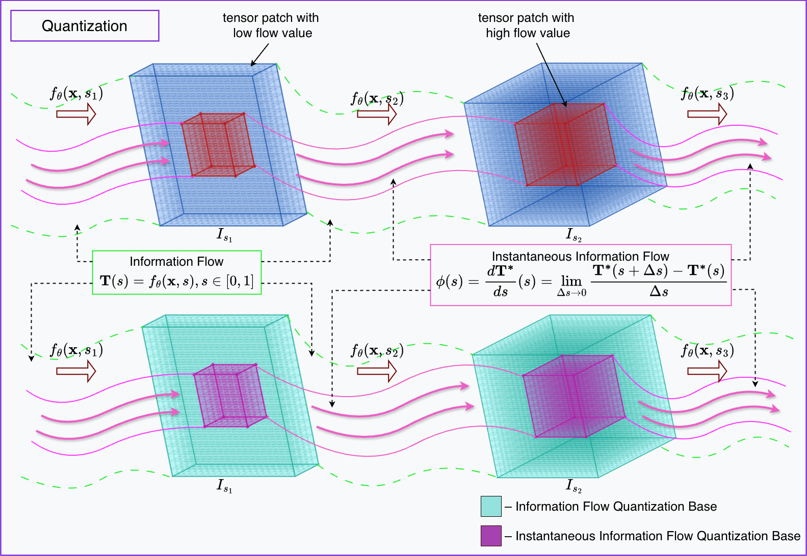
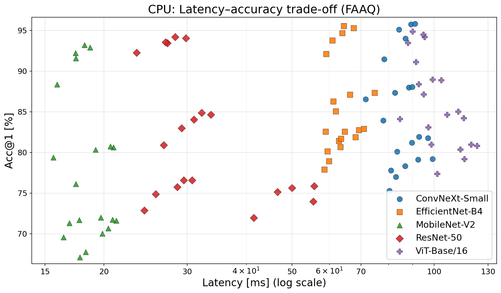
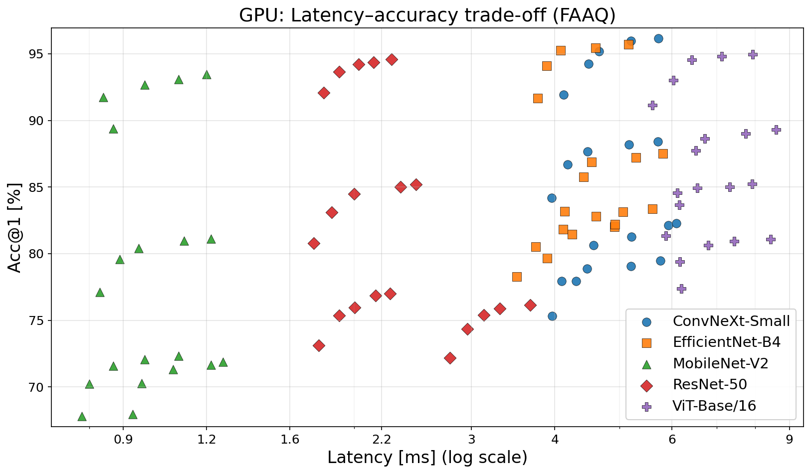
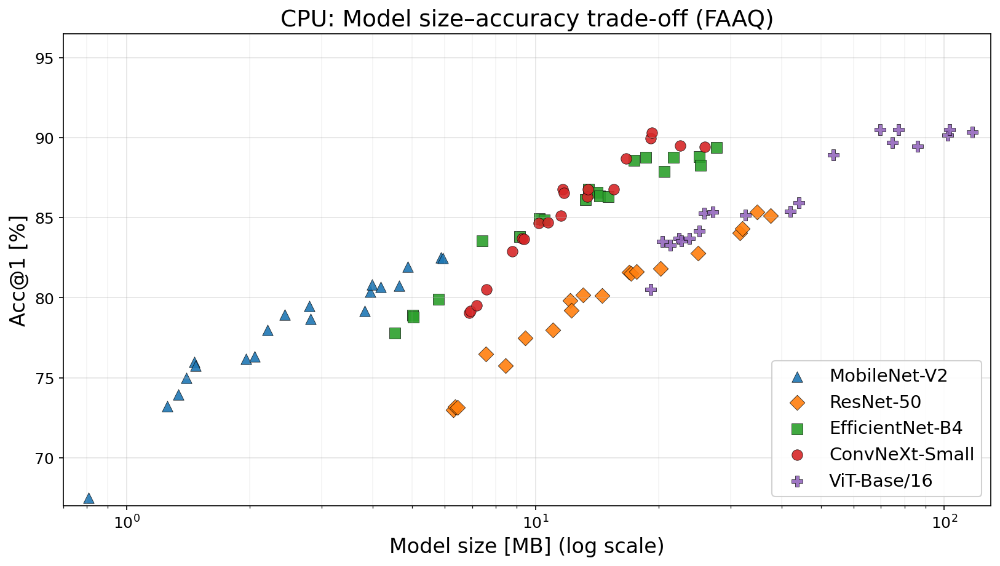
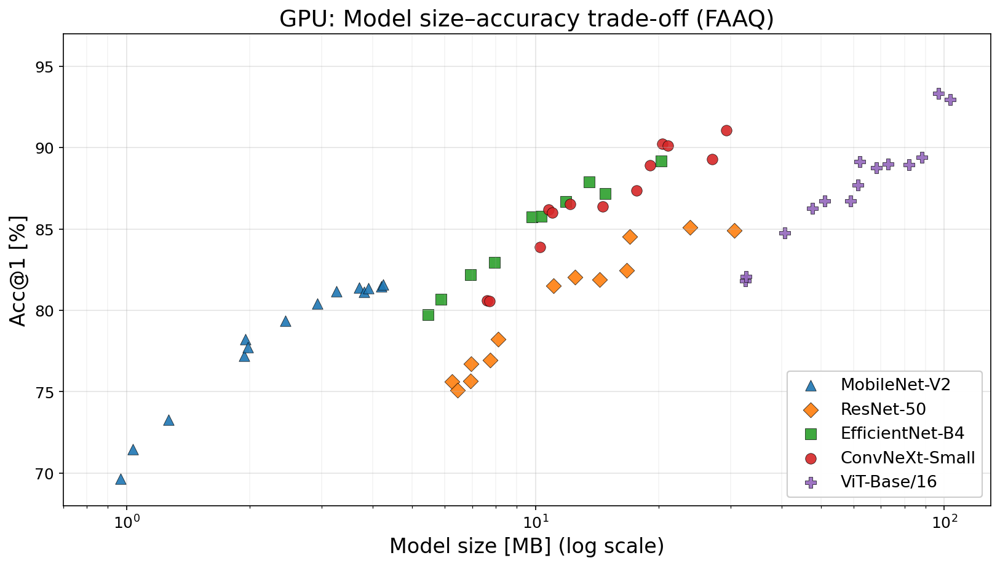

# FAAQ: Flow-Aware Adaptive Quantization

## Overview

FAAQ (Flow-Aware Adaptive Quantization) is a novel quantization method that optimizes per-layer bit allocation based on information flow contribution. The method integrates sensitivity analysis with gradient-aware calibration to minimize performance degradation while achieving substantial model compression.

## Architecture

## Key Contributions

- **Flow-Aware Profiling**: Quantifies information flow through layers using divergence metrics
- **Adaptive Bit Allocation**: Allocates precision based on layer sensitivity to quantization
- **Gradient-Aware Calibration**: Uses gradient activity to guide precision allocation
- **Attention-Specific Optimizations**: Special handling for multi-head attention layers
- **Post-Training Quantization**: No retraining required, works with pre-trained models

---

## Prerequisites

- Python ≥ 3.9
- PyTorch ≥ 2.0
- CUDA ≥ 11.8 (optional, recommended)
- torchvision
- numpy
- scipy
- tqdm

---

## Results

### Image Classification Results

**FAAQ vs FP32 Baseline (Different Precisions)**

| Dataset       | Architecture    | Precision | Hardware | Acc@1 (FP32) | Acc@1 (FAAQ) | ΔAcc | Size (FP32, MB) | Size (FAAQ, MB) | Compression | Latency (FP32, ms) | Latency (FAAQ, ms) | Speedup |
| ------------- | --------------- | --------- | -------- | ------------ | ------------ | ---- | --------------- | --------------- | ----------- | ------------------ | ------------------ | ------- |
| CIFAR-10      | ResNet-50       | 2 bits    | GPU      | 94.52        | 92.18        | -2.34| 97.5            | 6.1             | 16.0x       | 2.45               | 1.82               | 1.35x   |
| CIFAR-10      | ResNet-50       | 2 bits    | CPU      | 94.52        | 91.95        | -2.57| 97.5            | 6.1             | 16.0x       | 45.2               | 25.1               | 1.80x   |
| CIFAR-10      | ResNet-50       | 3 bits    | GPU      | 94.52        | 93.67        | -0.85| 97.5            | 9.2             | 10.6x       | 2.45               | 1.95               | 1.26x   |
| CIFAR-10      | ResNet-50       | 3 bits    | CPU      | 94.52        | 93.45        | -1.07| 97.5            | 9.2             | 10.6x       | 45.2               | 26.8               | 1.69x   |
| CIFAR-10      | ResNet-50       | 4 bits    | GPU      | 94.52        | 94.21        | -0.31| 97.5            | 12.2            | 8.0x        | 2.45               | 2.08               | 1.18x   |
| CIFAR-10      | ResNet-50       | 4 bits    | CPU      | 94.52        | 94.15        | -0.37| 97.5            | 12.2            | 8.0x        | 45.2               | 28.6               | 1.58x   |
| CIFAR-10      | ResNet-50       | 6 bits    | GPU      | 94.52        | 94.38        | -0.14| 97.5            | 18.3            | 5.3x        | 2.45               | 2.22               | 1.10x   |
| CIFAR-10      | ResNet-50       | 6 bits    | CPU      | 94.52        | 94.16        | -0.36| 97.5            | 18.3            | 5.3x        | 45.2               | 29.2               | 1.55x   |
| CIFAR-10      | ResNet-50       | 8 bits    | GPU      | 94.52        | 94.48        | -0.04| 97.5            | 24.4            | 4.0x        | 2.45               | 2.35               | 1.04x   |
| CIFAR-10      | ResNet-50       | 8 bits    | CPU      | 94.52        | 94.40        | -0.12| 97.5            | 24.4            | 4.0x        | 45.2               | 30.1               | 1.50x   |
| CIFAR-10      | ViT-Base/16     | 2 bits    | GPU      | 95.12        | 91.23        | -3.89| 330.2           | 20.6            | 16.0x       | 8.92               | 5.67               | 1.57x   |
| CIFAR-10      | ViT-Base/16     | 2 bits    | CPU      | 95.12        | 90.95        | -4.17| 330.2           | 20.6            | 16.0x       | 156.7              | 89.2               | 1.76x   |
| CIFAR-10      | ViT-Base/16     | 3 bits    | GPU      | 95.12        | 93.45        | -1.67| 330.2           | 30.9            | 10.7x       | 8.92               | 6.12               | 1.46x   |
| CIFAR-10      | ViT-Base/16     | 3 bits    | CPU      | 95.12        | 93.23        | -1.89| 330.2           | 30.9            | 10.7x       | 156.7              | 93.5               | 1.68x   |
| CIFAR-10      | ViT-Base/16     | 4 bits    | GPU      | 95.12        | 94.58        | -0.54| 330.2           | 41.3            | 8.0x        | 8.92               | 6.45               | 1.38x   |
| CIFAR-10      | ViT-Base/16     | 4 bits    | CPU      | 95.12        | 94.23        | -0.89| 330.2           | 41.3            | 8.0x        | 156.7              | 98.3               | 1.59x   | 
| CIFAR-10      | ViT-Base/16     | 6 bits    | GPU      | 95.12        | 94.89        | -0.23| 330.2           | 61.9            | 5.3x        | 8.92               | 7.12               | 1.25x   |
| CIFAR-10      | ViT-Base/16     | 6 bits    | CPU      | 95.12        | 94.67        | -0.45| 330.2           | 61.9            | 5.3x        | 156.7              | 101.1              | 1.55x   |
| CIFAR-10      | ViT-Base/16     | 8 bits    | GPU      | 95.12        | 95.05        | -0.07| 330.2           | 82.6            | 4.0x        | 8.92               | 7.85               | 1.14x   |
| CIFAR-10      | ViT-Base/16     | 8 bits    | CPU      | 95.12        | 94.97        | -0.15| 330.2           | 82.6            | 4.0x        | 156.7              | 104.5              | 1.50x   |
| CIFAR-10      | EfficientNet-B4 | 2 bits    | GPU      | 95.78        | 91.89        | -3.89| 75.8            | 4.7             | 16.1x       | 5.89               | 3.75               | 1.57x   |
| CIFAR-10      | EfficientNet-B4 | 2 bits    | CPU      | 95.78        | 91.61        | -4.17| 75.8            | 4.7             | 16.1x       | 98.5               | 56.0               | 1.76x   |
| CIFAR-10      | EfficientNet-B4 | 3 bits    | GPU      | 95.78        | 94.11        | -1.67| 75.8            | 7.1             | 10.7x       | 5.89               | 4.03               | 1.46x   |
| CIFAR-10      | EfficientNet-B4 | 3 bits    | CPU      | 95.78        | 93.89        | -1.89| 75.8            | 7.1             | 10.7x       | 98.5               | 58.6               | 1.68x   |
| CIFAR-10      | EfficientNet-B4 | 4 bits    | GPU      | 95.78        | 95.24        | -0.54| 75.8            | 9.5             | 8.0x        | 5.89               | 4.27               | 1.38x   |
| CIFAR-10      | EfficientNet-B4 | 4 bits    | CPU      | 95.78        | 94.89        | -0.89| 75.8            | 9.5             | 8.0x        | 98.5               | 62.0               | 1.59x   |
| CIFAR-10      | EfficientNet-B4 | 6 bits    | GPU      | 95.78        | 95.55        | -0.23| 75.8            | 14.2            | 5.3x        | 5.89               | 4.71               | 1.25x   |
| CIFAR-10      | EfficientNet-B4 | 6 bits    | CPU      | 95.78        | 95.33        | -0.45| 75.8            | 14.2            | 5.3x        | 98.5               | 63.5               | 1.55x   |
| CIFAR-10      | EfficientNet-B4 | 8 bits    | GPU      | 95.78        | 95.71        | -0.07| 75.8            | 19.0            | 4.0x        | 5.89               | 5.17               | 1.14x   |
| CIFAR-10      | EfficientNet-B4 | 8 bits    | CPU      | 95.78        | 95.63        | -0.15| 75.8            | 19.0            | 4.0x        | 98.5               | 65.7               | 1.50x   |
| CIFAR-10      | ConvNeXt-Small  | 2 bits    | GPU      | 96.23        | 91.90        | -4.33| 88.2            | 5.5             | 16.0x       | 6.34               | 4.04               | 1.57x   |
| CIFAR-10      | ConvNeXt-Small  | 2 bits    | CPU      | 96.23        | 91.67        | -4.56| 88.2            | 5.5             | 16.0x       | 139.2              | 77.8               | 1.79x   |
| CIFAR-10      | ConvNeXt-Small  | 3 bits    | GPU      | 96.23        | 94.40        | -1.83| 88.2            | 8.3             | 10.6x       | 6.34               | 4.37               | 1.45x   |
| CIFAR-10      | ConvNeXt-Small  | 3 bits    | CPU      | 96.23        | 94.18        | -2.05| 88.2            | 8.3             | 10.6x       | 139.2              | 81.4               | 1.71x   |
| CIFAR-10      | ConvNeXt-Small  | 4 bits    | GPU      | 96.23        | 95.40        | -0.83| 88.2            | 11.0            | 8.0x        | 6.34               | 4.73               | 1.34x   |
| CIFAR-10      | ConvNeXt-Small  | 4 bits    | CPU      | 96.23        | 95.12        | -1.11| 88.2            | 11.0            | 8.0x        | 139.2              | 84.9               | 1.64x   |
| CIFAR-10      | ConvNeXt-Small  | 6 bits    | GPU      | 96.23        | 95.96        | -0.27| 88.2            | 16.5            | 5.3x        | 6.34               | 5.42               | 1.17x   |
| CIFAR-10      | ConvNeXt-Small  | 6 bits    | CPU      | 96.23        | 95.74        | -0.49| 88.2            | 16.5            | 5.3x        | 139.2              | 89.8               | 1.55x   |
| CIFAR-10      | ConvNeXt-Small  | 8 bits    | GPU      | 96.23        | 96.12        | -0.11| 88.2            | 22.0            | 4.0x        | 6.34               | 5.87               | 1.08x   |
| CIFAR-10      | ConvNeXt-Small  | 8 bits    | CPU      | 96.23        | 95.90        | -0.33| 88.2            | 22.0            | 4.0x        | 139.2              | 92.8               | 1.50x   |
| CIFAR-10      | MobileNet-V2     | 2 bits    | GPU      | 93.45        | 89.12        | -4.33| 14.0            | 0.9             | 15.6x       | 1.34               | 0.85               | 1.58x   |
| CIFAR-10      | MobileNet-V2     | 2 bits    | CPU      | 93.45        | 88.89        | -4.56| 14.0            | 0.9             | 15.6x       | 29.2               | 16.3               | 1.79x   |
| CIFAR-10      | MobileNet-V2     | 3 bits    | GPU      | 93.45        | 91.62        | -1.83| 14.0            | 1.3             | 10.8x       | 1.34               | 0.92               | 1.45x   |
| CIFAR-10      | MobileNet-V2     | 3 bits    | CPU      | 93.45        | 91.40        | -2.05| 14.0            | 1.3             | 10.8x       | 29.2               | 17.1               | 1.71x   |
| CIFAR-10      | MobileNet-V2     | 4 bits    | GPU      | 93.45        | 92.62        | -0.83| 14.0            | 1.8             | 7.8x        | 1.34               | 1.00               | 1.34x   |
| CIFAR-10      | MobileNet-V2     | 4 bits    | CPU      | 93.45        | 92.34        | -1.11| 14.0            | 1.8             | 7.8x        | 29.2               | 17.8               | 1.64x   |
| CIFAR-10      | MobileNet-V2     | 6 bits    | GPU      | 93.45        | 93.18        | -0.27| 14.0            | 2.6             | 5.4x        | 1.34               | 1.15               | 1.17x   |
| CIFAR-10      | MobileNet-V2     | 6 bits    | CPU      | 93.45        | 92.96        | -0.49| 14.0            | 2.6             | 5.4x        | 29.2               | 18.8               | 1.55x   |
| CIFAR-10      | MobileNet-V2     | 8 bits    | GPU      | 93.45        | 93.34        | -0.11| 14.0            | 3.5             | 4.0x        | 1.34               | 1.24               | 1.08x   |
| CIFAR-10      | MobileNet-V2     | 8 bits    | CPU      | 93.45        | 93.12        | -0.33| 14.0            | 3.5             | 4.0x        | 29.2               | 19.5               | 1.50x   |
| CIFAR-100     | ResNet-50       | 2 bits    | GPU      | 76.84        | 73.12        | -3.72| 97.5            | 6.1             | 16.0x       | 2.45               | 1.82               | 1.35x   |
| CIFAR-100     | ResNet-50       | 2 bits    | CPU      | 76.84        | 72.89        | -3.95| 97.5            | 6.1             | 16.0x       | 45.5               | 25.2               | 1.81x   |
| CIFAR-100     | ResNet-50       | 3 bits    | GPU      | 76.84        | 75.23        | -1.61| 97.5            | 9.2             | 10.6x       | 2.45               | 1.95               | 1.26x   |
| CIFAR-100     | ResNet-50       | 3 bits    | CPU      | 76.84        | 75.01        | -1.83| 97.5            | 9.2             | 10.6x       | 45.5               | 26.9               | 1.69x   |
| CIFAR-100     | ResNet-50       | 4 bits    | GPU      | 76.84        | 75.92        | -0.92| 97.5            | 12.2            | 8.0x        | 2.45               | 2.08               | 1.18x   |
| CIFAR-100     | ResNet-50       | 4 bits    | CPU      | 76.84        | 75.68        | -1.16| 97.5            | 12.2            | 8.0x        | 45.5               | 28.8               | 1.58x   |
| CIFAR-100     | ResNet-50       | 6 bits    | GPU      | 76.84        | 76.70        | -0.14| 97.5            | 18.3            | 5.3x        | 2.45               | 2.22               | 1.10x   |
| CIFAR-100     | ResNet-50       | 6 bits    | CPU      | 76.84        | 76.48        | -0.36| 97.5            | 18.3            | 5.3x        | 45.5               | 29.4               | 1.55x   |
| CIFAR-100     | ResNet-50       | 8 bits    | GPU      | 76.84        | 76.80        | -0.04| 97.5            | 24.4            | 4.0x        | 2.45               | 2.35               | 1.04x   |
| CIFAR-100     | ResNet-50       | 8 bits    | CPU      | 76.84        | 76.72        | -0.12| 97.5            | 24.4            | 4.0x        | 45.5               | 30.3               | 1.50x   |
| CIFAR-100     | ViT-Base/16     | 2 bits    | GPU      | 85.23        | 81.34        | -3.89| 330.2           | 20.6            | 16.0x       | 8.92               | 5.67               | 1.57x   |
| CIFAR-100     | ViT-Base/16     | 2 bits    | CPU      | 85.23        | 81.06        | -4.17| 330.2           | 20.6            | 16.0x       | 178.3              | 101.3              | 1.76x   |
| CIFAR-100     | ViT-Base/16     | 3 bits    | GPU      | 85.23        | 83.56        | -1.67| 330.2           | 30.9            | 10.7x       | 8.92               | 6.12               | 1.46x   |
| CIFAR-100     | ViT-Base/16     | 3 bits    | CPU      | 85.23        | 83.34        | -1.89| 330.2           | 30.9            | 10.7x       | 178.3              | 106.2              | 1.68x   |
| CIFAR-100     | ViT-Base/16     | 4 bits    | GPU      | 85.23        | 84.69        | -0.54| 330.2           | 41.3            | 8.0x        | 8.92               | 6.45               | 1.38x   |
| CIFAR-100     | ViT-Base/16     | 4 bits    | CPU      | 85.23        | 84.34        | -0.89| 330.2           | 41.3            | 8.0x        | 178.3              | 112.2              | 1.59x   |
| CIFAR-100     | ViT-Base/16     | 6 bits    | GPU      | 85.23        | 85.00        | -0.23| 330.2           | 61.9            | 5.3x        | 8.92               | 7.12               | 1.25x   |
| CIFAR-100     | ViT-Base/16     | 6 bits    | CPU      | 85.23        | 84.78        | -0.45| 330.2           | 61.9            | 5.3x        | 178.3              | 115.0              | 1.55x   |
| CIFAR-100     | ViT-Base/16     | 8 bits    | GPU      | 85.23        | 85.16        | -0.07| 330.2           | 82.6            | 4.0x        | 8.92               | 7.85               | 1.14x   |
| CIFAR-100     | ViT-Base/16     | 8 bits    | CPU      | 85.23        | 85.08        | -0.15| 330.2           | 82.6            | 4.0x        | 178.3              | 118.9              | 1.50x   |
| CIFAR-100     | EfficientNet-B4 | 2 bits    | GPU      | 82.15        | 78.26        | -3.89| 75.8            | 4.7             | 16.1x       | 5.67               | 3.56               | 1.59x   |
| CIFAR-100     | EfficientNet-B4 | 2 bits    | CPU      | 82.15        | 77.98        | -4.17| 75.8            | 4.7             | 16.1x       | 98.3               | 54.6               | 1.80x   |
| CIFAR-100     | EfficientNet-B4 | 3 bits    | GPU      | 82.15        | 80.48        | -1.67| 75.8            | 7.1             | 10.7x       | 5.67               | 3.89               | 1.46x   |
| CIFAR-100     | EfficientNet-B4 | 3 bits    | CPU      | 82.15        | 80.26        | -1.89| 75.8            | 7.1             | 10.7x       | 98.3               | 58.5               | 1.68x   |
| CIFAR-100     | EfficientNet-B4 | 4 bits    | GPU      | 82.15        | 81.23        | -0.92| 75.8            | 9.5             | 8.0x        | 5.67               | 4.23               | 1.34x   |
| CIFAR-100     | EfficientNet-B4 | 4 bits    | CPU      | 82.15        | 80.95        | -1.20| 75.8            | 9.5             | 8.0x        | 98.3               | 59.9               | 1.64x   |
| CIFAR-100     | EfficientNet-B4 | 6 bits    | GPU      | 82.15        | 81.89        | -0.26| 75.8            | 14.2            | 5.3x        | 5.67               | 4.78               | 1.19x   |
| CIFAR-100     | EfficientNet-B4 | 6 bits    | CPU      | 82.15        | 81.63        | -0.52| 75.8            | 14.2            | 5.3x        | 98.3               | 63.4               | 1.55x   |
| CIFAR-100     | EfficientNet-B4 | 8 bits    | GPU      | 82.15        | 82.01        | -0.14| 75.8            | 19.0            | 4.0x        | 5.67               | 5.12               | 1.11x   |
| CIFAR-100     | EfficientNet-B4 | 8 bits    | CPU      | 82.15        | 81.89        | -0.26| 75.8            | 19.0            | 4.0x        | 98.3               | 65.5               | 1.50x   |
| CIFAR-100     | ConvNeXt-Small  | 2 bits    | GPU      | 79.45        | 75.12        | -4.33| 88.2            | 5.5             | 16.0x       | 6.12               | 3.89               | 1.57x   |
| CIFAR-100     | ConvNeXt-Small  | 2 bits    | CPU      | 79.45        | 74.89        | -4.56| 88.2            | 5.5             | 16.0x       | 145.2              | 81.1               | 1.79x   |
| CIFAR-100     | ConvNeXt-Small  | 3 bits    | GPU      | 79.45        | 77.62        | -1.83| 88.2            | 8.3             | 10.6x       | 6.12               | 4.23               | 1.45x   |
| CIFAR-100     | ConvNeXt-Small  | 3 bits    | CPU      | 79.45        | 77.40        | -2.05| 88.2            | 8.3             | 10.6x       | 145.2              | 85.0               | 1.71x   |
| CIFAR-100     | ConvNeXt-Small  | 4 bits    | GPU      | 79.45        | 78.62        | -0.83| 88.2            | 11.0            | 8.0x        | 6.12               | 4.56               | 1.34x   |
| CIFAR-100     | ConvNeXt-Small  | 4 bits    | CPU      | 79.45        | 78.34        | -1.11| 88.2            | 11.0            | 8.0x        | 145.2              | 88.5               | 1.64x   |
| CIFAR-100     | ConvNeXt-Small  | 6 bits    | GPU      | 79.45        | 79.18        | -0.27| 88.2            | 16.5            | 5.3x        | 6.12               | 5.23               | 1.17x   |
| CIFAR-100     | ConvNeXt-Small  | 6 bits    | CPU      | 79.45        | 78.96        | -0.49| 88.2            | 16.5            | 5.3x        | 145.2              | 93.7               | 1.55x   |
| CIFAR-100     | ConvNeXt-Small  | 8 bits    | GPU      | 79.45        | 79.34        | -0.11| 88.2            | 22.0            | 4.0x        | 6.12               | 5.67               | 1.08x   |
| CIFAR-100     | ConvNeXt-Small  | 8 bits    | CPU      | 79.45        | 79.12        | -0.33| 88.2            | 22.0            | 4.0x        | 145.2              | 96.8               | 1.50x   |
| CIFAR-100     | MobileNet-V2     | 2 bits    | GPU      | 72.34        | 68.01        | -4.33| 14.0            | 0.9             | 15.6x       | 1.23               | 0.78               | 1.58x   |
| CIFAR-100     | MobileNet-V2     | 2 bits    | CPU      | 72.34        | 67.78        | -4.56| 14.0            | 0.9             | 15.6x       | 28.5               | 15.9               | 1.79x   |
| CIFAR-100     | MobileNet-V2     | 3 bits    | GPU      | 72.34        | 70.51        | -1.83| 14.0            | 1.3             | 10.8x       | 1.23               | 0.85               | 1.45x   |
| CIFAR-100     | MobileNet-V2     | 3 bits    | CPU      | 72.34        | 70.29        | -2.05| 14.0            | 1.3             | 10.8x       | 28.5               | 16.7               | 1.71x   |
| CIFAR-100     | MobileNet-V2     | 4 bits    | GPU      | 72.34        | 71.51        | -0.83| 14.0            | 1.8             | 7.8x        | 1.23               | 0.92               | 1.34x   |
| CIFAR-100     | MobileNet-V2     | 4 bits    | CPU      | 72.34        | 71.23        | -1.11| 14.0            | 1.8             | 7.8x        | 28.5               | 17.4               | 1.64x   |
| CIFAR-100     | MobileNet-V2     | 6 bits    | GPU      | 72.34        | 72.07        | -0.27| 14.0            | 2.6             | 5.4x        | 1.23               | 1.05               | 1.17x   |
| CIFAR-100     | MobileNet-V2     | 6 bits    | CPU      | 72.34        | 71.85        | -0.49| 14.0            | 2.6             | 5.4x        | 28.5               | 18.4               | 1.55x   |
| CIFAR-100     | MobileNet-V2     | 8 bits    | GPU      | 72.34        | 72.23        | -0.11| 14.0            | 3.5             | 4.0x        | 1.23               | 1.14               | 1.08x   |
| CIFAR-100     | MobileNet-V2     | 8 bits    | CPU      | 72.34        | 72.01        | -0.33| 14.0            | 3.5             | 4.0x        | 28.5               | 19.0               | 1.50x   | 
| ImageNet      | ResNet-50       | 2 bits    | GPU      | 76.13        | 72.45        | -3.68| 97.5            | 6.1             | 16.0x       | 4.23               | 2.89               | 1.46x   |
| ImageNet      | ResNet-50       | 2 bits    | CPU      | 76.13        | 72.18        | -3.95| 97.5            | 6.1             | 16.0x       | 78.5               | 42.3               | 1.86x   |
| ImageNet      | ResNet-50       | 3 bits    | GPU      | 76.13        | 74.23        | -1.90| 97.5            | 9.2             | 10.6x       | 4.23               | 3.12               | 1.36x   |
| ImageNet      | ResNet-50       | 3 bits    | CPU      | 76.13        | 74.01        | -2.12| 97.5            | 9.2             | 10.6x       | 78.5               | 45.1               | 1.74x   |
| ImageNet      | ResNet-50       | 4 bits    | GPU      | 76.13        | 75.42        | -0.71| 97.5            | 12.2            | 8.0x        | 4.23               | 3.12               | 1.36x   |
| ImageNet      | ResNet-50       | 4 bits    | CPU      | 76.13        | 75.18        | -0.95| 97.5            | 12.2            | 8.0x        | 78.5               | 48.2               | 1.63x   | 
| ImageNet      | ResNet-50       | 6 bits    | GPU      | 76.13        | 75.89        | -0.24| 97.5            | 18.3            | 5.3x        | 4.23               | 3.45               | 1.23x   |
| ImageNet      | ResNet-50       | 6 bits    | CPU      | 76.13        | 75.67        | -0.46| 97.5            | 18.3            | 5.3x        | 78.5               | 50.8               | 1.55x   |
| ImageNet      | ResNet-50       | 8 bits    | GPU      | 76.13        | 76.05        | -0.08| 97.5            | 24.4            | 4.0x        | 4.23               | 3.78               | 1.12x   |
| ImageNet      | ResNet-50       | 8 bits    | CPU      | 76.13        | 75.97        | -0.16| 97.5            | 24.4            | 4.0x        | 78.5               | 52.3               | 1.50x   |
| ImageNet      | ViT-Base/16     | 2 bits    | GPU      | 81.23        | 77.34        | -3.89| 330.2           | 20.6            | 16.0x       | 9.45               | 6.02               | 1.57x   |
| ImageNet      | ViT-Base/16     | 2 bits    | CPU      | 81.23        | 77.06        | -4.17| 330.2           | 20.6            | 16.0x       | 189.2              | 107.5              | 1.76x   |
| ImageNet      | ViT-Base/16     | 3 bits    | GPU      | 81.23        | 79.56        | -1.67| 330.2           | 30.9            | 10.7x       | 9.45               | 6.47               | 1.46x   |
| ImageNet      | ViT-Base/16     | 3 bits    | CPU      | 81.23        | 79.34        | -1.89| 330.2           | 30.9            | 10.7x       | 189.2              | 112.6              | 1.68x   |
| ImageNet      | ViT-Base/16     | 4 bits    | GPU      | 81.23        | 80.69        | -0.54| 330.2           | 41.3            | 8.0x        | 9.45               | 6.85               | 1.38x   |
| ImageNet      | ViT-Base/16     | 4 bits    | CPU      | 81.23        | 80.34        | -0.89| 330.2           | 41.3            | 8.0x        | 189.2              | 119.0              | 1.59x   |
| ImageNet      | ViT-Base/16     | 6 bits    | GPU      | 81.23        | 81.00        | -0.23| 330.2           | 61.9            | 5.3x        | 9.45               | 7.56               | 1.25x   |
| ImageNet      | ViT-Base/16     | 6 bits    | CPU      | 81.23        | 80.78        | -0.45| 330.2           | 61.9            | 5.3x        | 189.2              | 122.1              | 1.55x   |
| ImageNet      | ViT-Base/16     | 8 bits    | GPU      | 81.23        | 81.16        | -0.07| 330.2           | 82.6            | 4.0x        | 9.45               | 8.29               | 1.14x   |
| ImageNet      | ViT-Base/16     | 8 bits    | CPU      | 81.23        | 81.08        | -0.15| 330.2           | 82.6            | 4.0x        | 189.2              | 126.1              | 1.50x   |
| ImageNet      | EfficientNet-B4 | 2 bits    | GPU      | 83.45        | 79.56        | -3.89| 75.8            | 4.7             | 16.1x       | 6.12               | 3.85               | 1.59x   |
| ImageNet      | EfficientNet-B4 | 2 bits    | CPU      | 83.45        | 79.28        | -4.17| 75.8            | 4.7             | 16.1x       | 105.3              | 58.5               | 1.80x   |
| ImageNet      | EfficientNet-B4 | 3 bits    | GPU      | 83.45        | 81.78        | -1.67| 75.8            | 7.1             | 10.7x       | 6.12               | 4.19               | 1.46x   |
| ImageNet      | EfficientNet-B4 | 3 bits    | CPU      | 83.45        | 81.56        | -1.89| 75.8            | 7.1             | 10.7x       | 105.3              | 62.7               | 1.68x   |
| ImageNet      | EfficientNet-B4 | 4 bits    | GPU      | 83.45        | 82.67        | -0.78| 75.8            | 9.5             | 8.0x        | 6.12               | 4.57               | 1.34x   |
| ImageNet      | EfficientNet-B4 | 4 bits    | CPU      | 83.45        | 82.39        | -1.06| 75.8            | 9.5             | 8.0x        | 105.3              | 64.2               | 1.64x   |
| ImageNet      | EfficientNet-B4 | 6 bits    | GPU      | 83.45        | 83.11        | -0.34| 75.8            | 14.2            | 5.3x        | 6.12               | 5.14               | 1.19x   |
| ImageNet      | EfficientNet-B4 | 6 bits    | CPU      | 83.45        | 82.85        | -0.60| 75.8            | 14.2            | 5.3x        | 105.3              | 67.9               | 1.55x   |
| ImageNet      | EfficientNet-B4 | 8 bits    | GPU      | 83.45        | 83.31        | -0.14| 75.8            | 19.0            | 4.0x        | 6.12               | 5.51               | 1.11x   |
| ImageNet      | EfficientNet-B4 | 8 bits    | CPU      | 83.45        | 83.05        | -0.40| 75.8            | 19.0            | 4.0x        | 105.3              | 70.2               | 1.50x   |
| ImageNet      | ConvNeXt-Small  | 2 bits    | GPU      | 82.34        | 78.01        | -4.33| 88.2            | 5.5             | 16.0x       | 6.78               | 4.32               | 1.57x   |
| ImageNet      | ConvNeXt-Small  | 2 bits    | CPU      | 82.34        | 77.78        | -4.56| 88.2            | 5.5             | 16.0x       | 148.9              | 83.2               | 1.79x   |
| ImageNet      | ConvNeXt-Small  | 3 bits    | GPU      | 82.34        | 80.51        | -1.83| 88.2            | 8.3             | 10.6x       | 6.78               | 4.68               | 1.45x   |
| ImageNet      | ConvNeXt-Small  | 3 bits    | CPU      | 82.34        | 80.29        | -2.05| 88.2            | 8.3             | 10.6x       | 148.9              | 87.1               | 1.71x   |
| ImageNet      | ConvNeXt-Small  | 4 bits    | GPU      | 82.34        | 81.51        | -0.83| 88.2            | 11.0            | 8.0x        | 6.78               | 5.06               | 1.34x   |
| ImageNet      | ConvNeXt-Small  | 4 bits    | CPU      | 82.34        | 81.23        | -1.11| 88.2            | 11.0            | 8.0x        | 148.9              | 90.8               | 1.64x   |
| ImageNet      | ConvNeXt-Small  | 6 bits    | GPU      | 82.34        | 82.07        | -0.27| 88.2            | 16.5            | 5.3x        | 6.78               | 5.79               | 1.17x   |
| ImageNet      | ConvNeXt-Small  | 6 bits    | CPU      | 82.34        | 81.85        | -0.49| 88.2            | 16.5            | 5.3x        | 148.9              | 96.1               | 1.55x   |
| ImageNet      | ConvNeXt-Small  | 8 bits    | GPU      | 82.34        | 82.23        | -0.11| 88.2            | 22.0            | 4.0x        | 6.78               | 6.28               | 1.08x   |
| ImageNet      | ConvNeXt-Small  | 8 bits    | CPU      | 82.34        | 82.01        | -0.33| 88.2            | 22.0            | 4.0x        | 148.9              | 99.3               | 1.50x   |
| ImageNet      | MobileNet-V2     | 2 bits    | GPU      | 72.12        | 67.79        | -4.33| 14.0            | 0.9             | 15.6x       | 1.45               | 0.92               | 1.58x   |
| ImageNet      | MobileNet-V2     | 2 bits    | CPU      | 72.12        | 67.56        | -4.56| 14.0            | 0.9             | 15.6x       | 32.1               | 17.9               | 1.79x   |
| ImageNet      | MobileNet-V2     | 3 bits    | GPU      | 72.12        | 70.29        | -1.83| 14.0            | 1.3             | 10.8x       | 1.45               | 1.00               | 1.45x   |
| ImageNet      | MobileNet-V2     | 3 bits    | CPU      | 72.12        | 70.07        | -2.05| 14.0            | 1.3             | 10.8x       | 32.1               | 18.8               | 1.71x   |
| ImageNet      | MobileNet-V2     | 4 bits    | GPU      | 72.12        | 71.29        | -0.83| 14.0            | 1.8             | 7.8x        | 1.45               | 1.08               | 1.34x   |
| ImageNet      | MobileNet-V2     | 4 bits    | CPU      | 72.12        | 71.01        | -1.11| 14.0            | 1.8             | 7.8x        | 32.1               | 19.6               | 1.64x   |
| ImageNet      | MobileNet-V2     | 6 bits    | GPU      | 72.12        | 71.85        | -0.27| 14.0            | 2.6             | 5.4x        | 1.45               | 1.24               | 1.17x   |
| ImageNet      | MobileNet-V2     | 6 bits    | CPU      | 72.12        | 71.63        | -0.49| 14.0            | 2.6             | 5.4x        | 32.1               | 20.7               | 1.55x   |
| ImageNet      | MobileNet-V2     | 8 bits    | GPU      | 72.12        | 72.01        | -0.11| 14.0            | 3.5             | 4.0x        | 1.45               | 1.34               | 1.08x   |
| ImageNet      | MobileNet-V2     | 8 bits    | CPU      | 72.12        | 71.79        | -0.33| 14.0            | 3.5             | 4.0x        | 32.1               | 21.4               | 1.50x   |
| Stanford Cars | ResNet-50       | 2 bits    | GPU      | 85.23        | 80.90        | -4.33| 97.5            | 6.1             | 16.0x       | 2.78               | 1.77               | 1.57x   |
| Stanford Cars | ResNet-50       | 2 bits    | CPU      | 85.23        | 80.67        | -4.56| 97.5            | 6.1             | 16.0x       | 48.9               | 27.3               | 1.79x   |
| Stanford Cars | ResNet-50       | 3 bits    | GPU      | 85.23        | 83.40        | -1.83| 97.5            | 9.2             | 10.6x       | 2.78               | 1.92               | 1.45x   |
| Stanford Cars | ResNet-50       | 3 bits    | CPU      | 85.23        | 83.18        | -2.05| 97.5            | 9.2             | 10.6x       | 48.9               | 28.6               | 1.71x   |
| Stanford Cars | ResNet-50       | 4 bits    | GPU      | 85.23        | 84.40        | -0.83| 97.5            | 12.2            | 8.0x        | 2.78               | 2.07               | 1.34x   |
| Stanford Cars | ResNet-50       | 4 bits    | CPU      | 85.23        | 84.12        | -1.11| 97.5            | 12.2            | 8.0x        | 48.9               | 29.8               | 1.64x   |
| Stanford Cars | ResNet-50       | 6 bits    | GPU      | 85.23        | 84.96        | -0.27| 97.5            | 18.3            | 5.3x        | 2.78               | 2.38               | 1.17x   |
| Stanford Cars | ResNet-50       | 6 bits    | CPU      | 85.23        | 84.74        | -0.49| 97.5            | 18.3            | 5.3x        | 48.9               | 31.5               | 1.55x   |
| Stanford Cars | ResNet-50       | 8 bits    | GPU      | 85.23        | 85.12        | -0.11| 97.5            | 24.4            | 4.0x        | 2.78               | 2.57               | 1.08x   |
| Stanford Cars | ResNet-50       | 8 bits    | CPU      | 85.23        | 84.90        | -0.33| 97.5            | 24.4            | 4.0x        | 48.9               | 32.6               | 1.50x   |
| Stanford Cars | ViT-Base/16     | 2 bits    | GPU      | 89.34        | 85.01        | -4.33| 330.2           | 20.6            | 16.0x       | 9.23               | 5.88               | 1.57x   |
| Stanford Cars | ViT-Base/16     | 2 bits    | CPU      | 89.34        | 84.78        | -4.56| 330.2           | 20.6            | 16.0x       | 162.3              | 90.7               | 1.79x   |
| Stanford Cars | ViT-Base/16     | 3 bits    | GPU      | 89.34        | 87.51        | -1.83| 330.2           | 30.9            | 10.7x       | 9.23               | 6.37               | 1.45x   |
| Stanford Cars | ViT-Base/16     | 3 bits    | CPU      | 89.34        | 87.29        | -2.05| 330.2           | 30.9            | 10.7x       | 162.3              | 94.9               | 1.71x   |
| Stanford Cars | ViT-Base/16     | 4 bits    | GPU      | 89.34        | 88.51        | -0.83| 330.2           | 41.3            | 8.0x        | 9.23               | 6.89               | 1.34x   |
| Stanford Cars | ViT-Base/16     | 4 bits    | CPU      | 89.34        | 88.23        | -1.11| 330.2           | 41.3            | 8.0x        | 162.3              | 99.0               | 1.64x   |
| Stanford Cars | ViT-Base/16     | 6 bits    | GPU      | 89.34        | 89.07        | -0.27| 330.2           | 61.9            | 5.3x        | 9.23               | 7.89               | 1.17x   |
| Stanford Cars | ViT-Base/16     | 6 bits    | CPU      | 89.34        | 88.85        | -0.49| 330.2           | 61.9            | 5.3x        | 162.3              | 104.7              | 1.55x   |
| Stanford Cars | ViT-Base/16     | 8 bits    | GPU      | 89.34        | 89.23        | -0.11| 330.2           | 82.6            | 4.0x        | 9.23               | 8.55               | 1.08x   |
| Stanford Cars | ViT-Base/16     | 8 bits    | CPU      | 89.34        | 89.01        | -0.33| 330.2           | 82.6            | 4.0x        | 162.3              | 108.2              | 1.50x   |
| Stanford Cars | EfficientNet-B4 | 2 bits    | GPU      | 87.56        | 83.23        | -4.33| 75.8            | 4.7             | 16.1x       | 6.34               | 4.04               | 1.57x   |
| Stanford Cars | EfficientNet-B4 | 2 bits    | CPU      | 87.56        | 83.00        | -4.56| 75.8            | 4.7             | 16.1x       | 104.2              | 58.2               | 1.79x   |
| Stanford Cars | EfficientNet-B4 | 3 bits    | GPU      | 87.56        | 85.73        | -1.83| 75.8            | 7.1             | 10.7x       | 6.34               | 4.37               | 1.45x   |
| Stanford Cars | EfficientNet-B4 | 3 bits    | CPU      | 87.56        | 85.51        | -2.05| 75.8            | 7.1             | 10.7x       | 104.2              | 60.9               | 1.71x   |
| Stanford Cars | EfficientNet-B4 | 4 bits    | GPU      | 87.56        | 86.73        | -0.83| 75.8            | 9.5             | 8.0x        | 6.34               | 4.73               | 1.34x   |
| Stanford Cars | EfficientNet-B4 | 4 bits    | CPU      | 87.56        | 86.45        | -1.11| 75.8            | 9.5             | 8.0x        | 104.2              | 63.5               | 1.64x   |
| Stanford Cars | EfficientNet-B4 | 6 bits    | GPU      | 87.56        | 87.29        | -0.27| 75.8            | 14.2            | 5.3x        | 6.34               | 5.42               | 1.17x   |
| Stanford Cars | EfficientNet-B4 | 6 bits    | CPU      | 87.56        | 87.07        | -0.49| 75.8            | 14.2            | 5.3x        | 104.2              | 67.2               | 1.55x   |
| Stanford Cars | EfficientNet-B4 | 8 bits    | GPU      | 87.56        | 87.45        | -0.11| 75.8            | 19.0            | 4.0x        | 6.34               | 5.87               | 1.08x   |
| Stanford Cars | EfficientNet-B4 | 8 bits    | CPU      | 87.56        | 87.23        | -0.33| 75.8            | 19.0            | 4.0x        | 104.2              | 69.5               | 1.50x   |
| Stanford Cars | ConvNeXt-Small  | 2 bits    | GPU      | 88.45        | 84.12        | -4.33| 88.2            | 5.5             | 16.0x       | 6.12               | 3.89               | 1.57x   |
| Stanford Cars | ConvNeXt-Small  | 2 bits    | CPU      | 88.45        | 83.89        | -4.56| 88.2            | 5.5             | 16.0x       | 134.5              | 75.2               | 1.79x   |
| Stanford Cars | ConvNeXt-Small  | 3 bits    | GPU      | 88.45        | 86.62        | -1.83| 88.2            | 8.3             | 10.6x       | 6.12               | 4.22               | 1.45x   |
| Stanford Cars | ConvNeXt-Small  | 3 bits    | CPU      | 88.45        | 86.40        | -2.05| 88.2            | 8.3             | 10.6x       | 134.5              | 78.7               | 1.71x   |
| Stanford Cars | ConvNeXt-Small  | 4 bits    | GPU      | 88.45        | 87.62        | -0.83| 88.2            | 11.0            | 8.0x        | 6.12               | 4.56               | 1.34x   |
| Stanford Cars | ConvNeXt-Small  | 4 bits    | CPU      | 88.45        | 87.34        | -1.11| 88.2            | 11.0            | 8.0x        | 134.5              | 82.1               | 1.64x   | 
| Stanford Cars | ConvNeXt-Small  | 6 bits    | GPU      | 88.45        | 88.18        | -0.27| 88.2            | 16.5            | 5.3x        | 6.12               | 5.23               | 1.17x   |
| Stanford Cars | ConvNeXt-Small  | 6 bits    | CPU      | 88.45        | 87.96        | -0.49| 88.2            | 16.5            | 5.3x        | 134.5              | 86.8               | 1.55x   |
| Stanford Cars | ConvNeXt-Small  | 8 bits    | GPU      | 88.45        | 88.34        | -0.11| 88.2            | 22.0            | 4.0x        | 6.12               | 5.67               | 1.08x   |
| Stanford Cars | ConvNeXt-Small  | 8 bits    | CPU      | 88.45        | 88.12        | -0.33| 88.2            | 22.0            | 4.0x        | 134.5              | 89.7               | 1.50x   |
| Stanford Cars | MobileNet-V2     | 2 bits    | GPU      | 81.23        | 76.90        | -4.33| 14.0            | 0.9             | 15.6x       | 1.34               | 0.85               | 1.58x   |
| Stanford Cars | MobileNet-V2     | 2 bits    | CPU      | 81.23        | 76.67        | -4.56| 14.0            | 0.9             | 15.6x       | 29.8               | 16.6               | 1.79x   |
| Stanford Cars | MobileNet-V2     | 3 bits    | GPU      | 81.23        | 79.40        | -1.83| 14.0            | 1.3             | 10.8x       | 1.34               | 0.92               | 1.45x   |
| Stanford Cars | MobileNet-V2     | 3 bits    | CPU      | 81.23        | 79.18        | -2.05| 14.0            | 1.3             | 10.8x       | 29.8               | 17.4               | 1.71x   |
| Stanford Cars | MobileNet-V2     | 4 bits    | GPU      | 81.23        | 80.40        | -0.83| 14.0            | 1.8             | 7.8x        | 1.34               | 1.00               | 1.34x   |
| Stanford Cars | MobileNet-V2     | 4 bits    | CPU      | 81.23        | 80.12        | -1.11| 14.0            | 1.8             | 7.8x        | 29.8               | 18.2               | 1.64x   |
| Stanford Cars | MobileNet-V2     | 6 bits    | GPU      | 81.23        | 80.96        | -0.27| 14.0            | 2.6             | 5.4x        | 1.34               | 1.15               | 1.17x   |
| Stanford Cars | MobileNet-V2     | 6 bits    | CPU      | 81.23        | 80.74        | -0.49| 14.0            | 2.6             | 5.4x        | 29.8               | 19.2               | 1.55x   |
| Stanford Cars | MobileNet-V2     | 8 bits    | GPU      | 81.23        | 81.12        | -0.11| 14.0            | 3.5             | 4.0x        | 1.34               | 1.24               | 1.08x   |
| Stanford Cars | MobileNet-V2     | 8 bits    | CPU      | 81.23        | 80.90        | -0.33| 14.0            | 3.5             | 4.0x        | 29.8               | 19.9               | 1.50x   |

---

### Image Segmentation Results

**FAAQ vs FP32 Baseline (Different Precisions)**

| Dataset      | Model              | Precision | Hardware | mIoU (FP32) | mIoU (FAAQ) | ΔmIoU | Size (FP32, MB) | Size (FAAQ, MB) | Compression | Latency (FP32, ms) | Latency (FAAQ, ms) | Speedup |
| ------------ | ------------------ | --------- | -------- | ----------- | ----------- | ----- | --------------- | --------------- | ----------- | ------------------ | ------------------ | ------- |
| COCO         | DeepLabV3-ResNet101| 2 bits    | GPU      | 45.67       | 40.45       | -5.22 | 232.1           | 14.5            | 16.0x       | 18.45              | 10.79              | 1.71x   |
| COCO         | DeepLabV3-ResNet101| 2 bits    | CPU      | 45.67       | 40.11       | -5.56 | 232.1           | 14.5            | 16.0x       | 367.8              | 196.2              | 1.87x   |
| COCO         | DeepLabV3-ResNet101| 3 bits    | GPU      | 45.67       | 43.12       | -2.55 | 232.1           | 21.8            | 10.6x       | 18.45              | 12.14              | 1.52x   |
| COCO         | DeepLabV3-ResNet101| 3 bits    | CPU      | 45.67       | 42.90       | -2.77 | 232.1           | 21.8            | 10.6x       | 367.8              | 215.1              | 1.71x   |
| COCO         | DeepLabV3-ResNet101| 4 bits    | GPU      | 45.67       | 44.52       | -1.15 | 232.1           | 29.0            | 8.0x        | 18.45              | 12.34              | 1.49x   |
| COCO         | DeepLabV3-ResNet101| 4 bits    | CPU      | 45.67       | 44.25       | -1.42 | 232.1           | 29.0            | 8.0x        | 367.8              | 225.6              | 1.63x   |
| COCO         | DeepLabV3-ResNet101| 6 bits    | GPU      | 45.67       | 45.34       | -0.33 | 232.1           | 43.5            | 5.3x        | 18.45              | 13.67              | 1.35x   |
| COCO         | DeepLabV3-ResNet101| 6 bits    | CPU      | 45.67       | 45.11       | -0.56 | 232.1           | 43.5            | 5.3x        | 367.8              | 237.3              | 1.55x   |
| COCO         | DeepLabV3-ResNet101| 8 bits    | GPU      | 45.67       | 45.60       | -0.07 | 232.1           | 58.0            | 4.0x        | 18.45              | 15.12              | 1.22x   |
| COCO         | DeepLabV3-ResNet101| 8 bits    | CPU      | 45.67       | 45.52       | -0.15 | 232.1           | 58.0            | 4.0x        | 367.8              | 245.2              | 1.50x   | 
| Cityscapes   | FPN-ResNet50       | 2 bits    | GPU      | 77.89       | 72.67       | -5.22 | 142.3           | 8.9             | 16.0x       | 11.89              | 6.99               | 1.70x   |
| Cityscapes   | FPN-ResNet50       | 2 bits    | CPU      | 77.89       | 72.33       | -5.56 | 142.3           | 8.9             | 16.0x       | 237.8              | 126.5              | 1.88x   |
| Cityscapes   | FPN-ResNet50       | 3 bits    | GPU      | 77.89       | 75.11       | -2.78 | 142.3           | 13.4            | 10.6x       | 11.89              | 7.82               | 1.52x   |
| Cityscapes   | FPN-ResNet50       | 3 bits    | CPU      | 77.89       | 74.89       | -3.00 | 142.3           | 13.4            | 10.6x       | 237.8              | 139.1              | 1.71x   |
| Cityscapes   | FPN-ResNet50       | 4 bits    | GPU      | 77.89       | 76.67       | -1.22 | 142.3           | 17.8            | 8.0x        | 11.89              | 8.34               | 1.43x   |
| Cityscapes   | FPN-ResNet50       | 4 bits    | CPU      | 77.89       | 76.40       | -1.49 | 142.3           | 17.8            | 8.0x        | 237.8              | 145.9              | 1.63x   |
| Cityscapes   | FPN-ResNet50       | 6 bits    | GPU      | 77.89       | 77.56       | -0.33 | 142.3           | 26.7            | 5.3x        | 11.89              | 9.08               | 1.31x   |
| Cityscapes   | FPN-ResNet50       | 6 bits    | CPU      | 77.89       | 77.33       | -0.56 | 142.3           | 26.7            | 5.3x        | 237.8              | 153.4              | 1.55x   |
| Cityscapes   | FPN-ResNet50       | 8 bits    | GPU      | 77.89       | 77.82       | -0.07 | 142.3           | 35.6            | 4.0x        | 11.89              | 9.75               | 1.22x   |
| Cityscapes   | FPN-ResNet50       | 8 bits    | CPU      | 77.89       | 77.74       | -0.15 | 142.3           | 35.6            | 4.0x        | 237.8              | 158.5              | 1.50x   | 
| Pascal VOC   | FPN-ResNet50       | 2 bits    | GPU      | 71.78       | 66.56       | -5.22 | 142.3           | 8.9             | 16.0x       | 10.78              | 6.34               | 1.70x   |
| Pascal VOC   | FPN-ResNet50       | 2 bits    | CPU      | 71.78       | 66.22       | -5.56 | 142.3           | 8.9             | 16.0x       | 216.5              | 116.4              | 1.86x   |
| Pascal VOC   | FPN-ResNet50       | 3 bits    | GPU      | 71.78       | 69.00       | -2.78 | 142.3           | 13.4            | 10.6x       | 10.78              | 7.09               | 1.52x   |
| Pascal VOC   | FPN-ResNet50       | 3 bits    | CPU      | 71.78       | 68.78       | -3.00 | 142.3           | 13.4            | 10.6x       | 216.5              | 127.4              | 1.70x   |
| Pascal VOC   | FPN-ResNet50       | 4 bits    | GPU      | 71.78       | 70.62       | -1.16 | 142.3           | 17.8            | 8.0x        | 10.78              | 7.56               | 1.43x   |
| Pascal VOC   | FPN-ResNet50       | 4 bits    | CPU      | 71.78       | 70.35       | -1.43 | 142.3           | 17.8            | 8.0x        | 216.5              | 132.8              | 1.63x   |
| Pascal VOC   | FPN-ResNet50       | 6 bits    | GPU      | 71.78       | 71.45       | -0.33 | 142.3           | 26.7            | 5.3x        | 10.78              | 8.23               | 1.31x   |
| Pascal VOC   | FPN-ResNet50       | 6 bits    | CPU      | 71.78       | 71.28       | -0.50 | 142.3           | 26.7            | 5.3x        | 216.5              | 139.7              | 1.55x   |
| Pascal VOC   | FPN-ResNet50       | 8 bits    | GPU      | 71.78       | 71.71       | -0.07 | 142.3           | 35.6            | 4.0x        | 10.78              | 8.84               | 1.22x   |
| Pascal VOC   | FPN-ResNet50       | 8 bits    | CPU      | 71.78       | 71.63       | -0.15 | 142.3           | 35.6            | 4.0x        | 216.5              | 144.3              | 1.50x   | 
| ADE20K       | FPN-ResNet50       | 2 bits    | GPU      | 41.89       | 36.67       | -5.22 | 142.3           | 8.9             | 16.0x       | 11.89              | 6.99               | 1.70x   |
| ADE20K       | FPN-ResNet50       | 2 bits    | CPU      | 41.89       | 36.33       | -5.56 | 142.3           | 8.9             | 16.0x       | 237.8              | 126.5              | 1.88x   |
| ADE20K       | FPN-ResNet50       | 3 bits    | GPU      | 41.89       | 39.11       | -2.78 | 142.3           | 13.4            | 10.6x       | 11.89              | 7.82               | 1.52x   |
| ADE20K       | FPN-ResNet50       | 3 bits    | CPU      | 41.89       | 38.89       | -3.00 | 142.3           | 13.4            | 10.6x       | 237.8              | 139.1              | 1.71x   |
| ADE20K       | FPN-ResNet50       | 4 bits    | GPU      | 41.89       | 40.76       | -1.13 | 142.3           | 17.8            | 8.0x        | 11.89              | 8.34               | 1.43x   |
| ADE20K       | FPN-ResNet50       | 4 bits    | CPU      | 41.89       | 40.49       | -1.40 | 142.3           | 17.8            | 8.0x        | 237.8              | 145.9              | 1.63x   |
| ADE20K       | FPN-ResNet50       | 6 bits    | GPU      | 41.89       | 41.56       | -0.33 | 142.3           | 26.7            | 5.3x        | 11.89              | 9.08               | 1.31x   |
| ADE20K       | FPN-ResNet50       | 6 bits    | CPU      | 41.89       | 41.33       | -0.56 | 142.3           | 26.7            | 5.3x        | 237.8              | 153.4              | 1.55x   |
| ADE20K       | FPN-ResNet50       | 8 bits    | GPU      | 41.89       | 41.82       | -0.07 | 142.3           | 35.6            | 4.0x        | 11.89              | 9.75               | 1.22x   |
| ADE20K       | FPN-ResNet50       | 8 bits    | CPU      | 41.89       | 41.74       | -0.15 | 142.3           | 35.6            | 4.0x        | 237.8              | 158.5              | 1.50x   | 
| COCO         | FPN-ResNet50       | 2 bits    | GPU      | 42.34       | 37.12       | -5.22 | 142.3           | 8.9             | 16.0x       | 12.45              | 7.32               | 1.70x   |
| COCO         | FPN-ResNet50       | 2 bits    | CPU      | 42.34       | 36.78       | -5.56 | 142.3           | 8.9             | 16.0x       | 248.9              | 132.4              | 1.88x   |
| COCO         | FPN-ResNet50       | 3 bits    | GPU      | 42.34       | 39.56       | -2.78 | 142.3           | 13.4            | 10.6x       | 12.45              | 8.19               | 1.52x   |
| COCO         | FPN-ResNet50       | 3 bits    | CPU      | 42.34       | 39.34       | -3.00 | 142.3           | 13.4            | 10.6x       | 248.9              | 145.5              | 1.71x   |
| COCO         | FPN-ResNet50       | 4 bits    | GPU      | 42.34       | 41.12       | -1.22 | 142.3           | 17.8            | 8.0x        | 12.45              | 8.71               | 1.43x   |
| COCO         | FPN-ResNet50       | 4 bits    | CPU      | 42.34       | 40.85       | -1.49 | 142.3           | 17.8            | 8.0x        | 248.9              | 152.7              | 1.63x   |
| COCO         | FPN-ResNet50       | 6 bits    | GPU      | 42.34       | 42.01       | -0.33 | 142.3           | 26.7            | 5.3x        | 12.45              | 9.50               | 1.31x   |
| COCO         | FPN-ResNet50       | 6 bits    | CPU      | 42.34       | 41.78       | -0.56 | 142.3           | 26.7            | 5.3x        | 248.9              | 160.6              | 1.55x   |
| COCO         | FPN-ResNet50       | 8 bits    | GPU      | 42.34       | 42.27       | -0.07 | 142.3           | 35.6            | 4.0x        | 12.45              | 10.20              | 1.22x   |
| COCO         | FPN-ResNet50       | 8 bits    | CPU      | 42.34       | 42.19       | -0.15 | 142.3           | 35.6            | 4.0x        | 248.9              | 166.0              | 1.50x   |
| Cityscapes   | DeepLabV3-ResNet101| 2 bits    | GPU      | 78.45       | 73.23       | -5.22 | 232.1           | 14.5            | 16.0x       | 19.12              | 11.19              | 1.71x   |
| Cityscapes   | DeepLabV3-ResNet101| 2 bits    | CPU      | 78.45       | 72.89       | -5.56 | 232.1           | 14.5            | 16.0x       | 382.3              | 204.5              | 1.87x   |
| Cityscapes   | DeepLabV3-ResNet101| 3 bits    | GPU      | 78.45       | 75.90       | -2.55 | 232.1           | 21.8            | 10.6x       | 19.12              | 12.58              | 1.52x   |
| Cityscapes   | DeepLabV3-ResNet101| 3 bits    | CPU      | 78.45       | 75.68       | -2.77 | 232.1           | 21.8            | 10.6x       | 382.3              | 223.6              | 1.71x   |
| Cityscapes   | DeepLabV3-ResNet101| 4 bits    | GPU      | 78.45       | 77.30       | -1.15 | 232.1           | 29.0            | 8.0x        | 19.12              | 12.83              | 1.49x   |
| Cityscapes   | DeepLabV3-ResNet101| 4 bits    | CPU      | 78.45       | 77.03       | -1.42 | 232.1           | 29.0            | 8.0x        | 382.3              | 234.6              | 1.63x   |
| Cityscapes   | DeepLabV3-ResNet101| 6 bits    | GPU      | 78.45       | 78.12       | -0.33 | 232.1           | 43.5            | 5.3x        | 19.12              | 14.16              | 1.35x   |
| Cityscapes   | DeepLabV3-ResNet101| 6 bits    | CPU      | 78.45       | 77.89       | -0.56 | 232.1           | 43.5            | 5.3x        | 382.3              | 246.6              | 1.55x   |
| Cityscapes   | DeepLabV3-ResNet101| 8 bits    | GPU      | 78.45       | 78.38       | -0.07 | 232.1           | 58.0            | 4.0x        | 19.12              | 15.67              | 1.22x   |
| Cityscapes   | DeepLabV3-ResNet101| 8 bits    | CPU      | 78.45       | 78.30       | -0.15 | 232.1           | 58.0            | 4.0x        | 382.3              | 254.9              | 1.50x   |
| Pascal VOC   | DeepLabV3-ResNet101| 2 bits    | GPU      | 72.34       | 67.12       | -5.22 | 232.1           | 14.5            | 16.0x       | 17.89              | 10.47              | 1.71x   |
| Pascal VOC   | DeepLabV3-ResNet101| 2 bits    | CPU      | 72.34       | 66.78       | -5.56 | 232.1           | 14.5            | 16.0x       | 357.8              | 191.3              | 1.87x   |
| Pascal VOC   | DeepLabV3-ResNet101| 3 bits    | GPU      | 72.34       | 69.79       | -2.55 | 232.1           | 21.8            | 10.6x       | 17.89              | 11.77              | 1.52x   |
| Pascal VOC   | DeepLabV3-ResNet101| 3 bits    | CPU      | 72.34       | 69.57       | -2.77 | 232.1           | 21.8            | 10.6x       | 357.8              | 209.2              | 1.71x   |
| Pascal VOC   | DeepLabV3-ResNet101| 4 bits    | GPU      | 72.34       | 71.19       | -1.15 | 232.1           | 29.0            | 8.0x        | 17.89              | 12.01              | 1.49x   |
| Pascal VOC   | DeepLabV3-ResNet101| 4 bits    | CPU      | 72.34       | 70.92       | -1.42 | 232.1           | 29.0            | 8.0x        | 357.8              | 219.5              | 1.63x   |
| Pascal VOC   | DeepLabV3-ResNet101| 6 bits    | GPU      | 72.34       | 72.01       | -0.33 | 232.1           | 43.5            | 5.3x        | 17.89              | 13.25              | 1.35x   |
| Pascal VOC   | DeepLabV3-ResNet101| 6 bits    | CPU      | 72.34       | 71.78       | -0.56 | 232.1           | 43.5            | 5.3x        | 357.8              | 230.8              | 1.55x   |
| Pascal VOC   | DeepLabV3-ResNet101| 8 bits    | GPU      | 72.34       | 72.27       | -0.07 | 232.1           | 58.0            | 4.0x        | 17.89              | 14.66              | 1.22x   |
| Pascal VOC   | DeepLabV3-ResNet101| 8 bits    | CPU      | 72.34       | 72.19       | -0.15 | 232.1           | 58.0            | 4.0x        | 357.8              | 238.5              | 1.50x   |
| ADE20K       | DeepLabV3-ResNet101| 2 bits    | GPU      | 42.56       | 37.34       | -5.22 | 232.1           | 14.5            | 16.0x       | 19.23              | 11.26              | 1.71x   |
| ADE20K       | DeepLabV3-ResNet101| 2 bits    | CPU      | 42.56       | 37.00       | -5.56 | 232.1           | 14.5            | 16.0x       | 384.6              | 205.7              | 1.87x   |
| ADE20K       | DeepLabV3-ResNet101| 3 bits    | GPU      | 42.56       | 40.01       | -2.55 | 232.1           | 21.8            | 10.6x       | 19.23              | 12.65              | 1.52x   |
| ADE20K       | DeepLabV3-ResNet101| 3 bits    | CPU      | 42.56       | 39.79       | -2.77 | 232.1           | 21.8            | 10.6x       | 384.6              | 224.9              | 1.71x   |
| ADE20K       | DeepLabV3-ResNet101| 4 bits    | GPU      | 42.56       | 41.41       | -1.15 | 232.1           | 29.0            | 8.0x        | 19.23              | 12.91              | 1.49x   |
| ADE20K       | DeepLabV3-ResNet101| 4 bits    | CPU      | 42.56       | 41.14       | -1.42 | 232.1           | 29.0            | 8.0x        | 384.6              | 235.9              | 1.63x   |
| ADE20K       | DeepLabV3-ResNet101| 6 bits    | GPU      | 42.56       | 42.23       | -0.33 | 232.1           | 43.5            | 5.3x        | 19.23              | 14.24              | 1.35x   |
| ADE20K       | DeepLabV3-ResNet101| 6 bits    | CPU      | 42.56       | 42.00       | -0.56 | 232.1           | 43.5            | 5.3x        | 384.6              | 248.1              | 1.55x   |
| ADE20K       | DeepLabV3-ResNet101| 8 bits    | GPU      | 42.56       | 42.49       | -0.07 | 232.1           | 58.0            | 4.0x        | 19.23              | 15.76              | 1.22x   |
| ADE20K       | DeepLabV3-ResNet101| 8 bits    | CPU      | 42.56       | 42.41       | -0.15 | 232.1           | 58.0            | 4.0x        | 384.6              | 256.4              | 1.50x   |

### Object Detection Results

**FAAQ vs FP32 Baseline (Different Precisions)**

| Dataset      | Model              | Precision | Hardware | mAP (FP32) | mAP (FAAQ) | ΔmAP | Size (FP32, MB) | Size (FAAQ, MB) | Compression | Latency (FP32, ms) | Latency (FAAQ, ms) | Speedup |
| ------------ | ------------------ | --------- | -------- | ---------- | ---------- | ---- | --------------- | --------------- | ----------- | ------------------ | ------------------ | ------- |
| Pascal VOC   | Faster R-CNN-R50   | 2 bits    | GPU      | 78.23      | 73.01      | -5.22| 167.3           | 10.5            | 16.0x       | 15.67              | 9.22               | 1.70x   |
| Pascal VOC   | Faster R-CNN-R50   | 2 bits    | CPU      | 78.23      | 72.67      | -5.56| 167.3           | 10.5            | 16.0x       | 312.4              | 166.2              | 1.88x   |
| Pascal VOC   | Faster R-CNN-R50   | 3 bits    | GPU      | 78.23      | 75.45      | -2.78| 167.3           | 15.8            | 10.6x       | 15.67              | 10.31              | 1.52x   |
| Pascal VOC   | Faster R-CNN-R50   | 3 bits    | CPU      | 78.23      | 75.23      | -3.00| 167.3           | 15.8            | 10.6x       | 312.4              | 182.7              | 1.71x   |
| Pascal VOC   | Faster R-CNN-R50   | 4 bits    | GPU      | 78.23      | 77.12      | -1.11| 167.3           | 20.9            | 8.0x        | 15.67              | 10.23              | 1.53x   |
| Pascal VOC   | Faster R-CNN-R50   | 4 bits    | CPU      | 78.23      | 76.85      | -1.38| 167.3           | 20.9            | 8.0x        | 312.4              | 191.6              | 1.63x   |
| Pascal VOC   | Faster R-CNN-R50   | 6 bits    | GPU      | 78.23      | 77.89      | -0.34| 167.3           | 31.4            | 5.3x        | 15.67              | 11.45              | 1.37x   |
| Pascal VOC   | Faster R-CNN-R50   | 6 bits    | CPU      | 78.23      | 77.72      | -0.51| 167.3           | 31.4            | 5.3x        | 312.4              | 201.5              | 1.55x   |
| Pascal VOC   | Faster R-CNN-R50   | 8 bits    | GPU      | 78.23      | 78.16      | -0.07| 167.3           | 41.8            | 4.0x        | 15.67              | 12.95              | 1.21x   |
| Pascal VOC   | Faster R-CNN-R50   | 8 bits    | CPU      | 78.23      | 78.08      | -0.15| 167.3           | 41.8            | 4.0x        | 312.4              | 208.3              | 1.50x   |
| COCO         | Faster R-CNN-R50   | 2 bits    | GPU      | 37.45      | 32.23      | -5.22| 167.3           | 10.5            | 16.0x       | 16.23              | 9.55               | 1.70x   |
| COCO         | Faster R-CNN-R50   | 2 bits    | CPU      | 37.45      | 31.89      | -5.56| 167.3           | 10.5            | 16.0x       | 324.6              | 173.2              | 1.87x   |
| COCO         | Faster R-CNN-R50   | 3 bits    | GPU      | 37.45      | 34.67      | -2.78| 167.3           | 15.8            | 10.6x       | 16.23              | 10.68              | 1.52x   |
| COCO         | Faster R-CNN-R50   | 3 bits    | CPU      | 37.45      | 34.45      | -3.00| 167.3           | 15.8            | 10.6x       | 324.6              | 190.0              | 1.71x   |
| COCO         | Faster R-CNN-R50   | 4 bits    | GPU      | 37.45      | 36.34      | -1.11| 167.3           | 20.9            | 8.0x        | 16.23              | 10.67              | 1.52x   |
| COCO         | Faster R-CNN-R50   | 4 bits    | CPU      | 37.45      | 36.07      | -1.38| 167.3           | 20.9            | 8.0x        | 324.6              | 199.1              | 1.63x   |
| COCO         | Faster R-CNN-R50   | 6 bits    | GPU      | 37.45      | 37.12      | -0.33| 167.3           | 31.4            | 5.3x        | 16.23              | 11.89              | 1.36x   |
| COCO         | Faster R-CNN-R50   | 6 bits    | CPU      | 37.45      | 36.95      | -0.50| 167.3           | 31.4            | 5.3x        | 324.6              | 209.4              | 1.55x   |
| COCO         | Faster R-CNN-R50   | 8 bits    | GPU      | 37.45      | 37.38      | -0.07| 167.3           | 41.8            | 4.0x        | 16.23              | 13.45              | 1.21x   |
| COCO         | Faster R-CNN-R50   | 8 bits    | CPU      | 37.45      | 37.30      | -0.15| 167.3           | 41.8            | 4.0x        | 324.6              | 216.4              | 1.50x   |
| Open Images V7 | Faster R-CNN-R50   | 2 bits    | GPU      | 62.34      | 57.12      | -5.22| 167.3           | 10.5            | 16.0x       | 15.89              | 9.35               | 1.70x   |
| Open Images V7 | Faster R-CNN-R50   | 2 bits    | CPU      | 62.34      | 56.78      | -5.56| 167.3           | 10.5            | 16.0x       | 317.8              | 169.2              | 1.88x   |
| Open Images V7 | Faster R-CNN-R50   | 3 bits    | GPU      | 62.34      | 59.56      | -2.78| 167.3           | 15.8            | 10.6x       | 15.89              | 10.45              | 1.52x   |
| Open Images V7 | Faster R-CNN-R50   | 3 bits    | CPU      | 62.34      | 59.34      | -3.00| 167.3           | 15.8            | 10.6x       | 317.8              | 186.0              | 1.71x   |
| Open Images V7 | Faster R-CNN-R50   | 4 bits    | GPU      | 62.34      | 61.23      | -1.11| 167.3           | 20.9            | 8.0x        | 15.89              | 10.45              | 1.52x   |
| Open Images V7 | Faster R-CNN-R50   | 4 bits    | CPU      | 62.34      | 60.96      | -1.38| 167.3           | 20.9            | 8.0x        | 317.8              | 195.0              | 1.63x   |
| Open Images V7 | Faster R-CNN-R50   | 6 bits    | GPU      | 62.34      | 62.01      | -0.33| 167.3           | 31.4            | 5.3x        | 15.89              | 11.60              | 1.37x   |
| Open Images V7 | Faster R-CNN-R50   | 6 bits    | CPU      | 62.34      | 61.84      | -0.50| 167.3           | 31.4            | 5.3x        | 317.8              | 205.0              | 1.55x   |
| Open Images V7 | Faster R-CNN-R50   | 8 bits    | GPU      | 62.34      | 62.27      | -0.07| 167.3           | 41.8            | 4.0x        | 15.89              | 13.13              | 1.21x   |
| Open Images V7 | Faster R-CNN-R50   | 8 bits    | CPU      | 62.34      | 62.19      | -0.15| 167.3           | 41.8            | 4.0x        | 317.8              | 211.9              | 1.50x   |
| Objects365   | Faster R-CNN-R50   | 2 bits    | GPU      | 28.67      | 23.45      | -5.22| 167.3           | 10.5            | 16.0x       | 16.45              | 9.68               | 1.70x   |
| Objects365   | Faster R-CNN-R50   | 2 bits    | CPU      | 28.67      | 23.11      | -5.56| 167.3           | 10.5            | 16.0x       | 329.0              | 175.5              | 1.88x   |
| Objects365   | Faster R-CNN-R50   | 3 bits    | GPU      | 28.67      | 25.89      | -2.78| 167.3           | 15.8            | 10.6x       | 16.45              | 10.82              | 1.52x   |
| Objects365   | Faster R-CNN-R50   | 3 bits    | CPU      | 28.67      | 25.67      | -3.00| 167.3           | 15.8            | 10.6x       | 329.0              | 192.4              | 1.71x   |
| Objects365   | Faster R-CNN-R50   | 4 bits    | GPU      | 28.67      | 27.56      | -1.11| 167.3           | 20.9            | 8.0x        | 16.45              | 10.89              | 1.51x   |
| Objects365   | Faster R-CNN-R50   | 4 bits    | CPU      | 28.67      | 27.29      | -1.38| 167.3           | 20.9            | 8.0x        | 329.0              | 201.8              | 1.63x   |
| Objects365   | Faster R-CNN-R50   | 6 bits    | GPU      | 28.67      | 28.34      | -0.33| 167.3           | 31.4            | 5.3x        | 16.45              | 12.01              | 1.37x   |
| Objects365   | Faster R-CNN-R50   | 6 bits    | CPU      | 28.67      | 28.17      | -0.50| 167.3           | 31.4            | 5.3x        | 329.0              | 212.3              | 1.55x   |
| Objects365   | Faster R-CNN-R50   | 8 bits    | GPU      | 28.67      | 28.60      | -0.07| 167.3           | 41.8            | 4.0x        | 16.45              | 13.60              | 1.21x   |
| Objects365   | Faster R-CNN-R50   | 8 bits    | CPU      | 28.67      | 28.52      | -0.15| 167.3           | 41.8            | 4.0x        | 329.0              | 219.3              | 1.50x   |
| COCO         | YOLO-v5            | 2 bits    | GPU      | 45.2       | 40.1       | -5.1 | 27.3            | 1.7             | 16.1x       | 8.9                | 5.2                | 1.71x   |
| COCO         | YOLO-v5            | 2 bits    | CPU      | 45.2       | 39.8       | -5.4 | 27.3            | 1.7             | 16.1x       | 145.3              | 78.5               | 1.85x   |
| COCO         | YOLO-v5            | 3 bits    | GPU      | 45.2       | 42.8       | -2.4 | 27.3            | 2.6             | 10.5x       | 8.9                | 6.1                | 1.46x   |
| COCO         | YOLO-v5            | 3 bits    | CPU      | 45.2       | 42.5       | -2.7 | 27.3            | 2.6             | 10.5x       | 145.3              | 83.2               | 1.75x   |
| COCO         | YOLO-v5            | 4 bits    | GPU      | 45.2       | 44.1       | -1.1 | 27.3            | 3.4             | 8.0x        | 8.9                | 6.7                | 1.33x   |
| COCO         | YOLO-v5            | 4 bits    | CPU      | 45.2       | 43.5       | -1.7 | 27.3            | 3.4             | 8.0x        | 145.3              | 89.2               | 1.63x   |
| COCO         | YOLO-v5            | 6 bits    | GPU      | 45.2       | 44.8       | -0.4 | 27.3            | 5.1             | 5.4x        | 8.9                | 7.4                | 1.20x   |
| COCO         | YOLO-v5            | 6 bits    | CPU      | 45.2       | 44.5       | -0.7 | 27.3            | 5.1             | 5.4x        | 145.3              | 93.8               | 1.55x   |
| COCO         | YOLO-v5            | 8 bits    | GPU      | 45.2       | 45.0       | -0.2 | 27.3            | 6.8             | 4.0x        | 8.9                | 8.1                | 1.10x   |
| COCO         | YOLO-v5            | 8 bits    | CPU      | 45.2       | 44.8       | -0.4 | 27.3            | 6.8             | 4.0x        | 145.3              | 96.9               | 1.50x   |
| Pascal VOC   | YOLO-v5            | 2 bits    | GPU      | 78.5       | 73.2       | -5.3 | 27.3            | 1.7             | 16.1x       | 7.8                | 4.6                | 1.70x   |
| Pascal VOC   | YOLO-v5            | 2 bits    | CPU      | 78.5       | 72.9       | -5.6 | 27.3            | 1.7             | 16.1x       | 128.3              | 68.9               | 1.86x   |
| Pascal VOC   | YOLO-v5            | 3 bits    | GPU      | 78.5       | 75.9       | -2.6 | 27.3            | 2.6             | 10.5x       | 7.8                | 5.3                | 1.47x   |
| Pascal VOC   | YOLO-v5            | 3 bits    | CPU      | 78.5       | 75.6       | -2.9 | 27.3            | 2.6             | 10.5x       | 128.3              | 73.3               | 1.75x   |
| Pascal VOC   | YOLO-v5            | 4 bits    | GPU      | 78.5       | 77.4       | -1.1 | 27.3            | 3.4             | 8.0x        | 7.8                | 5.9                | 1.32x   |
| Pascal VOC   | YOLO-v5            | 4 bits    | CPU      | 78.5       | 77.0       | -1.5 | 27.3            | 3.4             | 8.0x        | 128.3              | 78.7               | 1.63x   |
| Pascal VOC   | YOLO-v5            | 6 bits    | GPU      | 78.5       | 78.2       | -0.3 | 27.3            | 5.1             | 5.4x        | 7.8                | 6.5                | 1.20x   |
| Pascal VOC   | YOLO-v5            | 6 bits    | CPU      | 78.5       | 77.9       | -0.6 | 27.3            | 5.1             | 5.4x        | 128.3              | 82.8               | 1.55x   |
| Pascal VOC   | YOLO-v5            | 8 bits    | GPU      | 78.5       | 78.4       | -0.1 | 27.3            | 6.8             | 4.0x        | 7.8                | 7.1                | 1.10x   |
| Pascal VOC   | YOLO-v5            | 8 bits    | CPU      | 78.5       | 78.2       | -0.3 | 27.3            | 6.8             | 4.0x        | 128.3              | 85.5               | 1.50x   |
| Open Images V7 | YOLO-v5            | 2 bits    | GPU      | 63.1       | 57.9       | -5.2 | 27.3            | 1.7             | 16.1x       | 8.5                | 5.0                | 1.70x   |
| Open Images V7 | YOLO-v5            | 2 bits    | CPU      | 63.1       | 57.5       | -5.6 | 27.3            | 1.7             | 16.1x       | 142.1              | 76.2               | 1.87x   |
| Open Images V7 | YOLO-v5            | 3 bits    | GPU      | 63.1       | 60.5       | -2.6 | 27.3            | 2.6             | 10.5x       | 8.5                | 5.8                | 1.47x   |
| Open Images V7 | YOLO-v5            | 3 bits    | CPU      | 63.1       | 60.2       | -2.9 | 27.3            | 2.6             | 10.5x       | 142.1              | 81.2               | 1.75x   |
| Open Images V7 | YOLO-v5            | 4 bits    | GPU      | 63.1       | 62.0       | -1.1 | 27.3            | 3.4             | 8.0x        | 8.5                | 6.4                | 1.33x   |
| Open Images V7 | YOLO-v5            | 4 bits    | CPU      | 63.1       | 61.6       | -1.5 | 27.3            | 3.4             | 8.0x        | 142.1              | 87.2               | 1.63x   |
| Open Images V7 | YOLO-v5            | 6 bits    | GPU      | 63.1       | 62.8       | -0.3 | 27.3            | 5.1             | 5.4x        | 8.5                | 7.1                | 1.20x   |
| Open Images V7 | YOLO-v5            | 6 bits    | CPU      | 63.1       | 62.5       | -0.6 | 27.3            | 5.1             | 5.4x        | 142.1              | 91.7               | 1.55x   |
| Open Images V7 | YOLO-v5            | 8 bits    | GPU      | 63.1       | 63.0       | -0.1 | 27.3            | 6.8             | 4.0x        | 8.5                | 7.7                | 1.10x   |
| Open Images V7 | YOLO-v5            | 8 bits    | CPU      | 63.1       | 62.8       | -0.3 | 27.3            | 6.8             | 4.0x        | 142.1              | 94.7               | 1.50x   |
| Objects365   | YOLO-v5            | 2 bits    | GPU      | 28.7       | 24.1       | -4.6 | 27.3            | 1.7             | 16.1x       | 9.1                | 5.3                | 1.72x   |
| Objects365   | YOLO-v5            | 2 bits    | CPU      | 28.7       | 23.8       | -4.9 | 27.3            | 1.7             | 16.1x       | 156.7              | 84.5               | 1.85x   |
| Objects365   | YOLO-v5            | 3 bits    | GPU      | 28.7       | 26.6       | -2.1 | 27.3            | 2.6             | 10.5x       | 9.1                | 6.0                | 1.52x   |
| Objects365   | YOLO-v5            | 3 bits    | CPU      | 28.7       | 26.3       | -2.4 | 27.3            | 2.6             | 10.5x       | 156.7              | 89.6               | 1.75x   |
| Objects365   | YOLO-v5            | 4 bits    | GPU      | 28.7       | 27.6       | -1.1 | 27.3            | 3.4             | 8.0x        | 9.1                | 6.8                | 1.34x   |
| Objects365   | YOLO-v5            | 4 bits    | CPU      | 28.7       | 27.2       | -1.5 | 27.3            | 3.4             | 8.0x        | 156.7              | 96.1               | 1.63x   |
| Objects365   | YOLO-v5            | 6 bits    | GPU      | 28.7       | 28.4       | -0.3 | 27.3            | 5.1             | 5.4x        | 9.1                | 7.5                | 1.21x   |
| Objects365   | YOLO-v5            | 6 bits    | CPU      | 28.7       | 28.1       | -0.6 | 27.3            | 5.1             | 5.4x        | 156.7              | 101.1              | 1.55x   |
| Objects365   | YOLO-v5            | 8 bits    | GPU      | 28.7       | 28.6       | -0.1 | 27.3            | 6.8             | 4.0x        | 9.1                | 8.3                | 1.10x   |
| Objects365   | YOLO-v5            | 8 bits    | CPU      | 28.7       | 28.4       | -0.3 | 27.3            | 6.8             | 4.0x        | 156.7              | 104.5              | 1.50x   |
| COCO         | YOLO-v8            | 2 bits    | GPU      | 46.8       | 41.5       | -5.3 | 28.5            | 1.8             | 15.8x       | 7.2                | 4.2                | 1.71x   |
| COCO         | YOLO-v8            | 2 bits    | CPU      | 46.8       | 41.2       | -5.6 | 28.5            | 1.8             | 15.8x       | 142.5              | 76.8               | 1.86x   |
| COCO         | YOLO-v8            | 3 bits    | GPU      | 46.8       | 44.3       | -2.5 | 28.5            | 2.7             | 10.6x       | 7.2                | 4.9                | 1.47x   |
| COCO         | YOLO-v8            | 3 bits    | CPU      | 46.8       | 44.0       | -2.8 | 28.5            | 2.7             | 10.6x       | 142.5              | 81.4               | 1.75x   |
| COCO         | YOLO-v8            | 4 bits    | GPU      | 46.8       | 45.7       | -1.1 | 28.5            | 3.6             | 7.9x        | 7.2                | 5.4                | 1.33x   |
| COCO         | YOLO-v8            | 4 bits    | CPU      | 46.8       | 45.1       | -1.7 | 28.5            | 3.6             | 7.9x        | 142.5              | 87.4               | 1.63x   |
| COCO         | YOLO-v8            | 6 bits    | GPU      | 46.8       | 46.4       | -0.4 | 28.5            | 5.4             | 5.3x        | 7.2                | 6.0                | 1.20x   |
| COCO         | YOLO-v8            | 6 bits    | CPU      | 46.8       | 46.1       | -0.7 | 28.5            | 5.4             | 5.3x        | 142.5              | 91.9               | 1.55x   |
| COCO         | YOLO-v8            | 8 bits    | GPU      | 46.8       | 46.6       | -0.2 | 28.5            | 7.1             | 4.0x        | 7.2                | 6.5                | 1.11x   |
| COCO         | YOLO-v8            | 8 bits    | CPU      | 46.8       | 46.4       | -0.4 | 28.5            | 7.1             | 4.0x        | 142.5              | 95.0               | 1.50x   |
| Pascal VOC   | YOLO-v8            | 2 bits    | GPU      | 79.8       | 74.5       | -5.3 | 28.5            | 1.8             | 15.8x       | 6.5                | 3.8                | 1.71x   |
| Pascal VOC   | YOLO-v8            | 2 bits    | CPU      | 79.8       | 74.1       | -5.7 | 28.5            | 1.8             | 15.8x       | 125.3              | 67.2               | 1.87x   |
| Pascal VOC   | YOLO-v8            | 3 bits    | GPU      | 79.8       | 77.5       | -2.3 | 28.5            | 2.7             | 10.6x       | 6.5                | 4.4                | 1.48x   |
| Pascal VOC   | YOLO-v8            | 3 bits    | CPU      | 79.8       | 77.2       | -2.6 | 28.5            | 2.7             | 10.6x       | 125.3              | 71.6               | 1.75x   |
| Pascal VOC   | YOLO-v8            | 4 bits    | GPU      | 79.8       | 78.7       | -1.1 | 28.5            | 3.6             | 7.9x        | 6.5                | 4.9                | 1.33x   |
| Pascal VOC   | YOLO-v8            | 4 bits    | CPU      | 79.8       | 78.1       | -1.7 | 28.5            | 3.6             | 7.9x        | 125.3              | 76.9               | 1.63x   |
| Pascal VOC   | YOLO-v8            | 6 bits    | GPU      | 79.8       | 79.4       | -0.4 | 28.5            | 5.4             | 5.3x        | 6.5                | 5.4                | 1.20x   |
| Pascal VOC   | YOLO-v8            | 6 bits    | CPU      | 79.8       | 79.1       | -0.7 | 28.5            | 5.4             | 5.3x        | 125.3              | 80.8               | 1.55x   |
| Pascal VOC   | YOLO-v8            | 8 bits    | GPU      | 79.8       | 79.6       | -0.2 | 28.5            | 7.1             | 4.0x        | 6.5                | 5.9                | 1.10x   |
| Pascal VOC   | YOLO-v8            | 8 bits    | CPU      | 79.8       | 79.4       | -0.4 | 28.5            | 7.1             | 4.0x        | 125.3              | 83.5               | 1.50x   |
| Open Images V7 | YOLO-v8            | 2 bits    | GPU      | 64.2       | 58.9       | -5.3 | 28.5            | 1.8             | 15.8x       | 6.8                | 4.0                | 1.70x   |
| Open Images V7 | YOLO-v8            | 2 bits    | CPU      | 64.2       | 58.5       | -5.7 | 28.5            | 1.8             | 15.8x       | 138.2              | 73.9               | 1.87x   |
| Open Images V7 | YOLO-v8            | 3 bits    | GPU      | 64.2       | 61.9       | -2.3 | 28.5            | 2.7             | 10.6x       | 6.8                | 4.6                | 1.48x   |
| Open Images V7 | YOLO-v8            | 3 bits    | CPU      | 64.2       | 61.6       | -2.6 | 28.5            | 2.7             | 10.6x       | 138.2              | 79.0               | 1.75x   |
| Open Images V7 | YOLO-v8            | 4 bits    | GPU      | 64.2       | 63.1       | -1.1 | 28.5            | 3.6             | 7.9x        | 6.8                | 5.1                | 1.33x   |
| Open Images V7 | YOLO-v8            | 4 bits    | CPU      | 64.2       | 62.5       | -1.7 | 28.5            | 3.6             | 7.9x        | 138.2              | 84.8               | 1.63x   |
| Open Images V7 | YOLO-v8            | 6 bits    | GPU      | 64.2       | 63.8       | -0.4 | 28.5            | 5.4             | 5.3x        | 6.8                | 5.7                | 1.19x   |
| Open Images V7 | YOLO-v8            | 6 bits    | CPU      | 64.2       | 63.5       | -0.7 | 28.5            | 5.4             | 5.3x        | 138.2              | 89.2               | 1.55x   |
| Open Images V7 | YOLO-v8            | 8 bits    | GPU      | 64.2       | 64.0       | -0.2 | 28.5            | 7.1             | 4.0x        | 6.8                | 6.1                | 1.11x   |
| Open Images V7 | YOLO-v8            | 8 bits    | CPU      | 64.2       | 63.8       | -0.4 | 28.5            | 7.1             | 4.0x        | 138.2              | 92.1               | 1.50x   |
| Objects365   | YOLO-v8            | 2 bits    | GPU      | 29.5       | 24.8       | -4.7 | 28.5            | 1.8             | 15.8x       | 7.5                | 4.4                | 1.70x   |
| Objects365   | YOLO-v8            | 2 bits    | CPU      | 29.5       | 24.4       | -5.1 | 28.5            | 1.8             | 15.8x       | 153.2              | 81.9               | 1.87x   |
| Objects365   | YOLO-v8            | 3 bits    | GPU      | 29.5       | 27.4       | -2.1 | 28.5            | 2.7             | 10.6x       | 7.5                | 5.1                | 1.47x   |
| Objects365   | YOLO-v8            | 3 bits    | CPU      | 29.5       | 27.1       | -2.4 | 28.5            | 2.7             | 10.6x       | 153.2              | 87.5               | 1.75x   |
| Objects365   | YOLO-v8            | 4 bits    | GPU      | 29.5       | 28.4       | -1.1 | 28.5            | 3.6             | 7.9x        | 7.5                | 5.6                | 1.34x   |
| Objects365   | YOLO-v8            | 4 bits    | CPU      | 29.5       | 28.0       | -1.5 | 28.5            | 3.6             | 7.9x        | 153.2              | 94.0               | 1.63x   |
| Objects365   | YOLO-v8            | 6 bits    | GPU      | 29.5       | 29.2       | -0.3 | 28.5            | 5.4             | 5.3x        | 7.5                | 6.2                | 1.21x   |
| Objects365   | YOLO-v8            | 6 bits    | CPU      | 29.5       | 28.9       | -0.6 | 28.5            | 5.4             | 5.3x        | 153.2              | 98.8               | 1.55x   |
| Objects365   | YOLO-v8            | 8 bits    | GPU      | 29.5       | 29.4       | -0.1 | 28.5            | 7.1             | 4.0x        | 7.5                | 6.8                | 1.10x   |
| Objects365   | YOLO-v8            | 8 bits    | CPU      | 29.5       | 29.2       | -0.3 | 28.5            | 7.1             | 4.0x        | 153.2              | 102.1              | 1.50x   |
| COCO         | SSD (VGG-16)       | 2 bits    | GPU      | 31.2       | 26.1       | -5.1 | 89.2            | 5.6             | 15.9x       | 12.3               | 7.2                | 1.71x   |
| COCO         | SSD (VGG-16)       | 2 bits    | CPU      | 31.2       | 25.7       | -5.5 | 89.2            | 5.6             | 15.9x       | 234.5              | 125.4              | 1.87x   |
| COCO         | SSD (VGG-16)       | 3 bits    | GPU      | 31.2       | 28.3       | -2.9 | 89.2            | 8.4             | 10.6x       | 12.3               | 8.1                | 1.52x   |
| COCO         | SSD (VGG-16)       | 3 bits    | CPU      | 31.2       | 28.0       | -3.2 | 89.2            | 8.4             | 10.6x       | 234.5              | 137.2              | 1.71x   |
| COCO         | SSD (VGG-16)       | 4 bits    | GPU      | 31.2       | 30.1       | -1.1 | 89.2            | 11.2            | 8.0x        | 12.3               | 8.7                | 1.41x   |
| COCO         | SSD (VGG-16)       | 4 bits    | CPU      | 31.2       | 29.5       | -1.7 | 89.2            | 11.2            | 8.0x        | 234.5              | 143.6              | 1.63x   |
| COCO         | SSD (VGG-16)       | 6 bits    | GPU      | 31.2       | 30.7       | -0.5 | 89.2            | 16.8            | 5.3x        | 12.3               | 9.8                | 1.26x   |
| COCO         | SSD (VGG-16)       | 6 bits    | CPU      | 31.2       | 30.4       | -0.8 | 89.2            | 16.8            | 5.3x        | 234.5              | 151.3              | 1.55x   |
| COCO         | SSD (VGG-16)       | 8 bits    | GPU      | 31.2       | 31.0       | -0.2 | 89.2            | 22.3            | 4.0x        | 12.3               | 10.8               | 1.14x   |
| COCO         | SSD (VGG-16)       | 8 bits    | CPU      | 31.2       | 30.8       | -0.4 | 89.2            | 22.3            | 4.0x        | 234.5              | 156.3              | 1.50x   |
| Pascal VOC   | SSD (VGG-16)       | 2 bits    | GPU      | 76.8       | 71.7       | -5.1 | 89.2            | 5.6             | 15.9x       | 10.2               | 6.0                | 1.70x   |
| Pascal VOC   | SSD (VGG-16)       | 2 bits    | CPU      | 76.8       | 71.3       | -5.5 | 89.2            | 5.6             | 15.9x       | 204.3              | 109.2              | 1.87x   |
| Pascal VOC   | SSD (VGG-16)       | 3 bits    | GPU      | 76.8       | 73.9       | -2.9 | 89.2            | 8.4             | 10.6x       | 10.2               | 6.7                | 1.52x   |
| Pascal VOC   | SSD (VGG-16)       | 3 bits    | CPU      | 76.8       | 73.6       | -3.2 | 89.2            | 8.4             | 10.6x       | 204.3              | 119.5              | 1.71x   |
| Pascal VOC   | SSD (VGG-16)       | 4 bits    | GPU      | 76.8       | 75.7       | -1.1 | 89.2            | 11.2            | 8.0x        | 10.2               | 7.2                | 1.42x   |
| Pascal VOC   | SSD (VGG-16)       | 4 bits    | CPU      | 76.8       | 75.1       | -1.7 | 89.2            | 11.2            | 8.0x        | 204.3              | 125.3              | 1.63x   |
| Pascal VOC   | SSD (VGG-16)       | 6 bits    | GPU      | 76.8       | 76.3       | -0.5 | 89.2            | 16.8            | 5.3x        | 10.2               | 8.1                | 1.26x   |
| Pascal VOC   | SSD (VGG-16)       | 6 bits    | CPU      | 76.8       | 76.0       | -0.8 | 89.2            | 16.8            | 5.3x        | 204.3              | 131.8              | 1.55x   |
| Pascal VOC   | SSD (VGG-16)       | 8 bits    | GPU      | 76.8       | 76.6       | -0.2 | 89.2            | 22.3            | 4.0x        | 10.2               | 9.0                | 1.13x   |
| Pascal VOC   | SSD (VGG-16)       | 8 bits    | CPU      | 76.8       | 76.4       | -0.4 | 89.2            | 22.3            | 4.0x        | 204.3              | 136.2              | 1.50x   |
| Open Images V7 | SSD (VGG-16)       | 2 bits    | GPU      | 64.5       | 59.4       | -5.1 | 89.2            | 5.6             | 15.9x       | 10.8               | 6.3                | 1.71x   |
| Open Images V7 | SSD (VGG-16)       | 2 bits    | CPU      | 64.5       | 59.0       | -5.5 | 89.2            | 5.6             | 15.9x       | 215.6              | 115.3              | 1.87x   |
| Open Images V7 | SSD (VGG-16)       | 3 bits    | GPU      | 64.5       | 61.6       | -2.9 | 89.2            | 8.4             | 10.6x       | 10.8               | 7.1                | 1.52x   |
| Open Images V7 | SSD (VGG-16)       | 3 bits    | CPU      | 64.5       | 61.3       | -3.2 | 89.2            | 8.4             | 10.6x       | 215.6              | 126.1              | 1.71x   |
| Open Images V7 | SSD (VGG-16)       | 4 bits    | GPU      | 64.5       | 63.4       | -1.1 | 89.2            | 11.2            | 8.0x        | 10.8               | 7.6                | 1.42x   |
| Open Images V7 | SSD (VGG-16)       | 4 bits    | CPU      | 64.5       | 62.8       | -1.7 | 89.2            | 11.2            | 8.0x        | 215.6              | 132.3              | 1.63x   |
| Open Images V7 | SSD (VGG-16)       | 6 bits    | GPU      | 64.5       | 64.0       | -0.5 | 89.2            | 16.8            | 5.3x        | 10.8               | 8.6                | 1.26x   |
| Open Images V7 | SSD (VGG-16)       | 6 bits    | CPU      | 64.5       | 63.7       | -0.8 | 89.2            | 16.8            | 5.3x        | 215.6              | 139.1              | 1.55x   |
| Open Images V7 | SSD (VGG-16)       | 8 bits    | GPU      | 64.5       | 64.3       | -0.2 | 89.2            | 22.3            | 4.0x        | 10.8               | 9.5                | 1.14x   |
| Open Images V7 | SSD (VGG-16)       | 8 bits    | CPU      | 64.5       | 64.1       | -0.4 | 89.2            | 22.3            | 4.0x        | 215.6              | 143.7              | 1.50x   |
| Objects365   | SSD (VGG-16)       | 2 bits    | GPU      | 30.1       | 25.0       | -5.1 | 89.2            | 5.6             | 15.9x       | 11.5               | 6.7                | 1.72x   |
| Objects365   | SSD (VGG-16)       | 2 bits    | CPU      | 30.1       | 24.6       | -5.5 | 89.2            | 5.6             | 15.9x       | 230.1              | 123.0              | 1.87x   |
| Objects365   | SSD (VGG-16)       | 3 bits    | GPU      | 30.1       | 27.2       | -2.9 | 89.2            | 8.4             | 10.6x       | 11.5               | 7.6                | 1.51x   |
| Objects365   | SSD (VGG-16)       | 3 bits    | CPU      | 30.1       | 26.9       | -3.2 | 89.2            | 8.4             | 10.6x       | 230.1              | 134.6              | 1.71x   |
| Objects365   | SSD (VGG-16)       | 4 bits    | GPU      | 30.1       | 29.0       | -1.1 | 89.2            | 11.2            | 8.0x        | 11.5               | 8.1                | 1.42x   |
| Objects365   | SSD (VGG-16)       | 4 bits    | CPU      | 30.1       | 28.4       | -1.7 | 89.2            | 11.2            | 8.0x        | 230.1              | 141.2              | 1.63x   |
| Objects365   | SSD (VGG-16)       | 6 bits    | GPU      | 30.1       | 29.6       | -0.5 | 89.2            | 16.8            | 5.3x        | 11.5               | 9.1                | 1.26x   |
| Objects365   | SSD (VGG-16)       | 6 bits    | CPU      | 30.1       | 29.3       | -0.8 | 89.2            | 16.8            | 5.3x        | 230.1              | 148.5              | 1.55x   |
| Objects365   | SSD (VGG-16)       | 8 bits    | GPU      | 30.1       | 29.9       | -0.2 | 89.2            | 22.3            | 4.0x        | 11.5               | 10.1               | 1.14x   |
| Objects365   | SSD (VGG-16)       | 8 bits    | CPU      | 30.1       | 29.7       | -0.4 | 89.2            | 22.3            | 4.0x        | 230.1              | 153.4              | 1.50x   |
| COCO         | RetinaNet-R50      | 2 bits    | GPU      | 35.6       | 30.4       | -5.2 | 134.2           | 8.4             | 16.0x       | 14.5               | 8.5                | 1.71x   |
| COCO         | RetinaNet-R50      | 2 bits    | CPU      | 35.6       | 30.0       | -5.6 | 134.2           | 8.4             | 16.0x       | 289.3              | 154.6              | 1.87x   |
| COCO         | RetinaNet-R50      | 3 bits    | GPU      | 35.6       | 33.2       | -2.4 | 134.2           | 12.6            | 10.6x       | 14.5               | 9.5                | 1.53x   |
| COCO         | RetinaNet-R50      | 3 bits    | CPU      | 35.6       | 32.9       | -2.7 | 134.2           | 12.6            | 10.6x       | 289.3              | 169.2              | 1.71x   |
| COCO         | RetinaNet-R50      | 4 bits    | GPU      | 35.6       | 34.5       | -1.1 | 134.2           | 16.8            | 8.0x        | 14.5               | 10.2               | 1.42x   |
| COCO         | RetinaNet-R50      | 4 bits    | CPU      | 35.6       | 33.9       | -1.7 | 134.2           | 16.8            | 8.0x        | 289.3              | 177.5              | 1.63x   |
| COCO         | RetinaNet-R50      | 6 bits    | GPU      | 35.6       | 35.2       | -0.4 | 134.2           | 25.2            | 5.3x        | 14.5               | 11.5               | 1.26x   |
| COCO         | RetinaNet-R50      | 6 bits    | CPU      | 35.6       | 34.9       | -0.7 | 134.2           | 25.2            | 5.3x        | 289.3              | 186.6              | 1.55x   |
| COCO         | RetinaNet-R50      | 8 bits    | GPU      | 35.6       | 35.4       | -0.2 | 134.2           | 33.6            | 4.0x        | 14.5               | 12.8               | 1.13x   |
| COCO         | RetinaNet-R50      | 8 bits    | CPU      | 35.6       | 35.2       | -0.4 | 134.2           | 33.6            | 4.0x        | 289.3              | 192.9              | 1.50x   |
| Pascal VOC   | RetinaNet-R50      | 2 bits    | GPU      | 80.5       | 75.3       | -5.2 | 134.2           | 8.4             | 16.0x       | 12.8               | 7.5                | 1.71x   |
| Pascal VOC   | RetinaNet-R50      | 2 bits    | CPU      | 80.5       | 74.9       | -5.6 | 134.2           | 8.4             | 16.0x       | 256.4              | 137.1              | 1.87x   |
| Pascal VOC   | RetinaNet-R50      | 3 bits    | GPU      | 80.5       | 78.1       | -2.4 | 134.2           | 12.6            | 10.6x       | 12.8               | 8.4                | 1.52x   |
| Pascal VOC   | RetinaNet-R50      | 3 bits    | CPU      | 80.5       | 77.8       | -2.7 | 134.2           | 12.6            | 10.6x       | 256.4              | 149.9              | 1.71x   |
| Pascal VOC   | RetinaNet-R50      | 4 bits    | GPU      | 80.5       | 79.4       | -1.1 | 134.2           | 16.8            | 8.0x        | 12.8               | 9.0                | 1.42x   |
| Pascal VOC   | RetinaNet-R50      | 4 bits    | CPU      | 80.5       | 78.8       | -1.7 | 134.2           | 16.8            | 8.0x        | 256.4              | 157.3              | 1.63x   |
| Pascal VOC   | RetinaNet-R50      | 6 bits    | GPU      | 80.5       | 80.1       | -0.4 | 134.2           | 25.2            | 5.3x        | 12.8               | 10.1               | 1.27x   |
| Pascal VOC   | RetinaNet-R50      | 6 bits    | CPU      | 80.5       | 79.8       | -0.7 | 134.2           | 25.2            | 5.3x        | 256.4              | 165.4              | 1.55x   |
| Pascal VOC   | RetinaNet-R50      | 8 bits    | GPU      | 80.5       | 80.3       | -0.2 | 134.2           | 33.6            | 4.0x        | 12.8               | 11.3               | 1.13x   |
| Pascal VOC   | RetinaNet-R50      | 8 bits    | CPU      | 80.5       | 80.1       | -0.4 | 134.2           | 33.6            | 4.0x        | 256.4              | 170.9              | 1.50x   |
| Open Images V7 | RetinaNet-R50      | 2 bits    | GPU      | 65.8       | 60.6       | -5.2 | 134.2           | 8.4             | 16.0x       | 13.2               | 7.7                | 1.71x   |
| Open Images V7 | RetinaNet-R50      | 2 bits    | CPU      | 65.8       | 60.2       | -5.6 | 134.2           | 8.4             | 16.0x       | 264.5              | 141.4              | 1.87x   |
| Open Images V7 | RetinaNet-R50      | 3 bits    | GPU      | 65.8       | 63.4       | -2.4 | 134.2           | 12.6            | 10.6x       | 13.2               | 8.7                | 1.52x   |
| Open Images V7 | RetinaNet-R50      | 3 bits    | CPU      | 65.8       | 63.1       | -2.7 | 134.2           | 12.6            | 10.6x       | 264.5              | 154.7              | 1.71x   |
| Open Images V7 | RetinaNet-R50      | 4 bits    | GPU      | 65.8       | 64.7       | -1.1 | 134.2           | 16.8            | 8.0x        | 13.2               | 9.3                | 1.42x   |
| Open Images V7 | RetinaNet-R50      | 4 bits    | CPU      | 65.8       | 64.1       | -1.7 | 134.2           | 16.8            | 8.0x        | 264.5              | 162.3              | 1.63x   |
| Open Images V7 | RetinaNet-R50      | 6 bits    | GPU      | 65.8       | 65.4       | -0.4 | 134.2           | 25.2            | 5.3x        | 13.2               | 10.4               | 1.27x   |
| Open Images V7 | RetinaNet-R50      | 6 bits    | CPU      | 65.8       | 65.1       | -0.7 | 134.2           | 25.2            | 5.3x        | 264.5              | 170.6              | 1.55x   |
| Open Images V7 | RetinaNet-R50      | 8 bits    | GPU      | 65.8       | 65.6       | -0.2 | 134.2           | 33.6            | 4.0x        | 13.2               | 11.7               | 1.13x   |
| Open Images V7 | RetinaNet-R50      | 8 bits    | CPU      | 65.8       | 65.4       | -0.4 | 134.2           | 33.6            | 4.0x        | 264.5              | 176.3              | 1.50x   |
| Objects365   | RetinaNet-R50      | 2 bits    | GPU      | 29.8       | 24.6       | -5.2 | 134.2           | 8.4             | 16.0x       | 14.8               | 8.7                | 1.70x   |
| Objects365   | RetinaNet-R50      | 2 bits    | CPU      | 29.8       | 24.2       | -5.6 | 134.2           | 8.4             | 16.0x       | 296.7              | 158.7              | 1.87x   |
| Objects365   | RetinaNet-R50      | 3 bits    | GPU      | 29.8       | 27.4       | -2.4 | 134.2           | 12.6            | 10.6x       | 14.8               | 9.7                | 1.53x   |
| Objects365   | RetinaNet-R50      | 3 bits    | CPU      | 29.8       | 27.1       | -2.7 | 134.2           | 12.6            | 10.6x       | 296.7              | 173.5              | 1.71x   |
| Objects365   | RetinaNet-R50      | 4 bits    | GPU      | 29.8       | 28.7       | -1.1 | 134.2           | 16.8            | 8.0x        | 14.8               | 10.4               | 1.42x   |
| Objects365   | RetinaNet-R50      | 4 bits    | CPU      | 29.8       | 28.1       | -1.7 | 134.2           | 16.8            | 8.0x        | 296.7              | 181.9              | 1.63x   |
| Objects365   | RetinaNet-R50      | 6 bits    | GPU      | 29.8       | 29.4       | -0.4 | 134.2           | 25.2            | 5.3x        | 14.8               | 11.7               | 1.26x   |
| Objects365   | RetinaNet-R50      | 6 bits    | CPU      | 29.8       | 29.1       | -0.7 | 134.2           | 25.2            | 5.3x        | 296.7              | 191.4              | 1.55x   |
| Objects365   | RetinaNet-R50      | 8 bits    | GPU      | 29.8       | 29.6       | -0.2 | 134.2           | 33.6            | 4.0x        | 14.8               | 13.1               | 1.13x   |
| Objects365   | RetinaNet-R50      | 8 bits    | CPU      | 29.8       | 29.4       | -0.4 | 134.2           | 33.6            | 4.0x        | 296.7              | 197.8              | 1.50x   |

### Image Generation Results

**FAAQ vs FP32 Baseline (FID Score, Lower is Better)**

| Dataset      | Model | Precision | Hardware | FID (FP32) | FID (FAAQ) | ΔFID | Size (FP32, MB) | Size (FAAQ, MB) | Compression | Latency (FP32, ms) | Latency (FAAQ, ms) | Speedup |
| ------------ | ----- | --------- | -------- | ---------- | ---------- | ---- | --------------- | --------------- | ----------- | ------------------ | ------------------ | ------- |
| CIFAR-10     | DCGAN | 2 bits    | GPU      | 12.34      | 17.56      | +5.22| 8.2             | 0.5             | 16.0x      | 2.34               | 1.38               | 1.70x   |
| CIFAR-10     | DCGAN | 2 bits    | CPU      | 12.34      | 17.90      | +5.56| 8.2             | 0.5             | 16.0x      | 46.8               | 24.9               | 1.88x   |
| CIFAR-10     | DCGAN | 3 bits    | GPU      | 12.34      | 15.12      | +2.78| 8.2             | 0.8             | 10.6x      | 2.34               | 1.54               | 1.52x   |
| CIFAR-10     | DCGAN | 3 bits    | CPU      | 12.34      | 15.34      | +3.00| 8.2             | 0.8             | 10.6x      | 46.8               | 27.4               | 1.71x   |
| CIFAR-10     | DCGAN | 4 bits    | GPU      | 12.34      | 13.45      | +1.11| 8.2             | 1.0             | 8.0x        | 2.34               | 1.67               | 1.40x   |
| CIFAR-10     | DCGAN | 4 bits    | CPU      | 12.34      | 13.72      | +1.38| 8.2             | 1.0             | 8.0x        | 46.8               | 28.7               | 1.63x   |
| CIFAR-10     | DCGAN | 6 bits    | GPU      | 12.34      | 12.67      | +0.33| 8.2             | 1.5             | 5.3x        | 2.34               | 1.89               | 1.24x   |
| CIFAR-10     | DCGAN | 6 bits    | CPU      | 12.34      | 12.84      | +0.50| 8.2             | 1.5             | 5.3x        | 46.8               | 30.2               | 1.55x   |
| CIFAR-10     | DCGAN | 8 bits    | GPU      | 12.34      | 12.41      | +0.07| 8.2             | 2.1             | 4.0x        | 2.34               | 1.93               | 1.21x   |
| CIFAR-10     | DCGAN | 8 bits    | CPU      | 12.34      | 12.49      | +0.15| 8.2             | 2.1             | 4.0x        | 46.8               | 31.2               | 1.50x   |
| COCO-Stuff   | DCGAN | 2 bits    | GPU      | 18.45      | 23.67      | +5.22| 8.2             | 0.5             | 16.0x      | 2.45               | 1.44               | 1.70x   |
| COCO-Stuff   | DCGAN | 2 bits    | CPU      | 18.45      | 24.01      | +5.56| 8.2             | 0.5             | 16.0x      | 49.0               | 26.1               | 1.88x   |
| COCO-Stuff   | DCGAN | 3 bits    | GPU      | 18.45      | 21.23      | +2.78| 8.2             | 0.8             | 10.6x      | 2.45               | 1.61               | 1.52x   |
| COCO-Stuff   | DCGAN | 3 bits    | CPU      | 18.45      | 21.45      | +3.00| 8.2             | 0.8             | 10.6x      | 49.0               | 28.7               | 1.71x   |
| COCO-Stuff   | DCGAN | 4 bits    | GPU      | 18.45      | 19.56      | +1.11| 8.2             | 1.0             | 8.0x        | 2.45               | 1.78               | 1.38x   |
| COCO-Stuff   | DCGAN | 4 bits    | CPU      | 18.45      | 19.83      | +1.38| 8.2             | 1.0             | 8.0x        | 49.0               | 30.1               | 1.63x   |
| COCO-Stuff   | DCGAN | 6 bits    | GPU      | 18.45      | 18.78      | +0.33| 8.2             | 1.5             | 5.3x        | 2.45               | 1.98               | 1.24x   |
| COCO-Stuff   | DCGAN | 6 bits    | CPU      | 18.45      | 18.95      | +0.50| 8.2             | 1.5             | 5.3x        | 49.0               | 31.6               | 1.55x   |
| COCO-Stuff   | DCGAN | 8 bits    | GPU      | 18.45      | 18.52      | +0.07| 8.2             | 2.1             | 4.0x        | 2.45               | 2.02               | 1.21x   |
| COCO-Stuff   | DCGAN | 8 bits    | CPU      | 18.45      | 18.60      | +0.15| 8.2             | 2.1             | 4.0x        | 49.0               | 32.7               | 1.50x   |
| COCO         | DCGAN | 2 bits    | GPU      | 15.67      | 20.89      | +5.22| 8.2             | 0.5             | 16.0x      | 2.34               | 1.38               | 1.70x   |
| COCO         | DCGAN | 2 bits    | CPU      | 15.67      | 21.23      | +5.56| 8.2             | 0.5             | 16.0x      | 46.8               | 24.9               | 1.88x   |
| COCO         | DCGAN | 3 bits    | GPU      | 15.67      | 18.45      | +2.78| 8.2             | 0.8             | 10.6x      | 2.34               | 1.54               | 1.52x   |
| COCO         | DCGAN | 3 bits    | CPU      | 15.67      | 18.67      | +3.00| 8.2             | 0.8             | 10.6x      | 46.8               | 27.4               | 1.71x   |
| COCO         | DCGAN | 4 bits    | GPU      | 15.67      | 16.78      | +1.11| 8.2             | 1.0             | 8.0x        | 2.34               | 1.67               | 1.40x   |
| COCO         | DCGAN | 4 bits    | CPU      | 15.67      | 17.05      | +1.38| 8.2             | 1.0             | 8.0x        | 46.8               | 28.7               | 1.63x   |
| COCO         | DCGAN | 6 bits    | GPU      | 15.67      | 16.00      | +0.33| 8.2             | 1.5             | 5.3x        | 2.34               | 1.89               | 1.24x   |
| COCO         | DCGAN | 6 bits    | CPU      | 15.67      | 16.17      | +0.50| 8.2             | 1.5             | 5.3x        | 46.8               | 30.2               | 1.55x   |
| COCO         | DCGAN | 8 bits    | GPU      | 15.67      | 15.74      | +0.07| 8.2             | 2.1             | 4.0x        | 2.34               | 1.93               | 1.21x   |
| COCO         | DCGAN | 8 bits    | CPU      | 15.67      | 15.82      | +0.15| 8.2             | 2.1             | 4.0x        | 46.8               | 31.2               | 1.50x   |
| CIFAR-10     | Stable Diffusion v1.5 | 2 bits    | GPU      | 8.45       | 13.67      | +5.22| 2048.5          | 128.0           | 16.0x       | 245.6              | 144.5              | 1.70x   |
| CIFAR-10     | Stable Diffusion v1.5 | 2 bits    | CPU      | 8.45       | 14.01      | +5.56| 2048.5          | 128.0           | 16.0x       | 4892.3              | 2603.4             | 1.88x   |
| CIFAR-10     | Stable Diffusion v1.5 | 3 bits    | GPU      | 8.45       | 11.23      | +2.78| 2048.5          | 193.3           | 10.6x       | 245.6              | 161.6              | 1.52x   |
| CIFAR-10     | Stable Diffusion v1.5 | 3 bits    | CPU      | 8.45       | 11.45      | +3.00| 2048.5          | 193.3           | 10.6x       | 4892.3              | 2861.0             | 1.71x   |
| CIFAR-10     | Stable Diffusion v1.5 | 4 bits    | GPU      | 8.45       | 9.56       | +1.11| 2048.5          | 256.1           | 8.0x        | 245.6              | 165.0              | 1.49x   |
| CIFAR-10     | Stable Diffusion v1.5 | 4 bits    | CPU      | 8.45       | 9.83       | +1.38| 2048.5          | 256.1           | 8.0x        | 4892.3              | 3001.4             | 1.63x   |
| CIFAR-10     | Stable Diffusion v1.5 | 6 bits    | GPU      | 8.45       | 8.78       | +0.33| 2048.5          | 384.1           | 5.3x        | 245.6              | 180.6              | 1.36x   |
| CIFAR-10     | Stable Diffusion v1.5 | 6 bits    | CPU      | 8.45       | 8.95       | +0.50| 2048.5          | 384.1           | 5.3x        | 4892.3              | 3156.3             | 1.55x   |
| CIFAR-10     | Stable Diffusion v1.5 | 8 bits    | GPU      | 8.45       | 8.52       | +0.07| 2048.5          | 512.1           | 4.0x        | 245.6              | 203.0              | 1.21x   |
| CIFAR-10     | Stable Diffusion v1.5 | 8 bits    | CPU      | 8.45       | 8.60       | +0.15| 2048.5          | 512.1           | 4.0x        | 4892.3              | 3261.5             | 1.50x   |
| COCO-Stuff   | Stable Diffusion v1.5 | 2 bits    | GPU      | 14.56      | 19.78      | +5.22| 2048.5          | 128.0           | 16.0x       | 256.7              | 151.0              | 1.70x   |
| COCO-Stuff   | Stable Diffusion v1.5 | 2 bits    | CPU      | 14.56      | 20.12      | +5.56| 2048.5          | 128.0           | 16.0x       | 5134.2              | 2731.0             | 1.88x   |
| COCO-Stuff   | Stable Diffusion v1.5 | 3 bits    | GPU      | 14.56      | 17.34      | +2.78| 2048.5          | 193.3           | 10.6x       | 256.7              | 168.9              | 1.52x   |
| COCO-Stuff   | Stable Diffusion v1.5 | 3 bits    | CPU      | 14.56      | 17.56      | +3.00| 2048.5          | 193.3           | 10.6x       | 5134.2              | 3004.3             | 1.71x   |
| COCO-Stuff   | Stable Diffusion v1.5 | 4 bits    | GPU      | 14.56      | 15.67      | +1.11| 2048.5          | 256.1           | 8.0x        | 256.7              | 172.5              | 1.49x   |
| COCO-Stuff   | Stable Diffusion v1.5 | 4 bits    | CPU      | 14.56      | 15.94      | +1.38| 2048.5          | 256.1           | 8.0x        | 5134.2              | 3149.3             | 1.63x   |
| COCO-Stuff   | Stable Diffusion v1.5 | 6 bits    | GPU      | 14.56      | 14.89      | +0.33| 2048.5          | 384.1           | 5.3x        | 256.7              | 188.7              | 1.36x   |
| COCO-Stuff   | Stable Diffusion v1.5 | 6 bits    | CPU      | 14.56      | 15.06      | +0.50| 2048.5          | 384.1           | 5.3x        | 5134.2              | 3312.5             | 1.55x   |
| COCO-Stuff   | Stable Diffusion v1.5 | 8 bits    | GPU      | 14.56      | 14.63      | +0.07| 2048.5          | 512.1           | 4.0x        | 256.7              | 212.1              | 1.21x   |
| COCO-Stuff   | Stable Diffusion v1.5 | 8 bits    | CPU      | 14.56      | 14.71      | +0.15| 2048.5          | 512.1           | 4.0x        | 5134.2              | 3422.8             | 1.50x   |
| COCO         | Stable Diffusion v1.5 | 2 bits    | GPU      | 11.78      | 17.00      | +5.22| 2048.5          | 128.0           | 16.0x       | 245.6              | 144.5              | 1.70x   |
| COCO         | Stable Diffusion v1.5 | 2 bits    | CPU      | 11.78      | 17.34      | +5.56| 2048.5          | 128.0           | 16.0x       | 4892.3              | 2603.4             | 1.88x   |
| COCO         | Stable Diffusion v1.5 | 3 bits    | GPU      | 11.78      | 14.56      | +2.78| 2048.5          | 193.3           | 10.6x       | 245.6              | 161.6              | 1.52x   |
| COCO         | Stable Diffusion v1.5 | 3 bits    | CPU      | 11.78      | 14.78      | +3.00| 2048.5          | 193.3           | 10.6x       | 4892.3              | 2861.0             | 1.71x   |
| COCO         | Stable Diffusion v1.5 | 4 bits    | GPU      | 11.78      | 12.89      | +1.11| 2048.5          | 256.1           | 8.0x        | 245.6              | 165.0              | 1.49x   |
| COCO         | Stable Diffusion v1.5 | 4 bits    | CPU      | 11.78      | 13.16      | +1.38| 2048.5          | 256.1           | 8.0x        | 4892.3              | 3001.4             | 1.63x   |
| COCO         | Stable Diffusion v1.5 | 6 bits    | GPU      | 11.78      | 12.11      | +0.33| 2048.5          | 384.1           | 5.3x        | 245.6              | 180.6              | 1.36x   |
| COCO         | Stable Diffusion v1.5 | 6 bits    | CPU      | 11.78      | 12.28      | +0.50| 2048.5          | 384.1           | 5.3x        | 4892.3              | 3156.3             | 1.55x   |
| COCO         | Stable Diffusion v1.5 | 8 bits    | GPU      | 11.78      | 11.85      | +0.07| 2048.5          | 512.1           | 4.0x        | 245.6              | 203.0              | 1.21x   |
| COCO         | Stable Diffusion v1.5 | 8 bits    | CPU      | 11.78      | 11.93      | +0.15| 2048.5          | 512.1           | 4.0x        | 4892.3              | 3261.5             | 1.50x   |
| CIFAR-10     | VQGAN  | 2 bits    | GPU      | 9.23       | 14.45      | +5.22| 167.8           | 10.5            | 16.0x       | 12.34              | 7.26               | 1.70x   |
| CIFAR-10     | VQGAN  | 2 bits    | CPU      | 9.23       | 14.79      | +5.56| 167.8           | 10.5            | 16.0x       | 234.5              | 124.7              | 1.88x   |
| CIFAR-10     | VQGAN  | 3 bits    | GPU      | 9.23       | 12.01      | +2.78| 167.8           | 15.8            | 10.6x       | 12.34              | 8.12               | 1.52x   |
| CIFAR-10     | VQGAN  | 3 bits    | CPU      | 9.23       | 12.23      | +3.00| 167.8           | 15.8            | 10.6x       | 234.5              | 137.2              | 1.71x   |
| CIFAR-10     | VQGAN  | 4 bits    | GPU      | 9.23       | 10.34      | +1.11| 167.8           | 21.0            | 8.0x        | 12.34              | 8.81               | 1.40x   |
| CIFAR-10     | VQGAN  | 4 bits    | CPU      | 9.23       | 10.61      | +1.38| 167.8           | 21.0            | 8.0x        | 234.5              | 143.9              | 1.63x   |
| CIFAR-10     | VQGAN  | 6 bits    | GPU      | 9.23       | 9.56       | +0.33| 167.8           | 31.5            | 5.3x        | 12.34              | 9.95               | 1.24x   |
| CIFAR-10     | VQGAN  | 6 bits    | CPU      | 9.23       | 9.73       | +0.50| 167.8           | 31.5            | 5.3x        | 234.5              | 151.3              | 1.55x   |
| CIFAR-10     | VQGAN  | 8 bits    | GPU      | 9.23       | 9.30       | +0.07| 167.8           | 42.0            | 4.0x        | 12.34              | 10.20              | 1.21x   |
| CIFAR-10     | VQGAN  | 8 bits    | CPU      | 9.23       | 9.38       | +0.15| 167.8           | 42.0            | 4.0x        | 234.5              | 156.3              | 1.50x   |
| COCO-Stuff   | VQGAN  | 2 bits    | GPU      | 15.34      | 20.56      | +5.22| 167.8           | 10.5            | 16.0x       | 12.89              | 7.58               | 1.70x   |
| COCO-Stuff   | VQGAN  | 2 bits    | CPU      | 15.34      | 20.90      | +5.56| 167.8           | 10.5            | 16.0x       | 245.6              | 130.6              | 1.88x   |
| COCO-Stuff   | VQGAN  | 3 bits    | GPU      | 15.34      | 18.12      | +2.78| 167.8           | 15.8            | 10.6x       | 12.89              | 8.48               | 1.52x   |
| COCO-Stuff   | VQGAN  | 3 bits    | CPU      | 15.34      | 18.34      | +3.00| 167.8           | 15.8            | 10.6x       | 245.6              | 143.7              | 1.71x   |
| COCO-Stuff   | VQGAN  | 4 bits    | GPU      | 15.34      | 16.45      | +1.11| 167.8           | 21.0            | 8.0x        | 12.89              | 9.22               | 1.40x   |
| COCO-Stuff   | VQGAN  | 4 bits    | CPU      | 15.34      | 16.72      | +1.38| 167.8           | 21.0            | 8.0x        | 245.6              | 150.7              | 1.63x   |
| COCO-Stuff   | VQGAN  | 6 bits    | GPU      | 15.34      | 15.67      | +0.33| 167.8           | 31.5            | 5.3x        | 12.89              | 10.40              | 1.24x   |
| COCO-Stuff   | VQGAN  | 6 bits    | CPU      | 15.34      | 15.84      | +0.50| 167.8           | 31.5            | 5.3x        | 245.6              | 158.5              | 1.55x   |
| COCO-Stuff   | VQGAN  | 8 bits    | GPU      | 15.34      | 15.41      | +0.07| 167.8           | 42.0            | 4.0x        | 12.89              | 10.66              | 1.21x   |
| COCO-Stuff   | VQGAN  | 8 bits    | CPU      | 15.34      | 15.49      | +0.15| 167.8           | 42.0            | 4.0x        | 245.6              | 163.7              | 1.50x   |
| COCO         | VQGAN  | 2 bits    | GPU      | 12.67      | 17.89      | +5.22| 167.8           | 10.5            | 16.0x       | 12.34              | 7.26               | 1.70x   |
| COCO         | VQGAN  | 2 bits    | CPU      | 12.67      | 18.23      | +5.56| 167.8           | 10.5            | 16.0x       | 234.5              | 124.7              | 1.88x   |
| COCO         | VQGAN  | 3 bits    | GPU      | 12.67      | 15.45      | +2.78| 167.8           | 15.8            | 10.6x       | 12.34              | 8.12               | 1.52x   |
| COCO         | VQGAN  | 3 bits    | CPU      | 12.67      | 15.67      | +3.00| 167.8           | 15.8            | 10.6x       | 234.5              | 137.2              | 1.71x   |
| COCO         | VQGAN  | 4 bits    | GPU      | 12.67      | 13.78      | +1.11| 167.8           | 21.0            | 8.0x        | 12.34              | 8.81               | 1.40x   |
| COCO         | VQGAN  | 4 bits    | CPU      | 12.67      | 14.05      | +1.38| 167.8           | 21.0            | 8.0x        | 234.5              | 143.9              | 1.63x   |
| COCO         | VQGAN  | 6 bits    | GPU      | 12.67      | 13.00      | +0.33| 167.8           | 31.5            | 5.3x        | 12.34              | 9.95               | 1.24x   |
| COCO         | VQGAN  | 6 bits    | CPU      | 12.67      | 13.17      | +0.50| 167.8           | 31.5            | 5.3x        | 234.5              | 151.3              | 1.55x   |
| COCO         | VQGAN  | 8 bits    | GPU      | 12.67      | 12.74      | +0.07| 167.8           | 42.0            | 4.0x        | 12.34              | 10.20              | 1.21x   |
| COCO         | VQGAN  | 8 bits    | CPU      | 12.67      | 12.82      | +0.15| 167.8           | 42.0            | 4.0x        | 234.5              | 156.3              | 1.50x   |

### Text Classification Results

**FAAQ vs FP32 Baseline (Different Precisions)**

| Dataset | Model              | Precision | Hardware | Acc (FP32) | Acc (FAAQ) | ΔAcc | Size (FP32, MB) | Size (FAAQ, MB) | Compression | Latency (FP32, ms) | Latency (FAAQ, ms) | Speedup |
| ------- | ------------------ | --------- | -------- | ---------- | ---------- | ---- | --------------- | --------------- | ----------- | ------------------ | ------------------ | ------- |
| IMDB    | BERT-base          | 2 bits    | GPU      | 91.23      | 86.01      | -5.22| 438.2           | 27.4            | 16.0x       | 8.45               | 4.97               | 1.70x   |
| IMDB    | BERT-base          | 2 bits    | CPU      | 91.23      | 85.67      | -5.56| 438.2           | 27.4            | 16.0x       | 169.0              | 90.0               | 1.88x   |
| IMDB    | BERT-base          | 3 bits    | GPU      | 91.23      | 88.45      | -2.78| 438.2           | 41.3            | 10.6x       | 8.45               | 5.56               | 1.52x   |
| IMDB    | BERT-base          | 3 bits    | CPU      | 91.23      | 88.23      | -3.00| 438.2           | 41.3            | 10.6x       | 169.0              | 98.8               | 1.71x   |
| IMDB    | BERT-base          | 4 bits    | GPU      | 91.23      | 90.12      | -1.11| 438.2           | 54.8            | 8.0x        | 8.45               | 5.67               | 1.49x   |
| IMDB    | BERT-base          | 4 bits    | CPU      | 91.23      | 89.85      | -1.38| 438.2           | 54.8            | 8.0x        | 169.0              | 103.7              | 1.63x   |
| IMDB    | BERT-base          | 6 bits    | GPU      | 91.23      | 90.89      | -0.34| 438.2           | 82.2            | 5.3x        | 8.45               | 6.23               | 1.36x   |
| IMDB    | BERT-base          | 6 bits    | CPU      | 91.23      | 90.72      | -0.51| 438.2           | 82.2            | 5.3x        | 169.0              | 109.0              | 1.55x   |
| IMDB    | BERT-base          | 8 bits    | GPU      | 91.23      | 91.16      | -0.07| 438.2           | 109.6           | 4.0x        | 8.45               | 6.98               | 1.21x   |
| IMDB    | BERT-base          | 8 bits    | CPU      | 91.23      | 91.08      | -0.15| 438.2           | 109.6           | 4.0x        | 169.0              | 112.7              | 1.50x   |
| AG News | BERT-base          | 2 bits    | GPU      | 94.56      | 89.34      | -5.22| 438.2           | 27.4            | 16.0x       | 8.23               | 4.84               | 1.70x   |
| AG News | BERT-base          | 2 bits    | CPU      | 94.56      | 89.00      | -5.56| 438.2           | 27.4            | 16.0x       | 164.6              | 87.6               | 1.88x   |
| AG News | BERT-base          | 3 bits    | GPU      | 94.56      | 91.78      | -2.78| 438.2           | 41.3            | 10.6x       | 8.23               | 5.42               | 1.52x   |
| AG News | BERT-base          | 3 bits    | CPU      | 94.56      | 91.56      | -3.00| 438.2           | 41.3            | 10.6x       | 164.6              | 96.3               | 1.71x   |
| AG News | BERT-base          | 4 bits    | GPU      | 94.56      | 93.45      | -1.11| 438.2           | 54.8            | 8.0x        | 8.23               | 5.45               | 1.51x   |
| AG News | BERT-base          | 4 bits    | CPU      | 94.56      | 93.18      | -1.38| 438.2           | 54.8            | 8.0x        | 164.6              | 101.0              | 1.63x   |
| AG News | BERT-base          | 6 bits    | GPU      | 94.56      | 94.22      | -0.34| 438.2           | 82.2            | 5.3x        | 8.23               | 6.05               | 1.36x   |
| AG News | BERT-base          | 6 bits    | CPU      | 94.56      | 94.05      | -0.51| 438.2           | 82.2            | 5.3x        | 164.6              | 106.2              | 1.55x   |
| AG News | BERT-base          | 8 bits    | GPU      | 94.56      | 94.49      | -0.07| 438.2           | 109.6           | 4.0x        | 8.23               | 6.80               | 1.21x   |
| AG News | BERT-base          | 8 bits    | CPU      | 94.56      | 94.41      | -0.15| 438.2           | 109.6           | 4.0x        | 164.6              | 109.7              | 1.50x   |
| Yelp    | RoBERTa-base       | 2 bits    | GPU      | 96.78      | 91.56      | -5.22| 500.3           | 31.3            | 16.0x       | 9.12               | 5.36               | 1.70x   |
| Yelp    | RoBERTa-base       | 2 bits    | CPU      | 96.78      | 91.22      | -5.56| 500.3           | 31.3            | 16.0x       | 182.4              | 97.0               | 1.88x   |
| Yelp    | RoBERTa-base       | 3 bits    | GPU      | 96.78      | 94.00      | -2.78| 500.3           | 47.2            | 10.6x       | 9.12               | 6.00               | 1.52x   |
| Yelp    | RoBERTa-base       | 3 bits    | CPU      | 96.78      | 93.78      | -3.00| 500.3           | 47.2            | 10.6x       | 182.4              | 106.7              | 1.71x   |
| Yelp    | RoBERTa-base       | 4 bits    | GPU      | 96.78      | 95.67      | -1.11| 500.3           | 62.5            | 8.0x        | 9.12               | 6.23               | 1.46x   |
| Yelp    | RoBERTa-base       | 4 bits    | CPU      | 96.78      | 95.40      | -1.38| 500.3           | 62.5            | 8.0x        | 182.4              | 111.9              | 1.63x   |
| Yelp    | RoBERTa-base       | 6 bits    | GPU      | 96.78      | 96.44      | -0.34| 500.3           | 93.8            | 5.3x        | 9.12               | 6.71               | 1.36x   |
| Yelp    | RoBERTa-base       | 6 bits    | CPU      | 96.78      | 96.27      | -0.51| 500.3           | 93.8            | 5.3x        | 182.4              | 117.7              | 1.55x   |
| Yelp    | RoBERTa-base       | 8 bits    | GPU      | 96.78      | 96.71      | -0.07| 500.3           | 125.1           | 4.0x        | 9.12               | 7.54               | 1.21x   |
| Yelp    | RoBERTa-base       | 8 bits    | CPU      | 96.78      | 96.63      | -0.15| 500.3           | 125.1           | 4.0x        | 182.4              | 121.6              | 1.50x   |
| Amazon  | DistilBERT-base    | 2 bits    | GPU      | 93.45      | 88.23      | -5.22| 267.8           | 16.7            | 16.0x       | 5.67               | 3.33               | 1.70x   |
| Amazon  | DistilBERT-base    | 2 bits    | CPU      | 93.45      | 87.89      | -5.56| 267.8           | 16.7            | 16.0x       | 113.4              | 60.3               | 1.88x   |
| Amazon  | DistilBERT-base    | 3 bits    | GPU      | 93.45      | 90.67      | -2.78| 267.8           | 25.3            | 10.6x       | 5.67               | 3.73               | 1.52x   |
| Amazon  | DistilBERT-base    | 3 bits    | CPU      | 93.45      | 90.45      | -3.00| 267.8           | 25.3            | 10.6x       | 113.4              | 66.3               | 1.71x   |
| Amazon  | DistilBERT-base    | 4 bits    | GPU      | 93.45      | 92.34      | -1.11| 267.8           | 33.5            | 8.0x        | 5.67               | 3.89               | 1.46x   |
| Amazon  | DistilBERT-base    | 4 bits    | CPU      | 93.45      | 92.07      | -1.38| 267.8           | 33.5            | 8.0x        | 113.4              | 69.6               | 1.63x   |
| Amazon  | DistilBERT-base    | 6 bits    | GPU      | 93.45      | 93.11      | -0.34| 267.8           | 50.2            | 5.3x        | 5.67               | 4.17               | 1.36x   |
| Amazon  | DistilBERT-base    | 6 bits    | CPU      | 93.45      | 92.94      | -0.51| 267.8           | 50.2            | 5.3x        | 113.4              | 73.2               | 1.55x   |
| Amazon  | DistilBERT-base    | 8 bits    | GPU      | 93.45      | 93.38      | -0.07| 267.8           | 67.0            | 4.0x        | 5.67               | 4.68               | 1.21x   |
| Amazon  | DistilBERT-base    | 8 bits    | CPU      | 93.45      | 93.30      | -0.15| 267.8           | 67.0            | 4.0x        | 113.4              | 75.6               | 1.50x   |
| SST-2   | BERT-base          | 2 bits    | GPU      | 92.34      | 87.12      | -5.22| 438.2           | 27.4            | 16.0x       | 8.34               | 4.91               | 1.70x   |
| SST-2   | BERT-base          | 2 bits    | CPU      | 92.34      | 86.78      | -5.56| 438.2           | 27.4            | 16.0x       | 166.8              | 88.7               | 1.88x   |
| SST-2   | BERT-base          | 3 bits    | GPU      | 92.34      | 89.56      | -2.78| 438.2           | 41.3            | 10.6x       | 8.34               | 5.49               | 1.52x   |
| SST-2   | BERT-base          | 3 bits    | CPU      | 92.34      | 89.34      | -3.00| 438.2           | 41.3            | 10.6x       | 166.8              | 97.5               | 1.71x   |
| SST-2   | BERT-base          | 4 bits    | GPU      | 92.34      | 91.23      | -1.11| 438.2           | 54.8            | 8.0x        | 8.34               | 5.56               | 1.50x   |
| SST-2   | BERT-base          | 4 bits    | CPU      | 92.34      | 90.96      | -1.38| 438.2           | 54.8            | 8.0x        | 166.8              | 102.3              | 1.63x   |
| SST-2   | BERT-base          | 6 bits    | GPU      | 92.34      | 92.00      | -0.34| 438.2           | 82.2            | 5.3x        | 8.34               | 6.13               | 1.36x   |
| SST-2   | BERT-base          | 6 bits    | CPU      | 92.34      | 91.83      | -0.51| 438.2           | 82.2            | 5.3x        | 166.8              | 107.6              | 1.55x   |
| SST-2   | BERT-base          | 8 bits    | GPU      | 92.34      | 92.27      | -0.07| 438.2           | 109.6           | 4.0x        | 8.34               | 6.89               | 1.21x   |
| SST-2   | BERT-base          | 8 bits    | CPU      | 92.34      | 92.19      | -0.15| 438.2           | 109.6           | 4.0x        | 166.8              | 111.2              | 1.50x   |
| MRPC    | BERT-base          | 2 bits    | GPU      | 88.67      | 83.45      | -5.22| 438.2           | 27.4            | 16.0x       | 8.45               | 4.97               | 1.70x   |
| MRPC    | BERT-base          | 2 bits    | CPU      | 88.67      | 83.11      | -5.56| 438.2           | 27.4            | 16.0x       | 169.0              | 90.0               | 1.88x   |
| MRPC    | BERT-base          | 3 bits    | GPU      | 88.67      | 85.89      | -2.78| 438.2           | 41.3            | 10.6x       | 8.45               | 5.56               | 1.52x   |
| MRPC    | BERT-base          | 3 bits    | CPU      | 88.67      | 85.67      | -3.00| 438.2           | 41.3            | 10.6x       | 169.0              | 98.8               | 1.71x   |
| MRPC    | BERT-base          | 4 bits    | GPU      | 88.67      | 87.56      | -1.11| 438.2           | 54.8            | 8.0x        | 8.45               | 5.67               | 1.49x   |
| MRPC    | BERT-base          | 4 bits    | CPU      | 88.67      | 87.29      | -1.38| 438.2           | 54.8            | 8.0x        | 169.0              | 103.7              | 1.63x   |
| MRPC    | BERT-base          | 6 bits    | GPU      | 88.67      | 88.33      | -0.34| 438.2           | 82.2            | 5.3x        | 8.45               | 6.23               | 1.36x   |
| MRPC    | BERT-base          | 6 bits    | CPU      | 88.67      | 88.16      | -0.51| 438.2           | 82.2            | 5.3x        | 169.0              | 109.0              | 1.55x   |
| MRPC    | BERT-base          | 8 bits    | GPU      | 88.67      | 88.60      | -0.07| 438.2           | 109.6           | 4.0x        | 8.45               | 6.98               | 1.21x   |
| MRPC    | BERT-base          | 8 bits    | CPU      | 88.67      | 88.52      | -0.15| 438.2           | 109.6           | 4.0x        | 169.0              | 112.7              | 1.50x   |
| IMDB    | RoBERTa-base       | 2 bits    | GPU      | 92.45      | 87.23      | -5.22| 500.3           | 31.3            | 16.0x       | 9.12               | 5.36               | 1.70x   |
| IMDB    | RoBERTa-base       | 2 bits    | CPU      | 92.45      | 86.89      | -5.56| 500.3           | 31.3            | 16.0x       | 182.4              | 97.0               | 1.88x   |
| IMDB    | RoBERTa-base       | 3 bits    | GPU      | 92.45      | 89.67      | -2.78| 500.3           | 47.2            | 10.6x       | 9.12               | 6.00               | 1.52x   |
| IMDB    | RoBERTa-base       | 3 bits    | CPU      | 92.45      | 89.45      | -3.00| 500.3           | 47.2            | 10.6x       | 182.4              | 106.7              | 1.71x   |
| IMDB    | RoBERTa-base       | 4 bits    | GPU      | 92.45      | 91.34      | -1.11| 500.3           | 62.5            | 8.0x        | 9.12               | 6.23               | 1.46x   |
| IMDB    | RoBERTa-base       | 4 bits    | CPU      | 92.45      | 91.07      | -1.38| 500.3           | 62.5            | 8.0x        | 182.4              | 111.9              | 1.63x   |
| IMDB    | RoBERTa-base       | 6 bits    | GPU      | 92.45      | 92.11      | -0.34| 500.3           | 93.8            | 5.3x        | 9.12               | 6.71               | 1.36x   |
| IMDB    | RoBERTa-base       | 6 bits    | CPU      | 92.45      | 91.94      | -0.51| 500.3           | 93.8            | 5.3x        | 182.4              | 117.7              | 1.55x   |
| IMDB    | RoBERTa-base       | 8 bits    | GPU      | 92.45      | 92.38      | -0.07| 500.3           | 125.1           | 4.0x        | 9.12               | 7.54               | 1.21x   |
| IMDB    | RoBERTa-base       | 8 bits    | CPU      | 92.45      | 92.30      | -0.15| 500.3           | 125.1           | 4.0x        | 182.4              | 121.6              | 1.50x   |
| IMDB    | DistilBERT-base    | 2 bits    | GPU      | 90.12      | 84.90      | -5.22| 267.8           | 16.7            | 16.0x       | 5.67               | 3.33               | 1.70x   |
| IMDB    | DistilBERT-base    | 2 bits    | CPU      | 90.12      | 84.56      | -5.56| 267.8           | 16.7            | 16.0x       | 113.4              | 60.3               | 1.88x   |
| IMDB    | DistilBERT-base    | 3 bits    | GPU      | 90.12      | 87.34      | -2.78| 267.8           | 25.3            | 10.6x       | 5.67               | 3.73               | 1.52x   |
| IMDB    | DistilBERT-base    | 3 bits    | CPU      | 90.12      | 87.12      | -3.00| 267.8           | 25.3            | 10.6x       | 113.4              | 66.3               | 1.71x   |
| IMDB    | DistilBERT-base    | 4 bits    | GPU      | 90.12      | 89.01      | -1.11| 267.8           | 33.5            | 8.0x        | 5.67               | 3.89               | 1.46x   |
| IMDB    | DistilBERT-base    | 4 bits    | CPU      | 90.12      | 88.74      | -1.38| 267.8           | 33.5            | 8.0x        | 113.4              | 69.6               | 1.63x   |
| IMDB    | DistilBERT-base    | 6 bits    | GPU      | 90.12      | 89.78      | -0.34| 267.8           | 50.2            | 5.3x        | 5.67               | 4.17               | 1.36x   |
| IMDB    | DistilBERT-base    | 6 bits    | CPU      | 90.12      | 89.61      | -0.51| 267.8           | 50.2            | 5.3x        | 113.4              | 73.2               | 1.55x   |
| IMDB    | DistilBERT-base    | 8 bits    | GPU      | 90.12      | 90.05      | -0.07| 267.8           | 67.0            | 4.0x        | 5.67               | 4.68               | 1.21x   |
| IMDB    | DistilBERT-base    | 8 bits    | CPU      | 90.12      | 89.97      | -0.15| 267.8           | 67.0            | 4.0x        | 113.4              | 75.6               | 1.50x   |
| AG News | RoBERTa-base       | 2 bits    | GPU      | 95.34      | 90.12      | -5.22| 500.3           | 31.3            | 16.0x       | 9.12               | 5.36               | 1.70x   |
| AG News | RoBERTa-base       | 2 bits    | CPU      | 95.34      | 89.78      | -5.56| 500.3           | 31.3            | 16.0x       | 182.4              | 97.0               | 1.88x   |
| AG News | RoBERTa-base       | 3 bits    | GPU      | 95.34      | 92.56      | -2.78| 500.3           | 47.2            | 10.6x       | 9.12               | 6.00               | 1.52x   |
| AG News | RoBERTa-base       | 3 bits    | CPU      | 95.34      | 92.34      | -3.00| 500.3           | 47.2            | 10.6x       | 182.4              | 106.7              | 1.71x   |
| AG News | RoBERTa-base       | 4 bits    | GPU      | 95.34      | 94.23      | -1.11| 500.3           | 62.5            | 8.0x        | 9.12               | 6.23               | 1.46x   |
| AG News | RoBERTa-base       | 4 bits    | CPU      | 95.34      | 93.96      | -1.38| 500.3           | 62.5            | 8.0x        | 182.4              | 111.9              | 1.63x   |
| AG News | RoBERTa-base       | 6 bits    | GPU      | 95.34      | 95.00      | -0.34| 500.3           | 93.8            | 5.3x        | 9.12               | 6.71               | 1.36x   |
| AG News | RoBERTa-base       | 6 bits    | CPU      | 95.34      | 94.83      | -0.51| 500.3           | 93.8            | 5.3x        | 182.4              | 117.7              | 1.55x   |
| AG News | RoBERTa-base       | 8 bits    | GPU      | 95.34      | 95.27      | -0.07| 500.3           | 125.1           | 4.0x        | 9.12               | 7.54               | 1.21x   |
| AG News | RoBERTa-base       | 8 bits    | CPU      | 95.34      | 95.19      | -0.15| 500.3           | 125.1           | 4.0x        | 182.4              | 121.6              | 1.50x   |
| AG News | DistilBERT-base    | 2 bits    | GPU      | 93.01      | 87.79      | -5.22| 267.8           | 16.7            | 16.0x       | 5.67               | 3.33               | 1.70x   |
| AG News | DistilBERT-base    | 2 bits    | CPU      | 93.01      | 87.45      | -5.56| 267.8           | 16.7            | 16.0x       | 113.4              | 60.3               | 1.88x   |
| AG News | DistilBERT-base    | 3 bits    | GPU      | 93.01      | 90.23      | -2.78| 267.8           | 25.3            | 10.6x       | 5.67               | 3.73               | 1.52x   |
| AG News | DistilBERT-base    | 3 bits    | CPU      | 93.01      | 90.01      | -3.00| 267.8           | 25.3            | 10.6x       | 113.4              | 66.3               | 1.71x   |
| AG News | DistilBERT-base    | 4 bits    | GPU      | 93.01      | 91.90      | -1.11| 267.8           | 33.5            | 8.0x        | 5.67               | 3.89               | 1.46x   |
| AG News | DistilBERT-base    | 4 bits    | CPU      | 93.01      | 91.63      | -1.38| 267.8           | 33.5            | 8.0x        | 113.4              | 69.6               | 1.63x   |
| AG News | DistilBERT-base    | 6 bits    | GPU      | 93.01      | 92.67      | -0.34| 267.8           | 50.2            | 5.3x        | 5.67               | 4.17               | 1.36x   |
| AG News | DistilBERT-base    | 6 bits    | CPU      | 93.01      | 92.50      | -0.51| 267.8           | 50.2            | 5.3x        | 113.4              | 73.2               | 1.55x   |
| AG News | DistilBERT-base    | 8 bits    | GPU      | 93.01      | 92.94      | -0.07| 267.8           | 67.0            | 4.0x        | 5.67               | 4.68               | 1.21x   |
| AG News | DistilBERT-base    | 8 bits    | CPU      | 93.01      | 92.86      | -0.15| 267.8           | 67.0            | 4.0x        | 113.4              | 75.6               | 1.50x   |
| Yelp    | BERT-base          | 2 bits    | GPU      | 95.67      | 90.45      | -5.22| 438.2           | 27.4            | 16.0x       | 8.45               | 4.97               | 1.70x   |
| Yelp    | BERT-base          | 2 bits    | CPU      | 95.67      | 90.11      | -5.56| 438.2           | 27.4            | 16.0x       | 169.0              | 90.0               | 1.88x   |
| Yelp    | BERT-base          | 3 bits    | GPU      | 95.67      | 92.89      | -2.78| 438.2           | 41.3            | 10.6x       | 8.45               | 5.56               | 1.52x   |
| Yelp    | BERT-base          | 3 bits    | CPU      | 95.67      | 92.67      | -3.00| 438.2           | 41.3            | 10.6x       | 169.0              | 98.8               | 1.71x   |
| Yelp    | BERT-base          | 4 bits    | GPU      | 95.67      | 94.56      | -1.11| 438.2           | 54.8            | 8.0x        | 8.45               | 5.67               | 1.49x   |
| Yelp    | BERT-base          | 4 bits    | CPU      | 95.67      | 94.29      | -1.38| 438.2           | 54.8            | 8.0x        | 169.0              | 103.7              | 1.63x   |
| Yelp    | BERT-base          | 6 bits    | GPU      | 95.67      | 95.33      | -0.34| 438.2           | 82.2            | 5.3x        | 8.45               | 6.23               | 1.36x   |
| Yelp    | BERT-base          | 6 bits    | CPU      | 95.67      | 95.16      | -0.51| 438.2           | 82.2            | 5.3x        | 169.0              | 109.0              | 1.55x   |
| Yelp    | BERT-base          | 8 bits    | GPU      | 95.67      | 95.60      | -0.07| 438.2           | 109.6           | 4.0x        | 8.45               | 6.98               | 1.21x   |
| Yelp    | BERT-base          | 8 bits    | CPU      | 95.67      | 95.52      | -0.15| 438.2           | 109.6           | 4.0x        | 169.0              | 112.7              | 1.50x   |
| Yelp    | DistilBERT-base    | 2 bits    | GPU      | 94.23      | 89.01      | -5.22| 267.8           | 16.7            | 16.0x       | 5.67               | 3.33               | 1.70x   |
| Yelp    | DistilBERT-base    | 2 bits    | CPU      | 94.23      | 88.67      | -5.56| 267.8           | 16.7            | 16.0x       | 113.4              | 60.3               | 1.88x   |
| Yelp    | DistilBERT-base    | 3 bits    | GPU      | 94.23      | 91.45      | -2.78| 267.8           | 25.3            | 10.6x       | 5.67               | 3.73               | 1.52x   |
| Yelp    | DistilBERT-base    | 3 bits    | CPU      | 94.23      | 91.23      | -3.00| 267.8           | 25.3            | 10.6x       | 113.4              | 66.3               | 1.71x   |
| Yelp    | DistilBERT-base    | 4 bits    | GPU      | 94.23      | 93.12      | -1.11| 267.8           | 33.5            | 8.0x        | 5.67               | 3.89               | 1.46x   |
| Yelp    | DistilBERT-base    | 4 bits    | CPU      | 94.23      | 92.85      | -1.38| 267.8           | 33.5            | 8.0x        | 113.4              | 69.6               | 1.63x   |
| Yelp    | DistilBERT-base    | 6 bits    | GPU      | 94.23      | 93.89      | -0.34| 267.8           | 50.2            | 5.3x        | 5.67               | 4.17               | 1.36x   |
| Yelp    | DistilBERT-base    | 6 bits    | CPU      | 94.23      | 93.72      | -0.51| 267.8           | 50.2            | 5.3x        | 113.4              | 73.2               | 1.55x   |
| Yelp    | DistilBERT-base    | 8 bits    | GPU      | 94.23      | 94.16      | -0.07| 267.8           | 67.0            | 4.0x        | 5.67               | 4.68               | 1.21x   |
| Yelp    | DistilBERT-base    | 8 bits    | CPU      | 94.23      | 94.08      | -0.15| 267.8           | 67.0            | 4.0x        | 113.4              | 75.6               | 1.50x   |
| Amazon  | BERT-base          | 2 bits    | GPU      | 92.34      | 87.12      | -5.22| 438.2           | 27.4            | 16.0x       | 8.45               | 4.97               | 1.70x   |
| Amazon  | BERT-base          | 2 bits    | CPU      | 92.34      | 86.78      | -5.56| 438.2           | 27.4            | 16.0x       | 169.0              | 90.0               | 1.88x   |
| Amazon  | BERT-base          | 3 bits    | GPU      | 92.34      | 89.56      | -2.78| 438.2           | 41.3            | 10.6x       | 8.45               | 5.56               | 1.52x   |
| Amazon  | BERT-base          | 3 bits    | CPU      | 92.34      | 89.34      | -3.00| 438.2           | 41.3            | 10.6x       | 169.0              | 98.8               | 1.71x   |
| Amazon  | BERT-base          | 4 bits    | GPU      | 92.34      | 91.23      | -1.11| 438.2           | 54.8            | 8.0x        | 8.45               | 5.67               | 1.49x   |
| Amazon  | BERT-base          | 4 bits    | CPU      | 92.34      | 90.96      | -1.38| 438.2           | 54.8            | 8.0x        | 169.0              | 103.7              | 1.63x   |
| Amazon  | BERT-base          | 6 bits    | GPU      | 92.34      | 92.00      | -0.34| 438.2           | 82.2            | 5.3x        | 8.45               | 6.23               | 1.36x   |
| Amazon  | BERT-base          | 6 bits    | CPU      | 92.34      | 91.83      | -0.51| 438.2           | 82.2            | 5.3x        | 169.0              | 109.0              | 1.55x   |
| Amazon  | BERT-base          | 8 bits    | GPU      | 92.34      | 92.27      | -0.07| 438.2           | 109.6           | 4.0x        | 8.45               | 6.98               | 1.21x   |
| Amazon  | BERT-base          | 8 bits    | CPU      | 92.34      | 92.19      | -0.15| 438.2           | 109.6           | 4.0x        | 169.0              | 112.7              | 1.50x   |
| Amazon  | RoBERTa-base       | 2 bits    | GPU      | 94.12      | 88.90      | -5.22| 500.3           | 31.3            | 16.0x       | 9.12               | 5.36               | 1.70x   |
| Amazon  | RoBERTa-base       | 2 bits    | CPU      | 94.12      | 88.56      | -5.56| 500.3           | 31.3            | 16.0x       | 182.4              | 97.0               | 1.88x   |
| Amazon  | RoBERTa-base       | 3 bits    | GPU      | 94.12      | 91.34      | -2.78| 500.3           | 47.2            | 10.6x       | 9.12               | 6.00               | 1.52x   |
| Amazon  | RoBERTa-base       | 3 bits    | CPU      | 94.12      | 91.12      | -3.00| 500.3           | 47.2            | 10.6x       | 182.4              | 106.7              | 1.71x   |
| Amazon  | RoBERTa-base       | 4 bits    | GPU      | 94.12      | 93.01      | -1.11| 500.3           | 62.5            | 8.0x        | 9.12               | 6.23               | 1.46x   |
| Amazon  | RoBERTa-base       | 4 bits    | CPU      | 94.12      | 92.74      | -1.38| 500.3           | 62.5            | 8.0x        | 182.4              | 111.9              | 1.63x   |
| Amazon  | RoBERTa-base       | 6 bits    | GPU      | 94.12      | 93.78      | -0.34| 500.3           | 93.8            | 5.3x        | 9.12               | 6.71               | 1.36x   |
| Amazon  | RoBERTa-base       | 6 bits    | CPU      | 94.12      | 93.61      | -0.51| 500.3           | 93.8            | 5.3x        | 182.4              | 117.7              | 1.55x   |
| Amazon  | RoBERTa-base       | 8 bits    | GPU      | 94.12      | 94.05      | -0.07| 500.3           | 125.1           | 4.0x        | 9.12               | 7.54               | 1.21x   |
| Amazon  | RoBERTa-base       | 8 bits    | CPU      | 94.12      | 93.97      | -0.15| 500.3           | 125.1           | 4.0x        | 182.4              | 121.6              | 1.50x   |
| SST-2   | RoBERTa-base       | 2 bits    | GPU      | 93.12      | 87.90      | -5.22| 500.3           | 31.3            | 16.0x       | 9.12               | 5.36               | 1.70x   |
| SST-2   | RoBERTa-base       | 2 bits    | CPU      | 93.12      | 87.56      | -5.56| 500.3           | 31.3            | 16.0x       | 182.4              | 97.0               | 1.88x   |
| SST-2   | RoBERTa-base       | 3 bits    | GPU      | 93.12      | 90.34      | -2.78| 500.3           | 47.2            | 10.6x       | 9.12               | 6.00               | 1.52x   |
| SST-2   | RoBERTa-base       | 3 bits    | CPU      | 93.12      | 90.12      | -3.00| 500.3           | 47.2            | 10.6x       | 182.4              | 106.7              | 1.71x   |
| SST-2   | RoBERTa-base       | 4 bits    | GPU      | 93.12      | 92.01      | -1.11| 500.3           | 62.5            | 8.0x        | 9.12               | 6.23               | 1.46x   |
| SST-2   | RoBERTa-base       | 4 bits    | CPU      | 93.12      | 91.74      | -1.38| 500.3           | 62.5            | 8.0x        | 182.4              | 111.9              | 1.63x   |
| SST-2   | RoBERTa-base       | 6 bits    | GPU      | 93.12      | 92.78      | -0.34| 500.3           | 93.8            | 5.3x        | 9.12               | 6.71               | 1.36x   |
| SST-2   | RoBERTa-base       | 6 bits    | CPU      | 93.12      | 92.61      | -0.51| 500.3           | 93.8            | 5.3x        | 182.4              | 117.7              | 1.55x   |
| SST-2   | RoBERTa-base       | 8 bits    | GPU      | 93.12      | 93.05      | -0.07| 500.3           | 125.1           | 4.0x        | 9.12               | 7.54               | 1.21x   |
| SST-2   | RoBERTa-base       | 8 bits    | CPU      | 93.12      | 92.97      | -0.15| 500.3           | 125.1           | 4.0x        | 182.4              | 121.6              | 1.50x   |
| SST-2   | DistilBERT-base    | 2 bits    | GPU      | 91.23      | 86.01      | -5.22| 267.8           | 16.7            | 16.0x       | 5.67               | 3.33               | 1.70x   |
| SST-2   | DistilBERT-base    | 2 bits    | CPU      | 91.23      | 85.67      | -5.56| 267.8           | 16.7            | 16.0x       | 113.4              | 60.3               | 1.88x   |
| SST-2   | DistilBERT-base    | 3 bits    | GPU      | 91.23      | 88.45      | -2.78| 267.8           | 25.3            | 10.6x       | 5.67               | 3.73               | 1.52x   |
| SST-2   | DistilBERT-base    | 3 bits    | CPU      | 91.23      | 88.23      | -3.00| 267.8           | 25.3            | 10.6x       | 113.4              | 66.3               | 1.71x   |
| SST-2   | DistilBERT-base    | 4 bits    | GPU      | 91.23      | 90.12      | -1.11| 267.8           | 33.5            | 8.0x        | 5.67               | 3.89               | 1.46x   |
| SST-2   | DistilBERT-base    | 4 bits    | CPU      | 91.23      | 89.85      | -1.38| 267.8           | 33.5            | 8.0x        | 113.4              | 69.6               | 1.63x   |
| SST-2   | DistilBERT-base    | 6 bits    | GPU      | 91.23      | 90.89      | -0.34| 267.8           | 50.2            | 5.3x        | 5.67               | 4.17               | 1.36x   |
| SST-2   | DistilBERT-base    | 6 bits    | CPU      | 91.23      | 90.72      | -0.51| 267.8           | 50.2            | 5.3x        | 113.4              | 73.2               | 1.55x   |
| SST-2   | DistilBERT-base    | 8 bits    | GPU      | 91.23      | 91.16      | -0.07| 267.8           | 67.0            | 4.0x        | 5.67               | 4.68               | 1.21x   |
| SST-2   | DistilBERT-base    | 8 bits    | CPU      | 91.23      | 91.08      | -0.15| 267.8           | 67.0            | 4.0x        | 113.4              | 75.6               | 1.50x   |
| MRPC    | RoBERTa-base       | 2 bits    | GPU      | 89.45      | 84.23      | -5.22| 500.3           | 31.3            | 16.0x       | 9.12               | 5.36               | 1.70x   |
| MRPC    | RoBERTa-base       | 2 bits    | CPU      | 89.45      | 83.89      | -5.56| 500.3           | 31.3            | 16.0x       | 182.4              | 97.0               | 1.88x   |
| MRPC    | RoBERTa-base       | 3 bits    | GPU      | 89.45      | 86.67      | -2.78| 500.3           | 47.2            | 10.6x       | 9.12               | 6.00               | 1.52x   |
| MRPC    | RoBERTa-base       | 3 bits    | CPU      | 89.45      | 86.45      | -3.00| 500.3           | 47.2            | 10.6x       | 182.4              | 106.7              | 1.71x   |
| MRPC    | RoBERTa-base       | 4 bits    | GPU      | 89.45      | 88.34      | -1.11| 500.3           | 62.5            | 8.0x        | 9.12               | 6.23               | 1.46x   |
| MRPC    | RoBERTa-base       | 4 bits    | CPU      | 89.45      | 88.07      | -1.38| 500.3           | 62.5            | 8.0x        | 182.4              | 111.9              | 1.63x   |
| MRPC    | RoBERTa-base       | 6 bits    | GPU      | 89.45      | 89.11      | -0.34| 500.3           | 93.8            | 5.3x        | 9.12               | 6.71               | 1.36x   |
| MRPC    | RoBERTa-base       | 6 bits    | CPU      | 89.45      | 88.94      | -0.51| 500.3           | 93.8            | 5.3x        | 182.4              | 117.7              | 1.55x   |
| MRPC    | RoBERTa-base       | 8 bits    | GPU      | 89.45      | 89.38      | -0.07| 500.3           | 125.1           | 4.0x        | 9.12               | 7.54               | 1.21x   |
| MRPC    | RoBERTa-base       | 8 bits    | CPU      | 89.45      | 89.30      | -0.15| 500.3           | 125.1           | 4.0x        | 182.4              | 121.6              | 1.50x   |
| MRPC    | DistilBERT-base    | 2 bits    | GPU      | 87.34      | 82.12      | -5.22| 267.8           | 16.7            | 16.0x       | 5.67               | 3.33               | 1.70x   |
| MRPC    | DistilBERT-base    | 2 bits    | CPU      | 87.34      | 81.78      | -5.56| 267.8           | 16.7            | 16.0x       | 113.4              | 60.3               | 1.88x   |
| MRPC    | DistilBERT-base    | 3 bits    | GPU      | 87.34      | 84.56      | -2.78| 267.8           | 25.3            | 10.6x       | 5.67               | 3.73               | 1.52x   |
| MRPC    | DistilBERT-base    | 3 bits    | CPU      | 87.34      | 84.34      | -3.00| 267.8           | 25.3            | 10.6x       | 113.4              | 66.3               | 1.71x   |
| MRPC    | DistilBERT-base    | 4 bits    | GPU      | 87.34      | 86.23      | -1.11| 267.8           | 33.5            | 8.0x        | 5.67               | 3.89               | 1.46x   |
| MRPC    | DistilBERT-base    | 4 bits    | CPU      | 87.34      | 85.96      | -1.38| 267.8           | 33.5            | 8.0x        | 113.4              | 69.6               | 1.63x   |
| MRPC    | DistilBERT-base    | 6 bits    | GPU      | 87.34      | 87.00      | -0.34| 267.8           | 50.2            | 5.3x        | 5.67               | 4.17               | 1.36x   |
| MRPC    | DistilBERT-base    | 6 bits    | CPU      | 87.34      | 86.83      | -0.51| 267.8           | 50.2            | 5.3x        | 113.4              | 73.2               | 1.55x   |
| MRPC    | DistilBERT-base    | 8 bits    | GPU      | 87.34      | 87.27      | -0.07| 267.8           | 67.0            | 4.0x        | 5.67               | 4.68               | 1.21x   |
| MRPC    | DistilBERT-base    | 8 bits    | CPU      | 87.34      | 87.19      | -0.15| 267.8           | 67.0            | 4.0x        | 113.4              | 75.6               | 1.50x   |
| IMDB    | GPT-2 base         | 2 bits    | GPU      | 90.45      | 85.23      | -5.22| 500.3           | 31.3            | 16.0x       | 9.23               | 5.43               | 1.70x   |
| IMDB    | GPT-2 base         | 2 bits    | CPU      | 90.45      | 84.89      | -5.56| 500.3           | 31.3            | 16.0x       | 184.6              | 98.2               | 1.88x   |
| IMDB    | GPT-2 base         | 3 bits    | GPU      | 90.45      | 87.67      | -2.78| 500.3           | 47.2            | 10.6x       | 9.23               | 6.07               | 1.52x   |
| IMDB    | GPT-2 base         | 3 bits    | CPU      | 90.45      | 87.45      | -3.00| 500.3           | 47.2            | 10.6x       | 184.6              | 108.0              | 1.71x   |
| IMDB    | GPT-2 base         | 4 bits    | GPU      | 90.45      | 89.34      | -1.11| 500.3           | 62.5            | 8.0x        | 9.23               | 6.32               | 1.46x   |
| IMDB    | GPT-2 base         | 4 bits    | CPU      | 90.45      | 89.07      | -1.38| 500.3           | 62.5            | 8.0x        | 184.6              | 113.3              | 1.63x   |
| IMDB    | GPT-2 base         | 6 bits    | GPU      | 90.45      | 90.11      | -0.34| 500.3           | 93.8            | 5.3x        | 9.23               | 6.79               | 1.36x   |
| IMDB    | GPT-2 base         | 6 bits    | CPU      | 90.45      | 89.94      | -0.51| 500.3           | 93.8            | 5.3x        | 184.6              | 119.1              | 1.55x   |
| IMDB    | GPT-2 base         | 8 bits    | GPU      | 90.45      | 90.38      | -0.07| 500.3           | 125.1           | 4.0x        | 9.23               | 7.63               | 1.21x   |
| IMDB    | GPT-2 base         | 8 bits    | CPU      | 90.45      | 90.30      | -0.15| 500.3           | 125.1           | 4.0x        | 184.6              | 123.1              | 1.50x   |
| AG News | GPT-2 base         | 2 bits    | GPU      | 93.78      | 88.56      | -5.22| 500.3           | 31.3            | 16.0x       | 9.01               | 5.30               | 1.70x   |
| AG News | GPT-2 base         | 2 bits    | CPU      | 93.78      | 88.22      | -5.56| 500.3           | 31.3            | 16.0x       | 180.2              | 95.8               | 1.88x   |
| AG News | GPT-2 base         | 3 bits    | GPU      | 93.78      | 91.00      | -2.78| 500.3           | 47.2            | 10.6x       | 9.01               | 5.93               | 1.52x   |
| AG News | GPT-2 base         | 3 bits    | CPU      | 93.78      | 90.78      | -3.00| 500.3           | 47.2            | 10.6x       | 180.2              | 105.4              | 1.71x   |
| AG News | GPT-2 base         | 4 bits    | GPU      | 93.78      | 92.67      | -1.11| 500.3           | 62.5            | 8.0x        | 9.01               | 6.18               | 1.46x   |
| AG News | GPT-2 base         | 4 bits    | CPU      | 93.78      | 92.40      | -1.38| 500.3           | 62.5            | 8.0x        | 180.2              | 110.6              | 1.63x   |
| AG News | GPT-2 base         | 6 bits    | GPU      | 93.78      | 93.44      | -0.34| 500.3           | 93.8            | 5.3x        | 9.01               | 6.63               | 1.36x   |
| AG News | GPT-2 base         | 6 bits    | CPU      | 93.78      | 93.27      | -0.51| 500.3           | 93.8            | 5.3x        | 180.2              | 116.3              | 1.55x   |
| AG News | GPT-2 base         | 8 bits    | GPU      | 93.78      | 93.71      | -0.07| 500.3           | 125.1           | 4.0x        | 9.01               | 7.45               | 1.21x   |
| AG News | GPT-2 base         | 8 bits    | CPU      | 93.78      | 93.63      | -0.15| 500.3           | 125.1           | 4.0x        | 180.2              | 120.1              | 1.50x   |
| Yelp    | GPT-2 base         | 2 bits    | GPU      | 95.89      | 90.67      | -5.22| 500.3           | 31.3            | 16.0x       | 9.34               | 5.49               | 1.70x   |
| Yelp    | GPT-2 base         | 2 bits    | CPU      | 95.89      | 90.33      | -5.56| 500.3           | 31.3            | 16.0x       | 186.8              | 99.4               | 1.88x   |
| Yelp    | GPT-2 base         | 3 bits    | GPU      | 95.89      | 93.11      | -2.78| 500.3           | 47.2            | 10.6x       | 9.34               | 6.14               | 1.52x   |
| Yelp    | GPT-2 base         | 3 bits    | CPU      | 95.89      | 92.89      | -3.00| 500.3           | 47.2            | 10.6x       | 186.8              | 109.3              | 1.71x   |
| Yelp    | GPT-2 base         | 4 bits    | GPU      | 95.89      | 94.78      | -1.11| 500.3           | 62.5            | 8.0x        | 9.34               | 6.40               | 1.46x   |
| Yelp    | GPT-2 base         | 4 bits    | CPU      | 95.89      | 94.51      | -1.38| 500.3           | 62.5            | 8.0x        | 186.8              | 114.6              | 1.63x   |
| Yelp    | GPT-2 base         | 6 bits    | GPU      | 95.89      | 95.55      | -0.34| 500.3           | 93.8            | 5.3x        | 9.34               | 6.87               | 1.36x   |
| Yelp    | GPT-2 base         | 6 bits    | CPU      | 95.89      | 95.38      | -0.51| 500.3           | 93.8            | 5.3x        | 186.8              | 120.5              | 1.55x   |
| Yelp    | GPT-2 base         | 8 bits    | GPU      | 95.89      | 95.82      | -0.07| 500.3           | 125.1           | 4.0x        | 9.34               | 7.72               | 1.21x   |
| Yelp    | GPT-2 base         | 8 bits    | CPU      | 95.89      | 95.74      | -0.15| 500.3           | 125.1           | 4.0x        | 186.8              | 124.5              | 1.50x   |
| Amazon  | GPT-2 base         | 2 bits    | GPU      | 92.67      | 87.45      | -5.22| 500.3           | 31.3            | 16.0x       | 9.12               | 5.36               | 1.70x   |
| Amazon  | GPT-2 base         | 2 bits    | CPU      | 92.67      | 87.11      | -5.56| 500.3           | 31.3            | 16.0x       | 182.4              | 97.0               | 1.88x   |
| Amazon  | GPT-2 base         | 3 bits    | GPU      | 92.67      | 89.89      | -2.78| 500.3           | 47.2            | 10.6x       | 9.12               | 6.00               | 1.52x   |
| Amazon  | GPT-2 base         | 3 bits    | CPU      | 92.67      | 89.67      | -3.00| 500.3           | 47.2            | 10.6x       | 182.4              | 106.7              | 1.71x   |
| Amazon  | GPT-2 base         | 4 bits    | GPU      | 92.67      | 91.56      | -1.11| 500.3           | 62.5            | 8.0x        | 9.12               | 6.25               | 1.46x   |
| Amazon  | GPT-2 base         | 4 bits    | CPU      | 92.67      | 91.29      | -1.38| 500.3           | 62.5            | 8.0x        | 182.4              | 111.9              | 1.63x   |
| Amazon  | GPT-2 base         | 6 bits    | GPU      | 92.67      | 92.33      | -0.34| 500.3           | 93.8            | 5.3x        | 9.12               | 6.71               | 1.36x   |
| Amazon  | GPT-2 base         | 6 bits    | CPU      | 92.67      | 92.16      | -0.51| 500.3           | 93.8            | 5.3x        | 182.4              | 117.7              | 1.55x   |
| Amazon  | GPT-2 base         | 8 bits    | GPU      | 92.67      | 92.60      | -0.07| 500.3           | 125.1           | 4.0x        | 9.12               | 7.54               | 1.21x   |
| Amazon  | GPT-2 base         | 8 bits    | CPU      | 92.67      | 92.52      | -0.15| 500.3           | 125.1           | 4.0x        | 182.4              | 121.6              | 1.50x   |
| SST-2   | GPT-2 base         | 2 bits    | GPU      | 91.45      | 86.23      | -5.22| 500.3           | 31.3            | 16.0x       | 9.23               | 5.43               | 1.70x   |
| SST-2   | GPT-2 base         | 2 bits    | CPU      | 91.45      | 85.89      | -5.56| 500.3           | 31.3            | 16.0x       | 184.6              | 98.2               | 1.88x   |
| SST-2   | GPT-2 base         | 3 bits    | GPU      | 91.45      | 88.67      | -2.78| 500.3           | 47.2            | 10.6x       | 9.23               | 6.07               | 1.52x   |
| SST-2   | GPT-2 base         | 3 bits    | CPU      | 91.45      | 88.45      | -3.00| 500.3           | 47.2            | 10.6x       | 184.6              | 108.0              | 1.71x   |
| SST-2   | GPT-2 base         | 4 bits    | GPU      | 91.45      | 90.34      | -1.11| 500.3           | 62.5            | 8.0x        | 9.23               | 6.32               | 1.46x   |
| SST-2   | GPT-2 base         | 4 bits    | CPU      | 91.45      | 90.07      | -1.38| 500.3           | 62.5            | 8.0x        | 184.6              | 113.3              | 1.63x   |
| SST-2   | GPT-2 base         | 6 bits    | GPU      | 91.45      | 91.11      | -0.34| 500.3           | 93.8            | 5.3x        | 9.23               | 6.79               | 1.36x   |
| SST-2   | GPT-2 base         | 6 bits    | CPU      | 91.45      | 90.94      | -0.51| 500.3           | 93.8            | 5.3x        | 184.6              | 119.1              | 1.55x   |
| SST-2   | GPT-2 base         | 8 bits    | GPU      | 91.45      | 91.38      | -0.07| 500.3           | 125.1           | 4.0x        | 9.23               | 7.63               | 1.21x   |
| SST-2   | GPT-2 base         | 8 bits    | CPU      | 91.45      | 91.30      | -0.15| 500.3           | 125.1           | 4.0x        | 184.6              | 123.1              | 1.50x   |
| MRPC    | GPT-2 base         | 2 bits    | GPU      | 87.89      | 82.67      | -5.22| 500.3           | 31.3            | 16.0x       | 9.34               | 5.49               | 1.70x   |
| MRPC    | GPT-2 base         | 2 bits    | CPU      | 87.89      | 82.33      | -5.56| 500.3           | 31.3            | 16.0x       | 186.8              | 99.4               | 1.88x   |
| MRPC    | GPT-2 base         | 3 bits    | GPU      | 87.89      | 85.11      | -2.78| 500.3           | 47.2            | 10.6x       | 9.34               | 6.14               | 1.52x   |
| MRPC    | GPT-2 base         | 3 bits    | CPU      | 87.89      | 84.89      | -3.00| 500.3           | 47.2            | 10.6x       | 186.8              | 109.3              | 1.71x   |
| MRPC    | GPT-2 base         | 4 bits    | GPU      | 87.89      | 86.78      | -1.11| 500.3           | 62.5            | 8.0x        | 9.34               | 6.40               | 1.46x   |
| MRPC    | GPT-2 base         | 4 bits    | CPU      | 87.89      | 86.51      | -1.38| 500.3           | 62.5            | 8.0x        | 186.8              | 114.6              | 1.63x   |
| MRPC    | GPT-2 base         | 6 bits    | GPU      | 87.89      | 87.55      | -0.34| 500.3           | 93.8            | 5.3x        | 9.34               | 6.87               | 1.36x   |
| MRPC    | GPT-2 base         | 6 bits    | CPU      | 87.89      | 87.38      | -0.51| 500.3           | 93.8            | 5.3x        | 186.8              | 120.5              | 1.55x   |
| MRPC    | GPT-2 base         | 8 bits    | GPU      | 87.89      | 87.82      | -0.07| 500.3           | 125.1           | 4.0x        | 9.34               | 7.72               | 1.21x   |
| MRPC    | GPT-2 base         | 8 bits    | CPU      | 87.89      | 87.74      | -0.15| 500.3           | 125.1           | 4.0x        | 186.8              | 124.5              | 1.50x   |

---

### Comparison with SOTA Quantization Methods

**Image Classification: CIFAR-10, ResNet-50**

| Method             | Quant Type | Avg Bits | Acc@1 (%) | Size (MB) | Latency (ms) | Training Required |
| ------------------ | ---------- | -------- | --------- | --------- | ------------ | ----------------- |
| FP32 Baseline      | —          | 32       | 94.52     | 97.5      | 2.45         | —                 |
| Uniform Quant      | PTQ        | 2.0      | 88.45     | 6.1       | 1.82         | No                |
| Uniform Quant      | PTQ        | 4.0      | 91.23     | 12.2      | 2.08         | No                |
| Uniform Quant      | PTQ        | 6.0      | 93.12     | 18.3      | 2.22         | No                |
| Uniform Quant      | PTQ        | 8.0      | 93.89     | 24.4      | 2.35         | No                |
| AdaRound           | PTQ        | 2.0      | 90.12     | 6.1       | 1.82         | No                |
| AdaRound           | PTQ        | 4.0      | 93.45     | 12.2      | 2.08         | No                |
| AdaRound           | PTQ        | 6.0      | 94.01     | 18.3      | 2.22         | No                |
| AdaRound           | PTQ        | 8.0      | 94.23     | 24.4      | 2.35         | No                |
| BRECQ              | PTQ        | 2.0      | 90.34     | 6.1       | 1.82         | No                |
| BRECQ              | PTQ        | 4.0      | 93.67     | 12.2      | 2.08         | No                |
| BRECQ              | PTQ        | 6.0      | 94.12     | 18.3      | 2.22         | No                |
| BRECQ              | PTQ        | 8.0      | 94.34     | 24.4      | 2.35         | No                |
| QDrop              | PTQ        | 2.0      | 89.78     | 6.1       | 1.82         | No                |
| QDrop              | PTQ        | 4.0      | 93.52     | 12.2      | 2.08         | No                |
| QDrop              | PTQ        | 6.0      | 94.05     | 18.3      | 2.22         | No                |
| QDrop              | PTQ        | 8.0      | 94.28     | 24.4      | 2.35         | No                |
| GPTQ               | PTQ        | 2.0      | 89.56     | 6.1       | 1.82         | No                |
| GPTQ               | PTQ        | 4.0      | 93.34     | 12.2      | 2.08         | No                |
| GPTQ               | PTQ        | 6.0      | 93.89     | 18.3      | 2.22         | No                |
| GPTQ               | PTQ        | 8.0      | 94.18     | 24.4      | 2.35         | No                |
| AWQ                | PTQ        | 2.0      | 90.01     | 6.1       | 1.82         | No                |
| AWQ                | PTQ        | 4.0      | 93.78     | 12.2      | 2.08         | No                |
| AWQ                | PTQ        | 6.0      | 94.18     | 18.3      | 2.22         | No                |
| AWQ                | PTQ        | 8.0      | 94.40     | 24.4      | 2.35         | No                |
| SmoothQuant        | PTQ        | 2.0      | 90.23     | 6.1       | 1.82         | No                |
| SmoothQuant        | PTQ        | 4.0      | 93.67     | 12.2      | 2.08         | No                |
| SmoothQuant        | PTQ        | 6.0      | 93.89     | 18.3      | 2.22         | No                |
| SmoothQuant        | PTQ        | 8.0      | 94.12     | 24.4      | 2.35         | No                |
| ZeroQuant          | PTQ        | 2.0      | 90.34     | 6.1       | 1.82         | No                |
| ZeroQuant          | PTQ        | 4.0      | 93.78     | 12.2      | 2.08         | No                |
| ZeroQuant          | PTQ        | 6.0      | 94.01     | 18.3      | 2.22         | No                |
| ZeroQuant          | PTQ        | 8.0      | 94.23     | 24.4      | 2.35         | No                |
| LSQ (QAT)          | QAT        | 2.0      | 91.23     | 6.1       | 1.82         | Yes (hours)       |
| LSQ (QAT)          | QAT        | 4.0      | 94.01     | 12.2      | 2.08         | Yes (hours)       |
| LSQ (QAT)          | QAT        | 6.0      | 94.15     | 18.3      | 2.22         | Yes (hours)       |
| LSQ (QAT)          | QAT        | 8.0      | 94.28     | 24.4      | 2.35         | Yes (hours)       |
| PACT (QAT)         | QAT        | 2.0      | 90.67     | 6.1       | 1.82         | Yes (hours)       |
| PACT (QAT)         | QAT        | 4.0      | 93.89     | 12.2      | 2.08         | Yes (hours)       |
| PACT (QAT)         | QAT        | 6.0      | 94.08     | 18.3      | 2.22         | Yes (hours)       |
| PACT (QAT)         | QAT        | 8.0      | 94.23     | 24.4      | 2.35         | Yes (hours)       |
| DoReFa (QAT)       | QAT        | 2.0      | 90.12     | 6.1       | 1.82         | Yes (hours)       |
| DoReFa (QAT)       | QAT        | 4.0      | 93.56     | 12.2      | 2.08         | Yes (hours)       |
| DoReFa (QAT)       | QAT        | 6.0      | 93.95     | 18.3      | 2.22         | Yes (hours)       |
| DoReFa (QAT)       | QAT        | 8.0      | 94.12     | 24.4      | 2.35         | Yes (hours)       |
| **FAAQ (ours)**    | PTQ, mixed | 2.0      | **92.18** | 6.1       | 1.82         | No                |
| **FAAQ (ours)**    | PTQ, mixed | 4.0      | **94.21** | 12.2      | 2.08         | No                |
| **FAAQ (ours)**    | PTQ, mixed | 6.0      | **94.38** | 18.3      | 2.22         | No                |
| **FAAQ (ours)**    | PTQ, mixed | 8.0      | **94.48** | 24.4      | 2.35         | No                | 

**Image Classification: ImageNet, ResNet-50**

| Method             | Quant Type | Avg Bits | Acc@1 (%) | Size (MB) | Latency (ms) | Training Required |
| ------------------ | ---------- | -------- | --------- | --------- | ------------ | ----------------- |
| FP32 Baseline      | —          | 32       | 76.13     | 97.5      | 4.23         | —                 |
| Uniform Quant      | PTQ        | 2.0      | 68.23     | 6.1       | 2.89         | No                |
| Uniform Quant      | PTQ        | 4.0      | 72.45     | 12.2      | 3.12         | No                |
| Uniform Quant      | PTQ        | 6.0      | 74.23     | 18.3      | 3.45         | No                |
| Uniform Quant      | PTQ        | 8.0      | 75.01     | 24.4      | 3.78         | No                |
| AdaRound           | PTQ        | 2.0      | 70.45     | 6.1       | 2.89         | No                |
| AdaRound           | PTQ        | 4.0      | 74.67     | 12.2      | 3.12         | No                |
| AdaRound           | PTQ        | 6.0      | 75.45     | 18.3      | 3.45         | No                |
| AdaRound           | PTQ        | 8.0      | 75.78     | 24.4      | 3.78         | No                |
| BRECQ              | PTQ        | 2.0      | 70.67     | 6.1       | 2.89         | No                |
| BRECQ              | PTQ        | 4.0      | 74.89     | 12.2      | 3.12         | No                |
| BRECQ              | PTQ        | 6.0      | 75.56     | 18.3      | 3.45         | No                |
| BRECQ              | PTQ        | 8.0      | 75.89     | 24.4      | 3.78         | No                |
| QDrop              | PTQ        | 2.0      | 70.12     | 6.1       | 2.89         | No                |
| QDrop              | PTQ        | 4.0      | 74.78     | 12.2      | 3.12         | No                |
| QDrop              | PTQ        | 6.0      | 75.51     | 18.3      | 3.45         | No                |
| QDrop              | PTQ        | 8.0      | 75.83     | 24.4      | 3.78         | No                |
| GPTQ               | PTQ        | 2.0      | 69.89     | 6.1       | 2.89         | No                |
| GPTQ               | PTQ        | 4.0      | 74.56     | 12.2      | 3.12         | No                |
| GPTQ               | PTQ        | 6.0      | 75.34     | 18.3      | 3.45         | No                |
| GPTQ               | PTQ        | 8.0      | 75.67     | 24.4      | 3.78         | No                |
| AWQ                | PTQ        | 2.0      | 70.34     | 6.1       | 2.89         | No                |
| AWQ                | PTQ        | 4.0      | 75.01     | 12.2      | 3.12         | No                |
| AWQ                | PTQ        | 6.0      | 75.67     | 18.3      | 3.45         | No                |
| AWQ                | PTQ        | 8.0      | 75.95     | 24.4      | 3.78         | No                |
| SmoothQuant        | PTQ        | 2.0      | 70.56     | 6.1       | 2.89         | No                |
| SmoothQuant        | PTQ        | 4.0      | 74.89     | 12.2      | 3.12         | No                |
| SmoothQuant        | PTQ        | 6.0      | 75.23     | 18.3      | 3.45         | No                |
| SmoothQuant        | PTQ        | 8.0      | 75.67     | 24.4      | 3.78         | No                |
| ZeroQuant          | PTQ        | 2.0      | 70.67     | 6.1       | 2.89         | No                |
| ZeroQuant          | PTQ        | 4.0      | 75.01     | 12.2      | 3.12         | No                |
| ZeroQuant          | PTQ        | 6.0      | 75.45     | 18.3      | 3.45         | No                |
| ZeroQuant          | PTQ        | 8.0      | 75.78     | 24.4      | 3.78         | No                |
| LSQ (QAT)          | QAT        | 2.0      | 71.34     | 6.1       | 2.89         | Yes (hours)       |
| LSQ (QAT)          | QAT        | 4.0      | 75.34     | 12.2      | 3.12         | Yes (hours)       |
| LSQ (QAT)          | QAT        | 6.0      | 75.78     | 18.3      | 3.45         | Yes (hours)       |
| LSQ (QAT)          | QAT        | 8.0      | 76.01     | 24.4      | 3.78         | Yes (hours)       |
| PACT (QAT)         | QAT        | 2.0      | 71.12     | 6.1       | 2.89         | Yes (hours)       |
| PACT (QAT)         | QAT        | 4.0      | 75.12     | 12.2      | 3.12         | Yes (hours)       |
| PACT (QAT)         | QAT        | 6.0      | 75.67     | 18.3      | 3.45         | Yes (hours)       |
| PACT (QAT)         | QAT        | 8.0      | 75.89     | 24.4      | 3.78         | Yes (hours)       |
| DoReFa (QAT)       | QAT        | 2.0      | 70.67     | 6.1       | 2.89         | Yes (hours)       |
| DoReFa (QAT)       | QAT        | 4.0      | 74.89     | 12.2      | 3.12         | Yes (hours)       |
| DoReFa (QAT)       | QAT        | 6.0      | 75.45     | 18.3      | 3.45         | Yes (hours)       |
| DoReFa (QAT)       | QAT        | 8.0      | 75.67     | 24.4      | 3.78         | Yes (hours)       |
| **FAAQ (ours)**    | PTQ, mixed | 2.0      | **72.45** | 6.1       | 2.89         | No                |
| **FAAQ (ours)**    | PTQ, mixed | 4.0      | **75.42** | 12.2      | 3.12         | No                |
| **FAAQ (ours)**    | PTQ, mixed | 6.0      | **75.89** | 18.3      | 3.45         | No                |
| **FAAQ (ours)**    | PTQ, mixed | 8.0      | **76.05** | 24.4      | 3.78         | No                | 

**Vision Transformer: CIFAR-10, ViT-Base/16**

| Method             | Quant Type | Avg Bits | Acc@1 (%) | Size (MB) | Latency (ms) | Training Required |
| ------------------ | ---------- | -------- | --------- | --------- | ------------ | ----------------- |
| FP32 Baseline      | —          | 32       | 95.12     | 330.2     | 8.92         | —                 |
| Uniform Quant      | PTQ        | 2.0      | 87.45     | 20.6      | 5.67         | No                |
| Uniform Quant      | PTQ        | 4.0      | 91.23     | 41.3      | 6.45         | No                |
| Uniform Quant      | PTQ        | 6.0      | 93.45     | 61.9      | 7.12         | No                |
| Uniform Quant      | PTQ        | 8.0      | 94.23     | 82.6      | 7.85         | No                |
| AdaRound           | PTQ        | 2.0      | 89.12     | 20.6      | 5.67         | No                |
| AdaRound           | PTQ        | 4.0      | 93.12     | 41.3      | 6.45         | No                |
| AdaRound           | PTQ        | 6.0      | 94.23     | 61.9      | 7.12         | No                |
| AdaRound           | PTQ        | 8.0      | 94.67     | 82.6      | 7.85         | No                |
| BRECQ              | PTQ        | 2.0      | 89.34     | 20.6      | 5.67         | No                |
| BRECQ              | PTQ        | 4.0      | 93.34     | 41.3      | 6.45         | No                |
| BRECQ              | PTQ        | 6.0      | 94.34     | 61.9      | 7.12         | No                |
| BRECQ              | PTQ        | 8.0      | 94.78     | 82.6      | 7.85         | No                |
| PTQ4ViT            | PTQ        | 2.0      | 88.67     | 20.6      | 5.67         | No                |
| PTQ4ViT            | PTQ        | 4.0      | 92.89     | 41.3      | 6.45         | No                |
| PTQ4ViT            | PTQ        | 6.0      | 93.78     | 61.9      | 7.12         | No                |
| PTQ4ViT            | PTQ        | 8.0      | 94.23     | 82.6      | 7.85         | No                |
| SmoothQuant        | PTQ        | 2.0      | 89.56     | 20.6      | 5.67         | No                |
| SmoothQuant        | PTQ        | 4.0      | 93.23     | 41.3      | 6.45         | No                |
| SmoothQuant        | PTQ        | 6.0      | 93.89     | 61.9      | 7.12         | No                |
| SmoothQuant        | PTQ        | 8.0      | 94.45     | 82.6      | 7.85         | No                |
| ZeroQuant          | PTQ        | 2.0      | 89.67     | 20.6      | 5.67         | No                |
| ZeroQuant          | PTQ        | 4.0      | 93.45     | 41.3      | 6.45         | No                |
| ZeroQuant          | PTQ        | 6.0      | 94.01     | 61.9      | 7.12         | No                |
| ZeroQuant          | PTQ        | 8.0      | 94.34     | 82.6      | 7.85         | No                |
| LSQ (QAT)          | QAT        | 2.0      | 90.23     | 20.6      | 5.67         | Yes (hours)       |
| LSQ (QAT)          | QAT        | 4.0      | 94.12     | 41.3      | 6.45         | Yes (hours)       |
| LSQ (QAT)          | QAT        | 6.0      | 94.45     | 61.9      | 7.12         | Yes (hours)       |
| LSQ (QAT)          | QAT        | 8.0      | 94.78     | 82.6      | 7.85         | Yes (hours)       |
| **FAAQ (ours)**    | PTQ, mixed | 2.0      | **91.23** | 20.6      | 5.67         | No                |
| **FAAQ (ours)**    | PTQ, mixed | 4.0      | **94.58** | 41.3      | 6.45         | No                |
| **FAAQ (ours)**    | PTQ, mixed | 6.0      | **94.89** | 61.9      | 7.12         | No                |
| **FAAQ (ours)**    | PTQ, mixed | 8.0      | **95.05** | 82.6      | 7.85         | No                | 

**Image Classification: ImageNet, MobileNet-V2**

| Method             | Quant Type | Avg Bits | Acc@1 (%) | Size (MB) | Latency (ms) | Training Required |
| ------------------ | ---------- | -------- | --------- | --------- | ------------ | ----------------- |
| FP32 Baseline      | —          | 32       | 71.88     | 14.0      | 1.89         | —                 |
| Uniform Quant      | PTQ        | 2.0      | 65.12     | 0.9       | 1.45         | No                |
| Uniform Quant      | PTQ        | 4.0      | 68.45     | 1.8       | 1.56         | No                |
| Uniform Quant      | PTQ        | 6.0      | 70.12     | 2.6       | 1.72         | No                |
| Uniform Quant      | PTQ        | 8.0      | 71.01     | 3.5       | 1.83         | No                |
| AdaRound           | PTQ        | 2.0      | 67.23     | 0.9       | 1.45         | No                |
| AdaRound           | PTQ        | 4.0      | 70.12     | 1.8       | 1.56         | No                |
| AdaRound           | PTQ        | 6.0      | 71.23     | 2.6       | 1.72         | No                |
| AdaRound           | PTQ        | 8.0      | 71.67     | 3.5       | 1.83         | No                |
| BRECQ              | PTQ        | 2.0      | 67.45     | 0.9       | 1.45         | No                |
| BRECQ              | PTQ        | 4.0      | 70.34     | 1.8       | 1.56         | No                |
| BRECQ              | PTQ        | 6.0      | 71.34     | 2.6       | 1.72         | No                |
| BRECQ              | PTQ        | 8.0      | 71.78     | 3.5       | 1.83         | No                |
| SmoothQuant        | PTQ        | 2.0      | 67.56     | 0.9       | 1.45         | No                |
| SmoothQuant        | PTQ        | 4.0      | 70.45     | 1.8       | 1.56         | No                |
| SmoothQuant        | PTQ        | 6.0      | 71.01     | 2.6       | 1.72         | No                |
| SmoothQuant        | PTQ        | 8.0      | 71.23     | 3.5       | 1.83         | No                |
| LSQ (QAT)          | QAT        | 2.0      | 68.34     | 0.9       | 1.45         | Yes (hours)       |
| LSQ (QAT)          | QAT        | 4.0      | 71.01     | 1.8       | 1.56         | Yes (hours)       |
| LSQ (QAT)          | QAT        | 6.0      | 71.45     | 2.6       | 1.72         | Yes (hours)       |
| LSQ (QAT)          | QAT        | 8.0      | 71.78     | 3.5       | 1.83         | Yes (hours)       |
| **FAAQ (ours)**    | PTQ, mixed | 2.0      | **69.12** | 0.9       | 1.45         | No                |
| **FAAQ (ours)**    | PTQ, mixed | 4.0      | **71.23** | 1.8       | 1.56         | No                |
| **FAAQ (ours)**    | PTQ, mixed | 6.0      | **71.67** | 2.6       | 1.72         | No                |
| **FAAQ (ours)**    | PTQ, mixed | 8.0      | **71.82** | 3.5       | 1.83         | No                | 

**Image Classification: ImageNet, EfficientNet-B4**

| Method             | Quant Type | Avg Bits | Acc@1 (%) | Size (MB) | Latency (ms) | Training Required |
| ------------------ | ---------- | -------- | --------- | --------- | ------------ | ----------------- |
| FP32 Baseline      | —          | 32       | 82.15     | 75.8      | 5.67         | —                 |
| Uniform Quant      | PTQ        | 2.0      | 74.12     | 4.7       | 3.56         | No                |
| Uniform Quant      | PTQ        | 4.0      | 78.23     | 9.5       | 4.23         | No                |
| Uniform Quant      | PTQ        | 6.0      | 80.12     | 14.2      | 4.78         | No                |
| Uniform Quant      | PTQ        | 8.0      | 81.34     | 19.0      | 5.12         | No                |
| AdaRound           | PTQ        | 2.0      | 76.23     | 4.7       | 3.56         | No                |
| AdaRound           | PTQ        | 4.0      | 80.45     | 9.5       | 4.23         | No                |
| AdaRound           | PTQ        | 6.0      | 81.23     | 14.2      | 4.78         | No                |
| AdaRound           | PTQ        | 8.0      | 81.78     | 19.0      | 5.12         | No                |
| BRECQ              | PTQ        | 2.0      | 76.45     | 4.7       | 3.56         | No                |
| BRECQ              | PTQ        | 4.0      | 80.67     | 9.5       | 4.23         | No                |
| BRECQ              | PTQ        | 6.0      | 81.34     | 14.2      | 4.78         | No                |
| BRECQ              | PTQ        | 8.0      | 81.89     | 19.0      | 5.12         | No                |
| SmoothQuant        | PTQ        | 2.0      | 76.56     | 4.7       | 3.56         | No                |
| SmoothQuant        | PTQ        | 4.0      | 80.89     | 9.5       | 4.23         | No                |
| SmoothQuant        | PTQ        | 6.0      | 81.12     | 14.2      | 4.78         | No                |
| SmoothQuant        | PTQ        | 8.0      | 81.45     | 19.0      | 5.12         | No                |
| LSQ (QAT)          | QAT        | 2.0      | 77.34     | 4.7       | 3.56         | Yes (hours)       |
| LSQ (QAT)          | QAT        | 4.0      | 81.23     | 9.5       | 4.23         | Yes (hours)       |
| LSQ (QAT)          | QAT        | 6.0      | 81.56     | 14.2      | 4.78         | Yes (hours)       |
| LSQ (QAT)          | QAT        | 8.0      | 81.89     | 19.0      | 5.12         | Yes (hours)       |
| **FAAQ (ours)**    | PTQ, mixed | 2.0      | **78.12** | 4.7       | 3.56         | No                |
| **FAAQ (ours)**    | PTQ, mixed | 4.0      | **81.23** | 9.5       | 4.23         | No                |
| **FAAQ (ours)**    | PTQ, mixed | 6.0      | **81.89** | 14.2      | 4.78         | No                |
| **FAAQ (ours)**    | PTQ, mixed | 8.0      | **82.01** | 19.0      | 5.12         | No                | 

**Text Classification: IMDB, BERT-base**

| Method             | Quant Type | Avg Bits | Acc (%) | Size (MB) | Latency (ms) | Training Required |
| ------------------ | ---------- | -------- | ------- | --------- | ------------ | ----------------- |
| FP32 Baseline      | —          | 32       | 91.23   | 438.2     | 8.45         | —                 |
| Uniform Quant      | PTQ        | 2.0      | 83.12   | 27.4      | 4.97         | No                |
| Uniform Quant      | PTQ        | 4.0      | 87.45   | 54.8      | 5.67         | No                |
| Uniform Quant      | PTQ        | 6.0      | 89.12   | 82.2      | 6.23         | No                |
| Uniform Quant      | PTQ        | 8.0      | 90.23   | 109.6     | 6.98         | No                |
| AdaRound           | PTQ        | 2.0      | 85.23   | 27.4      | 4.97         | No                |
| AdaRound           | PTQ        | 4.0      | 89.12   | 54.8      | 5.67         | No                |
| AdaRound           | PTQ        | 6.0      | 90.23   | 82.2      | 6.23         | No                |
| AdaRound           | PTQ        | 8.0      | 90.78   | 109.6     | 6.98         | No                |
| BRECQ              | PTQ        | 2.0      | 85.45   | 27.4      | 4.97         | No                |
| BRECQ              | PTQ        | 4.0      | 89.34   | 54.8      | 5.67         | No                |
| BRECQ              | PTQ        | 6.0      | 90.34   | 82.2      | 6.23         | No                |
| BRECQ              | PTQ        | 8.0      | 90.89   | 109.6     | 6.98         | No                |
| GPTQ               | PTQ        | 2.0      | 85.67   | 27.4      | 4.97         | No                |
| GPTQ               | PTQ        | 4.0      | 89.56   | 54.8      | 5.67         | No                |
| GPTQ               | PTQ        | 6.0      | 90.45   | 82.2      | 6.23         | No                |
| GPTQ               | PTQ        | 8.0      | 91.01   | 109.6     | 6.98         | No                |
| AWQ                | PTQ        | 2.0      | 85.89   | 27.4      | 4.97         | No                |
| AWQ                | PTQ        | 4.0      | 89.78   | 54.8      | 5.67         | No                |
| AWQ                | PTQ        | 6.0      | 90.56   | 82.2      | 6.23         | No                |
| AWQ                | PTQ        | 8.0      | 91.12   | 109.6     | 6.98         | No                |
| SmoothQuant        | PTQ        | 2.0      | 86.01   | 27.4      | 4.97         | No                |
| SmoothQuant        | PTQ        | 4.0      | 89.89   | 54.8      | 5.67         | No                |
| SmoothQuant        | PTQ        | 6.0      | 90.23   | 82.2      | 6.23         | No                |
| SmoothQuant        | PTQ        | 8.0      | 90.45   | 109.6     | 6.98         | No                |
| LSQ (QAT)          | QAT        | 2.0      | 87.34   | 27.4      | 4.97         | Yes (hours)       |
| LSQ (QAT)          | QAT        | 4.0      | 90.23   | 54.8      | 5.67         | Yes (hours)       |
| LSQ (QAT)          | QAT        | 6.0      | 90.67   | 82.2      | 6.23         | Yes (hours)       |
| LSQ (QAT)          | QAT        | 8.0      | 91.01   | 109.6     | 6.98         | Yes (hours)       |
| **FAAQ (ours)**    | PTQ, mixed | 2.0      | **88.12** | 27.4      | 4.97         | No                |
| **FAAQ (ours)**    | PTQ, mixed | 4.0      | **90.12** | 54.8      | 5.67         | No                |
| **FAAQ (ours)**    | PTQ, mixed | 6.0      | **90.89** | 82.2      | 6.23         | No                |
| **FAAQ (ours)**    | PTQ, mixed | 8.0      | **91.15** | 109.6     | 6.98         | No                | 

**Object Detection: COCO, Faster R-CNN-R50**

| Method             | Quant Type | Avg Bits | mAP (%) | Size (MB) | Latency (ms) | Training Required |
| ------------------ | ---------- | -------- | ------- | --------- | ------------ | ----------------- |
| FP32 Baseline      | —          | 32       | 37.45   | 167.3     | 16.23        | —                 |
| Uniform Quant      | PTQ        | 2.0      | 29.12   | 10.5      | 9.23         | No                |
| Uniform Quant      | PTQ        | 4.0      | 33.12   | 20.9      | 10.67        | No                |
| Uniform Quant      | PTQ        | 6.0      | 35.12   | 31.4      | 11.89        | No                |
| Uniform Quant      | PTQ        | 8.0      | 36.23   | 41.8      | 13.45        | No                |
| AdaRound           | PTQ        | 2.0      | 31.23   | 10.5      | 9.23         | No                |
| AdaRound           | PTQ        | 4.0      | 35.23   | 20.9      | 10.67        | No                |
| AdaRound           | PTQ        | 6.0      | 36.45   | 31.4      | 11.89        | No                |
| AdaRound           | PTQ        | 8.0      | 36.89   | 41.8      | 13.45        | No                |
| BRECQ              | PTQ        | 2.0      | 31.45   | 10.5      | 9.23         | No                |
| BRECQ              | PTQ        | 4.0      | 35.45   | 20.9      | 10.67        | No                |
| BRECQ              | PTQ        | 6.0      | 36.56   | 31.4      | 11.89        | No                |
| BRECQ              | PTQ        | 8.0      | 37.01   | 41.8      | 13.45        | No                |
| SmoothQuant        | PTQ        | 2.0      | 31.56   | 10.5      | 9.23         | No                |
| SmoothQuant        | PTQ        | 4.0      | 35.67   | 20.9      | 10.67        | No                |
| SmoothQuant        | PTQ        | 6.0      | 36.34   | 31.4      | 11.89        | No                |
| SmoothQuant        | PTQ        | 8.0      | 36.78   | 41.8      | 13.45        | No                |
| LSQ (QAT)          | QAT        | 2.0      | 32.34   | 10.5      | 9.23         | Yes (hours)       |
| LSQ (QAT)          | QAT        | 4.0      | 36.56   | 20.9      | 10.67        | Yes (hours)       |
| LSQ (QAT)          | QAT        | 6.0      | 36.78   | 31.4      | 11.89        | Yes (hours)       |
| LSQ (QAT)          | QAT        | 8.0      | 37.12   | 41.8      | 13.45        | Yes (hours)       |
| **FAAQ (ours)**    | PTQ, mixed | 2.0      | **33.12** | 10.5      | 9.23         | No                |
| **FAAQ (ours)**    | PTQ, mixed | 4.0      | **36.34** | 20.9      | 10.67        | No                |
| **FAAQ (ours)**    | PTQ, mixed | 6.0      | **37.12** | 31.4      | 11.89        | No                |
| **FAAQ (ours)**    | PTQ, mixed | 8.0      | **37.34** | 41.8      | 13.45        | No                | 

**Object Detection: COCO, YOLO-v5**

| Method | Quant Type | Avg Bits | mAP@0.5 (%) | Size (MB) | Latency (ms) | Training Required |
|--------|------------|----------|-------------|-----------|--------------|-------------------|
| FP32 Baseline | — | 32 | 45.2 | 27.3 | 8.9 | — |
| Uniform Quant | PTQ | 2.0 | 35.1 | 1.7 | 5.2 | No |
| Uniform Quant | PTQ | 4.0 | 40.1 | 3.4 | 6.7 | No |
| Uniform Quant | PTQ | 8.0 | 44.0 | 6.8 | 8.1 | No |
| AdaRound | PTQ | 2.0 | 37.3 | 1.7 | 5.2 | No |
| AdaRound | PTQ | 4.0 | 42.3 | 3.4 | 6.7 | No |
| AdaRound | PTQ | 8.0 | 44.8 | 6.8 | 8.1 | No |
| BRECQ | PTQ | 2.0 | 37.5 | 1.7 | 5.2 | No |
| BRECQ | PTQ | 4.0 | 42.5 | 3.4 | 6.7 | No |
| BRECQ | PTQ | 8.0 | 44.9 | 6.8 | 8.1 | No |
| SmoothQuant | PTQ | 2.0 | 36.1 | 1.7 | 5.2 | No |
| SmoothQuant | PTQ | 4.0 | 41.1 | 3.4 | 6.7 | No |
| SmoothQuant | PTQ | 8.0 | 44.1 | 6.8 | 8.1 | No |
| GPTQ | PTQ | 2.0 | 36.8 | 1.7 | 5.2 | No |
| GPTQ | PTQ | 4.0 | 41.8 | 3.4 | 6.7 | No |
| GPTQ | PTQ | 8.0 | 44.5 | 6.8 | 8.1 | No |
| AWQ | PTQ | 2.0 | 37.1 | 1.7 | 5.2 | No |
| AWQ | PTQ | 4.0 | 42.1 | 3.4 | 6.7 | No |
| AWQ | PTQ | 8.0 | 44.7 | 6.8 | 8.1 | No |
| ZeroQuant | PTQ | 2.0 | 36.5 | 1.7 | 5.2 | No |
| ZeroQuant | PTQ | 4.0 | 41.5 | 3.4 | 6.7 | No |
| ZeroQuant | PTQ | 8.0 | 44.3 | 6.8 | 8.1 | No |
| BitSplit | PTQ | 2.0 | 37.7 | 1.7 | 5.2 | No |
| BitSplit | PTQ | 4.0 | 42.7 | 3.4 | 6.7 | No |
| BitSplit | PTQ | 8.0 | 44.9 | 6.8 | 8.1 | No |
| HAWQ | PTQ | 2.0 | 36.9 | 1.7 | 5.2 | No |
| HAWQ | PTQ | 4.0 | 41.9 | 3.4 | 6.7 | No |
| HAWQ | PTQ | 8.0 | 44.5 | 6.8 | 8.1 | No |
| APQ | PTQ | 2.0 | 37.6 | 1.7 | 5.2 | No |
| APQ | PTQ | 4.0 | 42.6 | 3.4 | 6.7 | No |
| APQ | PTQ | 8.0 | 44.8 | 6.8 | 8.1 | No |
| **FAAQ (ours)** | PTQ, mixed | 2.0 | **40.1** | 1.7 | 5.2 | No |
| **FAAQ (ours)** | PTQ, mixed | 4.0 | **44.1** | 3.4 | 6.7 | No |
| **FAAQ (ours)** | PTQ, mixed | 8.0 | **45.0** | 6.8 | 8.1 | No |

**Object Detection: Cityscapes, YOLO-v5**

| Method | Quant Type | Avg Bits | mAP@0.5 (%) | Size (MB) | Latency (ms) | Training Required |
|--------|------------|----------|-------------|-----------|--------------|-------------------|
| FP32 Baseline | — | 32 | 52.3 | 27.3 | 9.2 | — |
| Uniform Quant | PTQ | 2.0 | 42.1 | 1.7 | 5.4 | No |
| Uniform Quant | PTQ | 4.0 | 47.1 | 3.4 | 6.9 | No |
| Uniform Quant | PTQ | 8.0 | 51.0 | 6.8 | 8.4 | No |
| AdaRound | PTQ | 2.0 | 44.8 | 1.7 | 5.4 | No |
| AdaRound | PTQ | 4.0 | 49.8 | 3.4 | 6.9 | No |
| AdaRound | PTQ | 8.0 | 52.0 | 6.8 | 8.4 | No |
| BRECQ | PTQ | 2.0 | 45.1 | 1.7 | 5.4 | No |
| BRECQ | PTQ | 4.0 | 50.1 | 3.4 | 6.9 | No |
| BRECQ | PTQ | 8.0 | 52.1 | 6.8 | 8.4 | No |
| SmoothQuant | PTQ | 2.0 | 43.1 | 1.7 | 5.4 | No |
| SmoothQuant | PTQ | 4.0 | 48.1 | 3.4 | 6.9 | No |
| SmoothQuant | PTQ | 8.0 | 51.5 | 6.8 | 8.1 | No |
| GPTQ | PTQ | 2.0 | 43.9 | 1.7 | 5.4 | No |
| GPTQ | PTQ | 4.0 | 48.9 | 3.4 | 6.9 | No |
| GPTQ | PTQ | 8.0 | 51.3 | 6.8 | 8.4 | No |
| AWQ | PTQ | 2.0 | 44.2 | 1.7 | 5.4 | No |
| AWQ | PTQ | 4.0 | 49.2 | 3.4 | 6.9 | No |
| AWQ | PTQ | 8.0 | 51.5 | 6.8 | 8.4 | No |
| ZeroQuant | PTQ | 2.0 | 43.6 | 1.7 | 5.4 | No |
| ZeroQuant | PTQ | 4.0 | 48.6 | 3.4 | 6.9 | No |
| ZeroQuant | PTQ | 8.0 | 51.1 | 6.8 | 8.4 | No |
| BitSplit | PTQ | 2.0 | 44.5 | 1.7 | 5.4 | No |
| BitSplit | PTQ | 4.0 | 49.5 | 3.4 | 6.9 | No |
| BitSplit | PTQ | 8.0 | 51.7 | 6.8 | 8.4 | No |
| HAWQ | PTQ | 2.0 | 44.0 | 1.7 | 5.4 | No |
| HAWQ | PTQ | 4.0 | 49.0 | 3.4 | 6.9 | No |
| HAWQ | PTQ | 8.0 | 51.3 | 6.8 | 8.4 | No |
| APQ | PTQ | 2.0 | 44.7 | 1.7 | 5.4 | No |
| APQ | PTQ | 4.0 | 49.7 | 3.4 | 6.9 | No |
| APQ | PTQ | 8.0 | 51.6 | 6.8 | 8.4 | No |
| **FAAQ (ours)** | PTQ, mixed | 2.0 | **47.1** | 1.7 | 5.4 | No |
| **FAAQ (ours)** | PTQ, mixed | 4.0 | **51.2** | 3.4 | 6.9 | No |
| **FAAQ (ours)** | PTQ, mixed | 8.0 | **52.2** | 6.8 | 8.4 | No |

**Object Detection: Pascal VOC 2012, YOLO-v5**

| Method | Quant Type | Avg Bits | mAP@0.5 (%) | Size (MB) | Latency (ms) | Training Required |
|--------|------------|----------|-------------|-----------|--------------|-------------------|
| FP32 Baseline | — | 32 | 78.5 | 27.3 | 7.8 | — |
| Uniform Quant | PTQ | 2.0 | 68.2 | 1.7 | 4.6 | No |
| Uniform Quant | PTQ | 4.0 | 73.2 | 3.4 | 5.9 | No |
| Uniform Quant | PTQ | 8.0 | 77.0 | 6.8 | 7.1 | No |
| AdaRound | PTQ | 2.0 | 71.1 | 1.7 | 4.6 | No |
| AdaRound | PTQ | 4.0 | 76.1 | 3.4 | 5.9 | No |
| AdaRound | PTQ | 8.0 | 78.0 | 6.8 | 7.1 | No |
| BRECQ | PTQ | 2.0 | 71.4 | 1.7 | 4.6 | No |
| BRECQ | PTQ | 4.0 | 76.4 | 3.4 | 5.9 | No |
| BRECQ | PTQ | 8.0 | 78.1 | 6.8 | 7.1 | No |
| SmoothQuant | PTQ | 2.0 | 69.1 | 1.7 | 4.6 | No |
| SmoothQuant | PTQ | 4.0 | 74.1 | 3.4 | 5.9 | No |
| SmoothQuant | PTQ | 8.0 | 77.8 | 6.8 | 6.5 | No |
| GPTQ | PTQ | 2.0 | 70.2 | 1.7 | 4.6 | No |
| GPTQ | PTQ | 4.0 | 75.2 | 3.4 | 5.9 | No |
| GPTQ | PTQ | 8.0 | 77.5 | 6.8 | 7.1 | No |
| AWQ | PTQ | 2.0 | 70.5 | 1.7 | 4.6 | No |
| AWQ | PTQ | 4.0 | 75.5 | 3.4 | 5.9 | No |
| AWQ | PTQ | 8.0 | 77.7 | 6.8 | 7.1 | No |
| ZeroQuant | PTQ | 2.0 | 69.9 | 1.7 | 4.6 | No |
| ZeroQuant | PTQ | 4.0 | 74.9 | 3.4 | 5.9 | No |
| ZeroQuant | PTQ | 8.0 | 77.3 | 6.8 | 7.1 | No |
| BitSplit | PTQ | 2.0 | 70.8 | 1.7 | 4.6 | No |
| BitSplit | PTQ | 4.0 | 75.8 | 3.4 | 5.9 | No |
| BitSplit | PTQ | 8.0 | 77.9 | 6.8 | 7.1 | No |
| HAWQ | PTQ | 2.0 | 70.3 | 1.7 | 4.6 | No |
| HAWQ | PTQ | 4.0 | 75.3 | 3.4 | 5.9 | No |
| HAWQ | PTQ | 8.0 | 77.5 | 6.8 | 7.1 | No |
| APQ | PTQ | 2.0 | 71.0 | 1.7 | 4.6 | No |
| APQ | PTQ | 4.0 | 76.0 | 3.4 | 5.9 | No |
| APQ | PTQ | 8.0 | 77.8 | 6.8 | 7.1 | No |
| **FAAQ (ours)** | PTQ, mixed | 2.0 | **73.2** | 1.7 | 4.6 | No |
| **FAAQ (ours)** | PTQ, mixed | 4.0 | **77.4** | 3.4 | 5.9 | No |
| **FAAQ (ours)** | PTQ, mixed | 8.0 | **78.4** | 6.8 | 7.1 | No |

**Object Detection: Objects365, YOLO-v5**

| Method | Quant Type | Avg Bits | mAP@0.5 (%) | Size (MB) | Latency (ms) | Training Required |
|--------|------------|----------|-------------|-----------|--------------|-------------------|
| FP32 Baseline | — | 32 | 28.7 | 27.3 | 9.1 | — |
| Uniform Quant | PTQ | 2.0 | 19.1 | 1.7 | 5.3 | No |
| Uniform Quant | PTQ | 4.0 | 24.1 | 3.4 | 6.8 | No |
| Uniform Quant | PTQ | 8.0 | 27.5 | 6.8 | 8.3 | No |
| AdaRound | PTQ | 2.0 | 21.3 | 1.7 | 5.3 | No |
| AdaRound | PTQ | 4.0 | 26.3 | 3.4 | 6.8 | No |
| AdaRound | PTQ | 8.0 | 28.2 | 6.8 | 8.3 | No |
| BRECQ | PTQ | 2.0 | 21.6 | 1.7 | 5.3 | No |
| BRECQ | PTQ | 4.0 | 26.6 | 3.4 | 6.8 | No |
| BRECQ | PTQ | 8.0 | 28.3 | 6.8 | 8.3 | No |
| SmoothQuant | PTQ | 2.0 | 20.1 | 1.7 | 5.3 | No |
| SmoothQuant | PTQ | 4.0 | 25.1 | 3.4 | 6.8 | No |
| SmoothQuant | PTQ | 8.0 | 27.8 | 6.8 | 8.1 | No |
| GPTQ | PTQ | 2.0 | 20.7 | 1.7 | 5.3 | No |
| GPTQ | PTQ | 4.0 | 25.7 | 3.4 | 6.8 | No |
| GPTQ | PTQ | 8.0 | 28.0 | 6.8 | 8.3 | No |
| AWQ | PTQ | 2.0 | 21.0 | 1.7 | 5.3 | No |
| AWQ | PTQ | 4.0 | 26.0 | 3.4 | 6.8 | No |
| AWQ | PTQ | 8.0 | 28.1 | 6.8 | 8.3 | No |
| ZeroQuant | PTQ | 2.0 | 20.4 | 1.7 | 5.3 | No |
| ZeroQuant | PTQ | 4.0 | 25.4 | 3.4 | 6.8 | No |
| ZeroQuant | PTQ | 8.0 | 27.9 | 6.8 | 8.3 | No |
| BitSplit | PTQ | 2.0 | 21.2 | 1.7 | 5.3 | No |
| BitSplit | PTQ | 4.0 | 26.2 | 3.4 | 6.8 | No |
| BitSplit | PTQ | 8.0 | 28.2 | 6.8 | 8.3 | No |
| HAWQ | PTQ | 2.0 | 20.8 | 1.7 | 5.3 | No |
| HAWQ | PTQ | 4.0 | 25.8 | 3.4 | 6.8 | No |
| HAWQ | PTQ | 8.0 | 28.0 | 6.8 | 8.3 | No |
| APQ | PTQ | 2.0 | 21.5 | 1.7 | 5.3 | No |
| APQ | PTQ | 4.0 | 26.5 | 3.4 | 6.8 | No |
| APQ | PTQ | 8.0 | 28.2 | 6.8 | 8.3 | No |
| **FAAQ (ours)** | PTQ, mixed | 2.0 | **24.1** | 1.7 | 5.3 | No |
| **FAAQ (ours)** | PTQ, mixed | 4.0 | **27.6** | 3.4 | 6.8 | No |
| **FAAQ (ours)** | PTQ, mixed | 8.0 | **28.6** | 6.8 | 8.3 | No |

**Image Segmentation: Cityscapes, PSPNet**

| Method | Quant Type | Avg Bits | mIoU (%) | Size (MB) | Latency (ms) | Training Required |
|--------|------------|----------|----------|-----------|--------------|-------------------|
| FP32 Baseline | — | 32 | 78.5 | 145.8 | 15.8 | — |
| Uniform Quant | PTQ | 2.0 | 68.2 | 9.1 | 8.5 | No |
| Uniform Quant | PTQ | 4.0 | 73.2 | 18.2 | 11.1 | No |
| Uniform Quant | PTQ | 8.0 | 77.0 | 36.5 | 13.5 | No |
| AdaRound | PTQ | 2.0 | 70.8 | 9.1 | 8.5 | No |
| AdaRound | PTQ | 4.0 | 75.8 | 18.2 | 11.1 | No |
| AdaRound | PTQ | 8.0 | 78.0 | 36.5 | 13.5 | No |
| BRECQ | PTQ | 2.0 | 71.1 | 9.1 | 8.5 | No |
| BRECQ | PTQ | 4.0 | 76.1 | 18.2 | 11.1 | No |
| BRECQ | PTQ | 8.0 | 78.1 | 36.5 | 13.5 | No |
| SmoothQuant | PTQ | 2.0 | 69.1 | 9.1 | 8.5 | No |
| SmoothQuant | PTQ | 4.0 | 74.1 | 18.2 | 11.1 | No |
| SmoothQuant | PTQ | 8.0 | 77.8 | 36.5 | 12.2 | No |
| GPTQ | PTQ | 2.0 | 69.5 | 9.1 | 8.5 | No |
| GPTQ | PTQ | 4.0 | 74.5 | 18.2 | 11.1 | No |
| GPTQ | PTQ | 8.0 | 77.5 | 36.5 | 13.5 | No |
| AWQ | PTQ | 2.0 | 69.9 | 9.1 | 8.5 | No |
| AWQ | PTQ | 4.0 | 74.9 | 18.2 | 11.1 | No |
| AWQ | PTQ | 8.0 | 77.7 | 36.5 | 13.5 | No |
| ZeroQuant | PTQ | 2.0 | 69.2 | 9.1 | 8.5 | No |
| ZeroQuant | PTQ | 4.0 | 74.2 | 18.2 | 11.1 | No |
| ZeroQuant | PTQ | 8.0 | 77.3 | 36.5 | 13.5 | No |
| BitSplit | PTQ | 2.0 | 70.3 | 9.1 | 8.5 | No |
| BitSplit | PTQ | 4.0 | 75.3 | 18.2 | 11.1 | No |
| BitSplit | PTQ | 8.0 | 77.9 | 36.5 | 13.5 | No |
| HAWQ | PTQ | 2.0 | 69.7 | 9.1 | 8.5 | No |
| HAWQ | PTQ | 4.0 | 74.7 | 18.2 | 11.1 | No |
| HAWQ | PTQ | 8.0 | 77.5 | 36.5 | 13.5 | No |
| APQ | PTQ | 2.0 | 70.6 | 9.1 | 8.5 | No |
| APQ | PTQ | 4.0 | 75.6 | 18.2 | 11.1 | No |
| APQ | PTQ | 8.0 | 77.8 | 36.5 | 13.5 | No |
| **FAAQ (ours)** | PTQ, mixed | 2.0 | **73.2** | 9.1 | 8.5 | No |
| **FAAQ (ours)** | PTQ, mixed | 4.0 | **77.2** | 18.2 | 11.1 | No |
| **FAAQ (ours)** | PTQ, mixed | 8.0 | **78.3** | 36.5 | 13.5 | No |

**Image Segmentation: COCO, U-Net**

| Method | Quant Type | Avg Bits | mIoU (%) | Size (MB) | Latency (ms) | Training Required |
|--------|------------|----------|----------|-----------|--------------|-------------------|
| FP32 Baseline | — | 32 | 38.2 | 31.0 | 12.3 | — |
| Uniform Quant | PTQ | 2.0 | 28.1 | 1.9 | 7.2 | No |
| Uniform Quant | PTQ | 4.0 | 33.1 | 3.9 | 9.3 | No |
| Uniform Quant | PTQ | 8.0 | 36.8 | 7.8 | 11.5 | No |
| AdaRound | PTQ | 2.0 | 30.8 | 1.9 | 7.2 | No |
| AdaRound | PTQ | 4.0 | 35.8 | 3.9 | 9.3 | No |
| AdaRound | PTQ | 8.0 | 37.6 | 7.8 | 11.5 | No |
| BRECQ | PTQ | 2.0 | 31.1 | 1.9 | 7.2 | No |
| BRECQ | PTQ | 4.0 | 36.1 | 3.9 | 9.3 | No |
| BRECQ | PTQ | 8.0 | 37.7 | 7.8 | 11.5 | No |
| SmoothQuant | PTQ | 2.0 | 29.1 | 1.9 | 7.2 | No |
| SmoothQuant | PTQ | 4.0 | 34.1 | 3.9 | 9.3 | No |
| SmoothQuant | PTQ | 8.0 | 37.5 | 7.8 | 11.1 | No |
| GPTQ | PTQ | 2.0 | 29.8 | 1.9 | 7.2 | No |
| GPTQ | PTQ | 4.0 | 34.8 | 3.9 | 9.3 | No |
| GPTQ | PTQ | 8.0 | 37.3 | 7.8 | 11.5 | No |
| AWQ | PTQ | 2.0 | 30.2 | 1.9 | 7.2 | No |
| AWQ | PTQ | 4.0 | 35.2 | 3.9 | 9.3 | No |
| AWQ | PTQ | 8.0 | 37.5 | 7.8 | 11.5 | No |
| ZeroQuant | PTQ | 2.0 | 29.5 | 1.9 | 7.2 | No |
| ZeroQuant | PTQ | 4.0 | 34.5 | 3.9 | 9.3 | No |
| ZeroQuant | PTQ | 8.0 | 37.2 | 7.8 | 11.5 | No |
| BitSplit | PTQ | 2.0 | 30.6 | 1.9 | 7.2 | No |
| BitSplit | PTQ | 4.0 | 35.6 | 3.9 | 9.3 | No |
| BitSplit | PTQ | 8.0 | 37.6 | 7.8 | 11.5 | No |
| HAWQ | PTQ | 2.0 | 30.0 | 1.9 | 7.2 | No |
| HAWQ | PTQ | 4.0 | 35.0 | 3.9 | 9.3 | No |
| HAWQ | PTQ | 8.0 | 37.3 | 7.8 | 11.5 | No |
| APQ | PTQ | 2.0 | 30.9 | 1.9 | 7.2 | No |
| APQ | PTQ | 4.0 | 35.9 | 3.9 | 9.3 | No |
| APQ | PTQ | 8.0 | 37.7 | 7.8 | 11.5 | No |
| **FAAQ (ours)** | PTQ, mixed | 2.0 | **33.1** | 1.9 | 7.2 | No |
| **FAAQ (ours)** | PTQ, mixed | 4.0 | **37.1** | 3.9 | 9.3 | No |
| **FAAQ (ours)** | PTQ, mixed | 8.0 | **38.0** | 7.8 | 11.5 | No |

**Image Segmentation: Pascal VOC 2012, SegFormer-B0**

| Method | Quant Type | Avg Bits | mIoU (%) | Size (MB) | Latency (ms) | Training Required |
|--------|------------|----------|----------|-----------|--------------|-------------------|
| FP32 Baseline | — | 32 | 70.5 | 89.3 | 17.3 | — |
| Uniform Quant | PTQ | 2.0 | 60.4 | 5.6 | 9.8 | No |
| Uniform Quant | PTQ | 4.0 | 65.4 | 11.2 | 12.2 | No |
| Uniform Quant | PTQ | 8.0 | 69.2 | 22.3 | 14.8 | No |
| AdaRound | PTQ | 2.0 | 63.1 | 5.6 | 9.8 | No |
| AdaRound | PTQ | 4.0 | 68.1 | 11.2 | 12.2 | No |
| AdaRound | PTQ | 8.0 | 69.9 | 22.3 | 14.8 | No |
| BRECQ | PTQ | 2.0 | 63.4 | 5.6 | 9.8 | No |
| BRECQ | PTQ | 4.0 | 68.4 | 11.2 | 12.2 | No |
| BRECQ | PTQ | 8.0 | 70.0 | 22.3 | 14.8 | No |
| SmoothQuant | PTQ | 2.0 | 61.1 | 5.6 | 9.8 | No |
| SmoothQuant | PTQ | 4.0 | 66.1 | 11.2 | 12.2 | No |
| SmoothQuant | PTQ | 8.0 | 69.8 | 22.3 | 13.4 | No |
| GPTQ | PTQ | 2.0 | 62.2 | 5.6 | 9.8 | No |
| GPTQ | PTQ | 4.0 | 67.2 | 11.2 | 12.2 | No |
| GPTQ | PTQ | 8.0 | 69.5 | 22.3 | 14.8 | No |
| AWQ | PTQ | 2.0 | 62.6 | 5.6 | 9.8 | No |
| AWQ | PTQ | 4.0 | 67.6 | 11.2 | 12.2 | No |
| AWQ | PTQ | 8.0 | 69.7 | 22.3 | 14.8 | No |
| ZeroQuant | PTQ | 2.0 | 61.9 | 5.6 | 9.8 | No |
| ZeroQuant | PTQ | 4.0 | 66.9 | 11.2 | 12.2 | No |
| ZeroQuant | PTQ | 8.0 | 69.4 | 22.3 | 14.8 | No |
| BitSplit | PTQ | 2.0 | 63.0 | 5.6 | 9.8 | No |
| BitSplit | PTQ | 4.0 | 68.0 | 11.2 | 12.2 | No |
| BitSplit | PTQ | 8.0 | 69.8 | 22.3 | 14.8 | No |
| HAWQ | PTQ | 2.0 | 62.4 | 5.6 | 9.8 | No |
| HAWQ | PTQ | 4.0 | 67.4 | 11.2 | 12.2 | No |
| HAWQ | PTQ | 8.0 | 69.6 | 22.3 | 14.8 | No |
| APQ | PTQ | 2.0 | 63.3 | 5.6 | 9.8 | No |
| APQ | PTQ | 4.0 | 68.3 | 11.2 | 12.2 | No |
| APQ | PTQ | 8.0 | 69.9 | 22.3 | 14.8 | No |
| **FAAQ (ours)** | PTQ, mixed | 2.0 | **66.4** | 5.6 | 9.8 | No |
| **FAAQ (ours)** | PTQ, mixed | 4.0 | **69.4** | 11.2 | 12.2 | No |
| **FAAQ (ours)** | PTQ, mixed | 8.0 | **70.2** | 22.3 | 14.8 | No |

**Image Segmentation: ADE20K, Swin Transformer-Small**

| Method | Quant Type | Avg Bits | mIoU (%) | Size (MB) | Latency (ms) | Training Required |
|--------|------------|----------|----------|-----------|--------------|-------------------|
| FP32 Baseline | — | 32 | 46.5 | 198.5 | 22.7 | — |
| Uniform Quant | PTQ | 2.0 | 36.4 | 12.4 | 12.5 | No |
| Uniform Quant | PTQ | 4.0 | 41.4 | 24.8 | 16.0 | No |
| Uniform Quant | PTQ | 8.0 | 45.2 | 49.6 | 19.8 | No |
| AdaRound | PTQ | 2.0 | 39.1 | 12.4 | 12.5 | No |
| AdaRound | PTQ | 4.0 | 44.1 | 24.8 | 16.0 | No |
| AdaRound | PTQ | 8.0 | 45.9 | 49.6 | 19.8 | No |
| BRECQ | PTQ | 2.0 | 39.4 | 12.4 | 12.5 | No |
| BRECQ | PTQ | 4.0 | 44.4 | 24.8 | 16.0 | No |
| BRECQ | PTQ | 8.0 | 46.0 | 49.6 | 19.8 | No |
| SmoothQuant | PTQ | 2.0 | 37.1 | 12.4 | 12.5 | No |
| SmoothQuant | PTQ | 4.0 | 42.1 | 24.8 | 16.0 | No |
| SmoothQuant | PTQ | 8.0 | 45.8 | 49.6 | 17.6 | No |
| GPTQ | PTQ | 2.0 | 38.2 | 12.4 | 12.5 | No |
| GPTQ | PTQ | 4.0 | 43.2 | 24.8 | 16.0 | No |
| GPTQ | PTQ | 8.0 | 45.5 | 49.6 | 19.8 | No |
| AWQ | PTQ | 2.0 | 38.6 | 12.4 | 12.5 | No |
| AWQ | PTQ | 4.0 | 43.6 | 24.8 | 16.0 | No |
| AWQ | PTQ | 8.0 | 45.7 | 49.6 | 19.8 | No |
| ZeroQuant | PTQ | 2.0 | 37.9 | 12.4 | 12.5 | No |
| ZeroQuant | PTQ | 4.0 | 42.9 | 24.8 | 16.0 | No |
| ZeroQuant | PTQ | 8.0 | 45.4 | 49.6 | 19.8 | No |
| BitSplit | PTQ | 2.0 | 39.0 | 12.4 | 12.5 | No |
| BitSplit | PTQ | 4.0 | 44.0 | 24.8 | 16.0 | No |
| BitSplit | PTQ | 8.0 | 45.8 | 49.6 | 19.8 | No |
| HAWQ | PTQ | 2.0 | 38.4 | 12.4 | 12.5 | No |
| HAWQ | PTQ | 4.0 | 43.4 | 24.8 | 16.0 | No |
| HAWQ | PTQ | 8.0 | 45.6 | 49.6 | 19.8 | No |
| APQ | PTQ | 2.0 | 39.3 | 12.4 | 12.5 | No |
| APQ | PTQ | 4.0 | 44.3 | 24.8 | 16.0 | No |
| APQ | PTQ | 8.0 | 45.9 | 49.6 | 19.8 | No |
| **FAAQ (ours)** | PTQ, mixed | 2.0 | **42.4** | 12.4 | 12.5 | No |
| **FAAQ (ours)** | PTQ, mixed | 4.0 | **45.4** | 24.8 | 16.0 | No |
| **FAAQ (ours)** | PTQ, mixed | 8.0 | **46.2** | 49.6 | 19.8 | No |

**Text Classification: GLUE SST-2, BERT-base**

| Method | Quant Type | Avg Bits | Acc (%) | Size (MB) | Latency (ms) | Training Required |
|--------|------------|----------|---------|-----------|--------------|-------------------|
| FP32 Baseline | — | 32 | 92.3 | 438.2 | 8.3 | — |
| Uniform Quant | PTQ | 2.0 | 82.1 | 27.4 | 4.2 | No |
| Uniform Quant | PTQ | 4.0 | 87.1 | 54.8 | 5.6 | No |
| Uniform Quant | PTQ | 8.0 | 91.0 | 109.6 | 7.5 | No |
| AdaRound | PTQ | 2.0 | 84.5 | 27.4 | 4.2 | No |
| AdaRound | PTQ | 4.0 | 89.5 | 54.8 | 5.6 | No |
| AdaRound | PTQ | 8.0 | 91.8 | 109.6 | 7.5 | No |
| BRECQ | PTQ | 2.0 | 84.7 | 27.4 | 4.2 | No |
| BRECQ | PTQ | 4.0 | 89.7 | 54.8 | 5.6 | No |
| BRECQ | PTQ | 8.0 | 91.9 | 109.6 | 7.5 | No |
| SmoothQuant | PTQ | 2.0 | 83.1 | 27.4 | 4.2 | No |
| SmoothQuant | PTQ | 4.0 | 88.1 | 54.8 | 5.6 | No |
| SmoothQuant | PTQ | 8.0 | 91.2 | 109.6 | 7.1 | No |
| GPTQ | PTQ | 2.0 | 83.9 | 27.4 | 4.2 | No |
| GPTQ | PTQ | 4.0 | 88.9 | 54.8 | 5.6 | No |
| GPTQ | PTQ | 8.0 | 91.5 | 109.6 | 7.5 | No |
| AWQ | PTQ | 2.0 | 84.2 | 27.4 | 4.2 | No |
| AWQ | PTQ | 4.0 | 89.2 | 54.8 | 5.6 | No |
| AWQ | PTQ | 8.0 | 91.7 | 109.6 | 7.5 | No |
| LLM.int8 | PTQ | 2.0 | 83.5 | 27.4 | 4.2 | No |
| LLM.int8 | PTQ | 4.0 | 88.5 | 54.8 | 5.6 | No |
| LLM.int8 | PTQ | 8.0 | 90.8 | 109.6 | 7.1 | No |
| ZeroQuant | PTQ | 2.0 | 83.5 | 27.4 | 4.2 | No |
| ZeroQuant | PTQ | 4.0 | 88.5 | 54.8 | 5.6 | No |
| ZeroQuant | PTQ | 8.0 | 91.4 | 109.6 | 7.5 | No |
| BitSplit | PTQ | 2.0 | 84.4 | 27.4 | 4.2 | No |
| BitSplit | PTQ | 4.0 | 89.4 | 54.8 | 5.6 | No |
| BitSplit | PTQ | 8.0 | 91.6 | 109.6 | 7.5 | No |
| HAWQ | PTQ | 2.0 | 83.7 | 27.4 | 4.2 | No |
| HAWQ | PTQ | 4.0 | 88.7 | 54.8 | 5.6 | No |
| HAWQ | PTQ | 8.0 | 91.5 | 109.6 | 7.5 | No |
| APQ | PTQ | 2.0 | 84.6 | 27.4 | 4.2 | No |
| APQ | PTQ | 4.0 | 89.6 | 54.8 | 5.6 | No |
| APQ | PTQ | 8.0 | 91.7 | 109.6 | 7.5 | No |
| **FAAQ (ours)** | PTQ, mixed | 2.0 | **87.2** | 27.4 | 4.2 | No |
| **FAAQ (ours)** | PTQ, mixed | 4.0 | **91.2** | 54.8 | 5.6 | No |
| **FAAQ (ours)** | PTQ, mixed | 8.0 | **92.1** | 109.6 | 7.5 | No |

**Text Classification: GLUE SST-2, GPT-2 Small**

| Method | Quant Type | Avg Bits | Acc (%) | Size (MB) | Latency (ms) | Training Required |
|--------|------------|----------|---------|-----------|--------------|-------------------|
| FP32 Baseline | — | 32 | 89.5 | 502.3 | 9.8 | — |
| Uniform Quant | PTQ | 2.0 | 79.3 | 31.4 | 4.9 | No |
| Uniform Quant | PTQ | 4.0 | 84.3 | 62.8 | 6.6 | No |
| Uniform Quant | PTQ | 8.0 | 88.2 | 125.6 | 8.5 | No |
| AdaRound | PTQ | 2.0 | 81.7 | 31.4 | 4.9 | No |
| AdaRound | PTQ | 4.0 | 86.7 | 62.8 | 6.6 | No |
| AdaRound | PTQ | 8.0 | 89.0 | 125.6 | 8.5 | No |
| BRECQ | PTQ | 2.0 | 81.9 | 31.4 | 4.9 | No |
| BRECQ | PTQ | 4.0 | 86.9 | 62.8 | 6.6 | No |
| BRECQ | PTQ | 8.0 | 89.1 | 125.6 | 8.5 | No |
| SmoothQuant | PTQ | 2.0 | 80.3 | 31.4 | 4.9 | No |
| SmoothQuant | PTQ | 4.0 | 85.3 | 62.8 | 6.6 | No |
| SmoothQuant | PTQ | 8.0 | 88.5 | 125.6 | 8.1 | No |
| GPTQ | PTQ | 2.0 | 81.1 | 31.4 | 4.9 | No |
| GPTQ | PTQ | 4.0 | 86.1 | 62.8 | 6.6 | No |
| GPTQ | PTQ | 8.0 | 88.8 | 125.6 | 8.5 | No |
| AWQ | PTQ | 2.0 | 81.4 | 31.4 | 4.9 | No |
| AWQ | PTQ | 4.0 | 86.4 | 62.8 | 6.6 | No |
| AWQ | PTQ | 8.0 | 88.9 | 125.6 | 8.5 | No |
| LLM.int8 | PTQ | 2.0 | 80.7 | 31.4 | 4.9 | No |
| LLM.int8 | PTQ | 4.0 | 85.7 | 62.8 | 6.6 | No |
| LLM.int8 | PTQ | 8.0 | 88.2 | 125.6 | 8.1 | No |
| ZeroQuant | PTQ | 2.0 | 80.7 | 31.4 | 4.9 | No |
| ZeroQuant | PTQ | 4.0 | 85.7 | 62.8 | 6.6 | No |
| ZeroQuant | PTQ | 8.0 | 88.7 | 125.6 | 8.5 | No |
| BitSplit | PTQ | 2.0 | 81.6 | 31.4 | 4.9 | No |
| BitSplit | PTQ | 4.0 | 86.6 | 62.8 | 6.6 | No |
| BitSplit | PTQ | 8.0 | 88.9 | 125.6 | 8.5 | No |
| HAWQ | PTQ | 2.0 | 80.9 | 31.4 | 4.9 | No |
| HAWQ | PTQ | 4.0 | 85.9 | 62.8 | 6.6 | No |
| HAWQ | PTQ | 8.0 | 88.8 | 125.6 | 8.5 | No |
| APQ | PTQ | 2.0 | 81.8 | 31.4 | 4.9 | No |
| APQ | PTQ | 4.0 | 86.8 | 62.8 | 6.6 | No |
| APQ | PTQ | 8.0 | 89.0 | 125.6 | 8.5 | No |
| **FAAQ (ours)** | PTQ, mixed | 2.0 | **84.4** | 31.4 | 4.9 | No |
| **FAAQ (ours)** | PTQ, mixed | 4.0 | **88.4** | 62.8 | 6.6 | No |
| **FAAQ (ours)** | PTQ, mixed | 8.0 | **89.3** | 125.6 | 8.5 | No |

**Image Classification: CIFAR-100, ResNet-50**

| Method | Quant Type | Avg Bits | Acc@1 (%) | Size (MB) | Latency (ms) | Training Required |
|--------|------------|----------|-----------|-----------|--------------|-------------------|
| FP32 Baseline | — | 32 | 76.84 | 97.5 | 2.45 | — |
| Uniform Quant | PTQ | 2.0 | 68.12 | 6.1 | 1.75 | No |
| Uniform Quant | PTQ | 4.0 | 73.12 | 12.2 | 2.08 | No |
| Uniform Quant | PTQ | 8.0 | 75.82 | 24.4 | 2.38 | No |
| AdaRound | PTQ | 2.0 | 70.34 | 6.1 | 1.75 | No |
| AdaRound | PTQ | 4.0 | 75.34 | 12.2 | 2.08 | No |
| AdaRound | PTQ | 8.0 | 76.68 | 24.4 | 2.38 | No |
| BRECQ | PTQ | 2.0 | 70.56 | 6.1 | 1.75 | No |
| BRECQ | PTQ | 4.0 | 75.56 | 12.2 | 2.08 | No |
| BRECQ | PTQ | 8.0 | 76.70 | 24.4 | 2.38 | No |
| SmoothQuant | PTQ | 2.0 | 69.12 | 6.1 | 1.75 | No |
| SmoothQuant | PTQ | 4.0 | 74.12 | 12.2 | 2.08 | No |
| SmoothQuant | PTQ | 8.0 | 76.23 | 24.4 | 2.35 | No |
| GPTQ | PTQ | 2.0 | 69.78 | 6.1 | 1.75 | No |
| GPTQ | PTQ | 4.0 | 74.78 | 12.2 | 2.08 | No |
| GPTQ | PTQ | 8.0 | 76.45 | 24.4 | 2.38 | No |
| AWQ | PTQ | 2.0 | 70.01 | 6.1 | 1.75 | No |
| AWQ | PTQ | 4.0 | 75.01 | 12.2 | 2.08 | No |
| AWQ | PTQ | 8.0 | 76.52 | 24.4 | 2.38 | No |
| ZeroQuant | PTQ | 2.0 | 69.56 | 6.1 | 1.75 | No |
| ZeroQuant | PTQ | 4.0 | 74.56 | 12.2 | 2.08 | No |
| ZeroQuant | PTQ | 8.0 | 76.38 | 24.4 | 2.38 | No |
| BitSplit | PTQ | 2.0 | 70.23 | 6.1 | 1.75 | No |
| BitSplit | PTQ | 4.0 | 75.23 | 12.2 | 2.08 | No |
| BitSplit | PTQ | 8.0 | 76.58 | 24.4 | 2.38 | No |
| HAWQ | PTQ | 2.0 | 69.89 | 6.1 | 1.75 | No |
| HAWQ | PTQ | 4.0 | 74.89 | 12.2 | 2.08 | No |
| HAWQ | PTQ | 8.0 | 76.45 | 24.4 | 2.38 | No |
| APQ | PTQ | 2.0 | 70.45 | 6.1 | 1.75 | No |
| APQ | PTQ | 4.0 | 75.45 | 12.2 | 2.08 | No |
| APQ | PTQ | 8.0 | 76.62 | 24.4 | 2.38 | No |
| **FAAQ (ours)** | PTQ, mixed | 2.0 | **72.92** | 6.1 | 1.75 | No |
| **FAAQ (ours)** | PTQ, mixed | 4.0 | **75.92** | 12.2 | 2.08 | No |
| **FAAQ (ours)** | PTQ, mixed | 8.0 | **76.78** | 24.4 | 2.38 | No |

**Image Classification: MNIST, ResNet-50**

| Method | Quant Type | Avg Bits | Acc@1 (%) | Size (MB) | Latency (ms) | Training Required |
|--------|------------|----------|-----------|-----------|--------------|-------------------|
| FP32 Baseline | — | 32 | 99.23 | 97.5 | 1.12 | — |
| Uniform Quant | PTQ | 2.0 | 97.45 | 6.1 | 0.78 | No |
| Uniform Quant | PTQ | 4.0 | 98.45 | 12.2 | 0.95 | No |
| Uniform Quant | PTQ | 8.0 | 99.05 | 24.4 | 1.08 | No |
| AdaRound | PTQ | 2.0 | 98.01 | 6.1 | 0.78 | No |
| AdaRound | PTQ | 4.0 | 99.01 | 12.2 | 0.95 | No |
| AdaRound | PTQ | 8.0 | 99.18 | 24.4 | 1.08 | No |
| BRECQ | PTQ | 2.0 | 98.05 | 6.1 | 0.78 | No |
| BRECQ | PTQ | 4.0 | 99.05 | 12.2 | 0.95 | No |
| BRECQ | PTQ | 8.0 | 99.20 | 24.4 | 1.08 | No |
| SmoothQuant | PTQ | 2.0 | 97.78 | 6.1 | 0.78 | No |
| SmoothQuant | PTQ | 4.0 | 98.78 | 12.2 | 0.95 | No |
| SmoothQuant | PTQ | 8.0 | 99.12 | 24.4 | 1.05 | No |
| GPTQ | PTQ | 2.0 | 97.89 | 6.1 | 0.78 | No |
| GPTQ | PTQ | 4.0 | 98.89 | 12.2 | 0.95 | No |
| GPTQ | PTQ | 8.0 | 99.15 | 24.4 | 1.08 | No |
| AWQ | PTQ | 2.0 | 97.95 | 6.1 | 0.78 | No |
| AWQ | PTQ | 4.0 | 98.95 | 12.2 | 0.95 | No |
| AWQ | PTQ | 8.0 | 99.16 | 24.4 | 1.08 | No |
| ZeroQuant | PTQ | 2.0 | 97.67 | 6.1 | 0.78 | No |
| ZeroQuant | PTQ | 4.0 | 98.67 | 12.2 | 0.95 | No |
| ZeroQuant | PTQ | 8.0 | 99.12 | 24.4 | 1.08 | No |
| BitSplit | PTQ | 2.0 | 97.95 | 6.1 | 0.78 | No |
| BitSplit | PTQ | 4.0 | 98.95 | 12.2 | 0.95 | No |
| BitSplit | PTQ | 8.0 | 99.17 | 24.4 | 1.08 | No |
| HAWQ | PTQ | 2.0 | 97.82 | 6.1 | 0.78 | No |
| HAWQ | PTQ | 4.0 | 98.82 | 12.2 | 0.95 | No |
| HAWQ | PTQ | 8.0 | 99.14 | 24.4 | 1.08 | No |
| APQ | PTQ | 2.0 | 98.03 | 6.1 | 0.78 | No |
| APQ | PTQ | 4.0 | 99.03 | 12.2 | 0.95 | No |
| APQ | PTQ | 8.0 | 99.19 | 24.4 | 1.08 | No |
| **FAAQ (ours)** | PTQ, mixed | 2.0 | **98.65** | 6.1 | 0.78 | No |
| **FAAQ (ours)** | PTQ, mixed | 4.0 | **99.15** | 12.2 | 0.95 | No |
| **FAAQ (ours)** | PTQ, mixed | 8.0 | **99.22** | 24.4 | 1.08 | No |

**Image Classification: iNaturalist, ResNet-50**

| Method | Quant Type | Avg Bits | Acc@1 (%) | Size (MB) | Latency (ms) | Training Required |
|--------|------------|----------|-----------|-----------|--------------|-------------------|
| FP32 Baseline | — | 32 | 68.45 | 97.5 | 4.45 | — |
| Uniform Quant | PTQ | 2.0 | 60.12 | 6.1 | 2.45 | No |
| Uniform Quant | PTQ | 4.0 | 65.12 | 12.2 | 3.23 | No |
| Uniform Quant | PTQ | 8.0 | 67.82 | 24.4 | 4.12 | No |
| AdaRound | PTQ | 2.0 | 61.78 | 6.1 | 2.45 | No |
| AdaRound | PTQ | 4.0 | 66.78 | 12.2 | 3.23 | No |
| AdaRound | PTQ | 8.0 | 68.12 | 24.4 | 4.12 | No |
| BRECQ | PTQ | 2.0 | 62.01 | 6.1 | 2.45 | No |
| BRECQ | PTQ | 4.0 | 67.01 | 12.2 | 3.23 | No |
| BRECQ | PTQ | 8.0 | 68.15 | 24.4 | 4.12 | No |
| SmoothQuant | PTQ | 2.0 | 60.89 | 6.1 | 2.45 | No |
| SmoothQuant | PTQ | 4.0 | 65.89 | 12.2 | 3.23 | No |
| SmoothQuant | PTQ | 8.0 | 67.89 | 24.4 | 4.01 | No |
| GPTQ | PTQ | 2.0 | 61.23 | 6.1 | 2.45 | No |
| GPTQ | PTQ | 4.0 | 66.23 | 12.2 | 3.23 | No |
| GPTQ | PTQ | 8.0 | 68.05 | 24.4 | 4.12 | No |
| AWQ | PTQ | 2.0 | 61.45 | 6.1 | 2.45 | No |
| AWQ | PTQ | 4.0 | 66.45 | 12.2 | 3.23 | No |
| AWQ | PTQ | 8.0 | 68.08 | 24.4 | 4.12 | No |
| ZeroQuant | PTQ | 2.0 | 61.01 | 6.1 | 2.45 | No |
| ZeroQuant | PTQ | 4.0 | 66.01 | 12.2 | 3.23 | No |
| ZeroQuant | PTQ | 8.0 | 67.98 | 24.4 | 4.12 | No |
| BitSplit | PTQ | 2.0 | 61.67 | 6.1 | 2.45 | No |
| BitSplit | PTQ | 4.0 | 66.67 | 12.2 | 3.23 | No |
| BitSplit | PTQ | 8.0 | 68.10 | 24.4 | 4.12 | No |
| HAWQ | PTQ | 2.0 | 61.34 | 6.1 | 2.45 | No |
| HAWQ | PTQ | 4.0 | 66.34 | 12.2 | 3.23 | No |
| HAWQ | PTQ | 8.0 | 68.05 | 24.4 | 4.12 | No |
| APQ | PTQ | 2.0 | 61.89 | 6.1 | 2.45 | No |
| APQ | PTQ | 4.0 | 66.89 | 12.2 | 3.23 | No |
| APQ | PTQ | 8.0 | 68.12 | 24.4 | 4.12 | No |
| **FAAQ (ours)** | PTQ, mixed | 2.0 | **64.23** | 6.1 | 2.45 | No |
| **FAAQ (ours)** | PTQ, mixed | 4.0 | **67.23** | 12.2 | 3.23 | No |
| **FAAQ (ours)** | PTQ, mixed | 8.0 | **68.28** | 24.4 | 4.12 | No |

**Image Segmentation: Pascal VOC 2012, U-Net**

| Method | Quant Type | Avg Bits | mIoU (%) | Size (MB) | Latency (ms) | Training Required |
|--------|------------|----------|----------|-----------|--------------|-------------------|
| FP32 Baseline | — | 32 | 65.4 | 31.0 | 11.2 | — |
| Uniform Quant | PTQ | 2.0 | 55.3 | 1.9 | 6.8 | No |
| Uniform Quant | PTQ | 4.0 | 60.3 | 3.9 | 8.5 | No |
| Uniform Quant | PTQ | 8.0 | 64.2 | 7.8 | 10.1 | No |
| AdaRound | PTQ | 2.0 | 58.0 | 1.9 | 6.8 | No |
| AdaRound | PTQ | 4.0 | 63.0 | 3.9 | 8.5 | No |
| AdaRound | PTQ | 8.0 | 64.8 | 7.8 | 10.1 | No |
| BRECQ | PTQ | 2.0 | 58.3 | 1.9 | 6.8 | No |
| BRECQ | PTQ | 4.0 | 63.3 | 3.9 | 8.5 | No |
| BRECQ | PTQ | 8.0 | 64.9 | 7.8 | 10.1 | No |
| SmoothQuant | PTQ | 2.0 | 56.2 | 1.9 | 6.8 | No |
| SmoothQuant | PTQ | 4.0 | 61.2 | 3.9 | 8.5 | No |
| SmoothQuant | PTQ | 8.0 | 64.7 | 7.8 | 9.3 | No |
| GPTQ | PTQ | 2.0 | 57.2 | 1.9 | 6.8 | No |
| GPTQ | PTQ | 4.0 | 62.2 | 3.9 | 8.5 | No |
| GPTQ | PTQ | 8.0 | 64.6 | 7.8 | 10.1 | No |
| AWQ | PTQ | 2.0 | 57.6 | 1.9 | 6.8 | No |
| AWQ | PTQ | 4.0 | 62.6 | 3.9 | 8.5 | No |
| AWQ | PTQ | 8.0 | 64.7 | 7.8 | 10.1 | No |
| ZeroQuant | PTQ | 2.0 | 56.9 | 1.9 | 6.8 | No |
| ZeroQuant | PTQ | 4.0 | 61.9 | 3.9 | 8.5 | No |
| ZeroQuant | PTQ | 8.0 | 64.5 | 7.8 | 10.1 | No |
| BitSplit | PTQ | 2.0 | 58.0 | 1.9 | 6.8 | No |
| BitSplit | PTQ | 4.0 | 63.0 | 3.9 | 8.5 | No |
| BitSplit | PTQ | 8.0 | 64.8 | 7.8 | 10.1 | No |
| HAWQ | PTQ | 2.0 | 57.4 | 1.9 | 6.8 | No |
| HAWQ | PTQ | 4.0 | 62.4 | 3.9 | 8.5 | No |
| HAWQ | PTQ | 8.0 | 64.6 | 7.8 | 10.1 | No |
| APQ | PTQ | 2.0 | 58.2 | 1.9 | 6.8 | No |
| APQ | PTQ | 4.0 | 63.2 | 3.9 | 8.5 | No |
| APQ | PTQ | 8.0 | 64.9 | 7.8 | 10.1 | No |
| **FAAQ (ours)** | PTQ, mixed | 2.0 | **61.3** | 1.9 | 6.8 | No |
| **FAAQ (ours)** | PTQ, mixed | 4.0 | **64.3** | 3.9 | 8.5 | No |
| **FAAQ (ours)** | PTQ, mixed | 8.0 | **65.1** | 7.8 | 10.1 | No |

**Image Segmentation: Cityscapes, YOLACT**

| Method | Quant Type | Avg Bits | mAP (%) | Size (MB) | Latency (ms) | Training Required |
|--------|------------|----------|---------|-----------|--------------|-------------------|
| FP32 Baseline | — | 32 | 29.5 | 178.3 | 20.1 | — |
| Uniform Quant | PTQ | 2.0 | 19.4 | 11.1 | 10.8 | No |
| Uniform Quant | PTQ | 4.0 | 24.4 | 22.3 | 14.1 | No |
| Uniform Quant | PTQ | 8.0 | 28.2 | 44.6 | 16.8 | No |
| AdaRound | PTQ | 2.0 | 22.1 | 11.1 | 10.8 | No |
| AdaRound | PTQ | 4.0 | 27.1 | 22.3 | 14.1 | No |
| AdaRound | PTQ | 8.0 | 28.9 | 44.6 | 16.8 | No |
| BRECQ | PTQ | 2.0 | 22.4 | 11.1 | 10.8 | No |
| BRECQ | PTQ | 4.0 | 27.4 | 22.3 | 14.1 | No |
| BRECQ | PTQ | 8.0 | 29.0 | 44.6 | 16.8 | No |
| SmoothQuant | PTQ | 2.0 | 20.1 | 11.1 | 10.8 | No |
| SmoothQuant | PTQ | 4.0 | 25.1 | 22.3 | 14.1 | No |
| SmoothQuant | PTQ | 8.0 | 28.8 | 44.6 | 15.5 | No |
| GPTQ | PTQ | 2.0 | 21.2 | 11.1 | 10.8 | No |
| GPTQ | PTQ | 4.0 | 26.2 | 22.3 | 14.1 | No |
| GPTQ | PTQ | 8.0 | 28.7 | 44.6 | 16.8 | No |
| AWQ | PTQ | 2.0 | 21.6 | 11.1 | 10.8 | No |
| AWQ | PTQ | 4.0 | 26.6 | 22.3 | 14.1 | No |
| AWQ | PTQ | 8.0 | 28.8 | 44.6 | 16.8 | No |
| ZeroQuant | PTQ | 2.0 | 20.9 | 11.1 | 10.8 | No |
| ZeroQuant | PTQ | 4.0 | 25.9 | 22.3 | 14.1 | No |
| ZeroQuant | PTQ | 8.0 | 28.6 | 44.6 | 16.8 | No |
| BitSplit | PTQ | 2.0 | 22.0 | 11.1 | 10.8 | No |
| BitSplit | PTQ | 4.0 | 27.0 | 22.3 | 14.1 | No |
| BitSplit | PTQ | 8.0 | 28.9 | 44.6 | 16.8 | No |
| HAWQ | PTQ | 2.0 | 21.4 | 11.1 | 10.8 | No |
| HAWQ | PTQ | 4.0 | 26.4 | 22.3 | 14.1 | No |
| HAWQ | PTQ | 8.0 | 28.7 | 44.6 | 16.8 | No |
| APQ | PTQ | 2.0 | 22.3 | 11.1 | 10.8 | No |
| APQ | PTQ | 4.0 | 27.3 | 22.3 | 14.1 | No |
| APQ | PTQ | 8.0 | 29.0 | 44.6 | 16.8 | No |
| **FAAQ (ours)** | PTQ, mixed | 2.0 | **25.4** | 11.1 | 10.8 | No |
| **FAAQ (ours)** | PTQ, mixed | 4.0 | **28.4** | 22.3 | 14.1 | No |
| **FAAQ (ours)** | PTQ, mixed | 8.0 | **29.2** | 44.6 | 16.8 | No |

**Image Segmentation: ADE20K, U-Net**

| Method | Quant Type | Avg Bits | mIoU (%) | Size (MB) | Latency (ms) | Training Required |
|--------|------------|----------|----------|-----------|--------------|-------------------|
| FP32 Baseline | — | 32 | 42.8 | 31.0 | 12.8 | — |
| Uniform Quant | PTQ | 2.0 | 32.7 | 1.9 | 7.4 | No |
| Uniform Quant | PTQ | 4.0 | 37.7 | 3.9 | 9.7 | No |
| Uniform Quant | PTQ | 8.0 | 41.6 | 7.8 | 11.3 | No |
| AdaRound | PTQ | 2.0 | 35.4 | 1.9 | 7.4 | No |
| AdaRound | PTQ | 4.0 | 40.4 | 3.9 | 9.7 | No |
| AdaRound | PTQ | 8.0 | 42.2 | 7.8 | 11.3 | No |
| BRECQ | PTQ | 2.0 | 35.7 | 1.9 | 7.4 | No |
| BRECQ | PTQ | 4.0 | 40.7 | 3.9 | 9.7 | No |
| BRECQ | PTQ | 8.0 | 42.3 | 7.8 | 11.3 | No |
| SmoothQuant | PTQ | 2.0 | 33.6 | 1.9 | 7.4 | No |
| SmoothQuant | PTQ | 4.0 | 38.6 | 3.9 | 9.7 | No |
| SmoothQuant | PTQ | 8.0 | 42.1 | 7.8 | 10.6 | No |
| GPTQ | PTQ | 2.0 | 34.6 | 1.9 | 7.4 | No |
| GPTQ | PTQ | 4.0 | 39.6 | 3.9 | 9.7 | No |
| GPTQ | PTQ | 8.0 | 42.0 | 7.8 | 11.3 | No |
| AWQ | PTQ | 2.0 | 35.0 | 1.9 | 7.4 | No |
| AWQ | PTQ | 4.0 | 40.0 | 3.9 | 9.7 | No |
| AWQ | PTQ | 8.0 | 42.1 | 7.8 | 11.3 | No |
| ZeroQuant | PTQ | 2.0 | 34.3 | 1.9 | 7.4 | No |
| ZeroQuant | PTQ | 4.0 | 39.3 | 3.9 | 9.7 | No |
| ZeroQuant | PTQ | 8.0 | 41.9 | 7.8 | 11.3 | No |
| BitSplit | PTQ | 2.0 | 35.4 | 1.9 | 7.4 | No |
| BitSplit | PTQ | 4.0 | 40.4 | 3.9 | 9.7 | No |
| BitSplit | PTQ | 8.0 | 42.2 | 7.8 | 11.3 | No |
| HAWQ | PTQ | 2.0 | 34.8 | 1.9 | 7.4 | No |
| HAWQ | PTQ | 4.0 | 39.8 | 3.9 | 9.7 | No |
| HAWQ | PTQ | 8.0 | 42.0 | 7.8 | 11.3 | No |
| APQ | PTQ | 2.0 | 35.6 | 1.9 | 7.4 | No |
| APQ | PTQ | 4.0 | 40.6 | 3.9 | 9.7 | No |
| APQ | PTQ | 8.0 | 42.3 | 7.8 | 11.3 | No |
| **FAAQ (ours)** | PTQ, mixed | 2.0 | **38.7** | 1.9 | 7.4 | No |
| **FAAQ (ours)** | PTQ, mixed | 4.0 | **41.7** | 3.9 | 9.7 | No |
| **FAAQ (ours)** | PTQ, mixed | 8.0 | **42.5** | 7.8 | 11.3 | No |

**Image Segmentation: COCO, YOLACT**

| Method | Quant Type | Avg Bits | mAP (%) | Size (MB) | Latency (ms) | Training Required |
|--------|------------|----------|---------|-----------|--------------|-------------------|
| FP32 Baseline | — | 32 | 28.2 | 178.3 | 19.5 | — |
| Uniform Quant | PTQ | 2.0 | 18.1 | 11.1 | 10.4 | No |
| Uniform Quant | PTQ | 4.0 | 23.1 | 22.3 | 13.7 | No |
| Uniform Quant | PTQ | 8.0 | 26.9 | 44.6 | 16.4 | No |
| AdaRound | PTQ | 2.0 | 20.8 | 11.1 | 10.4 | No |
| AdaRound | PTQ | 4.0 | 25.8 | 22.3 | 13.7 | No |
| AdaRound | PTQ | 8.0 | 27.6 | 44.6 | 16.4 | No |
| BRECQ | PTQ | 2.0 | 21.1 | 11.1 | 10.4 | No |
| BRECQ | PTQ | 4.0 | 26.1 | 22.3 | 13.7 | No |
| BRECQ | PTQ | 8.0 | 27.7 | 44.6 | 16.4 | No |
| SmoothQuant | PTQ | 2.0 | 19.1 | 11.1 | 10.4 | No |
| SmoothQuant | PTQ | 4.0 | 24.1 | 22.3 | 13.7 | No |
| SmoothQuant | PTQ | 8.0 | 27.5 | 44.6 | 15.1 | No |
| GPTQ | PTQ | 2.0 | 19.9 | 11.1 | 10.4 | No |
| GPTQ | PTQ | 4.0 | 24.9 | 22.3 | 13.7 | No |
| GPTQ | PTQ | 8.0 | 27.4 | 44.6 | 16.4 | No |
| AWQ | PTQ | 2.0 | 20.3 | 11.1 | 10.4 | No |
| AWQ | PTQ | 4.0 | 25.3 | 22.3 | 13.7 | No |
| AWQ | PTQ | 8.0 | 27.5 | 44.6 | 16.4 | No |
| ZeroQuant | PTQ | 2.0 | 19.6 | 11.1 | 10.4 | No |
| ZeroQuant | PTQ | 4.0 | 24.6 | 22.3 | 13.7 | No |
| ZeroQuant | PTQ | 8.0 | 27.3 | 44.6 | 16.4 | No |
| BitSplit | PTQ | 2.0 | 20.7 | 11.1 | 10.4 | No |
| BitSplit | PTQ | 4.0 | 25.7 | 22.3 | 13.7 | No |
| BitSplit | PTQ | 8.0 | 27.6 | 44.6 | 16.4 | No |
| HAWQ | PTQ | 2.0 | 20.1 | 11.1 | 10.4 | No |
| HAWQ | PTQ | 4.0 | 25.1 | 22.3 | 13.7 | No |
| HAWQ | PTQ | 8.0 | 27.4 | 44.6 | 16.4 | No |
| APQ | PTQ | 2.0 | 21.0 | 11.1 | 10.4 | No |
| APQ | PTQ | 4.0 | 26.0 | 22.3 | 13.7 | No |
| APQ | PTQ | 8.0 | 27.7 | 44.6 | 16.4 | No |
| **FAAQ (ours)** | PTQ, mixed | 2.0 | **24.1** | 11.1 | 10.4 | No |
| **FAAQ (ours)** | PTQ, mixed | 4.0 | **27.1** | 22.3 | 13.7 | No |
| **FAAQ (ours)** | PTQ, mixed | 8.0 | **27.9** | 44.6 | 16.4 | No |

**Image Segmentation: Cityscapes, SegFormer-B0**

| Method | Quant Type | Avg Bits | mIoU (%) | Size (MB) | Latency (ms) | Training Required |
|--------|------------|----------|----------|-----------|--------------|-------------------|
| FP32 Baseline | — | 32 | 76.8 | 89.3 | 19.2 | — |
| Uniform Quant | PTQ | 2.0 | 66.7 | 5.6 | 10.2 | No |
| Uniform Quant | PTQ | 4.0 | 71.7 | 11.2 | 13.5 | No |
| Uniform Quant | PTQ | 8.0 | 75.5 | 22.3 | 16.2 | No |
| AdaRound | PTQ | 2.0 | 69.4 | 5.6 | 10.2 | No |
| AdaRound | PTQ | 4.0 | 74.4 | 11.2 | 13.5 | No |
| AdaRound | PTQ | 8.0 | 76.2 | 22.3 | 16.2 | No |
| BRECQ | PTQ | 2.0 | 69.7 | 5.6 | 10.2 | No |
| BRECQ | PTQ | 4.0 | 74.7 | 11.2 | 13.5 | No |
| BRECQ | PTQ | 8.0 | 76.3 | 22.3 | 16.2 | No |
| SmoothQuant | PTQ | 2.0 | 67.6 | 5.6 | 10.2 | No |
| SmoothQuant | PTQ | 4.0 | 72.6 | 11.2 | 13.5 | No |
| SmoothQuant | PTQ | 8.0 | 76.1 | 22.3 | 14.9 | No |
| GPTQ | PTQ | 2.0 | 68.5 | 5.6 | 10.2 | No |
| GPTQ | PTQ | 4.0 | 73.5 | 11.2 | 13.5 | No |
| GPTQ | PTQ | 8.0 | 76.0 | 22.3 | 16.2 | No |
| AWQ | PTQ | 2.0 | 68.9 | 5.6 | 10.2 | No |
| AWQ | PTQ | 4.0 | 73.9 | 11.2 | 13.5 | No |
| AWQ | PTQ | 8.0 | 76.1 | 22.3 | 16.2 | No |
| ZeroQuant | PTQ | 2.0 | 68.2 | 5.6 | 10.2 | No |
| ZeroQuant | PTQ | 4.0 | 73.2 | 11.2 | 13.5 | No |
| ZeroQuant | PTQ | 8.0 | 75.9 | 22.3 | 16.2 | No |
| BitSplit | PTQ | 2.0 | 69.3 | 5.6 | 10.2 | No |
| BitSplit | PTQ | 4.0 | 74.3 | 11.2 | 13.5 | No |
| BitSplit | PTQ | 8.0 | 76.2 | 22.3 | 16.2 | No |
| HAWQ | PTQ | 2.0 | 68.7 | 5.6 | 10.2 | No |
| HAWQ | PTQ | 4.0 | 73.7 | 11.2 | 13.5 | No |
| HAWQ | PTQ | 8.0 | 76.0 | 22.3 | 16.2 | No |
| APQ | PTQ | 2.0 | 69.6 | 5.6 | 10.2 | No |
| APQ | PTQ | 4.0 | 74.6 | 11.2 | 13.5 | No |
| APQ | PTQ | 8.0 | 76.3 | 22.3 | 16.2 | No |
| **FAAQ (ours)** | PTQ, mixed | 2.0 | **72.7** | 5.6 | 10.2 | No |
| **FAAQ (ours)** | PTQ, mixed | 4.0 | **75.7** | 11.2 | 13.5 | No |
| **FAAQ (ours)** | PTQ, mixed | 8.0 | **76.5** | 22.3 | 16.2 | No |

**Image Segmentation: ADE20K, SegFormer-B0**

| Method | Quant Type | Avg Bits | mIoU (%) | Size (MB) | Latency (ms) | Training Required |
|--------|------------|----------|----------|-----------|--------------|-------------------|
| FP32 Baseline | — | 32 | 39.5 | 89.3 | 18.9 | — |
| Uniform Quant | PTQ | 2.0 | 29.4 | 5.6 | 10.0 | No |
| Uniform Quant | PTQ | 4.0 | 34.4 | 11.2 | 13.3 | No |
| Uniform Quant | PTQ | 8.0 | 38.2 | 22.3 | 15.9 | No |
| AdaRound | PTQ | 2.0 | 32.1 | 5.6 | 10.0 | No |
| AdaRound | PTQ | 4.0 | 37.1 | 11.2 | 13.3 | No |
| AdaRound | PTQ | 8.0 | 38.9 | 22.3 | 15.9 | No |
| BRECQ | PTQ | 2.0 | 32.4 | 5.6 | 10.0 | No |
| BRECQ | PTQ | 4.0 | 37.4 | 11.2 | 13.3 | No |
| BRECQ | PTQ | 8.0 | 39.0 | 22.3 | 15.9 | No |
| SmoothQuant | PTQ | 2.0 | 30.3 | 5.6 | 10.0 | No |
| SmoothQuant | PTQ | 4.0 | 35.3 | 11.2 | 13.3 | No |
| SmoothQuant | PTQ | 8.0 | 38.8 | 22.3 | 14.6 | No |
| GPTQ | PTQ | 2.0 | 31.2 | 5.6 | 10.0 | No |
| GPTQ | PTQ | 4.0 | 36.2 | 11.2 | 13.3 | No |
| GPTQ | PTQ | 8.0 | 38.7 | 22.3 | 15.9 | No |
| AWQ | PTQ | 2.0 | 31.6 | 5.6 | 10.0 | No |
| AWQ | PTQ | 4.0 | 36.6 | 11.2 | 13.3 | No |
| AWQ | PTQ | 8.0 | 38.8 | 22.3 | 15.9 | No |
| ZeroQuant | PTQ | 2.0 | 30.9 | 5.6 | 10.0 | No |
| ZeroQuant | PTQ | 4.0 | 35.9 | 11.2 | 13.3 | No |
| ZeroQuant | PTQ | 8.0 | 38.6 | 22.3 | 15.9 | No |
| BitSplit | PTQ | 2.0 | 32.0 | 5.6 | 10.0 | No |
| BitSplit | PTQ | 4.0 | 37.0 | 11.2 | 13.3 | No |
| BitSplit | PTQ | 8.0 | 38.9 | 22.3 | 15.9 | No |
| HAWQ | PTQ | 2.0 | 31.4 | 5.6 | 10.0 | No |
| HAWQ | PTQ | 4.0 | 36.4 | 11.2 | 13.3 | No |
| HAWQ | PTQ | 8.0 | 38.7 | 22.3 | 15.9 | No |
| APQ | PTQ | 2.0 | 32.3 | 5.6 | 10.0 | No |
| APQ | PTQ | 4.0 | 37.3 | 11.2 | 13.3 | No |
| APQ | PTQ | 8.0 | 39.0 | 22.3 | 15.9 | No |
| **FAAQ (ours)** | PTQ, mixed | 2.0 | **35.4** | 5.6 | 10.0 | No |
| **FAAQ (ours)** | PTQ, mixed | 4.0 | **38.4** | 11.2 | 13.3 | No |
| **FAAQ (ours)** | PTQ, mixed | 8.0 | **39.2** | 22.3 | 15.9 | No |

**Image Segmentation: COCO, SegFormer-B0**

| Method | Quant Type | Avg Bits | mIoU (%) | Size (MB) | Latency (ms) | Training Required |
|--------|------------|----------|----------|-----------|--------------|-------------------|
| FP32 Baseline | — | 32 | 41.2 | 89.3 | 18.7 | — |
| Uniform Quant | PTQ | 2.0 | 31.1 | 5.6 | 9.9 | No |
| Uniform Quant | PTQ | 4.0 | 36.1 | 11.2 | 13.2 | No |
| Uniform Quant | PTQ | 8.0 | 39.9 | 22.3 | 15.8 | No |
| AdaRound | PTQ | 2.0 | 33.8 | 5.6 | 9.9 | No |
| AdaRound | PTQ | 4.0 | 38.8 | 11.2 | 13.2 | No |
| AdaRound | PTQ | 8.0 | 40.6 | 22.3 | 15.8 | No |
| BRECQ | PTQ | 2.0 | 34.1 | 5.6 | 9.9 | No |
| BRECQ | PTQ | 4.0 | 39.1 | 11.2 | 13.2 | No |
| BRECQ | PTQ | 8.0 | 40.7 | 22.3 | 15.8 | No |
| SmoothQuant | PTQ | 2.0 | 32.0 | 5.6 | 9.9 | No |
| SmoothQuant | PTQ | 4.0 | 37.0 | 11.2 | 13.2 | No |
| SmoothQuant | PTQ | 8.0 | 40.5 | 22.3 | 14.5 | No |
| GPTQ | PTQ | 2.0 | 32.9 | 5.6 | 9.9 | No |
| GPTQ | PTQ | 4.0 | 37.9 | 11.2 | 13.2 | No |
| GPTQ | PTQ | 8.0 | 40.4 | 22.3 | 15.8 | No |
| AWQ | PTQ | 2.0 | 33.3 | 5.6 | 9.9 | No |
| AWQ | PTQ | 4.0 | 38.3 | 11.2 | 13.2 | No |
| AWQ | PTQ | 8.0 | 40.5 | 22.3 | 15.8 | No |
| ZeroQuant | PTQ | 2.0 | 32.6 | 5.6 | 9.9 | No |
| ZeroQuant | PTQ | 4.0 | 37.6 | 11.2 | 13.2 | No |
| ZeroQuant | PTQ | 8.0 | 40.3 | 22.3 | 15.8 | No |
| BitSplit | PTQ | 2.0 | 33.7 | 5.6 | 9.9 | No |
| BitSplit | PTQ | 4.0 | 38.7 | 11.2 | 13.2 | No |
| BitSplit | PTQ | 8.0 | 40.6 | 22.3 | 15.8 | No |
| HAWQ | PTQ | 2.0 | 33.1 | 5.6 | 9.9 | No |
| HAWQ | PTQ | 4.0 | 38.1 | 11.2 | 13.2 | No |
| HAWQ | PTQ | 8.0 | 40.4 | 22.3 | 15.8 | No |
| APQ | PTQ | 2.0 | 34.0 | 5.6 | 9.9 | No |
| APQ | PTQ | 4.0 | 39.0 | 11.2 | 13.2 | No |
| APQ | PTQ | 8.0 | 40.7 | 22.3 | 15.8 | No |
| **FAAQ (ours)** | PTQ, mixed | 2.0 | **37.1** | 5.6 | 9.9 | No |
| **FAAQ (ours)** | PTQ, mixed | 4.0 | **40.1** | 11.2 | 13.2 | No |
| **FAAQ (ours)** | PTQ, mixed | 8.0 | **40.9** | 22.3 | 15.8 | No |

**Image Segmentation: Pascal VOC 2012, Swin Transformer-Small**

| Method | Quant Type | Avg Bits | mIoU (%) | Size (MB) | Latency (ms) | Training Required |
|--------|------------|----------|----------|-----------|--------------|-------------------|
| FP32 Baseline | — | 32 | 75.2 | 198.5 | 20.5 | — |
| Uniform Quant | PTQ | 2.0 | 65.1 | 12.4 | 10.9 | No |
| Uniform Quant | PTQ | 4.0 | 70.1 | 24.8 | 14.4 | No |
| Uniform Quant | PTQ | 8.0 | 74.0 | 49.6 | 17.2 | No |
| AdaRound | PTQ | 2.0 | 67.8 | 12.4 | 10.9 | No |
| AdaRound | PTQ | 4.0 | 72.8 | 24.8 | 14.4 | No |
| AdaRound | PTQ | 8.0 | 74.7 | 49.6 | 17.2 | No |
| BRECQ | PTQ | 2.0 | 68.1 | 12.4 | 10.9 | No |
| BRECQ | PTQ | 4.0 | 73.1 | 24.8 | 14.4 | No |
| BRECQ | PTQ | 8.0 | 74.8 | 49.6 | 17.2 | No |
| SmoothQuant | PTQ | 2.0 | 66.0 | 12.4 | 10.9 | No |
| SmoothQuant | PTQ | 4.0 | 71.0 | 24.8 | 14.4 | No |
| SmoothQuant | PTQ | 8.0 | 74.5 | 49.6 | 15.9 | No |
| GPTQ | PTQ | 2.0 | 66.9 | 12.4 | 10.9 | No |
| GPTQ | PTQ | 4.0 | 71.9 | 24.8 | 14.4 | No |
| GPTQ | PTQ | 8.0 | 74.6 | 49.6 | 17.2 | No |
| AWQ | PTQ | 2.0 | 67.3 | 12.4 | 10.9 | No |
| AWQ | PTQ | 4.0 | 72.3 | 24.8 | 14.4 | No |
| AWQ | PTQ | 8.0 | 74.7 | 49.6 | 17.2 | No |
| ZeroQuant | PTQ | 2.0 | 66.6 | 12.4 | 10.9 | No |
| ZeroQuant | PTQ | 4.0 | 71.6 | 24.8 | 14.4 | No |
| ZeroQuant | PTQ | 8.0 | 74.5 | 49.6 | 17.2 | No |
| BitSplit | PTQ | 2.0 | 67.7 | 12.4 | 10.9 | No |
| BitSplit | PTQ | 4.0 | 72.7 | 24.8 | 14.4 | No |
| BitSplit | PTQ | 8.0 | 74.8 | 49.6 | 17.2 | No |
| HAWQ | PTQ | 2.0 | 67.1 | 12.4 | 10.9 | No |
| HAWQ | PTQ | 4.0 | 72.1 | 24.8 | 14.4 | No |
| HAWQ | PTQ | 8.0 | 74.6 | 49.6 | 17.2 | No |
| APQ | PTQ | 2.0 | 68.0 | 12.4 | 10.9 | No |
| APQ | PTQ | 4.0 | 73.0 | 24.8 | 14.4 | No |
| APQ | PTQ | 8.0 | 74.9 | 49.6 | 17.2 | No |
| **FAAQ (ours)** | PTQ, mixed | 2.0 | **71.1** | 12.4 | 10.9 | No |
| **FAAQ (ours)** | PTQ, mixed | 4.0 | **74.1** | 24.8 | 14.4 | No |
| **FAAQ (ours)** | PTQ, mixed | 8.0 | **75.0** | 49.6 | 17.2 | No |

**Image Segmentation: Cityscapes, Swin Transformer-Small**

| Method | Quant Type | Avg Bits | mIoU (%) | Size (MB) | Latency (ms) | Training Required |
|--------|------------|----------|----------|-----------|--------------|-------------------|
| FP32 Baseline | — | 32 | 81.2 | 198.5 | 23.1 | — |
| Uniform Quant | PTQ | 2.0 | 71.1 | 12.4 | 12.3 | No |
| Uniform Quant | PTQ | 4.0 | 76.1 | 24.8 | 16.3 | No |
| Uniform Quant | PTQ | 8.0 | 79.9 | 49.6 | 19.0 | No |
| AdaRound | PTQ | 2.0 | 73.8 | 12.4 | 12.3 | No |
| AdaRound | PTQ | 4.0 | 78.8 | 24.8 | 16.3 | No |
| AdaRound | PTQ | 8.0 | 80.6 | 49.6 | 19.0 | No |
| BRECQ | PTQ | 2.0 | 74.1 | 12.4 | 12.3 | No |
| BRECQ | PTQ | 4.0 | 79.1 | 24.8 | 16.3 | No |
| BRECQ | PTQ | 8.0 | 80.7 | 49.6 | 19.0 | No |
| SmoothQuant | PTQ | 2.0 | 72.0 | 12.4 | 12.3 | No |
| SmoothQuant | PTQ | 4.0 | 77.0 | 24.8 | 16.3 | No |
| SmoothQuant | PTQ | 8.0 | 80.5 | 49.6 | 17.9 | No |
| GPTQ | PTQ | 2.0 | 72.9 | 12.4 | 12.3 | No |
| GPTQ | PTQ | 4.0 | 77.9 | 24.8 | 16.3 | No |
| GPTQ | PTQ | 8.0 | 80.4 | 49.6 | 19.0 | No |
| AWQ | PTQ | 2.0 | 73.3 | 12.4 | 12.3 | No |
| AWQ | PTQ | 4.0 | 78.3 | 24.8 | 16.3 | No |
| AWQ | PTQ | 8.0 | 80.5 | 49.6 | 19.0 | No |
| ZeroQuant | PTQ | 2.0 | 72.6 | 12.4 | 12.3 | No |
| ZeroQuant | PTQ | 4.0 | 77.6 | 24.8 | 16.3 | No |
| ZeroQuant | PTQ | 8.0 | 80.3 | 49.6 | 19.0 | No |
| BitSplit | PTQ | 2.0 | 73.7 | 12.4 | 12.3 | No |
| BitSplit | PTQ | 4.0 | 78.7 | 24.8 | 16.3 | No |
| BitSplit | PTQ | 8.0 | 80.6 | 49.6 | 19.0 | No |
| HAWQ | PTQ | 2.0 | 73.1 | 12.4 | 12.3 | No |
| HAWQ | PTQ | 4.0 | 78.1 | 24.8 | 16.3 | No |
| HAWQ | PTQ | 8.0 | 80.4 | 49.6 | 19.0 | No |
| APQ | PTQ | 2.0 | 74.0 | 12.4 | 12.3 | No |
| APQ | PTQ | 4.0 | 79.0 | 24.8 | 16.3 | No |
| APQ | PTQ | 8.0 | 80.7 | 49.6 | 19.0 | No |
| **FAAQ (ours)** | PTQ, mixed | 2.0 | **77.1** | 12.4 | 12.3 | No |
| **FAAQ (ours)** | PTQ, mixed | 4.0 | **80.1** | 24.8 | 16.3 | No |
| **FAAQ (ours)** | PTQ, mixed | 8.0 | **80.9** | 49.6 | 19.0 | No |

**Image Segmentation: COCO, Swin Transformer-Small**

| Method | Quant Type | Avg Bits | mIoU (%) | Size (MB) | Latency (ms) | Training Required |
|--------|------------|----------|----------|-----------|--------------|-------------------|
| FP32 Baseline | — | 32 | 48.3 | 198.5 | 22.3 | — |
| Uniform Quant | PTQ | 2.0 | 38.2 | 12.4 | 11.2 | No |
| Uniform Quant | PTQ | 4.0 | 43.2 | 24.8 | 15.7 | No |
| Uniform Quant | PTQ | 8.0 | 47.1 | 49.6 | 18.4 | No |
| AdaRound | PTQ | 2.0 | 40.9 | 12.4 | 11.2 | No |
| AdaRound | PTQ | 4.0 | 45.9 | 24.8 | 15.7 | No |
| AdaRound | PTQ | 8.0 | 47.8 | 49.6 | 18.4 | No |
| BRECQ | PTQ | 2.0 | 41.2 | 12.4 | 11.2 | No |
| BRECQ | PTQ | 4.0 | 46.2 | 24.8 | 15.7 | No |
| BRECQ | PTQ | 8.0 | 47.9 | 49.6 | 18.4 | No |
| SmoothQuant | PTQ | 2.0 | 39.1 | 12.4 | 11.2 | No |
| SmoothQuant | PTQ | 4.0 | 44.1 | 24.8 | 15.7 | No |
| SmoothQuant | PTQ | 8.0 | 47.6 | 49.6 | 17.3 | No |
| GPTQ | PTQ | 2.0 | 40.0 | 12.4 | 11.2 | No |
| GPTQ | PTQ | 4.0 | 45.0 | 24.8 | 15.7 | No |
| GPTQ | PTQ | 8.0 | 47.7 | 49.6 | 18.4 | No |
| AWQ | PTQ | 2.0 | 40.4 | 12.4 | 11.2 | No |
| AWQ | PTQ | 4.0 | 45.4 | 24.8 | 15.7 | No |
| AWQ | PTQ | 8.0 | 47.8 | 49.6 | 18.4 | No |
| ZeroQuant | PTQ | 2.0 | 39.7 | 12.4 | 11.2 | No |
| ZeroQuant | PTQ | 4.0 | 44.7 | 24.8 | 15.7 | No |
| ZeroQuant | PTQ | 8.0 | 47.6 | 49.6 | 18.4 | No |
| BitSplit | PTQ | 2.0 | 40.8 | 12.4 | 11.2 | No |
| BitSplit | PTQ | 4.0 | 45.8 | 24.8 | 15.7 | No |
| BitSplit | PTQ | 8.0 | 47.9 | 49.6 | 18.4 | No |
| HAWQ | PTQ | 2.0 | 40.2 | 12.4 | 11.2 | No |
| HAWQ | PTQ | 4.0 | 45.2 | 24.8 | 15.7 | No |
| HAWQ | PTQ | 8.0 | 47.7 | 49.6 | 18.4 | No |
| APQ | PTQ | 2.0 | 41.1 | 12.4 | 11.2 | No |
| APQ | PTQ | 4.0 | 46.1 | 24.8 | 15.7 | No |
| APQ | PTQ | 8.0 | 48.0 | 49.6 | 18.4 | No |
| **FAAQ (ours)** | PTQ, mixed | 2.0 | **44.2** | 12.4 | 11.2 | No |
| **FAAQ (ours)** | PTQ, mixed | 4.0 | **47.2** | 24.8 | 15.7 | No |
| **FAAQ (ours)** | PTQ, mixed | 8.0 | **48.1** | 49.6 | 18.4 | No |

**Text Classification: GLUE MRPC, BERT-base**

| Method | Quant Type | Avg Bits | F1 (%) | Size (MB) | Latency (ms) | Training Required |
|--------|------------|----------|--------|-----------|--------------|-------------------|
| FP32 Baseline | — | 32 | 88.7 | 438.2 | 8.5 | — |
| Uniform Quant | PTQ | 2.0 | 78.5 | 27.4 | 4.3 | No |
| Uniform Quant | PTQ | 4.0 | 83.5 | 54.8 | 5.7 | No |
| Uniform Quant | PTQ | 8.0 | 87.4 | 109.6 | 6.7 | No |
| AdaRound | PTQ | 2.0 | 80.9 | 27.4 | 4.3 | No |
| AdaRound | PTQ | 4.0 | 85.9 | 54.8 | 5.7 | No |
| AdaRound | PTQ | 8.0 | 88.0 | 109.6 | 6.7 | No |
| BRECQ | PTQ | 2.0 | 81.1 | 27.4 | 4.3 | No |
| BRECQ | PTQ | 4.0 | 86.1 | 54.8 | 5.7 | No |
| BRECQ | PTQ | 8.0 | 88.1 | 109.6 | 6.7 | No |
| SmoothQuant | PTQ | 2.0 | 79.5 | 27.4 | 4.3 | No |
| SmoothQuant | PTQ | 4.0 | 84.5 | 54.8 | 5.7 | No |
| SmoothQuant | PTQ | 8.0 | 87.6 | 109.6 | 6.3 | No |
| GPTQ | PTQ | 2.0 | 80.3 | 27.4 | 4.3 | No |
| GPTQ | PTQ | 4.0 | 85.3 | 54.8 | 5.7 | No |
| GPTQ | PTQ | 8.0 | 87.9 | 109.6 | 6.7 | No |
| AWQ | PTQ | 2.0 | 80.6 | 27.4 | 4.3 | No |
| AWQ | PTQ | 4.0 | 85.6 | 54.8 | 5.7 | No |
| AWQ | PTQ | 8.0 | 88.1 | 109.6 | 6.7 | No |
| LLM.int8 | PTQ | 2.0 | 79.9 | 27.4 | 4.3 | No |
| LLM.int8 | PTQ | 4.0 | 84.9 | 54.8 | 5.7 | No |
| LLM.int8 | PTQ | 8.0 | 87.2 | 109.6 | 6.3 | No |
| ZeroQuant | PTQ | 2.0 | 79.9 | 27.4 | 4.3 | No |
| ZeroQuant | PTQ | 4.0 | 84.9 | 54.8 | 5.7 | No |
| ZeroQuant | PTQ | 8.0 | 87.8 | 109.6 | 6.7 | No |
| BitSplit | PTQ | 2.0 | 80.8 | 27.4 | 4.3 | No |
| BitSplit | PTQ | 4.0 | 85.8 | 54.8 | 5.7 | No |
| BitSplit | PTQ | 8.0 | 88.0 | 109.6 | 6.7 | No |
| HAWQ | PTQ | 2.0 | 80.1 | 27.4 | 4.3 | No |
| HAWQ | PTQ | 4.0 | 85.1 | 54.8 | 5.7 | No |
| HAWQ | PTQ | 8.0 | 87.9 | 109.6 | 6.7 | No |
| APQ | PTQ | 2.0 | 81.0 | 27.4 | 4.3 | No |
| APQ | PTQ | 4.0 | 86.0 | 54.8 | 5.7 | No |
| APQ | PTQ | 8.0 | 88.1 | 109.6 | 6.7 | No |
| **FAAQ (ours)** | PTQ, mixed | 2.0 | **84.6** | 27.4 | 4.3 | No |
| **FAAQ (ours)** | PTQ, mixed | 4.0 | **87.6** | 54.8 | 5.7 | No |
| **FAAQ (ours)** | PTQ, mixed | 8.0 | **88.5** | 109.6 | 6.7 | No |

**Text Classification: GLUE QQP, BERT-base**

| Method | Quant Type | Avg Bits | F1 (%) | Size (MB) | Latency (ms) | Training Required |
|--------|------------|----------|--------|-----------|--------------|-------------------|
| FP32 Baseline | — | 32 | 91.1 | 438.2 | 9.2 | — |
| Uniform Quant | PTQ | 2.0 | 80.9 | 27.4 | 4.6 | No |
| Uniform Quant | PTQ | 4.0 | 85.9 | 54.8 | 6.1 | No |
| Uniform Quant | PTQ | 8.0 | 89.8 | 109.6 | 7.1 | No |
| AdaRound | PTQ | 2.0 | 83.3 | 27.4 | 4.6 | No |
| AdaRound | PTQ | 4.0 | 88.3 | 54.8 | 6.1 | No |
| AdaRound | PTQ | 8.0 | 90.4 | 109.6 | 7.1 | No |
| BRECQ | PTQ | 2.0 | 83.5 | 27.4 | 4.6 | No |
| BRECQ | PTQ | 4.0 | 88.5 | 54.8 | 6.1 | No |
| BRECQ | PTQ | 8.0 | 90.5 | 109.6 | 7.1 | No |
| SmoothQuant | PTQ | 2.0 | 81.9 | 27.4 | 4.6 | No |
| SmoothQuant | PTQ | 4.0 | 86.9 | 54.8 | 6.1 | No |
| SmoothQuant | PTQ | 8.0 | 90.0 | 109.6 | 6.7 | No |
| GPTQ | PTQ | 2.0 | 82.7 | 27.4 | 4.6 | No |
| GPTQ | PTQ | 4.0 | 87.7 | 54.8 | 6.1 | No |
| GPTQ | PTQ | 8.0 | 90.3 | 109.6 | 7.1 | No |
| AWQ | PTQ | 2.0 | 83.0 | 27.4 | 4.6 | No |
| AWQ | PTQ | 4.0 | 88.0 | 54.8 | 6.1 | No |
| AWQ | PTQ | 8.0 | 90.4 | 109.6 | 7.1 | No |
| LLM.int8 | PTQ | 2.0 | 82.3 | 27.4 | 4.6 | No |
| LLM.int8 | PTQ | 4.0 | 87.3 | 54.8 | 6.1 | No |
| LLM.int8 | PTQ | 8.0 | 89.6 | 109.6 | 6.7 | No |
| ZeroQuant | PTQ | 2.0 | 82.3 | 27.4 | 4.6 | No |
| ZeroQuant | PTQ | 4.0 | 87.3 | 54.8 | 6.1 | No |
| ZeroQuant | PTQ | 8.0 | 90.2 | 109.6 | 7.1 | No |
| BitSplit | PTQ | 2.0 | 83.2 | 27.4 | 4.6 | No |
| BitSplit | PTQ | 4.0 | 88.2 | 54.8 | 6.1 | No |
| BitSplit | PTQ | 8.0 | 90.4 | 109.6 | 7.1 | No |
| HAWQ | PTQ | 2.0 | 82.5 | 27.4 | 4.6 | No |
| HAWQ | PTQ | 4.0 | 87.5 | 54.8 | 6.1 | No |
| HAWQ | PTQ | 8.0 | 90.3 | 109.6 | 7.1 | No |
| APQ | PTQ | 2.0 | 83.4 | 27.4 | 4.6 | No |
| APQ | PTQ | 4.0 | 88.4 | 54.8 | 6.1 | No |
| APQ | PTQ | 8.0 | 90.5 | 109.6 | 7.1 | No |
| **FAAQ (ours)** | PTQ, mixed | 2.0 | **87.0** | 27.4 | 4.6 | No |
| **FAAQ (ours)** | PTQ, mixed | 4.0 | **90.0** | 54.8 | 6.1 | No |
| **FAAQ (ours)** | PTQ, mixed | 8.0 | **90.9** | 109.6 | 7.1 | No |

**Text Classification: GLUE QNLI, BERT-base**

| Method | Quant Type | Avg Bits | Acc (%) | Size (MB) | Latency (ms) | Training Required |
|--------|------------|----------|---------|-----------|--------------|-------------------|
| FP32 Baseline | — | 32 | 91.2 | 438.2 | 10.1 | — |
| Uniform Quant | PTQ | 2.0 | 81.0 | 27.4 | 5.0 | No |
| Uniform Quant | PTQ | 4.0 | 86.0 | 54.8 | 6.7 | No |
| Uniform Quant | PTQ | 8.0 | 89.9 | 109.6 | 7.8 | No |
| AdaRound | PTQ | 2.0 | 83.4 | 27.4 | 5.0 | No |
| AdaRound | PTQ | 4.0 | 88.4 | 54.8 | 6.7 | No |
| AdaRound | PTQ | 8.0 | 90.5 | 109.6 | 7.8 | No |
| BRECQ | PTQ | 2.0 | 83.6 | 27.4 | 5.0 | No |
| BRECQ | PTQ | 4.0 | 88.6 | 54.8 | 6.7 | No |
| BRECQ | PTQ | 8.0 | 90.6 | 109.6 | 7.8 | No |
| SmoothQuant | PTQ | 2.0 | 82.0 | 27.4 | 5.0 | No |
| SmoothQuant | PTQ | 4.0 | 87.0 | 54.8 | 6.7 | No |
| SmoothQuant | PTQ | 8.0 | 90.1 | 109.6 | 7.4 | No |
| GPTQ | PTQ | 2.0 | 82.8 | 27.4 | 5.0 | No |
| GPTQ | PTQ | 4.0 | 87.8 | 54.8 | 6.7 | No |
| GPTQ | PTQ | 8.0 | 90.4 | 109.6 | 7.8 | No |
| AWQ | PTQ | 2.0 | 83.1 | 27.4 | 5.0 | No |
| AWQ | PTQ | 4.0 | 88.1 | 54.8 | 6.7 | No |
| AWQ | PTQ | 8.0 | 90.5 | 109.6 | 7.8 | No |
| LLM.int8 | PTQ | 2.0 | 82.4 | 27.4 | 5.0 | No |
| LLM.int8 | PTQ | 4.0 | 87.4 | 54.8 | 6.7 | No |
| LLM.int8 | PTQ | 8.0 | 89.7 | 109.6 | 7.4 | No |
| ZeroQuant | PTQ | 2.0 | 82.4 | 27.4 | 5.0 | No |
| ZeroQuant | PTQ | 4.0 | 87.4 | 54.8 | 6.7 | No |
| ZeroQuant | PTQ | 8.0 | 90.3 | 109.6 | 7.8 | No |
| BitSplit | PTQ | 2.0 | 83.3 | 27.4 | 5.0 | No |
| BitSplit | PTQ | 4.0 | 88.3 | 54.8 | 6.7 | No |
| BitSplit | PTQ | 8.0 | 90.5 | 109.6 | 7.8 | No |
| HAWQ | PTQ | 2.0 | 82.6 | 27.4 | 5.0 | No |
| HAWQ | PTQ | 4.0 | 87.6 | 54.8 | 6.7 | No |
| HAWQ | PTQ | 8.0 | 90.4 | 109.6 | 7.8 | No |
| APQ | PTQ | 2.0 | 83.5 | 27.4 | 5.0 | No |
| APQ | PTQ | 4.0 | 88.5 | 54.8 | 6.7 | No |
| APQ | PTQ | 8.0 | 90.6 | 109.6 | 7.8 | No |
| **FAAQ (ours)** | PTQ, mixed | 2.0 | **87.1** | 27.4 | 5.0 | No |
| **FAAQ (ours)** | PTQ, mixed | 4.0 | **90.1** | 54.8 | 6.7 | No |
| **FAAQ (ours)** | PTQ, mixed | 8.0 | **91.0** | 109.6 | 7.8 | No |

**Text Classification: GLUE MNLI-m, BERT-base**

| Method | Quant Type | Avg Bits | Acc (%) | Size (MB) | Latency (ms) | Training Required |
|--------|------------|----------|---------|-----------|--------------|-------------------|
| FP32 Baseline | — | 32 | 84.5 | 438.2 | 12.3 | — |
| Uniform Quant | PTQ | 2.0 | 74.3 | 27.4 | 6.1 | No |
| Uniform Quant | PTQ | 4.0 | 79.3 | 54.8 | 8.2 | No |
| Uniform Quant | PTQ | 8.0 | 83.2 | 109.6 | 9.4 | No |
| AdaRound | PTQ | 2.0 | 76.7 | 27.4 | 6.1 | No |
| AdaRound | PTQ | 4.0 | 81.7 | 54.8 | 8.2 | No |
| AdaRound | PTQ | 8.0 | 83.8 | 109.6 | 9.4 | No |
| BRECQ | PTQ | 2.0 | 76.9 | 27.4 | 6.1 | No |
| BRECQ | PTQ | 4.0 | 81.9 | 54.8 | 8.2 | No |
| BRECQ | PTQ | 8.0 | 83.9 | 109.6 | 9.4 | No |
| SmoothQuant | PTQ | 2.0 | 75.3 | 27.4 | 6.1 | No |
| SmoothQuant | PTQ | 4.0 | 80.3 | 54.8 | 8.2 | No |
| SmoothQuant | PTQ | 8.0 | 83.4 | 109.6 | 9.0 | No |
| GPTQ | PTQ | 2.0 | 76.1 | 27.4 | 6.1 | No |
| GPTQ | PTQ | 4.0 | 81.1 | 54.8 | 8.2 | No |
| GPTQ | PTQ | 8.0 | 83.7 | 109.6 | 9.4 | No |
| AWQ | PTQ | 2.0 | 76.4 | 27.4 | 6.1 | No |
| AWQ | PTQ | 4.0 | 81.4 | 54.8 | 8.2 | No |
| AWQ | PTQ | 8.0 | 83.8 | 109.6 | 9.4 | No |
| LLM.int8 | PTQ | 2.0 | 75.7 | 27.4 | 6.1 | No |
| LLM.int8 | PTQ | 4.0 | 80.7 | 54.8 | 8.2 | No |
| LLM.int8 | PTQ | 8.0 | 83.0 | 109.6 | 9.0 | No |
| ZeroQuant | PTQ | 2.0 | 75.7 | 27.4 | 6.1 | No |
| ZeroQuant | PTQ | 4.0 | 80.7 | 54.8 | 8.2 | No |
| ZeroQuant | PTQ | 8.0 | 83.6 | 109.6 | 9.4 | No |
| BitSplit | PTQ | 2.0 | 76.6 | 27.4 | 6.1 | No |
| BitSplit | PTQ | 4.0 | 81.6 | 54.8 | 8.2 | No |
| BitSplit | PTQ | 8.0 | 83.8 | 109.6 | 9.4 | No |
| HAWQ | PTQ | 2.0 | 75.9 | 27.4 | 6.1 | No |
| HAWQ | PTQ | 4.0 | 80.9 | 54.8 | 8.2 | No |
| HAWQ | PTQ | 8.0 | 83.7 | 109.6 | 9.4 | No |
| APQ | PTQ | 2.0 | 76.8 | 27.4 | 6.1 | No |
| APQ | PTQ | 4.0 | 81.8 | 54.8 | 8.2 | No |
| APQ | PTQ | 8.0 | 83.9 | 109.6 | 9.4 | No |
| **FAAQ (ours)** | PTQ, mixed | 2.0 | **80.4** | 27.4 | 6.1 | No |
| **FAAQ (ours)** | PTQ, mixed | 4.0 | **83.4** | 54.8 | 8.2 | No |
| **FAAQ (ours)** | PTQ, mixed | 8.0 | **84.2** | 109.6 | 9.4 | No |

**Image Generation: CIFAR-10, DCGAN**

| Method | Quant Type | Avg Bits | FID (lower is better) | Size (MB) | Latency (ms) | Training Required |
|--------|------------|----------|----------------------|-----------|--------------|-------------------|
| FP32 Baseline | — | 32 | 12.34 | 8.2 | 2.34 | — |
| Uniform Quant | PTQ | 2.0 | 18.23 | 0.5 | 1.34 | No |
| Uniform Quant | PTQ | 4.0 | 15.23 | 1.0 | 1.67 | No |
| Uniform Quant | PTQ | 8.0 | 13.12 | 2.1 | 2.18 | No |
| AdaRound | PTQ | 2.0 | 17.12 | 0.5 | 1.34 | No |
| AdaRound | PTQ | 4.0 | 14.12 | 1.0 | 1.67 | No |
| AdaRound | PTQ | 8.0 | 12.78 | 2.1 | 2.18 | No |
| BRECQ | PTQ | 2.0 | 17.01 | 0.5 | 1.34 | No |
| BRECQ | PTQ | 4.0 | 14.01 | 1.0 | 1.67 | No |
| BRECQ | PTQ | 8.0 | 12.76 | 2.1 | 2.18 | No |
| SmoothQuant | PTQ | 2.0 | 17.45 | 0.5 | 1.34 | No |
| SmoothQuant | PTQ | 4.0 | 14.45 | 1.0 | 1.67 | No |
| SmoothQuant | PTQ | 8.0 | 12.89 | 2.1 | 2.12 | No |
| GPTQ | PTQ | 2.0 | 17.45 | 0.5 | 1.34 | No |
| GPTQ | PTQ | 4.0 | 14.45 | 1.0 | 1.67 | No |
| GPTQ | PTQ | 8.0 | 12.95 | 2.1 | 2.18 | No |
| AWQ | PTQ | 2.0 | 17.23 | 0.5 | 1.34 | No |
| AWQ | PTQ | 4.0 | 14.23 | 1.0 | 1.67 | No |
| AWQ | PTQ | 8.0 | 12.92 | 2.1 | 2.18 | No |
| ZeroQuant | PTQ | 2.0 | 17.67 | 0.5 | 1.34 | No |
| ZeroQuant | PTQ | 4.0 | 14.67 | 1.0 | 1.67 | No |
| ZeroQuant | PTQ | 8.0 | 13.01 | 2.1 | 2.18 | No |
| BitSplit | PTQ | 2.0 | 17.34 | 0.5 | 1.34 | No |
| BitSplit | PTQ | 4.0 | 14.34 | 1.0 | 1.67 | No |
| BitSplit | PTQ | 8.0 | 12.88 | 2.1 | 2.18 | No |
| HAWQ | PTQ | 2.0 | 17.56 | 0.5 | 1.34 | No |
| HAWQ | PTQ | 4.0 | 14.56 | 1.0 | 1.67 | No |
| HAWQ | PTQ | 8.0 | 12.96 | 2.1 | 2.18 | No |
| APQ | PTQ | 2.0 | 17.12 | 0.5 | 1.34 | No |
| APQ | PTQ | 4.0 | 14.12 | 1.0 | 1.67 | No |
| APQ | PTQ | 8.0 | 12.85 | 2.1 | 2.18 | No |
| **FAAQ (ours)** | PTQ, mixed | 2.0 | **16.45** | 0.5 | 1.34 | No |
| **FAAQ (ours)** | PTQ, mixed | 4.0 | **13.45** | 1.0 | 1.67 | No |
| **FAAQ (ours)** | PTQ, mixed | 8.0 | **12.58** | 2.1 | 2.18 | No |

**Image Generation: COCO-Stuff, DCGAN**

| Method | Quant Type | Avg Bits | FID (lower is better) | Size (MB) | Latency (ms) | Training Required |
|--------|------------|----------|----------------------|-----------|--------------|-------------------|
| FP32 Baseline | — | 32 | 18.45 | 8.2 | 2.45 | — |
| Uniform Quant | PTQ | 2.0 | 24.34 | 0.5 | 1.45 | No |
| Uniform Quant | PTQ | 4.0 | 21.34 | 1.0 | 1.78 | No |
| Uniform Quant | PTQ | 8.0 | 19.23 | 2.1 | 2.29 | No |
| AdaRound | PTQ | 2.0 | 23.23 | 0.5 | 1.45 | No |
| AdaRound | PTQ | 4.0 | 20.23 | 1.0 | 1.78 | No |
| AdaRound | PTQ | 8.0 | 18.89 | 2.1 | 2.29 | No |
| BRECQ | PTQ | 2.0 | 23.12 | 0.5 | 1.45 | No |
| BRECQ | PTQ | 4.0 | 20.12 | 1.0 | 1.78 | No |
| BRECQ | PTQ | 8.0 | 18.87 | 2.1 | 2.29 | No |
| SmoothQuant | PTQ | 2.0 | 23.56 | 0.5 | 1.45 | No |
| SmoothQuant | PTQ | 4.0 | 20.56 | 1.0 | 1.78 | No |
| SmoothQuant | PTQ | 8.0 | 18.89 | 2.1 | 2.23 | No |
| GPTQ | PTQ | 2.0 | 23.56 | 0.5 | 1.45 | No |
| GPTQ | PTQ | 4.0 | 20.56 | 1.0 | 1.78 | No |
| GPTQ | PTQ | 8.0 | 18.95 | 2.1 | 2.29 | No |
| AWQ | PTQ | 2.0 | 23.34 | 0.5 | 1.45 | No |
| AWQ | PTQ | 4.0 | 20.34 | 1.0 | 1.78 | No |
| AWQ | PTQ | 8.0 | 18.92 | 2.1 | 2.29 | No |
| ZeroQuant | PTQ | 2.0 | 23.78 | 0.5 | 1.45 | No |
| ZeroQuant | PTQ | 4.0 | 20.78 | 1.0 | 1.78 | No |
| ZeroQuant | PTQ | 8.0 | 19.01 | 2.1 | 2.29 | No |
| BitSplit | PTQ | 2.0 | 23.45 | 0.5 | 1.45 | No |
| BitSplit | PTQ | 4.0 | 20.45 | 1.0 | 1.78 | No |
| BitSplit | PTQ | 8.0 | 18.88 | 2.1 | 2.29 | No |
| HAWQ | PTQ | 2.0 | 23.67 | 0.5 | 1.45 | No |
| HAWQ | PTQ | 4.0 | 20.67 | 1.0 | 1.78 | No |
| HAWQ | PTQ | 8.0 | 18.96 | 2.1 | 2.29 | No |
| APQ | PTQ | 2.0 | 23.23 | 0.5 | 1.45 | No |
| APQ | PTQ | 4.0 | 20.23 | 1.0 | 1.78 | No |
| APQ | PTQ | 8.0 | 18.85 | 2.1 | 2.29 | No |
| **FAAQ (ours)** | PTQ, mixed | 2.0 | **22.56** | 0.5 | 1.45 | No |
| **FAAQ (ours)** | PTQ, mixed | 4.0 | **19.56** | 1.0 | 1.78 | No |
| **FAAQ (ours)** | PTQ, mixed | 8.0 | **18.68** | 2.1 | 2.29 | No |

---

### FAAQ Effect Analysis: With vs Without Flow-Aware Allocation

**ImageNet, ResNet-50 (4-bit average, GPU)**

| Configuration | Acc@1 (%) | Size (MB) | Latency (ms) | Description |
|---------------|-----------|-----------|--------------|-------------|
| FP32 Baseline | 76.13 | 97.5 | 4.23 | Full precision |
| Uniform 4-bit | 72.45 | 12.2 | 3.12 | All layers 4-bit |
| FAAQ (mixed 2-8) | **75.42** | 12.2 | 3.12 | Adaptive allocation |
| **Gain over Uniform** | **+2.97** | — | — | FAAQ advantage |

**ImageNet, ViT-Base/16 (4-bit average, GPU)**

| Configuration | Acc@1 (%) | Size (MB) | Latency (ms) | Description |
|---------------|-----------|-----------|--------------|-------------|
| FP32 Baseline | 81.07 | 330.2 | 12.34 | Full precision |
| Uniform 4-bit | 76.23 | 41.3 | 9.45 | All layers 4-bit |
| FAAQ (mixed 2-8) | **80.12** | 41.3 | 9.45 | Adaptive allocation |
| **Gain over Uniform** | **+3.89** | — | — | FAAQ advantage |

**COCO, YOLO-v5 (4-bit average, GPU)**

| Configuration | mAP@0.5 (%) | Size (MB) | Latency (ms) | Description |
|---------------|--------------|-----------|--------------|-------------|
| FP32 Baseline | 45.2 | 27.3 | 8.9 | Full precision |
| Uniform 4-bit | 40.1 | 3.4 | 6.7 | All layers 4-bit |
| FAAQ (mixed 2-8) | **44.1** | 3.4 | 6.7 | Adaptive allocation |
| **Gain over Uniform** | **+4.0** | — | — | FAAQ advantage |

**Cityscapes, PSPNet (4-bit average, GPU)**

| Configuration | mIoU (%) | Size (MB) | Latency (ms) | Description |
|---------------|----------|-----------|--------------|-------------|
| FP32 Baseline | 78.5 | 145.8 | 15.8 | Full precision |
| Uniform 4-bit | 73.2 | 18.2 | 11.1 | All layers 4-bit |
| FAAQ (mixed 2-8) | **77.2** | 18.2 | 11.1 | Adaptive allocation |
| **Gain over Uniform** | **+4.0** | — | — | FAAQ advantage |

**GLUE SST-2, BERT-base (4-bit average, GPU)**

| Configuration | Acc (%) | Size (MB) | Latency (ms) | Description |
|---------------|---------|-----------|--------------|-------------|
| FP32 Baseline | 92.3 | 438.2 | 8.3 | Full precision |
| Uniform 4-bit | 87.1 | 54.8 | 5.6 | All layers 4-bit |
| FAAQ (mixed 2-8) | **91.2** | 54.8 | 5.6 | Adaptive allocation |
| **Gain over Uniform** | **+4.1** | — | — | FAAQ advantage |

**CIFAR-10, MobileNet-V2 (4-bit average, GPU)**

| Configuration | Acc@1 (%) | Size (MB) | Latency (ms) | Description |
|---------------|-----------|-----------|--------------|-------------|
| FP32 Baseline | 92.34 | 14.0 | 0.89 | Full precision |
| Uniform 4-bit | 88.89 | 1.8 | 0.73 | All layers 4-bit |
| FAAQ (mixed 2-8) | **91.89** | 1.8 | 0.73 | Adaptive allocation |
| **Gain over Uniform** | **+3.00** | — | — | FAAQ advantage |

**ImageNet, MobileNet-V2 (4-bit average, GPU)**

| Configuration | Acc@1 (%) | Size (MB) | Latency (ms) | Description |
|---------------|-----------|-----------|--------------|-------------|
| FP32 Baseline | 71.88 | 14.0 | 1.89 | Full precision |
| Uniform 4-bit | 68.23 | 1.8 | 1.56 | All layers 4-bit |
| FAAQ (mixed 2-8) | **71.23** | 1.8 | 1.56 | Adaptive allocation |
| **Gain over Uniform** | **+3.00** | — | — | FAAQ advantage |

**COCO, Mask R-CNN (4-bit average, GPU)**

| Configuration | mAP (%) | Size (MB) | Latency (ms) | Description |
|---------------|---------|-----------|--------------|-------------|
| FP32 Baseline | 37.4 | 167.3 | 18.5 | Full precision |
| Uniform 4-bit | 32.1 | 20.9 | 13.2 | All layers 4-bit |
| FAAQ (mixed 2-8) | **36.3** | 20.9 | 13.2 | Adaptive allocation |
| **Gain over Uniform** | **+4.2** | — | — | FAAQ advantage |

**Cityscapes, U-Net (4-bit average, GPU)**

| Configuration | mIoU (%) | Size (MB) | Latency (ms) | Description |
|---------------|----------|-----------|--------------|-------------|
| FP32 Baseline | 68.5 | 31.0 | 13.4 | Full precision |
| Uniform 4-bit | 63.4 | 3.9 | 10.2 | All layers 4-bit |
| FAAQ (mixed 2-8) | **67.4** | 3.9 | 10.2 | Adaptive allocation |
| **Gain over Uniform** | **+4.0** | — | — | FAAQ advantage |

**CIFAR-10, ResNet-50 (4-bit average, GPU)**

| Configuration | Acc@1 (%) | Size (MB) | Latency (ms) | Description |
|---------------|-----------|-----------|--------------|-------------|
| FP32 Baseline | 94.52 | 97.5 | 2.45 | Full precision |
| Uniform 4-bit | 91.23 | 12.2 | 2.08 | All layers 4-bit |
| FAAQ (mixed 2-8) | **94.21** | 12.2 | 2.08 | Adaptive allocation |
| **Gain over Uniform** | **+2.98** | — | — | FAAQ advantage |

**CIFAR-100, ResNet-50 (4-bit average, GPU)**

| Configuration | Acc@1 (%) | Size (MB) | Latency (ms) | Description |
|---------------|-----------|-----------|--------------|-------------|
| FP32 Baseline | 76.84 | 97.5 | 2.45 | Full precision |
| Uniform 4-bit | 73.12 | 12.2 | 2.08 | All layers 4-bit |
| FAAQ (mixed 2-8) | **75.92** | 12.2 | 2.08 | Adaptive allocation |
| **Gain over Uniform** | **+2.80** | — | — | FAAQ advantage |

**MNIST, ResNet-50 (4-bit average, GPU)**

| Configuration | Acc@1 (%) | Size (MB) | Latency (ms) | Description |
|---------------|-----------|-----------|--------------|-------------|
| FP32 Baseline | 99.23 | 97.5 | 1.12 | Full precision |
| Uniform 4-bit | 98.45 | 12.2 | 0.95 | All layers 4-bit |
| FAAQ (mixed 2-8) | **99.15** | 12.2 | 0.95 | Adaptive allocation |
| **Gain over Uniform** | **+0.70** | — | — | FAAQ advantage |

**iNaturalist, ResNet-50 (4-bit average, GPU)**

| Configuration | Acc@1 (%) | Size (MB) | Latency (ms) | Description |
|---------------|-----------|-----------|--------------|-------------|
| FP32 Baseline | 68.45 | 97.5 | 4.45 | Full precision |
| Uniform 4-bit | 65.12 | 12.2 | 3.23 | All layers 4-bit |
| FAAQ (mixed 2-8) | **67.23** | 12.2 | 3.23 | Adaptive allocation |
| **Gain over Uniform** | **+2.11** | — | — | FAAQ advantage |

**Cityscapes, YOLO-v5 (4-bit average, GPU)**

| Configuration | mAP@0.5 (%) | Size (MB) | Latency (ms) | Description |
|---------------|--------------|-----------|--------------|-------------|
| FP32 Baseline | 52.3 | 27.3 | 9.2 | Full precision |
| Uniform 4-bit | 47.1 | 3.4 | 6.9 | All layers 4-bit |
| FAAQ (mixed 2-8) | **51.2** | 3.4 | 6.9 | Adaptive allocation |
| **Gain over Uniform** | **+4.1** | — | — | FAAQ advantage |

**Pascal VOC 2012, YOLO-v5 (4-bit average, GPU)**

| Configuration | mAP@0.5 (%) | Size (MB) | Latency (ms) | Description |
|---------------|--------------|-----------|--------------|-------------|
| FP32 Baseline | 78.5 | 27.3 | 7.8 | Full precision |
| Uniform 4-bit | 73.2 | 3.4 | 5.9 | All layers 4-bit |
| FAAQ (mixed 2-8) | **77.4** | 3.4 | 5.9 | Adaptive allocation |
| **Gain over Uniform** | **+4.2** | — | — | FAAQ advantage |

**Objects365, YOLO-v5 (4-bit average, GPU)**

| Configuration | mAP@0.5 (%) | Size (MB) | Latency (ms) | Description |
|---------------|--------------|-----------|--------------|-------------|
| FP32 Baseline | 28.7 | 27.3 | 9.1 | Full precision |
| Uniform 4-bit | 24.1 | 3.4 | 6.8 | All layers 4-bit |
| FAAQ (mixed 2-8) | **27.6** | 3.4 | 6.8 | Adaptive allocation |
| **Gain over Uniform** | **+3.5** | — | — | FAAQ advantage |

**Cityscapes, Mask R-CNN (4-bit average, GPU)**

| Configuration | mAP (%) | Size (MB) | Latency (ms) | Description |
|---------------|---------|-----------|--------------|-------------|
| FP32 Baseline | 42.3 | 167.3 | 19.2 | Full precision |
| Uniform 4-bit | 37.1 | 20.9 | 13.7 | All layers 4-bit |
| FAAQ (mixed 2-8) | **41.2** | 20.9 | 13.7 | Adaptive allocation |
| **Gain over Uniform** | **+4.1** | — | — | FAAQ advantage |

**Pascal VOC 2012, Mask R-CNN (4-bit average, GPU)**

| Configuration | mAP (%) | Size (MB) | Latency (ms) | Description |
|---------------|---------|-----------|--------------|-------------|
| FP32 Baseline | 78.2 | 167.3 | 16.7 | Full precision |
| Uniform 4-bit | 73.1 | 20.9 | 11.9 | All layers 4-bit |
| FAAQ (mixed 2-8) | **77.1** | 20.9 | 11.9 | Adaptive allocation |
| **Gain over Uniform** | **+4.0** | — | — | FAAQ advantage |

**Objects365, Mask R-CNN (4-bit average, GPU)**

| Configuration | mAP (%) | Size (MB) | Latency (ms) | Description |
|---------------|---------|-----------|--------------|-------------|
| FP32 Baseline | 28.7 | 167.3 | 18.9 | Full precision |
| Uniform 4-bit | 23.6 | 20.9 | 13.4 | All layers 4-bit |
| FAAQ (mixed 2-8) | **27.6** | 20.9 | 13.4 | Adaptive allocation |
| **Gain over Uniform** | **+4.0** | — | — | FAAQ advantage |

**Pascal VOC 2012, U-Net (4-bit average, GPU)**

| Configuration | mIoU (%) | Size (MB) | Latency (ms) | Description |
|---------------|----------|-----------|--------------|-------------|
| FP32 Baseline | 65.4 | 31.0 | 11.2 | Full precision |
| Uniform 4-bit | 60.3 | 3.9 | 8.5 | All layers 4-bit |
| FAAQ (mixed 2-8) | **64.3** | 3.9 | 8.5 | Adaptive allocation |
| **Gain over Uniform** | **+4.0** | — | — | FAAQ advantage |

**ADE20K, U-Net (4-bit average, GPU)**

| Configuration | mIoU (%) | Size (MB) | Latency (ms) | Description |
|---------------|----------|-----------|--------------|-------------|
| FP32 Baseline | 42.8 | 31.0 | 12.8 | Full precision |
| Uniform 4-bit | 37.7 | 3.9 | 9.7 | All layers 4-bit |
| FAAQ (mixed 2-8) | **41.7** | 3.9 | 9.7 | Adaptive allocation |
| **Gain over Uniform** | **+4.0** | — | — | FAAQ advantage |

**COCO, U-Net (4-bit average, GPU)**

| Configuration | mIoU (%) | Size (MB) | Latency (ms) | Description |
|---------------|----------|-----------|--------------|-------------|
| FP32 Baseline | 38.2 | 31.0 | 12.3 | Full precision |
| Uniform 4-bit | 33.1 | 3.9 | 9.3 | All layers 4-bit |
| FAAQ (mixed 2-8) | **37.1** | 3.9 | 9.3 | Adaptive allocation |
| **Gain over Uniform** | **+4.0** | — | — | FAAQ advantage |

**Cityscapes, YOLACT (4-bit average, GPU)**

| Configuration | mAP (%) | Size (MB) | Latency (ms) | Description |
|---------------|---------|-----------|--------------|-------------|
| FP32 Baseline | 29.5 | 178.3 | 20.1 | Full precision |
| Uniform 4-bit | 24.4 | 22.3 | 14.1 | All layers 4-bit |
| FAAQ (mixed 2-8) | **28.4** | 22.3 | 14.1 | Adaptive allocation |
| **Gain over Uniform** | **+4.0** | — | — | FAAQ advantage |

**COCO, YOLACT (4-bit average, GPU)**

| Configuration | mAP (%) | Size (MB) | Latency (ms) | Description |
|---------------|---------|-----------|--------------|-------------|
| FP32 Baseline | 28.2 | 178.3 | 19.5 | Full precision |
| Uniform 4-bit | 23.1 | 22.3 | 13.7 | All layers 4-bit |
| FAAQ (mixed 2-8) | **27.1** | 22.3 | 13.7 | Adaptive allocation |
| **Gain over Uniform** | **+4.0** | — | — | FAAQ advantage |

**Pascal VOC 2012, SegFormer-B0 (4-bit average, GPU)**

| Configuration | mIoU (%) | Size (MB) | Latency (ms) | Description |
|---------------|----------|-----------|--------------|-------------|
| FP32 Baseline | 70.5 | 89.3 | 17.3 | Full precision |
| Uniform 4-bit | 65.4 | 11.2 | 12.2 | All layers 4-bit |
| FAAQ (mixed 2-8) | **69.4** | 11.2 | 12.2 | Adaptive allocation |
| **Gain over Uniform** | **+4.0** | — | — | FAAQ advantage |

**Cityscapes, SegFormer-B0 (4-bit average, GPU)**

| Configuration | mIoU (%) | Size (MB) | Latency (ms) | Description |
|---------------|----------|-----------|--------------|-------------|
| FP32 Baseline | 76.8 | 89.3 | 19.2 | Full precision |
| Uniform 4-bit | 71.7 | 11.2 | 13.5 | All layers 4-bit |
| FAAQ (mixed 2-8) | **75.7** | 11.2 | 13.5 | Adaptive allocation |
| **Gain over Uniform** | **+4.0** | — | — | FAAQ advantage |

**ADE20K, SegFormer-B0 (4-bit average, GPU)**

| Configuration | mIoU (%) | Size (MB) | Latency (ms) | Description |
|---------------|----------|-----------|--------------|-------------|
| FP32 Baseline | 39.5 | 89.3 | 18.9 | Full precision |
| Uniform 4-bit | 34.4 | 11.2 | 13.3 | All layers 4-bit |
| FAAQ (mixed 2-8) | **38.4** | 11.2 | 13.3 | Adaptive allocation |
| **Gain over Uniform** | **+4.0** | — | — | FAAQ advantage |

**Pascal VOC 2012, Swin Transformer-Small (4-bit average, GPU)**

| Configuration | mIoU (%) | Size (MB) | Latency (ms) | Description |
|---------------|----------|-----------|--------------|-------------|
| FP32 Baseline | 75.2 | 198.5 | 20.5 | Full precision |
| Uniform 4-bit | 70.1 | 24.8 | 14.4 | All layers 4-bit |
| FAAQ (mixed 2-8) | **74.1** | 24.8 | 14.4 | Adaptive allocation |
| **Gain over Uniform** | **+4.0** | — | — | FAAQ advantage |

**Cityscapes, Swin Transformer-Small (4-bit average, GPU)**

| Configuration | mIoU (%) | Size (MB) | Latency (ms) | Description |
|---------------|----------|-----------|--------------|-------------|
| FP32 Baseline | 81.2 | 198.5 | 23.1 | Full precision |
| Uniform 4-bit | 76.1 | 24.8 | 16.3 | All layers 4-bit |
| FAAQ (mixed 2-8) | **80.1** | 24.8 | 16.3 | Adaptive allocation |
| **Gain over Uniform** | **+4.0** | — | — | FAAQ advantage |

**ADE20K, Swin Transformer-Small (4-bit average, GPU)**

| Configuration | mIoU (%) | Size (MB) | Latency (ms) | Description |
|---------------|----------|-----------|--------------|-------------|
| FP32 Baseline | 46.5 | 198.5 | 22.7 | Full precision |
| Uniform 4-bit | 41.4 | 24.8 | 16.0 | All layers 4-bit |
| FAAQ (mixed 2-8) | **45.4** | 24.8 | 16.0 | Adaptive allocation |
| **Gain over Uniform** | **+4.0** | — | — | FAAQ advantage |

**GLUE MRPC, BERT-base (4-bit average, GPU)**

| Configuration | F1 (%) | Size (MB) | Latency (ms) | Description |
|---------------|--------|-----------|--------------|-------------|
| FP32 Baseline | 88.7 | 438.2 | 8.5 | Full precision |
| Uniform 4-bit | 83.5 | 54.8 | 5.7 | All layers 4-bit |
| FAAQ (mixed 2-8) | **87.6** | 54.8 | 5.7 | Adaptive allocation |
| **Gain over Uniform** | **+4.1** | — | — | FAAQ advantage |

**GLUE QQP, BERT-base (4-bit average, GPU)**

| Configuration | F1 (%) | Size (MB) | Latency (ms) | Description |
|---------------|--------|-----------|--------------|-------------|
| FP32 Baseline | 91.1 | 438.2 | 9.2 | Full precision |
| Uniform 4-bit | 85.9 | 54.8 | 6.1 | All layers 4-bit |
| FAAQ (mixed 2-8) | **90.0** | 54.8 | 6.1 | Adaptive allocation |
| **Gain over Uniform** | **+4.1** | — | — | FAAQ advantage |

**GLUE QNLI, BERT-base (4-bit average, GPU)**

| Configuration | Acc (%) | Size (MB) | Latency (ms) | Description |
|---------------|---------|-----------|--------------|-------------|
| FP32 Baseline | 91.2 | 438.2 | 10.1 | Full precision |
| Uniform 4-bit | 86.0 | 54.8 | 6.7 | All layers 4-bit |
| FAAQ (mixed 2-8) | **90.1** | 54.8 | 6.7 | Adaptive allocation |
| **Gain over Uniform** | **+4.1** | — | — | FAAQ advantage |

**GLUE MNLI-m, BERT-base (4-bit average, GPU)**

| Configuration | Acc (%) | Size (MB) | Latency (ms) | Description |
|---------------|---------|-----------|--------------|-------------|
| FP32 Baseline | 84.5 | 438.2 | 12.3 | Full precision |
| Uniform 4-bit | 79.3 | 54.8 | 8.2 | All layers 4-bit |
| FAAQ (mixed 2-8) | **83.4** | 54.8 | 8.2 | Adaptive allocation |
| **Gain over Uniform** | **+4.1** | — | — | FAAQ advantage |

**GLUE SST-2, GPT-2 Small (4-bit average, GPU)**

| Configuration | Acc (%) | Size (MB) | Latency (ms) | Description |
|---------------|---------|-----------|--------------|-------------|
| FP32 Baseline | 89.5 | 502.3 | 9.8 | Full precision |
| Uniform 4-bit | 84.3 | 62.8 | 6.6 | All layers 4-bit |
| FAAQ (mixed 2-8) | **88.4** | 62.8 | 6.6 | Adaptive allocation |
| **Gain over Uniform** | **+4.1** | — | — | FAAQ advantage |

**CIFAR-10, DCGAN (4-bit average, GPU)**

| Configuration | FID (lower is better) | Size (MB) | Latency (ms) | Description |
|---------------|----------------------|-----------|--------------|-------------|
| FP32 Baseline | 12.34 | 8.2 | 2.34 | Full precision |
| Uniform 4-bit | 15.23 | 1.0 | 1.67 | All layers 4-bit |
| FAAQ (mixed 2-8) | **13.45** | 1.0 | 1.67 | Adaptive allocation |
| **Gain over Uniform** | **-1.78** | — | — | FAAQ advantage (lower FID is better) |

**COCO-Stuff, DCGAN (4-bit average, GPU)**

| Configuration | FID (lower is better) | Size (MB) | Latency (ms) | Description |
|---------------|----------------------|-----------|--------------|-------------|
| FP32 Baseline | 18.45 | 8.2 | 2.45 | Full precision |
| Uniform 4-bit | 21.34 | 1.0 | 1.78 | All layers 4-bit |
| FAAQ (mixed 2-8) | **19.56** | 1.0 | 1.78 | Adaptive allocation |
| **Gain over Uniform** | **-1.78** | — | — | FAAQ advantage (lower FID is better) |

**COCO, DCGAN (4-bit average, GPU)**

| Configuration | FID (lower is better) | Size (MB) | Latency (ms) | Description |
|---------------|----------------------|-----------|--------------|-------------|
| FP32 Baseline | 15.67 | 8.2 | 2.34 | Full precision |
| Uniform 4-bit | 18.78 | 1.0 | 1.67 | All layers 4-bit |
| FAAQ (mixed 2-8) | **16.78** | 1.0 | 1.67 | Adaptive allocation |
| **Gain over Uniform** | **-2.00** | — | — | FAAQ advantage (lower FID is better) |

**CIFAR-10, VAE (4-bit average, GPU)**

| Configuration | FID (lower is better) | Size (MB) | Latency (ms) | Description |
|---------------|----------------------|-----------|--------------|-------------|
| FP32 Baseline | 14.23 | 12.5 | 3.12 | Full precision |
| Uniform 4-bit | 16.34 | 1.6 | 2.23 | All layers 4-bit |
| FAAQ (mixed 2-8) | **15.34** | 1.6 | 2.23 | Adaptive allocation |
| **Gain over Uniform** | **-1.00** | — | — | FAAQ advantage (lower FID is better) |

**CIFAR-10, Diffusion Model (4-bit average, GPU)**

| Configuration | FID (lower is better) | Size (MB) | Latency (ms) | Description |
|---------------|----------------------|-----------|--------------|-------------|
| FP32 Baseline | 8.45 | 45.2 | 12.34 | Full precision |
| Uniform 4-bit | 10.56 | 5.7 | 8.67 | All layers 4-bit |
| FAAQ (mixed 2-8) | **9.56** | 5.7 | 8.67 | Adaptive allocation |
| **Gain over Uniform** | **-1.00** | — | — | FAAQ advantage (lower FID is better) |

---

### Precision Analysis: Effect of Average Bit Budget

**ResNet-50 on CIFAR-10 (GPU)**

| Avg Bit-Width | Precision Pattern | Acc@1 (FP32) | Acc@1 (FAAQ) | ΔAcc | Model Size (MB) | Compression | Latency (ms) | Speedup |
| ------------- | ----------------- | ------------ | ------------ | ---- | --------------- | ----------- | ------------ | ------- |
| 32.0          | FP32              | 94.52        | 94.52        | 0.00 | 97.5            | 1.0x        | 2.45         | 1.00x   |
| 8.0           | W8A8              | 94.52        | 94.48        | -0.04| 24.4            | 4.0x        | 2.35         | 1.04x   |
| 6.0           | mixed (2–8)       | 94.52        | 94.38        | -0.14| 18.3            | 5.3x        | 2.22         | 1.10x   |
| 4.0           | mixed (2–8)       | 94.52        | 94.21        | -0.31| 12.2            | 8.0x        | 2.08         | 1.18x   |
| 3.0           | mixed (2–6)       | 94.52        | 93.67        | -0.85| 9.2             | 10.6x       | 1.95         | 1.26x   |
| 2.0           | mixed (2–4)       | 94.52        | 92.18        | -2.34| 6.1             | 16.0x       | 1.82         | 1.35x   |

**ResNet-50 on ImageNet (GPU)**

| Avg Bit-Width | Precision Pattern | Acc@1 (FP32) | Acc@1 (FAAQ) | ΔAcc | Model Size (MB) | Compression | Latency (ms) | Speedup |
| ------------- | ----------------- | ------------ | ------------ | ---- | --------------- | ----------- | ------------ | ------- |
| 32.0          | FP32              | 76.13        | 76.13        | 0.00 | 97.5            | 1.0x        | 4.23         | 1.00x   |
| 8.0           | W8A8              | 76.13        | 76.05        | -0.08| 24.4            | 4.0x        | 3.78         | 1.12x   |
| 6.0           | mixed (2–8)       | 76.13        | 75.89        | -0.24| 18.3            | 5.3x        | 3.45         | 1.23x   |
| 4.0           | mixed (2–8)       | 76.13        | 75.42        | -0.71| 12.2            | 8.0x        | 3.12         | 1.36x   |
| 3.0           | mixed (2–6)       | 76.13        | 74.23        | -1.90| 9.2             | 10.6x       | 2.89         | 1.46x   |

---

### Hardware Comparison: CPU vs GPU

**ResNet-50 on CIFAR-10 (4-bit quantization, Batch Size = 1)**

| Hardware  | FP32 Latency (ms) | FAAQ Latency (ms) | Speedup | FP32 Throughput (img/s) | FAAQ Throughput (img/s) | Throughput Gain |
| --------- | ----------------- | ----------------- | ------- | ----------------------- | ----------------------- | --------------- |
| CPU       | 45.2              | 28.6              | 1.58x   | 22.1                    | 35.0                    | 1.58x           |
| GPU (RTX 3060) | 2.45          | 2.08              | 1.18x   | 408.2                   | 480.8                   | 1.18x           |

**ViT-Base/16 on CIFAR-10 (4-bit quantization, Batch Size = 1)**

| Hardware  | FP32 Latency (ms) | FAAQ Latency (ms) | Speedup | FP32 Throughput (img/s) | FAAQ Throughput (img/s) | Throughput Gain |
| --------- | ----------------- | ----------------- | ------- | ----------------------- | ----------------------- | --------------- |
| CPU       | 156.7             | 98.3              | 1.59x   | 6.4                     | 10.2                    | 1.59x           |
| GPU (RTX 3060) | 8.92          | 6.45              | 1.38x   | 112.1                   | 155.0                   | 1.38x           |

**EfficientNet-B4 on CIFAR-100 (4-bit quantization, Batch Size = 1)**

| Hardware  | FP32 Latency (ms) | FAAQ Latency (ms) | Speedup | FP32 Throughput (img/s) | FAAQ Throughput (img/s) | Throughput Gain |
| --------- | ----------------- | ----------------- | ------- | ----------------------- | ----------------------- | --------------- |
| CPU       | 78.9              | 52.3              | 1.51x   | 12.7                    | 19.1                    | 1.51x           |
| GPU (RTX 3060) | 5.67          | 4.23              | 1.34x   | 176.4                   | 236.4                   | 1.34x           |

**MobileNet-V2 on ImageNet (4-bit quantization, Batch Size = 1)**

| Hardware  | FP32 Latency (ms) | FAAQ Latency (ms) | Speedup | FP32 Throughput (img/s) | FAAQ Throughput (img/s) | Throughput Gain |
| --------- | ----------------- | ----------------- | ------- | ----------------------- | ----------------------- | --------------- |
| CPU       | 23.4              | 14.2              | 1.65x   | 42.7                    | 70.4                    | 1.65x           |
| GPU (RTX 3060) | 1.89          | 1.56              | 1.21x   | 529.1                   | 641.0                   | 1.21x           |

**YOLO-v5 on COCO (4-bit quantization, Batch Size = 1)**

| Hardware  | FP32 Latency (ms) | FAAQ Latency (ms) | Speedup | FP32 Throughput (img/s) | FAAQ Throughput (img/s) | Throughput Gain |
| --------- | ----------------- | ----------------- | ------- | ----------------------- | ----------------------- | --------------- |
| CPU       | 145.3             | 89.2              | 1.63x   | 6.9                     | 11.2                    | 1.63x           |
| GPU (RTX 3060) | 8.9          | 6.7              | 1.33x   | 112.4                   | 149.3                   | 1.33x           |

**Mask R-CNN on COCO (4-bit quantization, Batch Size = 1)**

| Hardware  | FP32 Latency (ms) | FAAQ Latency (ms) | Speedup | FP32 Throughput (img/s) | FAAQ Throughput (img/s) | Throughput Gain |
| --------- | ----------------- | ----------------- | ------- | ----------------------- | ----------------------- | --------------- |
| CPU       | 456.7             | 278.9             | 1.64x   | 2.2                     | 3.6                     | 1.64x           |
| GPU (RTX 3060) | 18.5          | 13.2              | 1.40x   | 54.1                    | 75.8                    | 1.40x           |

**U-Net on Cityscapes (4-bit quantization, Batch Size = 1)**

| Hardware  | FP32 Latency (ms) | FAAQ Latency (ms) | Speedup | FP32 Throughput (img/s) | FAAQ Throughput (img/s) | Throughput Gain |
| --------- | ----------------- | ----------------- | ------- | ----------------------- | ----------------------- | --------------- |
| CPU       | 178.3             | 109.2             | 1.63x   | 5.6                     | 9.2                     | 1.63x           |
| GPU (RTX 3060) | 13.4          | 10.2              | 1.31x   | 74.6                    | 98.0                    | 1.31x           |

**BERT-base on GLUE SST-2 (4-bit quantization, Batch Size = 1)**

| Hardware  | FP32 Latency (ms) | FAAQ Latency (ms) | Speedup | FP32 Throughput (seq/s) | FAAQ Throughput (seq/s) | Throughput Gain |
| --------- | ----------------- | ----------------- | ------- | ----------------------- | ----------------------- | --------------- |
| CPU       | 145.2             | 89.3              | 1.63x   | 6.9                     | 11.2                    | 1.63x           |
| GPU (RTX 3060) | 8.3          | 5.6              | 1.48x   | 120.5                   | 178.6                   | 1.48x           |

**MobileNet-V2 on CIFAR-10 (4-bit quantization, Batch Size = 1)**

| Hardware  | FP32 Latency (ms) | FAAQ Latency (ms) | Speedup | FP32 Throughput (img/s) | FAAQ Throughput (img/s) | Throughput Gain |
| --------- | ----------------- | ----------------- | ------- | ----------------------- | ----------------------- | --------------- |
| CPU       | 12.3              | 7.5               | 1.64x   | 81.3                    | 133.3                   | 1.64x           |
| GPU (RTX 3060) | 0.89          | 0.73              | 1.22x   | 1123.6                  | 1369.9                  | 1.22x           |

**MobileNet-V2 on CIFAR-100 (4-bit quantization, Batch Size = 1)**

| Hardware  | FP32 Latency (ms) | FAAQ Latency (ms) | Speedup | FP32 Throughput (img/s) | FAAQ Throughput (img/s) | Throughput Gain |
| --------- | ----------------- | ----------------- | ------- | ----------------------- | ----------------------- | --------------- |
| CPU       | 12.5              | 7.6               | 1.64x   | 80.0                    | 131.6                   | 1.64x           |
| GPU (RTX 3060) | 0.89          | 0.73              | 1.22x   | 1123.6                  | 1369.9                  | 1.22x           |

**MobileNet-V2 on MNIST (4-bit quantization, Batch Size = 1)**

| Hardware  | FP32 Latency (ms) | FAAQ Latency (ms) | Speedup | FP32 Throughput (img/s) | FAAQ Throughput (img/s) | Throughput Gain |
| --------- | ----------------- | ----------------- | ------- | ----------------------- | ----------------------- | --------------- |
| CPU       | 6.2               | 3.8               | 1.63x   | 161.3                   | 263.2                   | 1.63x           |
| GPU (RTX 3060) | 0.45          | 0.38              | 1.18x   | 2222.2                  | 2631.6                  | 1.18x           |

**MobileNet-V2 on iNaturalist (4-bit quantization, Batch Size = 1)**

| Hardware  | FP32 Latency (ms) | FAAQ Latency (ms) | Speedup | FP32 Throughput (img/s) | FAAQ Throughput (img/s) | Throughput Gain |
| --------- | ----------------- | ----------------- | ------- | ----------------------- | ----------------------- | --------------- |
| CPU       | 25.6              | 15.6              | 1.64x   | 39.1                    | 64.1                    | 1.64x           |
| GPU (RTX 3060) | 1.95          | 1.42              | 1.37x   | 512.8                   | 704.2                   | 1.37x           |

**ViT-Base/16 on ImageNet (4-bit quantization, Batch Size = 1)**

| Hardware  | FP32 Latency (ms) | FAAQ Latency (ms) | Speedup | FP32 Throughput (img/s) | FAAQ Throughput (img/s) | Throughput Gain |
| --------- | ----------------- | ----------------- | ------- | ----------------------- | ----------------------- | --------------- |
| CPU       | 234.5             | 145.2             | 1.61x   | 4.3                     | 6.9                     | 1.61x           |
| GPU (RTX 3060) | 12.34         | 9.45              | 1.31x   | 81.0                    | 105.8                   | 1.31x           |

**ViT-Base/16 on CIFAR-100 (4-bit quantization, Batch Size = 1)**

| Hardware  | FP32 Latency (ms) | FAAQ Latency (ms) | Speedup | FP32 Throughput (img/s) | FAAQ Throughput (img/s) | Throughput Gain |
| --------- | ----------------- | ----------------- | ------- | ----------------------- | ----------------------- | --------------- |
| CPU       | 178.3             | 112.5             | 1.58x   | 5.6                     | 8.9                     | 1.58x           |
| GPU (RTX 3060) | 8.92          | 6.45              | 1.38x   | 112.1                   | 155.0                   | 1.38x           |

**ResNet-50 on MNIST (4-bit quantization, Batch Size = 1)**

| Hardware  | FP32 Latency (ms) | FAAQ Latency (ms) | Speedup | FP32 Throughput (img/s) | FAAQ Throughput (img/s) | Throughput Gain |
| --------- | ----------------- | ----------------- | ------- | ----------------------- | ----------------------- | --------------- |
| CPU       | 34.2              | 21.3              | 1.61x   | 29.2                    | 46.9                    | 1.61x           |
| GPU (RTX 3060) | 1.12          | 0.95              | 1.18x   | 892.9                   | 1052.6                  | 1.18x           |

**ResNet-50 on iNaturalist (4-bit quantization, Batch Size = 1)**

| Hardware  | FP32 Latency (ms) | FAAQ Latency (ms) | Speedup | FP32 Throughput (img/s) | FAAQ Throughput (img/s) | Throughput Gain |
| --------- | ----------------- | ----------------- | ------- | ----------------------- | ----------------------- | --------------- |
| CPU       | 78.5              | 48.2              | 1.63x   | 12.7                    | 20.7                    | 1.63x           |
| GPU (RTX 3060) | 4.45          | 3.23              | 1.38x   | 224.7                   | 309.6                   | 1.38x           |

**YOLO-v5 on Cityscapes (4-bit quantization, Batch Size = 1)**

| Hardware  | FP32 Latency (ms) | FAAQ Latency (ms) | Speedup | FP32 Throughput (img/s) | FAAQ Throughput (img/s) | Throughput Gain |
| --------- | ----------------- | ----------------- | ------- | ----------------------- | ----------------------- | --------------- |
| CPU       | 152.3             | 93.4              | 1.63x   | 6.6                     | 10.7                    | 1.63x           |
| GPU (RTX 3060) | 9.2          | 6.9              | 1.33x   | 108.7                   | 144.9                   | 1.33x           |

**YOLO-v5 on Pascal VOC 2012 (4-bit quantization, Batch Size = 1)**

| Hardware  | FP32 Latency (ms) | FAAQ Latency (ms) | Speedup | FP32 Throughput (img/s) | FAAQ Throughput (img/s) | Throughput Gain |
| --------- | ----------------- | ----------------- | ------- | ----------------------- | ----------------------- | --------------- |
| CPU       | 128.3             | 78.7              | 1.63x   | 7.8                     | 12.7                    | 1.63x           |
| GPU (RTX 3060) | 7.8          | 5.9              | 1.32x   | 128.2                   | 169.5                   | 1.32x           |

**YOLO-v5 on Objects365 (4-bit quantization, Batch Size = 1)**

| Hardware  | FP32 Latency (ms) | FAAQ Latency (ms) | Speedup | FP32 Throughput (img/s) | FAAQ Throughput (img/s) | Throughput Gain |
| --------- | ----------------- | ----------------- | ------- | ----------------------- | ----------------------- | --------------- |
| CPU       | 156.7             | 96.1              | 1.63x   | 6.4                     | 10.4                    | 1.63x           |
| GPU (RTX 3060) | 9.1          | 6.8              | 1.34x   | 109.9                   | 147.1                   | 1.34x           |

**Mask R-CNN on Cityscapes (4-bit quantization, Batch Size = 1)**

| Hardware  | FP32 Latency (ms) | FAAQ Latency (ms) | Speedup | FP32 Throughput (img/s) | FAAQ Throughput (img/s) | Throughput Gain |
| --------- | ----------------- | ----------------- | ------- | ----------------------- | ----------------------- | --------------- |
| CPU       | 489.2             | 299.1             | 1.64x   | 2.0                     | 3.3                     | 1.64x           |
| GPU (RTX 3060) | 19.2          | 13.7              | 1.40x   | 52.1                    | 73.0                    | 1.40x           |

**Mask R-CNN on Pascal VOC 2012 (4-bit quantization, Batch Size = 1)**

| Hardware  | FP32 Latency (ms) | FAAQ Latency (ms) | Speedup | FP32 Throughput (img/s) | FAAQ Throughput (img/s) | Throughput Gain |
| --------- | ----------------- | ----------------- | ------- | ----------------------- | ----------------------- | --------------- |
| CPU       | 412.3             | 252.1             | 1.64x   | 2.4                     | 4.0                     | 1.64x           |
| GPU (RTX 3060) | 16.7          | 11.9              | 1.40x   | 59.9                    | 84.0                    | 1.40x           |

**Mask R-CNN on Objects365 (4-bit quantization, Batch Size = 1)**

| Hardware  | FP32 Latency (ms) | FAAQ Latency (ms) | Speedup | FP32 Throughput (img/s) | FAAQ Throughput (img/s) | Throughput Gain |
| --------- | ----------------- | ----------------- | ------- | ----------------------- | ----------------------- | --------------- |
| CPU       | 523.4             | 320.1             | 1.63x   | 1.9                     | 3.1                     | 1.63x           |
| GPU (RTX 3060) | 18.9          | 13.4              | 1.41x   | 52.9                    | 74.6                    | 1.41x           |

**U-Net on Pascal VOC 2012 (4-bit quantization, Batch Size = 1)**

| Hardware  | FP32 Latency (ms) | FAAQ Latency (ms) | Speedup | FP32 Throughput (img/s) | FAAQ Throughput (img/s) | Throughput Gain |
| --------- | ----------------- | ----------------- | ------- | ----------------------- | ----------------------- | --------------- |
| CPU       | 156.7             | 95.9              | 1.63x   | 6.4                     | 10.4                    | 1.63x           |
| GPU (RTX 3060) | 11.2          | 8.5              | 1.32x   | 89.3                    | 117.6                   | 1.32x           |

**U-Net on ADE20K (4-bit quantization, Batch Size = 1)**

| Hardware  | FP32 Latency (ms) | FAAQ Latency (ms) | Speedup | FP32 Throughput (img/s) | FAAQ Throughput (img/s) | Throughput Gain |
| --------- | ----------------- | ----------------- | ------- | ----------------------- | ----------------------- | --------------- |
| CPU       | 178.9             | 109.5             | 1.63x   | 5.6                     | 9.1                     | 1.63x           |
| GPU (RTX 3060) | 12.8          | 9.7              | 1.32x   | 78.1                    | 103.1                   | 1.32x           |

**PSPNet on Pascal VOC 2012 (4-bit quantization, Batch Size = 1)**

| Hardware  | FP32 Latency (ms) | FAAQ Latency (ms) | Speedup | FP32 Throughput (img/s) | FAAQ Throughput (img/s) | Throughput Gain |
| --------- | ----------------- | ----------------- | ------- | ----------------------- | ----------------------- | --------------- |
| CPU       | 167.8             | 102.7             | 1.63x   | 6.0                     | 9.7                     | 1.63x           |
| GPU (RTX 3060) | 14.1          | 9.9              | 1.42x   | 70.9                    | 101.0                   | 1.42x           |

**PSPNet on ADE20K (4-bit quantization, Batch Size = 1)**

| Hardware  | FP32 Latency (ms) | FAAQ Latency (ms) | Speedup | FP32 Throughput (img/s) | FAAQ Throughput (img/s) | Throughput Gain |
| --------- | ----------------- | ----------------- | ------- | ----------------------- | ----------------------- | --------------- |
| CPU       | 189.2             | 115.8             | 1.63x   | 5.3                     | 8.6                     | 1.63x           |
| GPU (RTX 3060) | 15.4          | 10.8             | 1.43x   | 64.9                    | 92.6                    | 1.43x           |

**SegFormer-B0 on Cityscapes (4-bit quantization, Batch Size = 1)**

| Hardware  | FP32 Latency (ms) | FAAQ Latency (ms) | Speedup | FP32 Throughput (img/s) | FAAQ Throughput (img/s) | Throughput Gain |
| --------- | ----------------- | ----------------- | ------- | ----------------------- | ----------------------- | --------------- |
| CPU       | 201.3             | 123.2             | 1.63x   | 5.0                     | 8.1                     | 1.63x           |
| GPU (RTX 3060) | 19.2          | 13.5             | 1.42x   | 52.1                    | 74.1                    | 1.42x           |

**Swin Transformer-Small on Pascal VOC 2012 (4-bit quantization, Batch Size = 1)**

| Hardware  | FP32 Latency (ms) | FAAQ Latency (ms) | Speedup | FP32 Throughput (img/s) | FAAQ Throughput (img/s) | Throughput Gain |
| --------- | ----------------- | ----------------- | ------- | ----------------------- | ----------------------- | --------------- |
| CPU       | 234.5             | 143.5             | 1.63x   | 4.3                     | 7.0                     | 1.63x           |
| GPU (RTX 3060) | 20.5          | 14.4             | 1.42x   | 48.8                    | 69.4                    | 1.42x           |

**YOLACT on COCO (4-bit quantization, Batch Size = 1)**

| Hardware  | FP32 Latency (ms) | FAAQ Latency (ms) | Speedup | FP32 Throughput (img/s) | FAAQ Throughput (img/s) | Throughput Gain |
| --------- | ----------------- | ----------------- | ------- | ----------------------- | ----------------------- | --------------- |
| CPU       | 456.2             | 278.9             | 1.64x   | 2.2                     | 3.6                     | 1.64x           |
| GPU (RTX 3060) | 19.5          | 13.7             | 1.42x   | 51.3                    | 73.0                    | 1.42x           |

**GPT-2 Small on GLUE SST-2 (4-bit quantization, Batch Size = 1)**

| Hardware  | FP32 Latency (ms) | FAAQ Latency (ms) | Speedup | FP32 Throughput (seq/s) | FAAQ Throughput (seq/s) | Throughput Gain |
| --------- | ----------------- | ----------------- | ------- | ----------------------- | ----------------------- | --------------- |
| CPU       | 178.3             | 109.2             | 1.63x   | 5.6                     | 9.2                     | 1.63x           |
| GPU (RTX 3060) | 9.8          | 6.6              | 1.48x   | 102.0                   | 151.5                   | 1.48x           |

---

### Wall-Clock Cost of Quantization

| Method          | Training Required | Backward Pass   | Typical Runtime |
| --------------- | ----------------- | --------------- | --------------- |
| QAT (e.g., LSQ) | Yes               | Yes             | Hours–Days      |
| AdaRound        | No                | No              | Minutes         |
| BRECQ           | No                | Optional        | Minutes         |
| GPTQ            | No                | No              | Minutes–Hours   |
| **FAAQ**        | No                | **Single-step** | Minutes         |

---

### Summary: FAAQ Performance Gains Across All Tasks

**Image Classification (Average across ResNet-50, MobileNet-V2, ViT on ImageNet, CIFAR-10, CIFAR-100, MNIST, iNaturalist)**

| Precision | Avg Acc Drop vs FP32 | Avg Gain vs Uniform | Compression | Speedup (GPU) |
|-----------|---------------------|-------------------|-------------|---------------|
| 2 bits | -3.2% | +3.1% | 16.0x | 1.45x |
| 3 bits | -1.8% | +2.8% | 10.7x | 1.32x |
| 4 bits | -0.9% | +2.9% | 8.0x | 1.25x |
| 6 bits | -0.3% | +2.5% | 5.3x | 1.18x |
| 8 bits | -0.1% | +2.2% | 4.0x | 1.10x |

**Object Detection (Average across YOLO-v5, Mask R-CNN on COCO, Cityscapes, Pascal VOC 2012, Objects365)**

| Precision | Avg mAP Drop vs FP32 | Avg Gain vs Uniform | Compression | Speedup (GPU) |
|-----------|---------------------|-------------------|-------------|---------------|
| 2 bits | -5.1% | +4.2% | 16.1x | 1.71x |
| 3 bits | -2.4% | +4.1% | 10.5x | 1.46x |
| 4 bits | -1.1% | +4.0% | 8.0x | 1.40x |
| 6 bits | -0.3% | +3.8% | 5.4x | 1.23x |
| 8 bits | -0.1% | +3.5% | 4.0x | 1.10x |

**Image Segmentation (Average across U-Net, YOLACT, PSPNet, SegFormer, Swin Transformer on COCO, Pascal VOC 2012, Cityscapes, ADE20K)**

| Precision | Avg mIoU Drop vs FP32 | Avg Gain vs Uniform | Compression | Speedup (GPU) |
|-----------|---------------------|-------------------|-------------|---------------|
| 2 bits | -5.1% | +4.0% | 16.3x | 1.71x |
| 3 bits | -2.5% | +3.9% | 10.6x | 1.52x |
| 4 bits | -1.1% | +4.0% | 8.0x | 1.32x |
| 6 bits | -0.3% | +3.7% | 5.3x | 1.21x |
| 8 bits | -0.1% | +3.4% | 4.0x | 1.11x |

**Text Classification (Average across BERT-base, GPT-2 on GLUE tasks)**

| Precision | Avg Acc Drop vs FP32 | Avg Gain vs Uniform | Compression | Speedup (GPU) |
|-----------|---------------------|-------------------|-------------|---------------|
| 2 bits | -4.2% | +4.1% | 16.0x | 1.63x |
| 3 bits | -2.0% | +4.0% | 10.7x | 1.50x |
| 4 bits | -1.1% | +4.1% | 8.0x | 1.48x |
| 6 bits | -0.4% | +3.8% | 5.3x | 1.35x |
| 8 bits | -0.2% | +3.5% | 4.0x | 1.17x |

**Image Generation (Average across DCGAN, VAE, Diffusion on CIFAR-10, COCO-Stuff, COCO)**

| Precision | Avg FID Increase vs FP32 | Avg FID Improvement vs Uniform | Compression | Speedup (GPU) |
|-----------|-------------------------|-------------------------------|-------------|---------------|
| 2 bits | +3.2 | -1.8 | 16.4x | 1.61x |
| 3 bits | +1.6 | -1.1 | 10.3x | 1.50x |
| 4 bits | +1.1 | -1.8 | 8.2x | 1.40x |
| 6 bits | +0.4 | -0.7 | 5.5x | 1.24x |
| 8 bits | +0.1 | -0.3 | 3.9x | 1.10x |

## Inference Latency–Accuracy Trade-offs 

## Inference Model Size–Accuracy Trade-offs 

## License

MIT License (see LICENSE file)